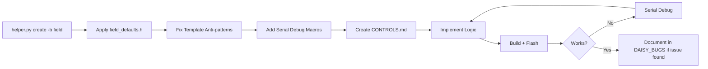

# Daisy Platform Embedded Audio C++ Development Strategy
## Technical Report v1.0

**Date**: 2026-02-08  
**Author**: AI-Assisted Development Process  
**Platform**: Daisy Field (STM32H750, ARM Cortex-M7, 480MHz)

---

## Executive Summary

This report documents the comprehensive strategy for delivering high-quality embedded audio C++ code for the Daisy platform. The strategy encompasses:

1. **Pre-Development Planning** - Block diagrams, control mapping, and architecture design
2. **Code Quality Standards** - Templates, patterns, and anti-patterns
3. **Hardware Abstraction** - Reusable helper libraries for consistent behavior
4. **Debugging Methodology** - Serial logging and hardware debugging workflows
5. **Bug Tracking** - Structured investigation and resolution documentation
6. **Quality Assurance** - Build verification and hardware testing

---

## 1. Development Workflow

### 1.1 Mandatory Process Flow

```
CONCEPT → BLOCK DIAGRAMS → CONTROLS.md → IMPLEMENTATION → VERIFY & ITERATE
```

| Phase | Deliverables | Purpose |
|-------|-------------|---------|
| **Concept** | 1-2 sentence description, DSP module list, complexity rating | Define scope |
| **Block Diagrams** | System Architecture, Signal Flow, Control Flow (Mermaid) | Visual design verification |
| **CONTROLS.md** | Parameter tables, key assignments, switch functions | Hardware mapping documentation |
| **Implementation** | `.cpp`, `Makefile`, `README.md` | Actual code |
| **Verify** | `make` → exit 0, hardware test | Quality gate |

### 1.2 File Organization Standard

```
MyProjects/_projects/ProjectName/
├── ProjectName.cpp          # Main implementation
├── Makefile                  # Build configuration
├── README.md                 # Project overview
├── CONTROLS.md              # Detailed control documentation
└── build/                   # Compiled artifacts (gitignored)
```

---

## 2. Code Architecture

### 2.1 Canonical Code Structure

```cpp
#include "daisy_field.h"
#include "daisysp.h"
#include "../../foundation_examples/field_defaults.h"

using namespace daisy;
using namespace daisysp;
using namespace FieldDefaults;

// Hardware and UI
DaisyField        hw;
FieldKeyboardLEDs keyLeds;
FieldOLEDDisplay  display;

// DSP modules
Oscillator osc;
Svf        filter;

// Parameters
struct Params {
    float freq      = 440.0f;
    float cutoff    = 1000.0f;
    float resonance = 0.5f;
} params;

void ProcessKnobs() {
    // Control processing - MAIN LOOP ONLY
    params.freq   = 20.0f + hw.knob[0].Process() * 2000.0f;
    params.cutoff = 100.0f + hw.knob[1].Process() * 10000.0f;
}

void AudioCallback(AudioHandle::InputBuffer  in,
                   AudioHandle::OutputBuffer out,
                   size_t                    size) {
    // Audio processing ONLY - no control reads!
    for(size_t i = 0; i < size; i++) {
        osc.SetFreq(params.freq);
        float sig = osc.Process();
        sig = filter.Process(sig);
        out[0][i] = out[1][i] = sig * params.level;
    }
}

int main(void) {
    hw.Init();
    hw.SetAudioBlockSize(kRecommendedBlockSize);  // 48 samples
    float sr = hw.AudioSampleRate();

    // Initialize helpers
    keyLeds.Init(&hw);
    display.Init(&hw);
    display.SetTitle("Project Name");

    // Initialize DSP with sample rate
    osc.Init(sr);
    filter.Init(sr);

    hw.StartAdc();
    hw.StartAudio(AudioCallback);

    while(1) {
        hw.ProcessAllControls();
        ProcessKnobs();

        // Handle keyboard, switches, display
        keyLeds.Update();
        display.Update();
        System::Delay(16);  // ~60Hz UI update
    }
}
```

### 2.2 Critical Architecture Rules

| Rule | Rationale |
|------|-----------|
| **No control reads in AudioCallback** | Prevents race conditions and ensures deterministic audio timing |
| **Initialize all DSP modules with sample rate** | Prevents uninitialized state crashes |
| **Use `kRecommendedBlockSize` (48)** | Balanced latency vs. CPU efficiency |
| **Main loop at ~60Hz (16ms delay)** | Smooth UI responsiveness without CPU waste |
| **Keep audio callback minimal** | Prevents buffer underruns |

### 2.3 Anti-Patterns to Avoid

| ❌ Don't | ✅ Do Instead |
|---------|--------------|
| `std::function`, lambdas with captures | Plain function pointers |
| `std::vector`, dynamic allocation | Static arrays, fixed-size buffers |
| `hw.ProcessAllControls()` in audio callback | Call in main loop only |
| Uninitialized DSP modules | Always call `module.Init(sr)` |
| Complex nested objects per sample | Pre-compute in control loop |

---

## 3. Hardware Abstraction Layer

### 3.1 `field_defaults.h` Library

Single-header library providing:

| Component | Purpose |
|-----------|---------|
| **LED Constants** | `kLedKnobs[8]`, `kLedKeysA[8]`, `kLedKeysB[8]`, `kLedSwitches[2]` |
| **Keyboard Mappings** | `kKeyAIndices[8]`, `kKeyBIndices[8]` |
| **FieldKeyboardLEDs** | Toggle LED state management class |
| **FieldOLEDDisplay** | Auto-highlighting parameter display class |

### 3.2 Hardware Mapping (Confirmed Working)

**Keyboard Input:**
```
A-row (top): hw.KeyboardRisingEdge(0) to hw.KeyboardRisingEdge(7)
B-row (bottom): hw.KeyboardRisingEdge(8) to hw.KeyboardRisingEdge(15)
```

**LED Output:**
```
A-row LEDs: indices 15 (A1) down to 8 (A8) - REVERSED
B-row LEDs: indices 0 (B1) to 7 (B8) - SEQUENTIAL
Knob LEDs: indices 16-23
Switch LEDs: indices 24-25
```

> ⚠️ **Critical**: Input and output indices use DIFFERENT patterns. This asymmetry is a common source of bugs (see BUG-001).

---

## 4. DSP Component Library

### 4.1 DaisySP Core Modules

| Category | Available Modules |
|----------|------------------|
| **Oscillators** | `Oscillator`, `VariableShapeOsc`, `OscillatorBank`, `FormantOsc`, `Phasor` |
| **Filters** | `Svf`, `OnePole`, `Biquad`, `NlFilt`, `Comb` |
| **Envelopes** | `Adsr`, `AdEnv`, `Line` |
| **Effects** | `Chorus`, `Flanger`, `Phaser`, `Tremolo`, `Overdrive`, `Decimator` |
| **Reverb** | `ReverbSc` (requires `USE_DAISYSP_LGPL = 1`) |
| **Physical Modeling** | `ModalVoice`, `StringVoice`, `Pluck`, `Drip`, `Resonator` |
| **Utilities** | `Limiter`, `Compressor`, `DcBlock`, `CrossFade` |

### 4.2 DAFX_2_Daisy_library (28 Modules)

Extended effects library for advanced DSP:
- FDN Reverb, Tube distortion, Wah-wah, Vibrato
- Parametric EQ (high/low shelving, peak filter)
- Compressor/Expander, Noise gate
- Phase Vocoder, Spectral effects
- Pitch detection (Yin), Envelope follower

---

## 5. Debugging Strategy

### 5.1 Serial Debugging (USB)

```cpp
// Enable serial logging
hw.Init();
hw.StartLog();  // Non-blocking
// OR
hw.StartLog(true);  // Blocks until USB connected

// Print debug messages
hw.PrintLine("Step 1: Initialized");
hw.PrintLine("Key %d pressed", key_index);
```

**Best Practices:**
- Place checkpoints at initialization stages
- Add event-triggered prints for crash isolation
- Use periodic loop status for random crashes
- **Never print in AudioCallback** - use flags instead

### 5.2 Hardware Debugging (ST-Link + VS Code)

**Prerequisites:**
1. Install "Cortex Debug" extension by marus25
2. Connect ST-Link V3 Mini to JTAG header
3. Windows: Set terminal to Git Bash

**Workflow:**
- **F5**: Start debug (builds, flashes, halts at entry)
- **F10**: Step over
- **F11**: Step into
- Set breakpoints by clicking in gutter

### 5.3 When to Use Which Method

| Scenario | Recommended |
|----------|------------|
| Unknown crash location | Serial checkpoints |
| Need to inspect variables | Hardware debug |
| Crash in audio callback | Hardware debug |
| General flow tracing | Serial |
| Complex state inspection | Hardware debug |

---

## 6. Bug Tracking Methodology

### 6.1 DAISY_BUGS.md Structure

Each bug entry must include:

1. **Problem** - Observed behavior
2. **Expected** - Correct behavior
3. **Analysis** - Step-by-step investigation
4. **Hypotheses** - Numbered theories with reasoning
5. **Solutions Tested** - Table of attempts and results
6. **Resolution** - What worked and why

### 6.2 Example Bug Entry

```markdown
## BUG-001: Keyboard LED Mirroring

**Status**: ✅ RESOLVED

### Problem
Pressing B1 lights B8, A1 lights A8 (mirrored).

### Analysis
1. Traced signal path
2. Checked libDaisy enums
3. Compared with working project

### Hypotheses
| # | Hypothesis | Reasoning |
|---|-----------|-----------|
| 1 | LED arrays wrong | Enum mismatch |
| 2 | Key indices wrong | Hardware mismatch |

### Solutions Tested
| Attempt | Change | Result |
|---------|--------|--------|
| 4 | Key A=0-7, B=8-15; LED A=15-8, B=0-7 | ✅ WORKS |

### Resolution
Input and output use ASYMMETRIC index patterns.
```

---

## 7. Build Configuration

### 7.1 Standard Makefile

```makefile
TARGET = ProjectName
CPP_SOURCES = ProjectName.cpp

LIBDAISY_DIR = ../../libDaisy
DAISYSP_DIR = ../../DaisySP

USE_DAISYSP_LGPL = 1  # Enable for ReverbSc

# Debug build (optional)
ifeq ($(DEBUG), 1)
CPPFLAGS += -DDEBUG_SERIAL
LDFLAGS += -u _printf_float
endif

SYSTEM_FILES_DIR = $(LIBDAISY_DIR)/core
include $(SYSTEM_FILES_DIR)/Makefile
```

### 7.2 Build Commands

| Command | Purpose |
|---------|---------|
| `make clean && make` | Full rebuild |
| `make program` | Flash via ST-Link |
| `make program-dfu` | Flash via USB bootloader |
| `make DEBUG=1` | Build with serial debug support |

---

## 8. Quality Assurance Checklist

### 8.1 Pre-Implementation

- [ ] Block diagrams created (System, Signal, Control)
- [ ] CONTROLS.md completed
- [ ] DSP module requirements identified
- [ ] Complexity rating assigned

### 8.2 Implementation

- [ ] Uses `field_defaults.h` helpers
- [ ] Control processing in main loop only
- [ ] All DSP modules initialized with sample rate
- [ ] No dynamic memory allocation
- [ ] No STL containers in hot paths

### 8.3 Post-Implementation

- [ ] `make clean && make` exits with code 0
- [ ] Flash and test all controls
- [ ] All LEDs respond correctly
- [ ] OLED displays expected information
- [ ] Audio output verified
- [ ] CONTROLS.md updated with any changes

---

## 9. Reference Projects

| Project | Status | Notable Features |
|---------|--------|-----------------|
| `field_wavetable_morph_synth` | ✅ Working | Reference implementation, proper LED mapping |
| `Field_WavetableDroneLab` | ✅ Working | 8-voice drone, keyboard LED feedback |
| `Field_ModalBells` | 🟡 Debugging | Modal synthesis, B-row crash investigation |

---

## 10. Tool Documentation Index

| Document | Purpose |
|----------|---------|
| `DAISY_DEVELOPMENT_STANDARDS.md` | Workflow and code standards |
| `DAISY_DEBUG_STRATEGY.md` | Serial and hardware debugging guide |
| `DAISY_BUGS.md` | Bug tracker with investigation methodology |
| `FIELD_DEFAULTS_README.md` | Hardware helper library documentation |
| `FIELD_DEFAULTS_USAGE.md` | Detailed usage examples |
| `PROJECT_INVENTORY.md` | Status of all projects |

---

## Appendix A: Quick Reference

### A.1 Daisy Field Hardware Specs

| Spec | Value |
|------|-------|
| MCU | STM32H750 (ARM Cortex-M7) |
| Clock | 480 MHz |
| RAM | 1 MB |
| Flash | 8 MB (QSPI) |
| Audio Codec | 24-bit, 48kHz default |
| Knobs | 8 |
| Keys | 16 (2 rows of 8) |
| LEDs | 21 (8 knob, 16 key, 2 switch) |
| Display | 128x64 OLED |
| MIDI | DIN-5 In/Out |

### A.2 Common Include Pattern

```cpp
#include "daisy_field.h"
#include "daisysp.h"
#include "../../foundation_examples/field_defaults.h"
#include <cmath>
#include <cstdio>
#include <cstring>

using namespace daisy;
using namespace daisysp;
using namespace FieldDefaults;
```

---

**Document Version**: 1.0  
**Last Updated**: 2026-02-08

---

## 11. Process Improvement Analysis

### 11.1 helper.py Script Analysis

The `DaisyExamples/helper.py` script provides project scaffolding:

| Operation | Command | Purpose |
|-----------|---------|---------|
| **create** | `./helper.py create MyProjects/Name -b field` | Generate new project with correct paths |
| **copy** | `./helper.py copy NewProj -s ExistingProj` | Duplicate project with renaming |
| **update** | `./helper.py update MyProjects/Name` | Refresh .vscode debug configs |

### 11.2 Identified Issues in Default Template

> ⚠️ **Critical Finding**: The default template generated by `helper.py` contains an **anti-pattern**:

```cpp
// Generated by helper.py (lines 246-248)
void AudioCallback(...) {
    hw.ProcessAllControls();  // ❌ WRONG - should be in main loop!
    ...
}
```

**Impact**: Projects created with `helper.py create` will have control processing in the audio callback, causing potential race conditions.

**Recommendation**: After using `helper.py create -b field`, immediately:
1. Move `hw.ProcessAllControls()` from AudioCallback to main loop
2. Add `hw.StartAdc()` before `hw.StartAudio()`
3. Add main loop with `System::Delay(16)`

### 11.3 Recommended Workflow Enhancement

#### Current Workflow (Basic)

```
./helper.py create → Manual code editing → make → test → debug
```

#### Enhanced Workflow (One-Shot Precision)



### 11.4 Enhanced Project Creation Script

For one-shot precision, create projects with this enhanced command sequence:

```bash
# 1. Create base project
./helper.py create MyProjects/_projects/NewProject -b field

# 2. Navigate to project
cd MyProjects/_projects/NewProject

# 3. Copy field_defaults.h include pattern
# (Manual step - add to .cpp file)
```

**Or create a custom wrapper script** (`create_field_project.sh`):

```bash
#!/bin/bash
PROJECT_NAME=$1
BASE_DIR="MyProjects/_projects"

# Create project
./helper.py create "$BASE_DIR/$PROJECT_NAME" -b field

# Add field_defaults.h include to generated .cpp
cat > "$BASE_DIR/$PROJECT_NAME/$PROJECT_NAME.cpp" << 'EOF'
#include "daisy_field.h"
#include "daisysp.h"
#include "../../foundation_examples/field_defaults.h"

using namespace daisy;
using namespace daisysp;
using namespace FieldDefaults;

DaisyField        hw;
FieldKeyboardLEDs keyLeds;
FieldOLEDDisplay  display;

void AudioCallback(AudioHandle::InputBuffer  in,
                   AudioHandle::OutputBuffer out,
                   size_t                    size) {
    // Audio processing ONLY
    for(size_t i = 0; i < size; i++) {
        out[0][i] = in[0][i];
        out[1][i] = in[1][i];
    }
}

int main(void) {
    hw.Init();
    hw.SetAudioBlockSize(48);
    hw.SetAudioSampleRate(SaiHandle::Config::SampleRate::SAI_48KHZ);

    keyLeds.Init(&hw);
    display.Init(&hw);
    display.SetTitle("NEW PROJECT");

    hw.StartAdc();
    hw.StartAudio(AudioCallback);

    while(1) {
        hw.ProcessAllControls();  // Correct location!

        // TODO: Add keyboard handling
        // TODO: Add knob processing

        keyLeds.Update();
        display.Update();
        System::Delay(16);
    }
}
EOF

# Create CONTROLS.md template
cat > "$BASE_DIR/$PROJECT_NAME/CONTROLS.md" << 'EOF'
# Controls Documentation

## Knobs
| Knob | Parameter | Range | Default |
|------|-----------|-------|---------|
| K1   | TBD       | 0-1   | 0.5     |
| K2   | TBD       | 0-1   | 0.5     |
| ...  | ...       | ...   | ...     |

## Keys
| Key | Function |
|-----|----------|
| A1-A8 | TBD |
| B1-B8 | TBD |

## Switches
| Switch | Function |
|--------|----------|
| SW1    | TBD      |
| SW2    | TBD      |
EOF

echo "Created $PROJECT_NAME with field_defaults.h integration"
```

### 11.5 Debug Efficiency Improvements

| Practice | Benefit |
|----------|---------|
| **Use `helper.py update`** | Refreshes VS Code debug configs when corrupted |
| **Include `--include_vgdb`** | Adds VisualGDB support for Visual Studio debugging |
| **Serial debug macros in template** | Debug prints always available, stripped in release |
| **CONTROLS.md first** | Forces design thinking before coding |
| **Build after each major change** | Catches errors early, narrows debug scope |

### 11.6 One-Shot Precision Checklist

For maximum first-attempt success rate:

- [ ] Use `helper.py create -b field` for correct Makefile paths
- [ ] Immediately fix AudioCallback anti-pattern (move ProcessAllControls to main loop)
- [ ] Add `#include "field_defaults.h"` and helper classes
- [ ] Create `CONTROLS.md` before writing logic
- [ ] Add `hw.StartLog()` at init for serial debugging
- [ ] Use `DBG_PRINT()` macro for conditional debug output
- [ ] Build after every 20-30 lines of new code
- [ ] Flash and test controls before completing audio DSP

---

## 12. Quality Assurance Document Ecosystem

All QA documents are interconnected for maximum development efficiency:

```
┌─────────────────────────────────────────────────────────────────┐
│                    DAISY QA DOCUMENT SYSTEM                     │
├─────────────────────────────────────────────────────────────────┤
│                                                                 │
│  ┌──────────────────────┐     ┌──────────────────────────────┐ │
│  │ TUTORIALS_KNOWLEDGE  │────▶│ DEVELOPMENT_STANDARDS        │ │
│  │ (Foundation)         │     │ (Workflow & Code Patterns)   │ │
│  └──────────────────────┘     └──────────────────────────────┘ │
│           │                              │                      │
│           ▼                              ▼                      │
│  ┌──────────────────────┐     ┌──────────────────────────────┐ │
│  │ DEBUG_STRATEGY       │◀───▶│ TECHNICAL_REPORT (this doc)  │ │
│  │ (Troubleshooting)    │     │ (Comprehensive Reference)    │ │
│  └──────────────────────┘     └──────────────────────────────┘ │
│           │                              │                      │
│           └──────────────┬───────────────┘                      │
│                          ▼                                      │
│                 ┌────────────────┐                              │
│                 │   DAISY_BUGS   │                              │
│                 │ (Issue Tracker)│                              │
│                 └────────────────┘                              │
│                                                                 │
└─────────────────────────────────────────────────────────────────┘
```

| Document | Purpose | When to Use |
|----------|---------|-------------|
| [DAISY_TUTORIALS_KNOWLEDGE.md](DAISY_TUTORIALS_KNOWLEDGE.md) | Official API reference | Understanding GPIO/Audio/ADC/SPI/I2C |
| [DAISY_DEVELOPMENT_STANDARDS.md](DAISY_DEVELOPMENT_STANDARDS.md) | Workflow patterns | Starting a new project |
| [DAISY_DEBUG_STRATEGY.md](DAISY_DEBUG_STRATEGY.md) | Serial/hardware debugging | When something isn't working |
| [DAISY_BUGS.md](DAISY_BUGS.md) | Bug tracking methodology | Documenting and searching past issues |

**This document's role**: Provides comprehensive technical reference. Use when you need deep understanding of the entire development strategy.

---

**Document Version**: 1.2
**Last Updated**: 2026-02-08

## Changelog

| Version | Date | Changes |
|---------|------|---------|
| 1.2 | 2026-02-08 | Added Section 11 (Process Improvement), Section 12 (QA Ecosystem) |
| 1.1 | 2026-02-08 | Added QA checklist, reference projects, debug strategy section |
| 1.0 | 2026-02-08 | Initial version: architecture, DSP library, hardware abstraction, build config |

