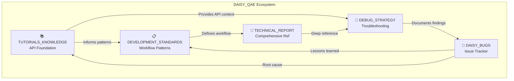
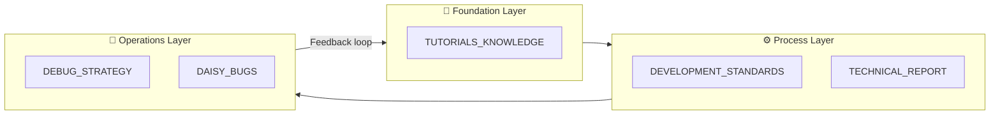
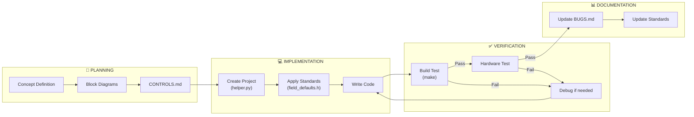
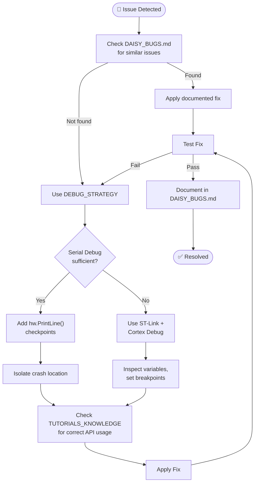
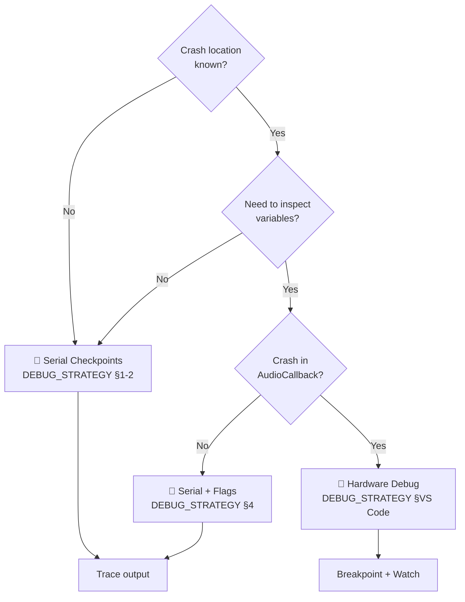
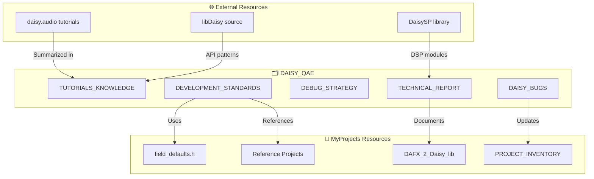
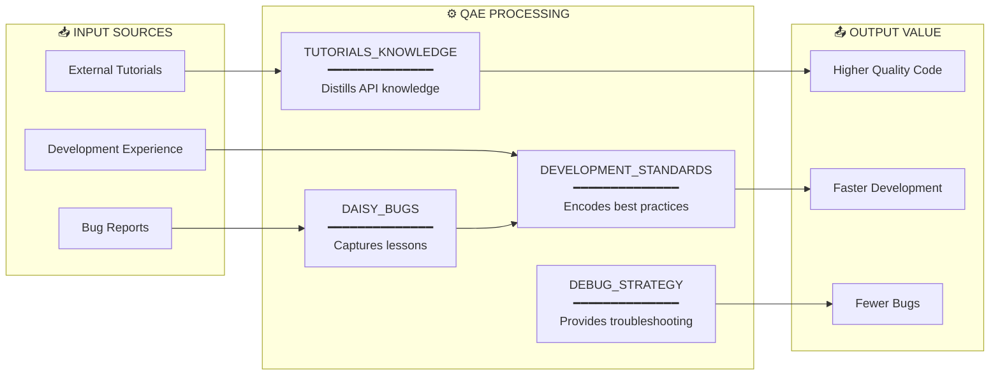
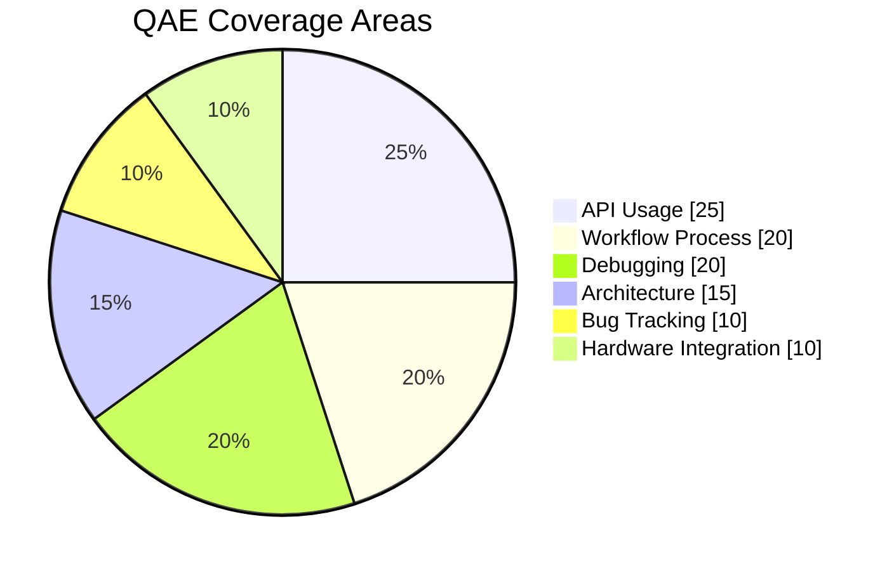
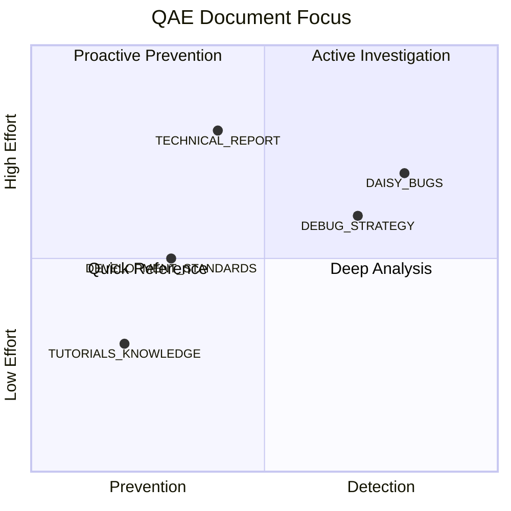

# DAISY Quality Assurance Ecosystem (QAE)

> **Purpose**: Centralized repository of documentation and tools for ensuring high-quality Daisy embedded audio C++ development.

---

## 🗺️ Visual Diagram Index

> **Navigation Guide**: Jump to any diagram to understand a specific aspect of the QAE system.

| # | Section | Diagram Type | Visualizes | Jump |
|---|---------|--------------|------------|------|
| 1 | Document Relationships | Flowchart | Internal document flow with feedback loops | [↓](#internal-document-flow) |
| 2 | Document Hierarchy | Graph | Foundation → Process → Operations layers | [↓](#document-purpose-hierarchy) |
| 3 | Project Workflow | Flowchart | Planning → Implementation → Verification → Documentation | [↓](#complete-project-workflow) |
| 4 | Document Usage | Gantt Chart | Which documents used in each dev phase | [↓](#qae-document-usage-by-phase) |
| 5 | Issue Resolution | Flowchart | Complete debugging workflow with decision points | [↓](#issue-resolution-flow) |
| 6 | Debug Decision Tree | Flowchart | When to use Serial vs Hardware debugging | [↓](#debug-method-decision-tree) |
| 7 | External Integration | Flowchart | QAE + daisy.audio + libDaisy + MyProjects | [↓](#qae--external-resources) |
| 8 | Information Flow | Flowchart | Input sources → QAE processing → Output value | [↓](#information-flow-architecture) |
| 9 | Coverage Areas | Pie Chart | API, Workflow, Debugging, Architecture, Bug tracking | [↓](#document-coverage-by-development-concern) |
| 10 | Prevention vs Detection | Quadrant Chart | Document positioning: effort vs focus | [↓](#prevention-vs-detection-balance) |

---

## Document Overview

```
DAISY_QAE/
├── README.md                         ← You are here
├── DAISY_TUTORIALS_KNOWLEDGE.md      ← Official API reference (GPIO, Audio, ADC, etc.)
├── DAISY_DEVELOPMENT_STANDARDS.md   ← Workflow and code patterns (Field/Pod/Seed)
├── DAISY_DEBUG_STRATEGY.md           ← Serial and hardware debugging techniques
├── DAISY_TECHNICAL_REPORT.md         ← Comprehensive process documentation
├── DAISY_BUGS.md                     ← Bug tracker with priority queue
├── DVPE_MODULE_CATALOG.md            ← Complete list of available DSP blocks
│
├── ── De-Hallucination System (Tier 1) ──────────────────────────────────────
├── DAISY_HALLUCINATION_REFERENCE.md  ← LLM prompt reference: paste into any AI prompt
├── daisyApiIndex.ts                  ← Verified DaisySP API database (35+ classes)
├── apiReferenceInjector.ts           ← Generates grounding comment blocks for .cpp files
│
├── ── Tooling ────────────────────────────────────────────────────────────────
├── create_field_project.sh           ← Project scaffolding (fixes helper.py anti-pattern)
├── validate_daisy_code.py            ← Automated linter (9 rules incl. hallucination detect)
└── generate_module_catalog.py        ← Script to regenerate module catalog from source
```

---

## Quick Reference: When to Use Each Document

| Situation | Start Here |
|-----------|------------|
| Starting a new project | [DAISY_DEVELOPMENT_STANDARDS.md](DAISY_DEVELOPMENT_STANDARDS.md) |
| Scaffolding a new Field project | `./create_field_project.sh MyProject` |
| Looking up API (GPIO, Audio, ADC) | [DAISY_TUTORIALS_KNOWLEDGE.md](DAISY_TUTORIALS_KNOWLEDGE.md) |
| Something isn't working | [DAISY_DEBUG_STRATEGY.md](DAISY_DEBUG_STRATEGY.md) |
| Need deep reference | [DAISY_TECHNICAL_REPORT.md](DAISY_TECHNICAL_REPORT.md) |
| Found a bug, documenting fix | [DAISY_BUGS.md](DAISY_BUGS.md) |
| Checking code against standards | `python validate_daisy_code.py MyProject.cpp` |
| Browsing available DSP blocks | [DVPE_MODULE_CATALOG.md](DVPE_MODULE_CATALOG.md) |
| Prompting an AI to write Daisy C++ | [DAISY_HALLUCINATION_REFERENCE.md](DAISY_HALLUCINATION_REFERENCE.md) |
| Integrating API grounding into DVPE | [daisyApiIndex.ts](daisyApiIndex.ts) + [apiReferenceInjector.ts](apiReferenceInjector.ts) |

---

## Field Platform MIDI Projects

> **Base Project**: Use [`field/Midi/Midi.cpp`](https://github.com/electro-smith/DaisyExamples/tree/master/field/Midi/Midi.cpp) as the starting point for external MIDI-oriented projects on the Daisy Field platform.

This project provides:
- MIDI input handling (NoteOn, NoteOff, ControlChange)
- Voice management with ADSR envelope
- Filter control via MIDI CC
- Display feedback for MIDI notes

### Why field/Midi?
- Clean, well-structured MIDI event handling
- Proper voice allocation (24 voices)
- Includes both NoteOn/NoteOff and CC message processing
- Working display integration for note feedback
- Compatible with Daisy Field hardware

---

## Document Relationships

### Internal Document Flow



### Document Purpose Hierarchy



---

## Development Lifecycle Integration

### Complete Project Workflow



### QAE Document Usage by Phase

```mermaid
gantt
    title Document Usage Across Development Phases
    dateFormat X
    axisFormat %s
    
    section Planning
    DEVELOPMENT_STANDARDS     :a1, 0, 3
    TUTORIALS_KNOWLEDGE       :a2, 1, 3
    
    section Implementation
    TUTORIALS_KNOWLEDGE       :b1, 3, 6
    DEVELOPMENT_STANDARDS     :b2, 3, 5
    TECHNICAL_REPORT          :b3, 4, 6
    
    section Debugging
    DEBUG_STRATEGY            :c1, 6, 9
    DAISY_BUGS                :c2, 7, 9
    TUTORIALS_KNOWLEDGE       :c3, 6, 8
    
    section Documentation
    DAISY_BUGS                :d1, 9, 10
    DEVELOPMENT_STANDARDS     :d2, 9, 10
```



---

## Debugging Workflow

### Issue Resolution Flow



### Debug Method Decision Tree



---

## External System Integration

### QAE + External Resources



### Information Flow Architecture



---

## Quality Metrics

### Document Coverage by Development Concern



### Prevention vs Detection Balance



---

## Related Resources (Outside This Folder)

| Resource | Location | Purpose |
|----------|----------|---------|
| `field_defaults.h` | `MyProjects/foundation_examples/` | Hardware helper library |
| `field_wavetable_morph_synth` | `MyProjects/_projects/` | Reference implementation |
| `DAFX_2_Daisy_lib` | `MyProjects/DAFX_2_Daisy_lib/` | Extended DSP effects library |
| `PROJECT_INVENTORY.md` | `MyProjects/PROJECT_INVENTORY.md` | Project status tracker |

---

## How to Use This Ecosystem

### For New Developers

1. Read `DAISY_DEVELOPMENT_STANDARDS.md` first
2. Use `DAISY_TUTORIALS_KNOWLEDGE.md` as API reference
3. Follow the workflow: Concept → Block Diagrams → CONTROLS.md → Implementation

### When Debugging

1. Check `DAISY_BUGS.md` for similar past issues
2. Follow patterns in `DAISY_DEBUG_STRATEGY.md`
3. Document your findings back to `DAISY_BUGS.md`

### For Comprehensive Understanding

- Read `DAISY_TECHNICAL_REPORT.md` for full process documentation

---

**Version**: 2.1
**Last Updated**: 2026-02-08

## Changelog

| Version | Date | Changes |
|---------|------|---------|
| 2.1 | 2026-02-08 | Added tooling entries (create_field_project.sh, validate_daisy_code.py) |
| 2.0 | 2026-02-08 | Added 10 mermaid diagrams, visual diagram index, usage-by-phase chart |
| 1.0 | 2026-02-08 | Initial version: document overview, quick reference table |
