<!-- markdownlint-disable MD024 -->
# NotebookLM Field — 10 DVPE Examples

Each project has **3 mandatory Mermaid diagrams**:

- **A. Block Diagram** (`block-beta`) — System architecture
- **B. Audio Flow** (`flowchart LR`) — Signal path source → output
- **C. Control Flow** (`flowchart TD`) — How controls update DSP

DVPE block IDs match `BlockRegistry.ts`. `*` = LGPL (`USE_DAISYSP_LGPL = 1`).

---

## Project 1: Basic Virtual Analog (VA) Synthesizer

- **Difficulty:** 2/10
- **Concept:** A foundational subtractive synthesizer patch, teaching the basics of signal flow (Source → Modifier → Amp).
- **DVPE Blocks:** `oscillator` → `moog_ladder`* → `vca` (driven by `adsr`)
- **Field Mapping:**
  - **Keys A1-A8:** Trigger MIDI Notes
  - **Knob 1:** Oscillator Waveform Morph
  - **Knob 2 & 3:** Filter Cutoff and Resonance
  - **Knob 4:** Envelope Decay Time

### A. System Architecture

```mermaid
block-beta
  columns 3

  block:hw1["Hardware"]:1
    keys1["Keys A1-A8\n(MIDI Trigger)"]
    k1_1["K1: Waveform"]
    k2_1["K2: Cutoff"]
    k3_1["K3: Resonance"]
    k4_1["K4: Decay"]
  end

  block:dsp1["DSP Chain"]:1
    osc1["oscillator"]
    filt1["moog_ladder*"]
    adsr1["adsr"]
    vca1["vca"]
  end

  block:out1["Output"]:1
    aout1["audio_output"]
  end

  keys1 --> osc1
  osc1 --> filt1
  filt1 --> vca1
  adsr1 --> vca1
  vca1 --> aout1
```

### B. Audio Flow

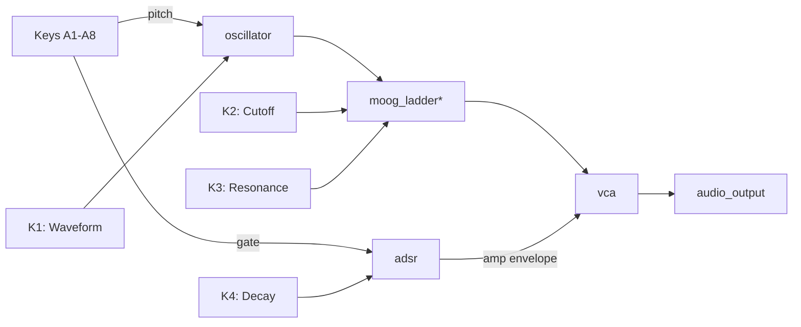

### C. Control Flow

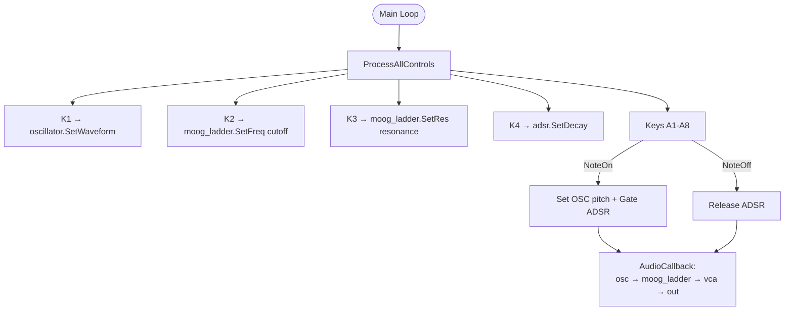

---

## Project 2: Stereo Ping-Pong Delay Line

- **Difficulty:** 3/10
- **Concept:** Audio effect utilizing memory buffers to create bouncing stereo echoes.
- **DVPE Blocks:** `audio_input` → `splitter` → `delay_line` L + R (cross-feedback) → `crossfade` → `audio_output`
- **Field Mapping:**
  - **Knob 1:** Master Delay Time
  - **Knob 2:** Cross-Feedback Amount
  - **Knob 3:** Wet/Dry Mix
  - **Keys B1-B4:** Instant jumps to delay subdivisions (1/4, 1/8, 1/16, 1/32 notes)

### A. System Architecture

```mermaid
block-beta
  columns 3

  block:hw2["Hardware"]:1
    ain2["audio_input"]
    k1_2["K1: Delay Time"]
    k2_2["K2: Feedback"]
    k3_2["K3: Wet/Dry"]
    bk2["Keys B1-B4\n(Subdivisions)"]
  end

  block:dsp2["DSP Chain"]:1
    spl2["splitter"]
    dll2["delay_line L"]
    dlr2["delay_line R"]
    cf2["crossfade\n(Wet/Dry)"]
  end

  block:out2["Output"]:1
    aout2["audio_output\n(Stereo)"]
  end

  ain2 --> spl2
  spl2 --> dll2
  spl2 --> dlr2
  dll2 -->|cross-feed| dlr2
  dlr2 -->|cross-feed| dll2
  dll2 --> cf2
  dlr2 --> cf2
  cf2 --> aout2
```

### B. Audio Flow

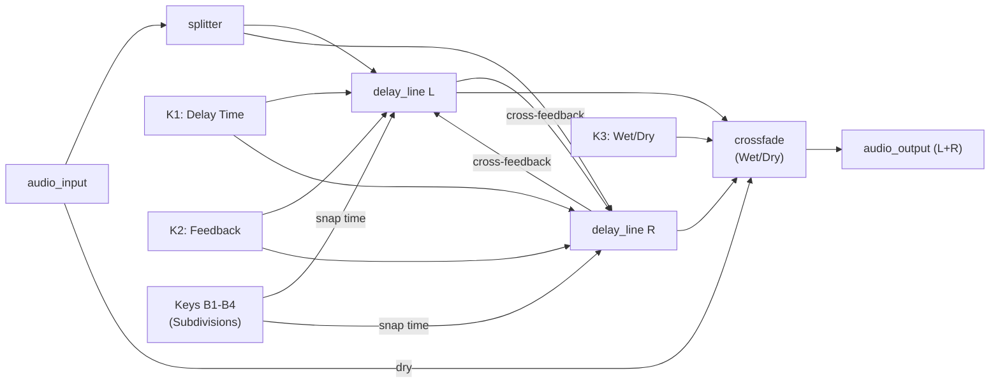

### C. Control Flow

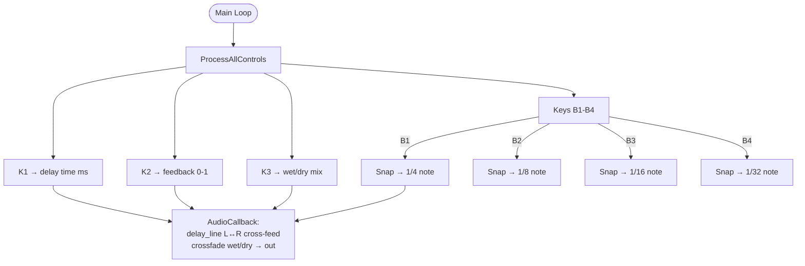

---

## Project 3: Two-Operator FM "Chowning" Synth

- **Difficulty:** 4/10
- **Concept:** Classic frequency modulation where a modulator oscillator alters the frequency of a carrier, creating complex metallic and bell-like spectra.
- **DVPE Blocks:** `fm2` + `ad_env` (modulates index) → `vca` → `audio_output`
- **Field Mapping:**
  - **Knob 1:** Carrier Frequency
  - **Knob 2:** Harmonic Ratio (snapped to integers)
  - **Knob 3:** Modulation Index (Brightness)
  - **Keys A1-A8:** Play notes of a specific scale

### A. System Architecture

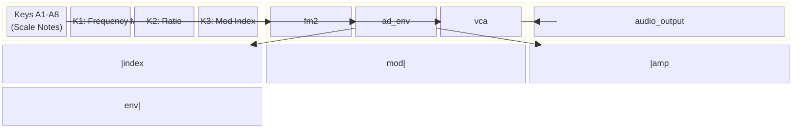

### B. Audio Flow

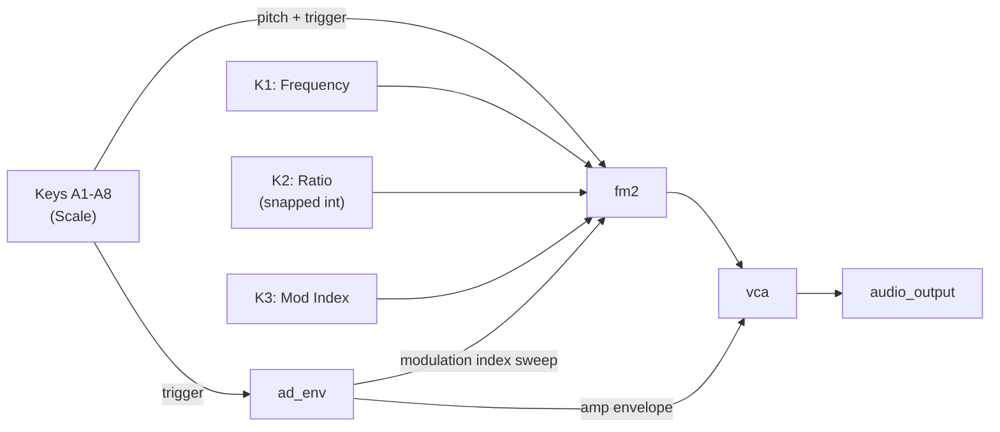

### C. Control Flow

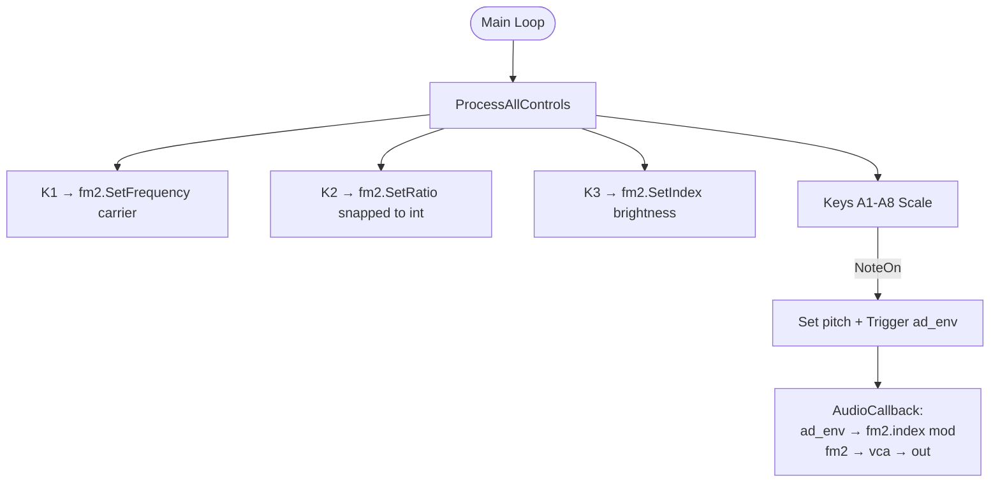

---

## Project 4: Karplus-Strong Plucked String (Physical Modeling)

- **Difficulty:** 5/10
- **Concept:** Simulating a physical string being struck, using a noise burst fed into a short delay line with a low-pass filter in the feedback loop.
- **DVPE Blocks:** `white_noise` (burst on trigger) + `string_voice`* → `audio_output`
- **Field Mapping:**
  - **Keys A1-A8:** Pluck strings at different pitches
  - **Knob 1:** Damping (low-pass cutoff in feedback loop)
  - **Knob 2:** String Structure / Decay

### A. System Architecture

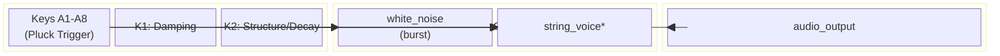

### B. Audio Flow

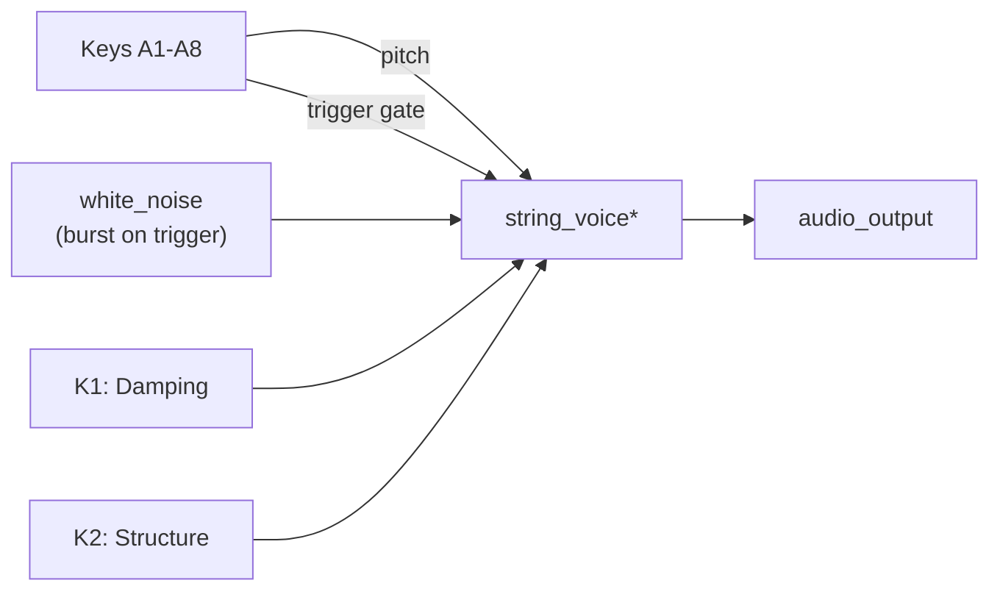

### C. Control Flow

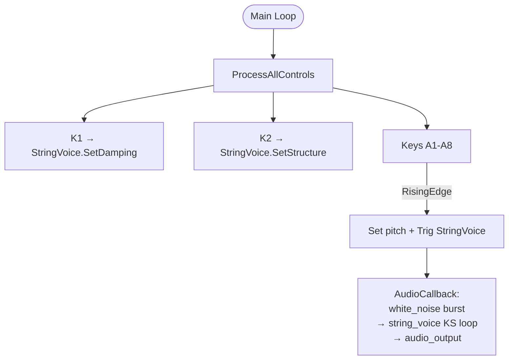

---

## Project 5: Wavetable Morphing Pad

- **Difficulty:** 6/10
- **Concept:** Scanning through single-cycle waveforms to create evolving, atmospheric textures.
- **DVPE Blocks:** `wavetable_read` (modulated by `lfo`) → `chorus` → `audio_output`
- **Field Mapping:**
  - **Knob 1:** Manual Wavetable Index
  - **Knob 2:** LFO Rate (scanning speed)
  - **Knob 3:** Chorus Depth
  - **Keys A1-A4:** Select different wavetable banks

### A. System Architecture

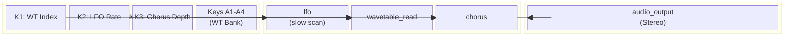

### B. Audio Flow

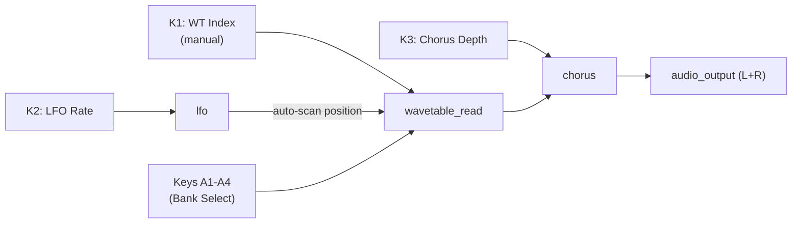

### C. Control Flow

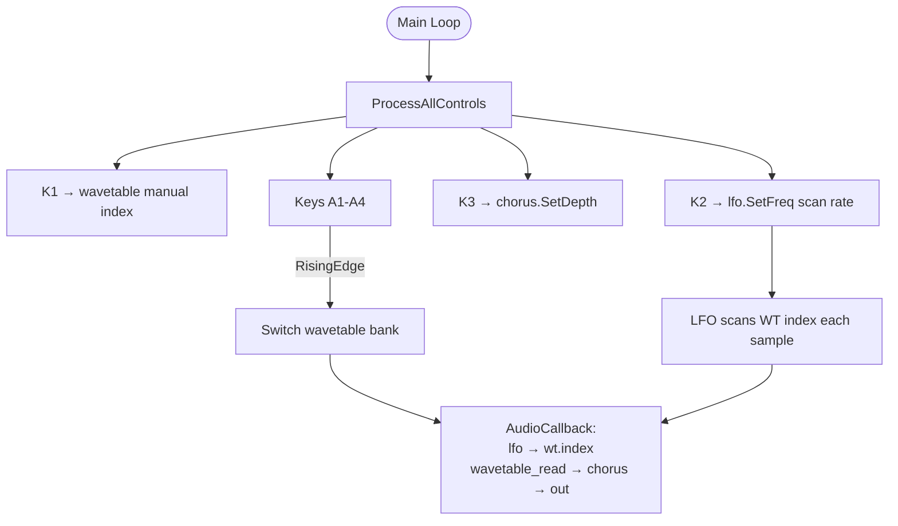

---

## Project 6: "x0x" Style Drum Machine & 16-Step Sequencer

- **Difficulty:** 7/10
- **Concept:** Analog-style drum machine driven by a step sequencer, recreating classic electronic percussion.
- **DVPE Blocks:** `metro` → `counter` → `analog_bass_drum` + `analog_snare_drum` + `hihat` → `mixer` → `audio_output`
- **Field Mapping:**
  - **Keys A1-A8:** Sequencer Steps 1-8
  - **Keys B1-B8:** Sequencer Steps 9-16
  - **Knobs 1-4:** Pitch and Decay for Kick and Snare

### A. System Architecture

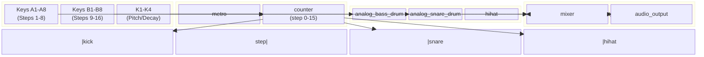

### B. Audio Flow

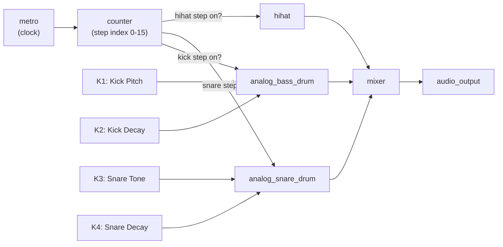

### C. Control Flow

```mermaid
flowchart TD
  ML6([Main Loop]) --> PAC6[ProcessAllControls]
  PAC6 --> C1_6[K1 → Kick Pitch]
  PAC6 --> C2_6[K2 → Kick Decay]
  PAC6 --> C3_6[K3 → Snare Tone]
  PAC6 --> C4_6[K4 → Snare Decay]
  PAC6 --> CKA6[Keys A1-A8 toggle Steps 1-8]
  PAC6 --> CKB6[Keys B1-B8 toggle Steps 9-16]
  CKA6 --> SEQ6[step_pattern[16] array]
  CKB6 --> SEQ6
  ML6 --> METRO6C[metro.Process tick?]
  METRO6C -->|yes| STEP6[Advance counter 0→15]
  STEP6 --> TRIG6{step_pattern\n[current] on?}
  TRIG6 -->|kick| K_T6[AnalogBassDrum.Trig]
  TRIG6 -->|snare| S_T6[AnalogSnareDrum.Trig]
  TRIG6 -->|hihat| H_T6[HiHat.Trig]
```

---

## Project 7: The Barber-Pole Flanger

- **Difficulty:** 7/10
- **Concept:** Auditory illusion of continuously rising/falling pitch achieved with crossfading quadrature LFOs on two flangers to hide the reset point.
- **DVPE Blocks:** `audio_input` → `flanger` L + R (driven by `phasor` 0° and 90°) → `crossfade` → `audio_output`
- **Field Mapping:**
  - **Knob 1:** Barber-Pole Speed
  - **Knob 2:** Feedback Amount
  - **Knob 3:** Stereo Spread

### A. System Architecture

```mermaid
block-beta
  columns 3

  block:hw7["Hardware"]:1
    ain7["audio_input"]
    k1_7["K1: Speed"]
    k2_7["K2: Feedback"]
    k3_7["K3: Spread"]
  end

  block:dsp7["DSP Chain"]:1
    pha7["phasor L\n(0°)"]
    phb7["phasor R\n(90°)"]
    fla7["flanger L"]
    flb7["flanger R"]
    cf7["crossfade\n(stereo spread)"]
  end

  block:out7["Output"]:1
    aout7["audio_output\n(Stereo)"]
  end

  ain7 --> fla7
  ain7 --> flb7
  pha7 --> fla7
  phb7 --> flb7
  k1_7 --> pha7
  k1_7 --> phb7
  k2_7 --> fla7
  k2_7 --> flb7
  fla7 --> cf7
  flb7 --> cf7
  k3_7 --> cf7
  cf7 --> aout7
```

### B. Audio Flow

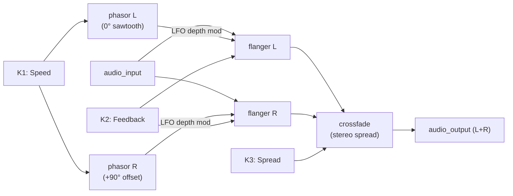

### C. Control Flow

```mermaid
flowchart TD
  ML7([Main Loop]) --> PAC7[ProcessAllControls]
  PAC7 --> C1_7[K1 → phasor L+R SetFreq speed]
  PAC7 --> C2_7[K2 → flanger L+R SetFeedback]
  PAC7 --> C3_7[K3 → crossfade stereo spread]
  C1_7 --> AC7[AudioCallback]
  C2_7 --> AC7
  C3_7 --> AC7
  AC7 --> PA7[phasorL.Process → 0-1 saw]
  AC7 --> PB7[phasorR.Process → 0-1 saw + 0.25 offset]
  PA7 -->|LFO L| FA7[flangerL.Process audio_in]
  PB7 -->|LFO R| FB7[flangerR.Process audio_in]
  FA7 --> XF7[crossfade → stereo out]
  FB7 --> XF7
```

---

## Project 8: Granular "Time-Freeze" Texturizer

- **Difficulty:** 8/10
- **Concept:** Recording audio into a circular SDRAM buffer, then freezing the write head while granular read heads scramble the audio.
- **DVPE Blocks:** `audio_input` → `switch` (freeze gate) → `ring_buffer` (SDRAM) → `granular` ×3 (with `sample_hold` jitter) → `mixer` → `audio_output`
- **Field Mapping:**
  - **SW1:** Freeze audio buffer (disable write)
  - **Knob 1:** Grain Size
  - **Knob 2:** Jitter / Randomization
  - **Knob 3:** Playback Speed / Scrub

### A. System Architecture

```mermaid
block-beta
  columns 3

  block:hw8["Hardware"]:1
    ain8["audio_input"]
    sw8["switch\n(SW1: Freeze)"]
    k1_8["K1: Grain Size"]
    k2_8["K2: Jitter"]
    k3_8["K3: Speed/Scrub"]
  end

  block:dsp8["DSP Chain"]:1
    swblk8["switch\n(bypass write)"]
    buf8["ring_buffer\n(SDRAM)"]
    jit8["sample_hold\n(jitter)"]
    gr1_8["granular 1"]
    gr2_8["granular 2"]
    gr3_8["granular 3"]
    mx8["mixer"]
  end

  block:out8["Output"]:1
    aout8["audio_output"]
  end

  ain8 --> swblk8
  sw8 --> swblk8
  swblk8 --> buf8
  buf8 --> gr1_8
  buf8 --> gr2_8
  buf8 --> gr3_8
  jit8 --> gr1_8
  jit8 --> gr2_8
  jit8 --> gr3_8
  k1_8 --> gr1_8
  k2_8 --> jit8
  k3_8 --> gr1_8
  gr1_8 --> mx8
  gr2_8 --> mx8
  gr3_8 --> mx8
  mx8 --> aout8
```

### B. Audio Flow

```mermaid
flowchart LR
  AIN8["audio_input"] --> SW_8["switch\n(freeze gate)"]
  SW1_8["SW1: Freeze"] -->|gate control| SW_8
  SW_8 -->|write when unfrozen| BUF8["ring_buffer\n(SDRAM circular)"]
  BUF8 --> GR1_8["granular 1"]
  BUF8 --> GR2_8["granular 2"]
  BUF8 --> GR3_8["granular 3"]
  JIT8["sample_hold\n(jitter)"] --> GR1_8
  JIT8 --> GR2_8
  JIT8 --> GR3_8
  K1_8["K1: Grain Size"] --> GR1_8
  K1_8 --> GR2_8
  K1_8 --> GR3_8
  K2_8["K2: Jitter Amount"] --> JIT8
  K3_8["K3: Playback Speed"] --> GR1_8
  K3_8 --> GR2_8
  K3_8 --> GR3_8
  GR1_8 --> MX8["mixer"]
  GR2_8 --> MX8
  GR3_8 --> MX8
  MX8 --> OUT8["audio_output"]
```

### C. Control Flow

```mermaid
flowchart TD
  ML8([Main Loop]) --> PAC8[ProcessAllControls]
  PAC8 --> C1_8[K1 → grain size samples]
  PAC8 --> C2_8[K2 → jitter range]
  PAC8 --> C3_8[K3 → playback speed ratio]
  PAC8 --> SW_C8[SW1 state]
  SW_C8 -->|pressed| FRZ8[freeze = true\nStop write pointer]
  SW_C8 -->|released| UFZ8[freeze = false\nResume write pointer]
  C1_8 --> AC8[AudioCallback]
  C2_8 --> AC8
  C3_8 --> AC8
  FRZ8 --> AC8
  AC8 --> WR8{freeze?}
  WR8 -->|no| WRITE8[Write audio_input → ring_buffer]
  WR8 -->|yes| SKIP8[Skip write — buffer frozen]
  WRITE8 --> READ8[3× granular heads\nscan buffer with jitter]
  SKIP8 --> READ8
  READ8 --> MIXOUT8[mixer sum → audio_output]
```

---

## Project 9: The 8-Partial Additive Organ

- **Difficulty:** 8/10
- **Concept:** Building complex spectra from the ground up by summing individual sine waves according to the Fourier series.
- **DVPE Blocks:** `harmonic_oscillator` (8 partials) → `vca` ×8 (drawbar gains) → `mixer` (8-ch) → `audio_output`
- **Field Mapping:**
  - **Knobs 1-8:** Drawbars — amplitude of harmonics 1 through 8
  - **Keys A1-A8:** Play root notes

### A. System Architecture

```mermaid
block-beta
  columns 3

  block:hw9["Hardware"]:1
    keys9["Keys A1-A8\n(Root Notes)"]
    k18_9["K1-K8\n(Drawbars H1-H8)"]
  end

  block:dsp9["DSP Chain"]:1
    hosc9["harmonic_oscillator\n(8 partials)"]
    vcas9["vca ×8\n(one per harmonic)"]
    mx9["mixer\n(8-channel)"]
  end

  block:out9["Output"]:1
    aout9["audio_output"]
  end

  keys9 --> hosc9
  k18_9 --> vcas9
  hosc9 --> vcas9
  vcas9 --> mx9
  mx9 --> aout9
```

### B. Audio Flow

```mermaid
flowchart LR
  KEYS9["Keys A1-A8\n(Root Note)"] -->|base frequency| HOSC9["harmonic_oscillator\n(partials 1-8)"]
  HOSC9 -->|H1| VCA1_9["vca H1"]
  HOSC9 -->|H2| VCA2_9["vca H2"]
  HOSC9 -->|H3| VCA3_9["vca H3"]
  HOSC9 -->|H4| VCA4_9["vca H4"]
  HOSC9 -->|H5| VCA5_9["vca H5"]
  HOSC9 -->|H6| VCA6_9["vca H6"]
  HOSC9 -->|H7| VCA7_9["vca H7"]
  HOSC9 -->|H8| VCA8_9["vca H8"]
  K1_9["K1: Drawbar H1"] --> VCA1_9
  K2_9["K2: Drawbar H2"] --> VCA2_9
  K3_9["K3: Drawbar H3"] --> VCA3_9
  K4_9["K4: Drawbar H4"] --> VCA4_9
  K5_9["K5: Drawbar H5"] --> VCA5_9
  K6_9["K6: Drawbar H6"] --> VCA6_9
  K7_9["K7: Drawbar H7"] --> VCA7_9
  K8_9["K8: Drawbar H8"] --> VCA8_9
  VCA1_9 --> MX9["mixer\n(8-channel)"]
  VCA2_9 --> MX9
  VCA3_9 --> MX9
  VCA4_9 --> MX9
  VCA5_9 --> MX9
  VCA6_9 --> MX9
  VCA7_9 --> MX9
  VCA8_9 --> MX9
  MX9 --> OUT9["audio_output"]
```

### C. Control Flow

```mermaid
flowchart TD
  ML9([Main Loop]) --> PAC9[ProcessAllControls]
  PAC9 --> DB1_9[K1 → vca H1 gain]
  PAC9 --> DB2_9[K2 → vca H2 gain]
  PAC9 --> DB3_9[K3 → vca H3 gain]
  PAC9 --> DB4_9[K4 → vca H4 gain]
  PAC9 --> DB5_9[K5 → vca H5 gain]
  PAC9 --> DB6_9[K6 → vca H6 gain]
  PAC9 --> DB7_9[K7 → vca H7 gain]
  PAC9 --> DB8_9[K8 → vca H8 gain]
  PAC9 --> CK9[Keys A1-A8]
  CK9 -->|NoteOn| PITCH9[harmonic_oscillator.SetFreq base]
  PITCH9 --> AC9[AudioCallback:\nhosc partials × vca gains\n→ 8-ch mixer → out]
  DB1_9 --> AC9
```

---

## Project 10: Genetic Step Sequencer & Improviser

- **Difficulty:** 9/10
- **Concept:** Algorithmic sequencer using evolutionary algorithms or Markov chains to mutate a melody over time, making it organic rather than purely random.
- **DVPE Blocks:** `metro` → Logic/counter (genetic mutator) → `step_sequencer` → `modal_voice`* → `audio_output`; OLED displays current generation
- **Field Mapping:**
  - **Keys A1-A8:** Input the initial "seed" melody into the buffer
  - **Knob 1:** Mutation Rate / Crossover probability
  - **Knob 2:** Clock Tempo
  - **OLED:** Displays the current generation of the sequence

### A. System Architecture

```mermaid
block-beta
  columns 4

  block:hw10["Hardware"]:1
    keys10["Keys A1-A8\n(Seed Melody)"]
    k1_10["K1: Mutation Rate"]
    k2_10["K2: Tempo"]
    oled10["OLED\n(Generation display)"]
  end

  block:logic10["Sequencer Logic"]:1
    metro10["metro\n(clock)"]
    gen10["genetic mutator\n(Logic blocks)"]
    seq10["step_sequencer\n(current generation)"]
  end

  block:synth10["Synthesis"]:1
    mv10["modal_voice*"]
  end

  block:out10["Output"]:1
    aout10["audio_output"]
  end

  keys10 --> gen10
  k1_10 --> gen10
  k2_10 --> metro10
  metro10 --> seq10
  gen10 --> seq10
  seq10 --> mv10
  mv10 --> aout10
  seq10 --> oled10
```

### B. Audio Flow

```mermaid
flowchart LR
  K2_10["K2: Tempo"] --> METRO10["metro\n(clock)"]
  METRO10 -->|tick| SEQ10["step_sequencer\n(active generation)"]
  SEQ10 -->|pitch + trigger| MV10["modal_voice*"]
  K1_10["K1: Mutation Rate"] --> GEN10["genetic mutator\n(Logic blocks)"]
  KEYS10["Keys A1-A8\n(Seed Input)"] --> GEN10
  GEN10 -->|evolve sequence each N ticks| SEQ10
  SEQ10 -->|note display| OLED10["OLED\n(generation viewer)"]
  MV10 --> OUT10["audio_output"]
```

### C. Control Flow

```mermaid
flowchart TD
  ML10([Main Loop]) --> PAC10[ProcessAllControls]
  PAC10 --> SEED10[Keys A1-A8 → seed_sequence array]
  PAC10 --> MUT10[K1 → mutation rate 0-1]
  PAC10 --> TEMPO10[K2 → metro.SetFreq BPM]
  SEED10 --> DNA10[Store seed_sequence[8]]
  ML10 --> TICK10[metro.Process tick?]
  TICK10 -->|yes| STEP10[Advance step index]
  STEP10 --> PLAY10[modal_voice.SetFreq + Trig]
  PLAY10 --> AC10[AudioCallback: modal_voice → out]
  ML10 --> MUTCHK{Every N ticks:\nmutation pass?}
  MUTCHK -->|yes| EVOLVE10[Apply crossover +\nrandom mutation\nper mutation rate]
  EVOLVE10 --> NEWGEN10[Update sequence buffer\nIncrement generation count]
  NEWGEN10 --> DISP10[OLED: Draw current\ngeneration notes + count]
  MUT10 --> EVOLVE10
```

---

*LGPL modules (`*`): `string_voice`, `modal_voice`, `moog_ladder`, `reverb_sc` — require `USE_DAISYSP_LGPL = 1` in Makefile.*
