<!-- markdownlint-disable MD024 -->
# NotebookLM Pod — 10 DVPE Examples

Each project has **3 mandatory Mermaid diagrams**:

- **A. Block Diagram** (`block-beta`) — System architecture
- **B. Audio Flow** (`flowchart LR`) — Signal path source → output
- **C. Control Flow** (`flowchart TD`) — How Pod encoder/knobs update DSP

DVPE block IDs match `BlockRegistry.ts`. `*` = LGPL (`USE_DAISYSP_LGPL = 1`).

---

## Project 1: Auto-Pan & Tremolo Modulator

- **Difficulty:** 2/10
- **Concept:** A foundational amplitude and spatial modulation effect. A low-frequency oscillator modulates the overall volume (tremolo) and the left/right balance (auto-pan).
- **DVPE Architecture:** `audio_input` → `tremolo` block. An `lfo` modulates the amplitude, and a second `lfo` (offset by 90 degrees) controls a `pan` block.
- **Pod FSM Mapping:**
  - _Page 1 (Cyan — Tremolo):_ Knob 1 = LFO Rate, Knob 2 = Tremolo Depth.
  - _Page 2 (Magenta — Panning):_ Knob 1 = Pan Rate, Knob 2 = Stereo Width.

### A. System Architecture

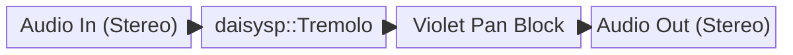

### B. Audio Flow

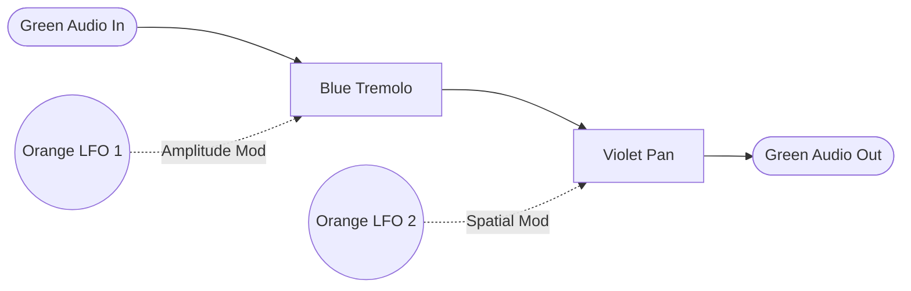

### C. Control Flow

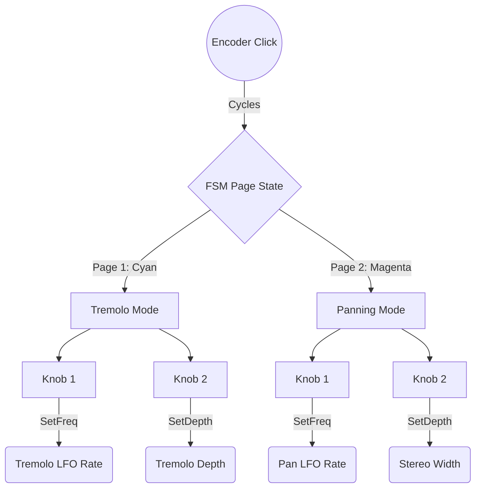

---

## Project 2: Asymmetrical Fuzz & Tube Overdrive

- **Difficulty:** 3/10
- **Concept:** A nonlinear distortion effect simulating a Class-A vacuum tube preamp and an analog "Fuzz Face" pedal via asymmetrical soft/hard clipping.
- **DVPE Architecture:** `audio_input` → `overdrive` (soft clipping) → `fold` (wavefolding) → `tone` (lowpass filter to remove harsh upper harmonics).
- **Pod FSM Mapping:**
  - _Page 1 (Red — Drive):_ Knob 1 = Input Gain (Drive), Knob 2 = Tone (Cutoff).
  - _Page 2 (Orange — Shape):_ Knob 1 = Asymmetry, Knob 2 = Output Trim.

### A. System Architecture


### B. Audio Flow


### C. Control Flow

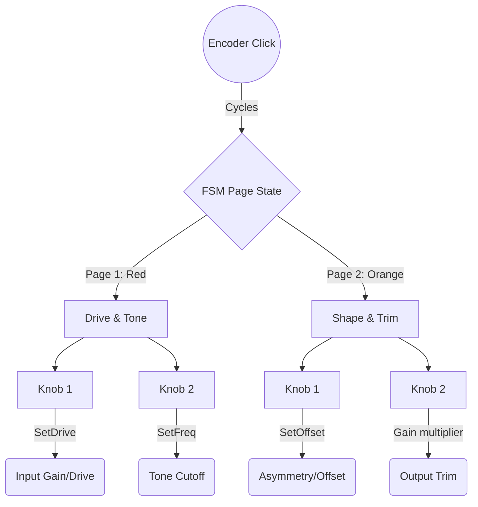

---

## Project 3: The Lo-Fi Digital Degrader

- **Difficulty:** 4/10
- **Concept:** Intentional destruction of the audio signal using quantization noise (bit-crushing) and sample-rate reduction (aliasing), popular in modern electronic production.
- **DVPE Architecture:** `audio_input` → `decimator` → `svf` (State Variable Filter to sweep through the resulting digital artifacts).
- **Pod FSM Mapping:**
  - _Page 1 (Blue — Degrade):_ Knob 1 = Sample Rate (Downsample), Knob 2 = Bit Depth.
  - _Page 2 (Yellow — Filter):_ Knob 1 = Filter Cutoff, Knob 2 = Resonance.

### A. System Architecture


### B. Audio Flow


### C. Control Flow

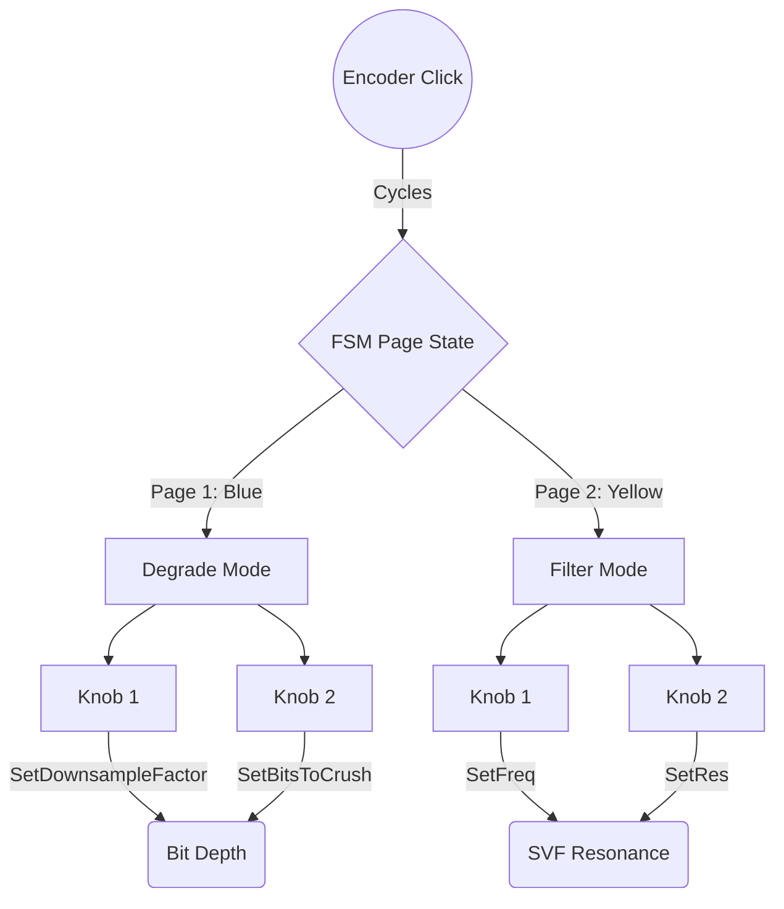

---

## Project 4: Studio Dynamics Compressor / Expander

- **Difficulty:** 5/10
- **Concept:** Algorithmic dynamic range control. This uses envelope followers to automatically attenuate peaks (compression) or silence noise floors (expanding/gating).
- **DVPE Architecture:** `audio_input` splits. Path A goes to `envelope_follower` → Violet Logic (calculating gain reduction). Path B goes to `vca`. The Logic block modulates the VCA.
- **Pod FSM Mapping:**
  - _Page 1 (White — Dynamics):_ Knob 1 = Threshold, Knob 2 = Ratio.
  - _Page 2 (Green — Time):_ Knob 1 = Attack Time, Knob 2 = Release Time.

### A. System Architecture


### B. Audio Flow

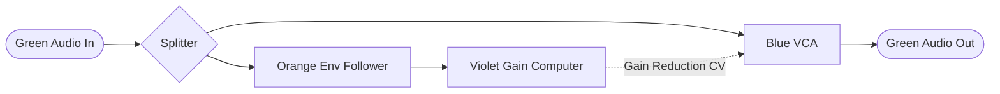

### C. Control Flow

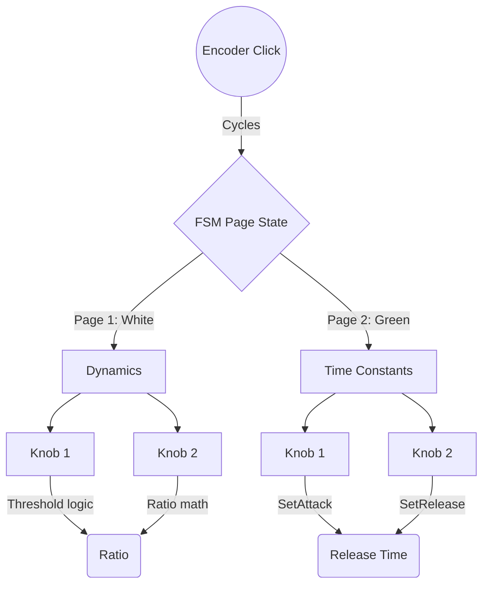

---

## Project 5: VOSIM Formant "Speaking" Voice

- **Difficulty:** 5/10
- **Concept:** Voice Simulation (VOSIM) synthesis that models the human vocal tract using squared sine wave pulses to create distinct vowel formants.
- **DVPE Architecture:** `midi_note` → `vosim_oscillator`. An `lfo` is lightly applied to the fundamental pitch to create natural human vibrato.
- **Pod FSM Mapping:**
  - _Page 1 (Cyan — Tract):_ Knob 1 = Formant 1 Freq (Vowel A), Knob 2 = Formant 2 Freq (Vowel B).
  - _Page 2 (Magenta — Breath):_ Knob 1 = Vibrato Depth, Knob 2 = Noise Blend (Aspiration).

### A. System Architecture


### B. Audio Flow

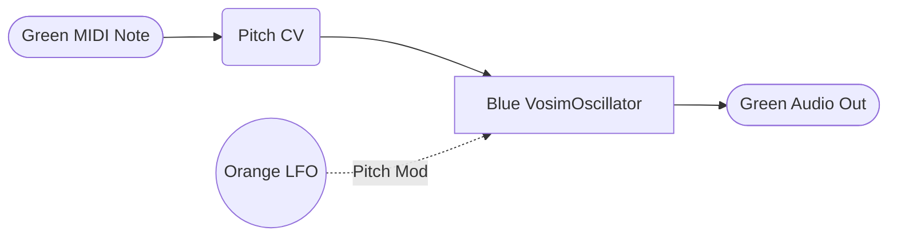

### C. Control Flow

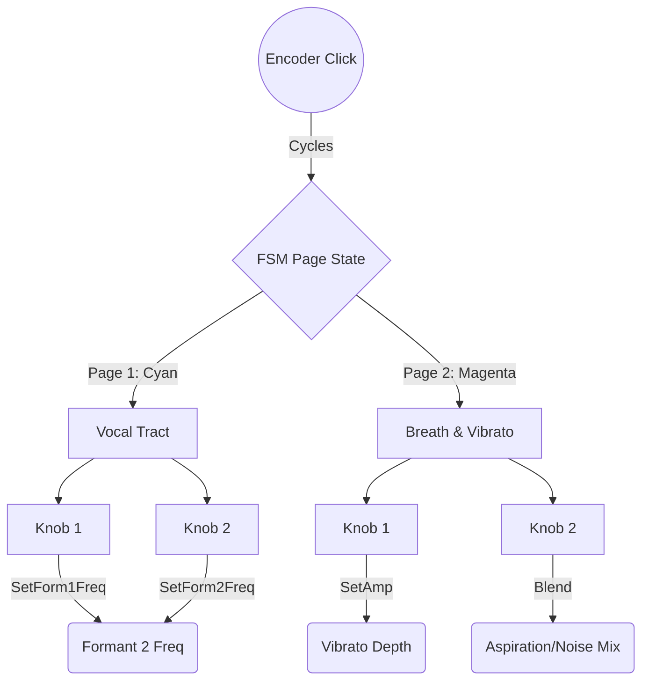

---

## Project 6: Spectral Pitch-Shifter / Harmonizer

- **Difficulty:** 6/10
- **Concept:** Shifting the pitch of an incoming audio signal without changing its duration, used to create artificial harmonies or octaves.
- **DVPE Architecture:** `audio_input` → `pitch_shifter` (using granular or phase-vocoder techniques) → `delay_line`.
- **Pod FSM Mapping:**
  - _Page 1 (Yellow — Harmony):_ Knob 1 = Pitch Shift Interval (-12 to +12 semitones), Knob 2 = Dry/Wet Mix.
  - _Page 2 (Purple — Space):_ Knob 1 = Delay Time, Knob 2 = Delay Feedback.

### A. System Architecture


### B. Audio Flow

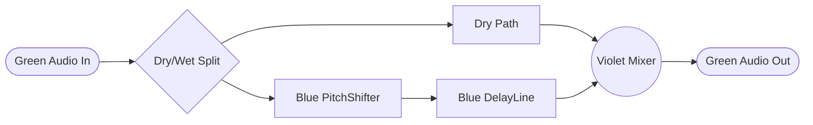

### C. Control Flow

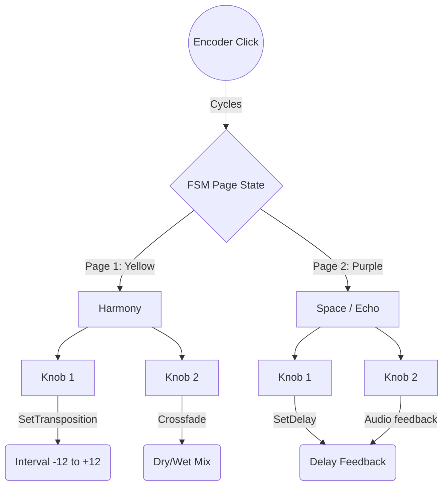

---

## Project 7: Modal Resonator (Acoustic Material Modeler)

- **Difficulty:** 7/10
- **Concept:** Simulating the physics of struck objects (wood, glass, metal membranes) by running an excitation signal through a finely tuned bank of bandpass filters.
- **DVPE Architecture:** `audio_input` (acting as the exciter) → `modal_voice`* (Resonator Filter Bank).
- **Pod FSM Mapping:**
  - _Page 1 (Orange — Material):_ Knob 1 = Structure (Inharmonicity), Knob 2 = Brightness.
  - _Page 2 (Cyan — Physics):_ Knob 1 = Damping (Decay), Knob 2 = Fundamental Pitch.

### A. System Architecture


### B. Audio Flow


### C. Control Flow

```mermaid
flowchart TD
  Encoder((Encoder Click)) -->|Cycles| FSM{FSM Page State}

  FSM -->|Page 1: Orange| P1[Material Properties]
  FSM -->|Page 2: Cyan| P2[Physics]

  P1 --> K1_P1[Knob 1] -->|SetStructure| Modal(Structure / Inharmonicity)
  P1 --> K2_P1[Knob 2] -->|SetBrightness| Modal(Brightness)

  P2 --> K1_P2[Knob 1] -->|SetDamping| Modal(Damping / Decay)
  P2 --> K2_P2[Knob 2] -->|SetFreq| Modal(Fundamental Pitch)
```

---

## Project 8: Stochastic Particle Texturizer

- **Difficulty:** 8/10
- **Concept:** Generating chaotic, bubbling, or crackling textures using random impulse trains. Creates "clouds" of sound rather than traditional notes.
- **DVPE Architecture:** `metro` (clock) triggers a `particle` module. The output feeds into `reverb_sc`* to smear the clicks into an ambient bed.
- **Pod FSM Mapping:**
  - _Page 1 (Red — Cloud):_ Knob 1 = Particle Density (Rate of clicks), Knob 2 = Pitch Randomization.
  - _Page 2 (Blue — Filter):_ Knob 1 = Resonant Filter Cutoff, Knob 2 = Q (Resonance).
  - _Page 3 (White — Space):_ Knob 1 = Reverb Size, Knob 2 = Reverb Mix.

### A. System Architecture

```mermaid
block-beta
  columns 4
  CLK["daisysp::Metro"]
  PART["daisysp::Particle"]
  VERB["daisysp::ReverbSc*"]
  OUT["Audio Out"]

  CLK --> PART
  PART --> VERB
  VERB --> OUT
```

### B. Audio Flow

```mermaid
flowchart LR
  Clock((Violet Clock)) -->|Trigger| Particle[Blue Particle Engine]
  Particle --> Reverb[Blue ReverbSc]
  Reverb --> Out([Green Audio Out])
```

### C. Control Flow

```mermaid
flowchart TD
  Encoder((Encoder Click)) -->|Cycles| FSM{FSM Page State}

  FSM -->|Page 1: Red| P1[Cloud Density]
  FSM -->|Page 2: Blue| P2[Particle Filter]
  FSM -->|Page 3: White| P3[Ambient Space]

  P1 --> K1_P1[Knob 1] -->|SetDensity| Particle(Rate of Clicks)
  P1 --> K2_P1[Knob 2] -->|SetSpread| Particle(Pitch Randomization)

  P2 --> K1_P2[Knob 1] -->|SetFreq| Particle(Resonant Cutoff)
  P2 --> K2_P2[Knob 2] -->|SetRes| Particle(Resonance Q)

  P3 --> K1_P3[Knob 1] -->|SetFeedback| Reverb(Reverb Size)
  P3 --> K2_P3[Knob 2] -->|Wet/Dry| Mixer(Reverb Mix)
```

---

## Project 9: Feedback Delay Network (FDN) Reverb

- **Difficulty:** 8/10
- **Concept:** Instead of a pre-packaged reverb block, this project builds a custom algorithmic room simulator from scratch using a matrix of delay lines that feed into each other.
- **DVPE Architecture:** `audio_input` splits into 4 `delay_line` blocks. The outputs are routed through Violet Multipliers (attenuators) and crossed back into the inputs of the other delay lines.
- **Pod FSM Mapping:**
  - _Page 1 (Cyan — Size):_ Knob 1 = Master Delay Time, Knob 2 = Matrix Feedback (Decay).
  - _Page 2 (Yellow — Tone):_ Knob 1 = Lowpass Damping, Knob 2 = Highpass Filter.

### A. System Architecture

```mermaid
block-beta
  columns 5
  IN["Audio In"]
  DLYS["4x DelayLines"]
  MTX["Feedback Matrix"]
  FLT["Filters"]
  OUT["Audio Out"]

  IN --> DLYS
  DLYS --> MTX
  MTX --> FLT
  FLT --> OUT
```

### B. Audio Flow

```mermaid
flowchart LR
  In([Green Audio In]) --> Split{Signal Splitter}
  Split --> DL1[Blue DelayLine 1]
  Split --> DL2[Blue DelayLine 2]
  Split --> DL3[Blue DelayLine 3]
  Split --> DL4[Blue DelayLine 4]

  DL1 & DL2 & DL3 & DL4 --> Matrix[Violet Feedback Matrix / Multipliers]
  Matrix --> LPF[Blue SVF Filters]
  Matrix -.->|Recursive Routing| DL1 & DL2 & DL3 & DL4
  LPF --> Out([Green Audio Out])
```

### C. Control Flow

```mermaid
flowchart TD
  Encoder((Encoder Click)) -->|Cycles| FSM{FSM Page State}

  FSM -->|Page 1: Cyan| P1[Room Size]
  FSM -->|Page 2: Yellow| P2[Room Tone]

  P1 --> K1_P1[Knob 1] -->|SetDelay| Delay(Master Delay Time)
  P1 --> K2_P1[Knob 2] -->|Multiply| Matrix(Matrix Feedback Decay)

  P2 --> K1_P2[Knob 1] -->|SetFreq LP| LPF(Lowpass Damping)
  P2 --> K2_P2[Knob 2] -->|SetFreq HP| HPF(Highpass Damping)
```

---

## Project 10: Markov-Chain AI Drummer

- **Difficulty:** 9/10
- **Concept:** Instead of a rigid step sequencer, this uses an artificial intelligence "Agent" (a variable-order Markov Model) to generate ever-evolving, non-looping rhythms based on probability matrices.
- **DVPE Architecture:** `metro` clocks a Violet Markov Chain logic block. The Markov block calculates state transitions and outputs conditional triggers to `analog_bass_drum` and `hihat` modules.
- **Pod FSM Mapping:**
  - _Page 1 (Green — Time):_ Knob 1 = Tempo, Knob 2 = Swing Amount.
  - _Page 2 (Magenta — AI Brain):_ Knob 1 = Kick Probability/Density, Knob 2 = Hat Complexity.
  - _Page 3 (Red — Tone):_ Knob 1 = Kick Decay, Knob 2 = Hat Pitch.

### A. System Architecture

```mermaid
block-beta
  columns 5
  CLK["daisysp::Metro"]
  AI["Markov Chain"]
  SYN["Drum Synths"]
  MIX["daisysp::Mixer"]
  OUT["Audio Out"]

  CLK --> AI
  AI --> SYN
  SYN --> MIX
  MIX --> OUT
```

### B. Audio Flow

```mermaid
flowchart LR
  Clock((Orange Metro)) --> Brain{Violet Markov Logic}

  Brain -.->|Kick Trigger| Kick[Blue AnalogBassDrum]
  Brain -.->|Hat Trigger| Hat[Blue HiHat]

  Kick --> Mix((Violet Mixer))
  Hat --> Mix
  Mix --> Out([Green Audio Out])
```

### C. Control Flow

```mermaid
flowchart TD
  Encoder((Encoder Click)) -->|Cycles| FSM{FSM Page State}

  FSM -->|Page 1: Green| P1[Time & Groove]
  FSM -->|Page 2: Magenta| P2[AI Brain]
  FSM -->|Page 3: Red| P3[Drum Tone]

  P1 --> K1_P1[Knob 1] -->|SetFreq| Clock(Master Tempo)
  P1 --> K2_P1[Knob 2] -->|Time Offset| Clock(Swing Amount)

  P2 --> K1_P2[Knob 1] -->|Matrix Weights| Logic(Kick Probability/Density)
  P2 --> K2_P2[Knob 2] -->|Matrix Weights| Logic(Hat Complexity)

  P3 --> K1_P3[Knob 1] -->|SetDecay| Kick(Kick Decay)
  P3 --> K2_P3[Knob 2] -->|SetFreq| Hat(Hat Pitch)
```

---

_LGPL modules (`*`): `modal_voice`, `reverb_sc`, `string_voice`, `moog_ladder` — require `USE_DAISYSP_LGPL = 1` in Makefile._
