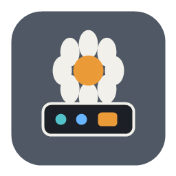
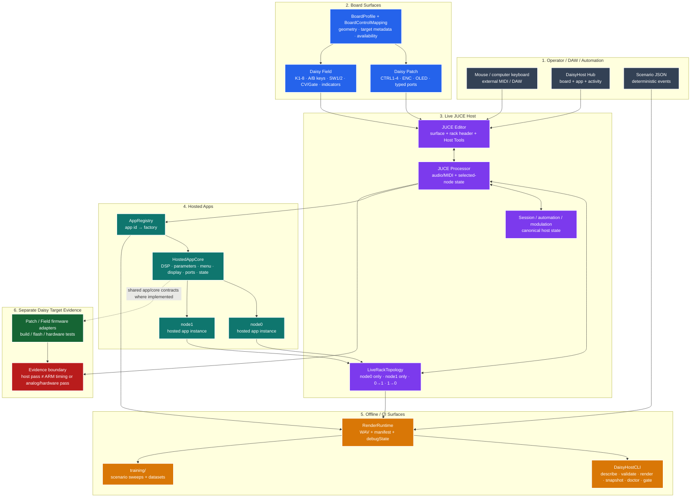

<div align="center">
  
</div>

# DaisyHost

**A Windows-first desktop lab for Daisy audio apps.** Run supported DaisyHost app cores as a
standalone JUCE application or VST3, switch between virtual **Daisy Patch** and
**Daisy Field** control surfaces, chain two hosted apps, inject test/MIDI/CV-style control,
and render deterministic scenarios without reflashing hardware for every experiment.

> DaisyHost models **app and board semantics**, not the STM32/libDaisy machine. A green host
> test or a good-sounding desktop render is useful evidence for the host implementation; it is
> not Cortex-M7 timing, SDRAM/cache, analog I/O, CV-voltage, or hardware validation.

Current source version: `0.2.0`.

## Why DaisyHost exists

Embedded-audio iteration gets tedious when every small DSP or control change requires a build,
flash, cable shuffle, and fresh interpretation of what the hardware did. DaisyHost moves the
parts that can safely run on a desktop into a common host:

- **Audition supported app cores** with live audio or built-in test signals.
- **Use Patch or Field-style controls** instead of a generic parameter spreadsheet.
- **Run two apps together** with a small, explicit rack instead of an arbitrary graph.
- **Exercise MIDI, CV/gate-style control, automation, and modulation** through one state model.
- **Render repeatable test scenarios** to WAV + JSON for regression, debugging, and datasets.
- **Inspect the same app metadata from CLI** when exact parameter IDs, ranges, or mappings matter.

DaisyHost does **not** ingest arbitrary libDaisy firmware and magically turn it into a desktop
plugin. Humanity has not yet automated away every unpleasant integration boundary.

## Quick start

From `DaisyHost/` on Windows, use the checked-in wrapper:

```bat
.\build_host.cmd
```

It configures CMake, builds the Release host targets, normalizes the known Windows
`Path` / `PATH` issue, and runs CTest.

The build produces the DaisyHost CLI, launcher Hub, offline renderer, VST3, standalone host,
and unit-test payload. Start with the generated **DaisyHost Hub** and choose:

1. a board surface: **Daisy Patch** or **Daisy Field**;
2. an app;
3. an activity: **Play / Test**, **Render**, or **Train**.

For a machine-readable sanity check after a Release build:

```bat
build\Release\DaisyHostCLI.exe doctor --build-dir build --source-dir . --config Release --json
build\Release\DaisyHostCLI.exe list-apps --json
build\Release\DaisyHostCLI.exe describe-board daisy_field --json
```

`doctor` is a readiness report. It does not replace the full build/test gate.

## The interface in one minute

DaisyHost has **two rack nodes**, `node0` and `node1`. Each node hosts one app instance.
The most important UI rule is simple:

> **Selected node = where your live controls go. Rack topology = where the audio goes.**

Those are intentionally separate. You can edit `node1` while audio is flowing
`node0 → node1`.

### Daisy Patch

The Patch surface gives the selected app:

- four main performance controls (`CTRL 1` ... `CTRL 4`);
- one rotary encoder plus push action for menu/edit work;
- a 128 × 64 OLED model;
- typed virtual audio, CV, gate, and MIDI ports;
- host tools for MIDI, test input, modulation, and rack state.

Labels are **app-dependent**. Do not assume `CTRL 2` always means the same DSP parameter.
The active app provides the binding and engineering metadata.

### Daisy Field

The Field surface expands the same selected-node model to:

- `K1` ... `K8`;
- `A1` ... `A8` and `B1` ... `B8` keys;
- `SW1` / `SW2`;
- four CV inputs;
- two derived CV-output monitor values;
- gate and host-side LED/indicator state.

Field controls fail unavailable when an app does not expose a valid target. They are not
silently reassigned to something convenient and mysterious.

**Detailed control-by-control instructions:**
[docs/interface-guide.md](docs/interface-guide.md)

## Interface previews

`DaisyHost/assets/` contains the publication icon assets only. The repository also tracks PNG
captures under `DaisyHost/.tmp/`, including Field host captures; this documentation pass did not
validate those `.tmp` images as current or publication-ready UI evidence. This README therefore
does not promote a temporary/debug capture, generated illustration, or unverified screenshot as
current UI evidence.

The interface guide records the required capture set for future screenshots: Patch, Field,
`pedal_multidelay`, rack header, Host Tools, and visible version/build identity.

## Two-node rack

The live host intentionally supports four bounded audio topologies:

| Topology | Audio path |
|---|---|
| `node0_only` | Host → `node0` → output |
| `node1_only` | Host → `node1` → output |
| `node0_to_node1` | Host → `node0` → `node1` → output |
| `node1_to_node0` | Host → `node1` → `node0` → output |

There is no freeform multi-node graph editor in v1. The bounded rack keeps routing, session
state, automation, offline rendering, and regression testing understandable.

## System map



For the implementation-level version of this map, including class/file ownership and evidence
boundaries, see [docs/technical-architecture.md](docs/technical-architecture.md).

## Common workflows

### Play an app with live audio

1. Launch the Hub and choose a board/app.
2. Start **Play / Test**.
3. Confirm the selected rack node.
4. Leave test input on `Host In`.
5. Use the board surface and app menu.

If the app works with a generated test tone but not `Host In`, the hosted DSP path is probably
alive; check the standalone audio device/input configuration next.

### Exercise an app without external audio

The live processor currently offers:

`Host In` · `Sine` · `Saw` · `Noise` · `Impulse` · `Triangle` · `Square`

Use a simple generated source first when separating app behavior from Windows audio-device
problems.

### Use MIDI

- Play from the on-screen keyboard or computer keyboard.
- In standalone, enable external MIDI devices in JUCE **Settings...**.
- MIDI learn is **CC-based**: use controller knobs/sliders, not note keys.
- Host Tools shows current MIDI input status and recent note/CC/program activity.

### Modulate a parameter

DaisyHost currently exposes four host modulation lanes. Each can use `CV1` ... `CV4` or
`LFO1` ... `LFO4` as a source and targets an eligible parameter in its native engineering
range. Effective state is available to the host snapshot/debug surfaces.

### Render a deterministic scenario

```bat
build\Release\DaisyHostCLI.exe validate-scenario training\examples\multidelay_smoke.json --json
build\Release\DaisyHostCLI.exe render training\examples\multidelay_smoke.json --output-dir build\cli_smoke\multidelay --expect-non-silent --json
```

The render path writes audio plus machine-readable evidence and is suitable for regression and
training/dataset workflows. It is not a substitute for live DAW or hardware testing.

## Featured hosted app: Pedal Multi-Delay

`pedal_multidelay` is the desktop host implementation of the compact delay-pedal concept.
It exposes five modes:

`DIGI` · `TAPE` · `MOD` · `REV` · `FREEZE`

and five performance slots:

`TIME` · `FEEDBACK` · `MIX` · `COLOR` · `MOTION`

On **Field**, the five performance slots are available on `K1` ... `K5`. On **Patch**, the
first four are on the main knobs and `MOTION` is reached through the encoder/menu surface.

Inspect the live machine-readable control contract:

```bat
build\Release\DaisyHostCLI.exe describe-app pedal_multidelay --json
```

For fractional-read policy, transition behavior, reverse overlap-add, freeze state machine,
host timing evidence, and explicit target non-claims, read
[docs/pedal-multidelay.md](docs/pedal-multidelay.md).

## What is actually shared with hardware?

DaisyHost is useful because supported app logic can be separated from board/runtime plumbing.
The repository currently includes firmware adapter references such as:

- [Patch MultiDelay](../patch/MultiDelay/README.md)
- [Field MultiDelay](../field/MultiDelay/README.md)
- [Generated Field MultiDelay](../field/MultiDelayGenerated/README.md)

But every firmware target still needs its own build, target timing, flash, physical I/O, and
audio/control verification. See the architecture guide for the evidence matrix.

## Documentation map

| Need | Read this |
|---|---|
| Use Patch, Field, MIDI, CV/gate, rack, test inputs, modulation | [Interface Guide](docs/interface-guide.md) |
| Understand architecture, contracts, state, render/CLI, firmware boundary | [Technical Architecture](docs/technical-architecture.md) |
| Understand `pedal_multidelay` DSP/control behavior and host evidence | [Pedal Multi-Delay](docs/pedal-multidelay.md) |
| Generate offline datasets | [Training README](training/README.md) |
| Current verified state / open issues | [CHECKPOINT](CHECKPOINT.md) |
| Work order and exact test ledger | [PROJECT_TRACKER](PROJECT_TRACKER.md) |
| Forward workstreams | [WORKSTREAM_TRACKER](WORKSTREAM_TRACKER.md) |
| Recent behavior and release notes | [CHANGELOG](CHANGELOG.md) |
| Local agent rules | [AGENTS](AGENTS.md) |
| Skill selection / usefulness evidence | [SKILL_PLAYBOOK](SKILL_PLAYBOOK.md) |

## Build and verification

Preferred full host gate from `DaisyHost/`:

```bat
.\build_host.cmd
```

Equivalent raw commands:

```bat
cmake -S . -B build
cmake --build build --config Release --target unit_tests DaisyHostCLI DaisyHostHub DaisyHostRender DaisyHostPatch_VST3 DaisyHostPatch_Standalone
ctest --test-dir build -C Release --output-on-failure
```

For current pass/fail evidence, use [PROJECT_TRACKER.md](PROJECT_TRACKER.md) and
[CHECKPOINT.md](CHECKPOINT.md). This landing page intentionally does not freeze a test count
that will become stale after the next useful commit.

## Architecture at a glance

| Layer | Primary location |
|---|---|
| Board/profile contracts | `include/daisyhost/BoardProfile.h`, `src/BoardProfile.cpp` |
| Field control mapping | `include/daisyhost/BoardControlMapping.h`, `src/BoardControlMapping.cpp` |
| Hosted app abstraction | `include/daisyhost/HostedAppCore.h` |
| App registry and app cores | `src/AppRegistry.cpp`, `src/apps/` |
| Live two-node rack/session | `src/LiveRackTopology.cpp`, `src/HostSessionState.cpp` |
| JUCE processor/editor | `src/juce/` |
| Headless render | `src/RenderRuntime.cpp` |
| CLI | `src/CliPayloads.cpp`, `tools/cli_app.cpp` |
| Launcher | `src/hub/` |
| Scenarios/datasets | `training/` |
| Tests | `tests/` |

## Non-goals

The current v1 architecture does not claim:

- full STM32/libDaisy emulation;
- arbitrary libDaisy firmware source translation;
- a freeform multi-node graph editor;
- mixed-board racks;
- Patch SM / Pod / custom-board runtime parity;
- Daisy target timing from desktop timing;
- analog input/output, CV-voltage, noise, headroom, EMI/EMC, or mechanical behavior from a
  desktop board drawing.

Those boundaries are features, not missing marketing adjectives. They keep DaisyHost testable
and make it clearer which evidence still belongs on the real target.
