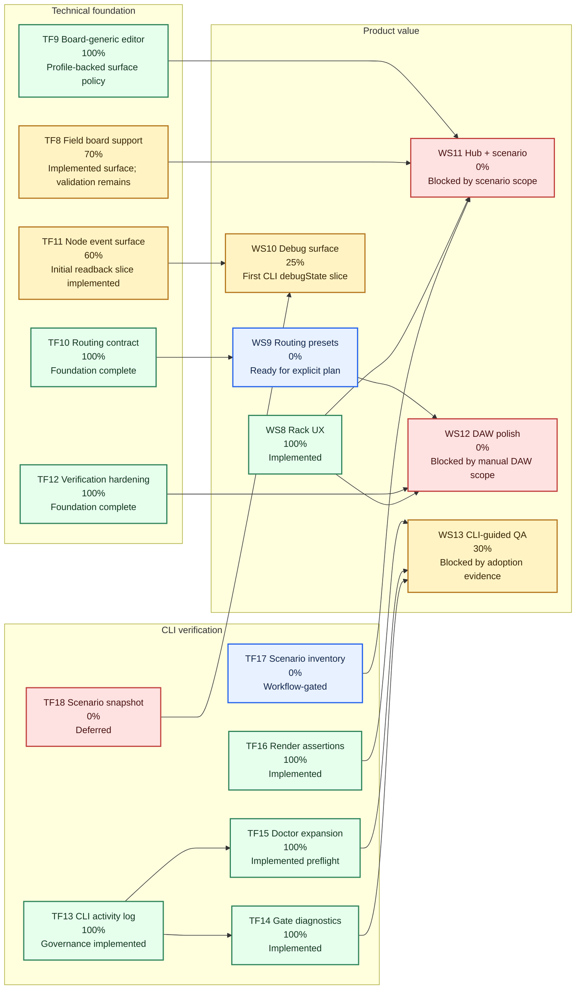

# DaisyHost Workstream Tracker

Last updated: 2026-04-29

This file tracks the next forward-looking DaisyHost portfolio after the current
`WS1` through `WS7` milestone set.

Current baseline:

- `WS1` through `WS7` planned milestone scope is complete enough to freeze in
  this checkout.
- Latest full host gate:
  `cmd /c build_host.cmd` passed on 2026-04-29 and Release `ctest` passed
  `278/278`, including `DaisyHostCliDoctor`,
  `DaisyHostCliRenderAssertions`, and `DaisyHostCliRenderAssertionsPass`.
- `WS8` rack UX productionization is implemented against the frozen two-node
  rack baseline: the four existing audio-only presets are unchanged, and the
  operator-facing rack now has clearer topology direction, selected-node role
  labels, per-node context, and Patch/Field selected-node target hints.
- Daisy Field board-support shell, host-side Field native controls, and Field
  extended host surface support are now implemented:
  `daisy_field` flows through Hub, session, standalone startup, render, and
  smoke paths while the rack remains frozen, including host-side Field
  outputs/switches/LEDs, startup-request launch planning, and selected-node
  Field surface render evidence. Field K5-K8 now avoid explicit K1-K4
  parameter targets, and the Field editor uses board-profile target metadata
  for the first board-generic cleanup pass. Sprint F3 also adds
  `field/MultiDelay` as the first Field firmware adapter; it is build-verified
  and ST-Link flash-verified, with manual functional hardware validation still
  pending. Adapter-pipeline v0 now generates a build/QAE-verified
  `field/MultiDelayGenerated` adapter from a checked-in spec and audits firmware
  portability without claiming arbitrary source translation.
- This tracker is mirrored in `PROJECT_TRACKER.md` so the active ledger and the
  forward portfolio stay readable in one place.
- TF12 verification/build hardening is complete for the current automated
  foundation: `build_host.cmd`, `gate --json`, expanded `doctor --json`, CTest
  smoke entries, documented CLI adoption, and the latest `278/278` full gate
  all agree. Manager-readable result: agents and CI now have a repeatable
  build/readiness/gate evidence path; manual DAW, hardware, firmware, and GUI
  validation remain separate product-validation work, not TF12 completion
  criteria.
- TF10 routing-contract foundation is complete: shared `LiveRackRoutePlan`
  construction is source-backed, targeted-test-backed, and covered by the
  latest `278/278` full host gate. Manager-readable result: DaisyHost now has
  one tested routing rulebook for today's two-node audio rack; richer routing
  presets still belong to explicit `WS9` product scope.
- TF11 now has an initial node-targeted readback/debug contract slice:
  render manifests report resolved `targetNodeId` for inferred parameter,
  CV/gate, menu, surface, and selected-node MIDI events, and CLI render result
  JSON exposes render `nodes`, `routes`, and `executedTimeline` readback. The
  slice is covered by targeted Debug tests and the latest `278/278` full host
  gate.
- WS10 now has a first external debug-surface slice: existing
  `DaisyHostCLI snapshot --json` and `render --json` outputs include additive
  `debugState` readback for board, selected node, entry/output node roles,
  routes, selected-node target cues, and render timeline target counts without
  adding new CLI commands or route semantics.
- TF13 now defines the DaisyHostCLI activity logger and scope governance layer:
  future CLI commands are tracked as evidence-backed automation needs before
  code-bearing CLI diagnostics work starts.
- TF14 CLI gate diagnostics is implemented: `DaisyHostCLI gate --json` wraps
  the existing `build_host.cmd` gate, reports configure/build/ctest phases,
  CTest totals, stable target names, capped output tail, and conservative
  known-blocker classifications without changing build semantics.
- TF15 doctor source/build readiness expansion is implemented by extending
  existing `doctor --json`, not by adding a new command. Manager-readable
  result: agents and CI can now distinguish source-root readiness, build-tree
  readiness, artifact readiness, CTest registration readiness, and duplicate
  `Path` / `PATH` environment hazards before deciding whether to run the gate.
  Doctor remains a preflight report only; it does not execute the gate, drive
  GUI/live/DAW workflows, flash firmware, or provide generic shell control.
- TF16 CLI render assertions are implemented on the existing `render` command:
  CI/agents can now ask the render step to fail on checksum, non-silence, route
  count, node ids, and executed timeline target-node evidence without manually
  inspecting JSON. Manager-readable result: render proof is now an executable
  pass/fail contract, not only a report someone must read.
- TF9 board-generic editor surface is complete: editor-facing board panel
  names, selected-node hint copy, keyboard hint copy, trace mode, indicator
  visibility, and extended-surface visibility now live in `BoardProfile` for
  `daisy_patch` and `daisy_field`. Manager-readable result: the editor still
  behaves the same for the supported boards, but future board-surface work can
  use profile metadata instead of reopening Patch-shaped UI branches. No new
  board, firmware, routing preset, graph editor, hardware, or DAW/VST3
  validation scope shipped in TF9.

## Blockers For Other WPs

`% unblocked` estimates dependency/readiness clearance, not implementation
completion. The implementation percent remains in the workstream tables below.

| WP | What blocks it | How to unblock | % unblocked |
|---|---|---|---|
| `TF8` Daisy Field board support | Manual Field hardware validation, generated-adapter flashing, broader firmware parity decisions, real voltage checks, USB MIDI/computer-side validation, and DAW/VST3 validation remain outside the automated host gate. | Run the Field hardware/manual validation checklist, flash generated adapters when explicitly scoped, record voltage/USB/DAW evidence, and keep host-only proof separate from hardware proof. | `70%` |
| `TF11` Node-targeted event surface expansion | The first render/debug readback slice exists, but the remaining node-event contract scope is not yet explicitly closed. | Define the remaining event/readback surface, add contract tests for only that scope, and rerun targeted plus full host verification. | `60%` |
| `WS9` Richer live routing presets | `TF10` provides the routing rulebook, but the actual product semantics for new presets are not designed. | Write an explicit routing-preset product plan: allowed presets, UI language, scenario/session behavior, tests, and non-goals. | `70%` |
| `WS11` Hub + scenario workflow upgrade | Scenario inventory/readback and Hub workflow scope are still undecided; `TF17` / `TF18` remain deferred. | Decide the curated scenario inventory, Hub launch flow, and whether scenario-backed snapshots are required before editing Hub behavior. | `45%` |
| `WS12` DAW-facing polish | Automated verification is ready, but manual VST3/DAW validation scope and proof are missing; richer routing may also affect DAW-facing behavior. | Define the DAW checklist, run VST3/manual host validation, and decide whether `WS9` routing scope must land first. | `35%` |
| `WS13` CLI-guided QA workflow adoption | CLI evidence tools exist, but routine real adoption evidence has not repeated enough to call the workflow standard. | Use `doctor`, `gate`, render assertions, and smoke in several real agent/CI iterations, then promote the proven sequence into policy. | `60%` |
| `TF17` Scenario inventory and validation matrix | Scenario parser/examples exist, but the Hub/scenario workflow may still change and repeated inventory pain is not yet proven. | Collect repeated scenario-discovery pain or lock the `WS11` scenario workflow, then add inventory/validation matrix tests. | `35%` |
| `TF18` Scenario-backed snapshot/readback | Render manifests already cover much of the evidence; no-audio scenario inspection has not become a repeated need. | Start only when `WS10` or `WS11` needs scenario-backed state without writing audio, then define the smallest snapshot contract. | `45%` |

## Portfolio Rules

- Product workstreams optimize operator-facing value and demo quality.
- Technical-foundation workstreams reduce future integration cost and keep the
  platform extensible.
- Daisy Field has landed as a board-support shell plus host-side Field native
  controls and host-side Field outputs/switches/LEDs through the existing board
  factory seam; the first `field/MultiDelay` firmware adapter now exists and
  has build plus ST-Link flash/verify evidence, and adapter-pipeline v0 can
  generate the same class of Field firmware adapter from a shared-core spec.
  Full manual Field hardware validation, generated-adapter flashing, broader
  firmware parity, arbitrary firmware import, real voltage-output measurement,
  Field-specific app ergonomics, mixed-board racks, and manual DAW/VST3
  validation remain separate future work. Field-specific follow-on scope is
  tracked in `FIELD_PROJECT_TRACKER.md`.
- Every implementation start still needs a per-iteration claim in
  `PROJECT_TRACKER.md`.
- Every WP plan, workstream-table update, and completion handoff must lead in
  manager terms before technical detail: what needs to be implemented or was
  implemented, why it matters, what it unlocks, what depends on it, what
  remains blocked, what is explicitly out of scope, and what evidence proves
  the work is done.
- CLI usefulness tiers:
  `Essential` = needed to keep agent/CI verification reliable,
  `Useful` = repeated workflow improvement, `Nice-to-have` = defer until
  proven, `Rejected` = outside the thin offline CLI scope.

## Product Value Workstreams

| ID | Workstream | What it unlocks | Depends on | Parallel-safe with | Percent complete | Status |
|---|---|---|---|---|---|---|
| `WS8` | Rack UX productionization | Makes the visible 2-node rack feel shippable: clearer node context, stronger role labels, better selected-node feedback, and fewer operator mistakes. | **Done:** frozen `WS7` rack baseline was available and preserved. | `TF8`, `TF9`, `TF12`, `WS9` | `100%` | Implemented; automated gate green, manual visual/hardware/DAW validation not claimed |
| `WS9` | Richer live routing presets | Expands the rack past the current four audio-only presets without jumping to a freeform graph editor. | **Ready for explicit planning:** `TF10` is complete as the routing foundation, but route semantics remain owned by `WS9` scope.<br>`WS7` rack runtime; full-gate-backed `TF10` routing contract | `WS8`, `TF10`, `TF11`, `TF12` | `0%` | Planned; do not start without explicit routing-preset scope |
| `WS10` | External state / debug surface | Exposes the effective host state outside the processor for tooling, QA, diagnostics, and demos. | **First slice implemented:** additive CLI `debugState` now exists on `snapshot --json` and `render --json`.<br>Existing snapshot model; clearer node-targeted event rules from `TF11` | `TF11`, `TF12`, `WS8` | `25%` | First external debug-surface slice implemented; no new CLI commands |
| `WS11` | Hub + scenario workflow upgrade | Turns Hub into a launch surface for curated rack setups, saved scenarios, and repeatable operator flows. | **Blocked / not ready:** board-generic editor dependency is complete, but scenario inventory/readback and Hub workflow scope remain unimplemented.<br>Stable rack UX from `WS8`; board-aware editor foundation from `TF8` / `TF9`; future scenario work from `TF17` / `TF18` | `WS8`, `TF8`, `TF9`, `TF12` | `0%` | Planned after scenario workflow expectations settle |
| `WS12` | DAW-facing polish | Improves host-facing ergonomics and validates real VST3 behavior after the rack baseline is frozen. | **Blocked / not ready:** verification foundation is complete, but DAW-facing validation still needs explicit manual VST3/DAW scope and proof.<br>Stable rack UX from `WS8`; completed verification hardening from `TF12` | `WS8`, `TF12` | `0%` | Planned after manual DAW validation scope settles |
| `WS13` | CLI-guided QA workflow adoption | Turns DaisyHostCLI into the routine agent/CI evidence entrypoint without making it a GUI, DAW, firmware, or generic shell controller. | **Partly ready:** `TF13` governance, `TF14` gate diagnostics, `TF15` doctor readiness, and `TF16` render assertions exist; broader adoption still waits for repeated workflow evidence.<br>`TF13`, implemented `TF14`, implemented `TF15`, implemented `TF16`, future adoption evidence | `TF12`, `TF14`, `TF15`, `TF16` | `30%` | Useful; CLI evidence tools are available, blocked on repeated adoption evidence |

## Technical Foundation Workstreams

| ID | Workstream | What it unlocks | Depends on | Parallel-safe with | Percent complete | Status |
|---|---|---|---|---|---|---|
| `TF8` | Daisy Field board support | Adds `daisy_field` through the board factory seam plus host-side Field native controls, host-side Field outputs/switches/LEDs, and first shared-core-to-Field firmware adapter generation so Field work can ship without reopening Patch-only architecture. | **Good to go:** `WS7` freeze gate is green; remaining work is validation/follow-on scope, not a dependency blocker.<br>Green `WS7` freeze gate | `WS8`, `WS11`, `TF9`, `TF12` | `70%` | Extended host surface + adapter pipeline v0 implemented; manual Field validation remains |
| `TF9` | Board-generic editor surface | Removes remaining Patch-shaped assumptions from the editor and board rendering path. | **Done:** board-editor surface policy is now profile-backed for the supported Patch and Field boards.<br>Existing board seam; pairs naturally with `TF8` | `TF8`, `WS8`, `WS11` | `100%` | Complete; editor-facing board surface policy is profile-backed for Patch and Field |
| `TF10` | Routing contract generalization | Stabilizes route validation and internal graph rules so richer routing does not become a rewrite every sprint. | **Done:** the shared two-node audio routing rulebook is source-backed, targeted-test-backed, and covered by the latest full gate.<br>`WS7` rack/session/render baseline | `WS9`, `TF11`, `TF12` | `100%` | Complete foundation contract; `WS9` owns any new routing presets or product semantics |
| `TF11` | Node-targeted event surface expansion | Broadens the node-scoped event model for live/render/debug tooling beyond the current first-pass contract. | **In progress:** initial render/debug readback slice is source-backed, targeted-test-backed, and covered by the latest full gate.<br>`WS7` node-targeted runtime | `WS9`, `WS10`, `TF10` | `60%` | Initial node-target readback slice implemented |
| `TF12` | Verification / build hardening | Keeps `build_host.cmd`, smoke coverage, and checkout verification boring and repeatable. | **Done:** wrapper, gate, doctor, CTest smoke, CLI adoption docs, and latest full-gate evidence agree.<br>`build_host.cmd`, `gate --json`, `doctor --json`, CLI smoke coverage | All workstreams | `100%` | Complete automated verification foundation; manual DAW/hardware/firmware validation remains outside TF12 |
| `TF13` | CLI activity logger and scope governance | Adds the lightweight evidence log and usefulness tiers that decide whether new DaisyHostCLI commands are essential, useful, nice-to-have, deferred, or rejected. | **Done:** tracker/docs evidence is sufficient; no runtime dependency.<br>Existing `PROJECT_TRACKER.md` ledger and DaisyHostCLI adoption sequence | `TF12`, `TF14`, `TF15`, docs-only Worker 3 slices | `100%` | Essential; implemented as docs-only governance |
| `TF14` | CLI gate diagnostics | Adds structured full-gate evidence and known-blocker classification so agents do not manually mine long MSBuild/CTest logs. | **Done:** implemented as a thin wrapper over `build_host.cmd`; source/build preflight readiness is now covered by implemented `TF15`.<br>`TF13`, `build_host.cmd`, current CTest smoke entries | `TF10`, `TF11`, `TF15` | `100%` | Essential; implemented with `gate --json` phase, CTest, target, blocker, and output-tail diagnostics |
| `TF15` | Doctor source/build readiness expansion | Extends existing `doctor --json` beyond artifact existence into environment, source/build readiness, CTest registration, and known Windows path hazards while preserving existing top-level fields. | **Done:** expanded as a preflight/readiness report, not a gate runner or new command.<br>`TF13`, existing `doctor`, CMake/CTest/smoke paths | `TF14`, `TF12` | `100%` | Essential / Useful; implemented with source/build/ctest/environment/blocker readiness and explicit out-of-scope boundaries |
| `TF16` | CLI render assertions | Lets CI fail directly on expected checksum, non-silence, route count, node ids, and executed timeline target-node readback. | **Done:** render evidence can now be asserted directly on the existing CLI `render` command.<br>`TF11` render debug payloads; implemented `TF14` gate diagnostics | `WS10`, `TF11`, `TF14` | `100%` | Complete bounded CLI assertion slice; no new command or product routing behavior |
| `TF17` | Scenario inventory and validation matrix | Lets agents discover checked-in scenarios and app/board/input validation status without manual repo searches. | **Deferred until workflow need is repeated:** scenario parser and examples exist, but Hub/scenario workflow may still change.<br>Training examples and scenario parser | `WS11`, `TF12`, `TF14` | `0%` | Useful; deferred until scenario workflow needs it |
| `TF18` | Scenario-backed snapshot/readback | Produces effective-state snapshots from actual scenario/rack setup without writing audio. | **Deferred:** render manifests already provide much of this evidence; no-audio scenario inspection must become a repeated need first.<br>`TF11`, future `WS10` external debug surface | `WS10`, `TF16` | `0%` | Nice-to-have; deferred |

## Visual Status Diagrams

Color key: green = implemented, amber = partial / in progress, blue = planned
and dependency-ready, red = blocked or deferred.

```mermaid
flowchart TD
  tf8["TF8 Field board support"]
  tf9["TF9 Board-generic editor"]
  tf10["TF10 Routing contract"]
  tf11["TF11 Node event surface"]
  tf12["TF12 Verification hardening"]
  tf13["TF13 CLI activity log"]
  tf14["TF14 Gate diagnostics"]
  tf15["TF15 Doctor expansion"]
  tf16["TF16 Render assertions"]
  tf17["TF17 Scenario inventory"]
  tf18["TF18 Scenario snapshot"]
  ws8["WS8 Rack UX"]

  tf13 --> tf14
  tf13 --> tf15
  tf14 --> ws13["WS13 CLI-guided QA"]
  tf15 --> ws13
  tf16 --> ws13
  tf10 --> ws9["WS9 Routing presets"]
  tf11 --> ws10["WS10 Debug surface"]
  tf18 --> ws10
  ws8 --> ws11["WS11 Hub + scenario"]
  tf8 --> ws11
  tf9 --> ws11
  tf17 --> ws11
  ws8 --> ws12["WS12 DAW polish"]
  tf12 --> ws12
  ws9 --> ws12

  classDef done fill:#e6ffed,stroke:#2f855a,color:#12391f,stroke-width:2px
  classDef partial fill:#fff3c4,stroke:#b7791f,color:#3b2600,stroke-width:2px
  classDef ready fill:#e8f1ff,stroke:#2563eb,color:#10264d,stroke-width:2px
  classDef blocked fill:#fde2e1,stroke:#c2413d,color:#4a1110,stroke-width:2px

  class ws8,tf9,tf10,tf12,tf13,tf14,tf15,tf16 done
  class tf8,tf11,ws10 partial
  class ws9,tf17 ready
  class ws11,ws12,tf18 blocked
  class ws13 partial
```





## ASCII Parallelization View

```text
Time ------------------------------------------------------------------------>

Frozen baseline:
  [WS1-WS7 complete] ----> [Daisy Field extended host surface implemented]

Product track:
  [WS8 Rack UX implemented] -----------> [WS11 Hub + Scenario]
  [WS9 Routing Presets] ---------------> [WS12 DAW Polish]
  [WS10 External State / Debug]
  [WS13 CLI-guided QA Workflow] <------- [TF14/TF15/TF16 CLI diagnostics]

Technical track:
  [TF8 Daisy Field] -------------------> [TF9 Board-Generic Editor]
  [TF10 Routing Contract] -------------> [TF11 Node Events]
  [TF12 Verification Hardening] ------------------------------------------+
  [TF13 CLI Activity Logger] ----------> [TF14 Gate Diagnostics]
                                 \------> [TF15 Doctor Expansion]
                                                                         |
Cross-links:                                                             |
  TF10 -> WS9                                                            |
  TF11 -> WS10                                                           |
  TF8  -> WS11                                                           |
  TF14, TF15, TF16 -> WS13                                                |
  TF17 -> WS11                                                            |
  TF18 -> WS10                                                            |
  WS8  -> WS11, WS12                                                     |
  TF12 -> all parallel lanes --------------------------------------------+
```

## Recommended Parallel Start

After each WP/workstream closeout, refresh this decision with the repo-local
recommender:

```sh
py -3 tools\suggest_next_wp.py --tracker WORKSTREAM_TRACKER.md
```

Start these first if staffing exists:

- `WS10` only when a concrete external-debug consumer needs more than the
  existing additive CLI `debugState` readback
- `WS13` only as an adoption/documented-workflow slice after repeated workflow
  evidence proves the CLI diagnostics and render assertions are routine, not
  one-off

Start these after the first joins settle:

- `WS9` once routing-preset scope is explicit
- `WS11` once scenario inventory/readback and Hub workflow scope are explicit
- `WS12` once manual DAW/VST3 validation scope is explicit
- `WS13` code-bearing expansion only after `TF14` / `TF15` / `TF16` have
  proved useful in repeated real agent/CI iterations
- `TF11` can continue as bounded contract-first work for remaining node-event
  hardening; `TF10` is closed as the routing foundation, and `WS9` should own
  any new route semantics

## Decision Summary

- The best product-side next move is no longer basic rack clarity; `WS8` made
  the existing rack easier to inspect, and the next product value is launch,
  scenario, routing, or DAW-facing polish on top of that baseline.
- The best foundation-side next move is no longer board-generic editor cleanup,
  verification hardening, doctor readiness, or render assertions; `TF9`,
  `TF12`, `TF14`, `TF15`, and `TF16` are complete. The next likely value is
  adoption proof or explicitly scoped product work, while deferred
  hardware-facing Field work remains outside TF9.
- DaisyHostCLI should grow from logged agent/CI pain: TF13 is the governance
  layer, TF14 has landed as gate diagnostics, TF15 has landed as doctor
  readiness, and TF16 has landed render assertions on the existing `render`
  command. Further CLI surface should wait for repeated workflow evidence.
