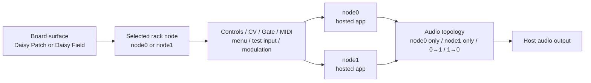

# DaisyHost Interface Guide

This guide explains the current DaisyHost desktop interface from the user point of view.
It is deliberately narrower than the implementation trackers: it tells you what each
surface is for, how controls are targeted, and which host tools are safe to use without
pretending that the desktop host is physical Daisy hardware.

The descriptions below are grounded in the current board/profile and JUCE host contracts:

- [`include/daisyhost/BoardProfile.h`](../include/daisyhost/BoardProfile.h)
- [`src/BoardProfile.cpp`](../src/BoardProfile.cpp)
- [`include/daisyhost/BoardControlMapping.h`](../include/daisyhost/BoardControlMapping.h)
- [`src/BoardControlMapping.cpp`](../src/BoardControlMapping.cpp)
- [`src/juce/DaisyHostPluginEditor.cpp`](../src/juce/DaisyHostPluginEditor.cpp)
- [`src/juce/DaisyHostPluginProcessor.cpp`](../src/juce/DaisyHostPluginProcessor.cpp)

For the compact delay pedal specifically, also read
[`pedal-multidelay.md`](pedal-multidelay.md).

> **Scope boundary:** Patch and Field are host-side board surfaces. They model control,
> port, display, and routing semantics. They are not full STM32/libDaisy emulators, and
> host behavior is not evidence for Daisy timing, SDRAM/cache behavior, analog levels,
> or physical control feel.

## 1. The mental model

DaisyHost currently runs a fixed two-node rack. Each node hosts one registered app core.
The board surface does not create a different DSP graph; it changes how the selected
node is controlled and displayed.



The important distinction is **selection versus routing**:

- **selected node** decides where live Patch/Field edits go;
- **rack topology** decides which node or serial order carries audio.

Changing one does not silently change the other.

## 2. Starting the interface

The least ambiguous route is the launcher:

1. Build DaisyHost with `build_host.cmd` from the `DaisyHost/` directory.
2. Start **DaisyHost Hub** from the generated Release artifacts.
3. Select the board surface (`Daisy Patch` or `Daisy Field`).
4. Select an app and **Play / Test** to launch the standalone host.
5. In the rack header, confirm which node is selected before changing controls.

The Hub also exposes **Render** and **Train** activities; those are offline workflows,
not live GUI audio paths.

Supported board IDs in the current source are exactly:

| Surface | Board ID | What it changes |
|---|---|---|
| Daisy Patch | `daisy_patch` | Patch-style four-knob + encoder panel, typed Patch virtual ports, OLED, host drawer. |
| Daisy Field | `daisy_field` | Field-style K1-K8, A/B keys, SW1/SW2, CV/Gate surface, derived indicators, Field drawer. |

## 3. Daisy Patch surface

The Patch profile is intentionally performance-oriented rather than a generic parameter
spreadsheet. The active app supplies the current labels and bindings.

### Main controls

| Surface control | Current host role |
|---|---|
| `CTRL 1` | Mix / top-ranked first control for the selected app surface. For the historical MultiDelay mapping this is dry/wet. |
| `CTRL 2` | Primary app control. |
| `CTRL 3` | Secondary app control. |
| `CTRL 4` | Feedback or another app-defined top control. |
| `ENC 1` rotate | Menu navigation / value editing according to the active menu state. |
| `ENC 1` push | Enter / confirm / edit action. |

Do not memorize one app's labels as global Patch behavior. The host binds the surface to
`HostedAppPatchBindings`, so labels and targets are app-dependent.

### Patch ports

The board profile exposes typed virtual ports rather than decorative jacks:

- four CV inputs;
- two gate inputs plus a gate output where supported by the app contract;
- four audio inputs and four audio outputs in the Patch profile;
- MIDI input and MIDI output;
- a 128 × 64 OLED display model.

The current live two-node rack is **not** a freeform virtual patcher. Audio topology is
selected from the four bounded rack presets described in section 6. Typed ports still
matter for app input/output semantics, render scenarios, snapshots, and diagnostics.

### What follows the selected node

The Patch profile explicitly states that these edits follow the selected rack node:

- knobs and encoder;
- CV and gate values;
- test input;
- menu actions;
- modulation edits.

If a control appears to affect the wrong app, check the selected-node indicator in the
rack header before changing anything else. Human beings have spent decades debugging the
wrong thing because a selector was pointing somewhere unexpected; DaisyHost does not need
to continue the tradition.

## 4. Daisy Field surface

Field is a richer control surface, not a different audio engine. The current mapping
contract defines:

- 8 knobs (`K1`-`K8`);
- 4 CV inputs;
- 2 derived CV-output monitor values;
- 2 switches (`SW1`, `SW2`);
- 16 keys (`A1`-`A8`, `B1`-`B8`);
- 20 host-side LED/indicator values.

### K1-K8

Field knob mapping has two supported policies in source:

- `PatchPagePlusExtras`: mirror the selected app's Patch page first, then expose additional
  important automatable parameters;
- `ControllableParameters`: populate the surface from controllable parameter metadata.

Unavailable controls remain unavailable rather than being silently wired to a random
parameter. The UI reads board-profile target metadata to decide what is interactive.

For `pedal_multidelay`, the app-specific contract is simpler: the five performance slots
are available on the first five Field knobs. See
[`pedal-multidelay.md`](pedal-multidelay.md) for the exact per-mode labels and DSP targets.

### A/B keys

The 16 Field keys are app-dependent. A binding can represent either:

- a menu/utility action; or
- a MIDI note.

For general hosted apps, the Field mapping can expose chromatic MIDI keys using the
selected keyboard octave. For `pedal_multidelay`, the app supplies explicit A/B-row
utility bindings for bypass, tap/trails, mode selection, and freeze operations.

### SW1/SW2

The two Field switches are fixed menu-navigation controls in the current host mapping:

- **SW1 Back** targets the selected node's `/menu/navigation/back` action and dispatches
  one encoder step backward;
- **SW2 Forward** targets `/menu/navigation/forward` and dispatches one encoder step
  forward.

Their pressed state is host-side and momentary, but their semantic targets are not
app-declared alternate switch actions. App-specific utility actions belong on declared
Field key bindings rather than SW1/SW2.

### CV and Gate

Field CV1-CV4 reuse the host CV input path. Each CV source can be configured in the host
tools, and Field target selection is constrained by the safe-target helpers in
`BoardControlMapping` rather than accepting arbitrary IDs.

CV OUT 1-2 in the host are **derived monitor values**, not claims about physical DAC
voltage accuracy. The source maps them to `0..5 V` evidence values for snapshots and
render manifests. Use them to inspect state, not to certify hardware.

Gate input follows the selected node. Indicator values are derived state and are not a
second persistence system.

### Field drawer pages

The Field host drawer presents three visible pages. Use the labels shown in the current UI:

1. **Play** (`DaisyFieldDrawerPage::kKeyboardMidiCv`): on-screen/computer-keyboard MIDI,
   MIDI activity, CV generators and manual CV, gate, octave, and live performance input.
2. **Mod** (`DaisyFieldDrawerPage::kPublicParameters`): eligible modulation destinations
   plus the four modulation lanes, including source, amount, enable, and clear controls.
3. **Rack** (`DaisyFieldDrawerPage::kRackAudio`): rack nodes, app assignment, topology,
   test-input source, and audio-routing work.

The enum names are implementation identifiers; **Play / Mod / Rack** are the operator-facing
names. In particular, the middle page is a modulation surface in the current UI rather than
a generic direct-parameter page.

## 5. Computer keyboard and MIDI

DaisyHost supports an on-screen MIDI keyboard and computer-keyboard note input.
The Patch surface hint is `A/W/S/E...`; the Field surface also reserves `X/C` for
Field-switch interaction in its current host hint.

### External MIDI

In the standalone host, a physical MIDI device must still be enabled in JUCE's
**Settings...** dialog. DaisyHost then reports current input status and a rolling log of
recent note, CC, and program messages in Host Tools.

### MIDI learn

MIDI learn is CC-oriented. Use a controller knob or slider for learn operations; playing
note keys is not a substitute for sending a CC. The five fixed DAW automation slots are a
separate mechanism and remain stable at IDs `daisyhost.slot1` through
`daisyhost.slot5` while their selected-app targets can change.

## 6. Two-node rack

The live plugin/standalone runtime contains exactly two hosted nodes today:

- `node0`
- `node1`

Each node has its own app instance and state. The rack header exposes per-node app
selection and the current role label.

Available audio topology presets are:

| Topology | Meaning |
|---|---|
| `node0_only` | Host audio passes through node0 only. |
| `node1_only` | Host audio passes through node1 only. |
| `node0_to_node1` | Serial chain: node0 then node1. |
| `node1_to_node0` | Serial chain: node1 then node0. |

There is intentionally no arbitrary graph editor in v1. This keeps state, automation,
render evidence, and CPU behavior bounded enough to test instead of turning the host into
an attractive rectangle farm with unknowable routing.

## 7. Test input tools

The processor currently exposes these test-input modes:

- `Host In` (standalone default)
- Sine
- Saw
- Noise
- Impulse
- Triangle
- Square

Generated sources have level/frequency controls where applicable. Impulse has an explicit
trigger. These sources exist to exercise hosted apps when live input is unavailable or
undesirable; they do not validate analog input hardware.

In a serial rack, host or generated test input is injected at the topology's **entry node**.
A downstream node receives the routed output of the upstream node rather than its own test
source. A useful debugging sequence is therefore:

1. record the current topology and selected node; select the current topology entry node;
   if the app under test is downstream, temporarily switch the topology to that node alone
   and select that now-soloed node;
2. choose a simple generated input such as Sine or Triangle for the entry/soloed node;
3. verify app output/activity;
4. **while that entry/soloed node is still selected**, return its test-input source to
   `Host In`;
5. restore the intended topology and the original selected node;
6. only then investigate the OS audio device or physical source.

That separates app-path problems from Windows/driver/input problems with considerably less
ritual sacrifice.

## 8. Host modulation

DaisyHost currently provides four modulation lanes. Each lane can be fed from:

- CV1-CV4; or
- LFO1-LFO4.

A lane is attached to an eligible app parameter and contributes in the parameter's native
engineering range. The host evaluates the base value plus lane contributions, clamps when
needed, and exposes the effective result through the live-state snapshot.

This is host modulation. It is not a claim that the corresponding modulation exists in a
firmware adapter unless that adapter implements it separately.

## 9. `pedal_multidelay` in Patch and Field

The compact delay host app exposes five modes:

- `DIGI`
- `TAPE`
- `MOD`
- `REV`
- `FREEZE`

Each mode has five performance slots: `TIME`, `FEEDBACK`, `MIX`, `COLOR`, `MOTION`.
The musician-facing labels, engineering labels, units, ranges, smoothing, provisional
status, and exact DSP targets are emitted by the app descriptor.

Use this command after a Release build when you need machine-readable truth instead of a
README transcription:

```bat
build\Release\DaisyHostCLI.exe describe-app pedal_multidelay --json
```

Surface difference:

- **Field:** all five performance slots are directly available on K1-K5;
- **Patch:** the first four performance slots use the four knobs and `MOTION` is reached
  through the encoder/menu surface.

For DSP policy, freeze-state semantics, host timing evidence, and the explicit target
non-claims, read [`pedal-multidelay.md`](pedal-multidelay.md).

## 10. Troubleshooting by symptom

| Symptom | First check | Why |
|---|---|---|
| Knob edits the wrong app | Selected rack node | Live surface edits target selection, not necessarily the rack entry node. |
| No live audio but generated tone works | `Host In`, JUCE audio settings, standalone mute policy | The hosted app path is probably alive; the problem is upstream of it. |
| External MIDI does nothing | JUCE `Settings...` MIDI input enable | Device enumeration/enablement is still a standalone-host responsibility. |
| MIDI learn ignores keys | Send a CC from a knob/slider | Learn is CC-based. |
| Field control is disabled | Current app binding / mapping policy | Unsupported targets fail unavailable rather than falling through. |
| Serial chain sounds reversed | Rack topology label | `node0_to_node1` and `node1_to_node0` are distinct presets. |
| CV changes a surprising parameter | Field CV target + selected node | CV target selection is node-scoped and configurable. |
| `pedal_multidelay` label/range differs from this guide | `describe-app pedal_multidelay --json` | App metadata is the current machine-readable contract; pedal ranges are provisional. |

## 11. Screenshot status

At the source revision used for this guide, `DaisyHost/assets/` contains the publication icon
assets only. The repository also tracks PNG captures under `DaisyHost/.tmp/`, including
`daisyhost-window-printwindow.png` and `daisyhost-subharmoniq-field-gui.png`. This pass did not
validate those `.tmp` captures as current or publication-ready, so none is embedded here as
current UI evidence.

When screenshots are added later, capture at least:

1. Patch surface with rack header and Host Tools visible;
2. Field surface with K1-K8, A/B keys, CV/Gate, and drawer visible;
3. one `pedal_multidelay` example on each surface;
4. the exact DaisyHost version/build identity in the frame or caption.

## 12. Related documentation

- [README](../README.md): project description and quick start
- [Technical architecture](technical-architecture.md): implementation boundaries and data flow
- [Pedal Multi-Delay](pedal-multidelay.md): delay-specific DSP/control contract and evidence
- [Field expansion-board layout](field-expansion-board-layout.html): separate Field hardware/layout study
- [CHECKPOINT](../CHECKPOINT.md): current verified state and unresolved work
- [PROJECT_TRACKER](../PROJECT_TRACKER.md): implementation/test ledger
