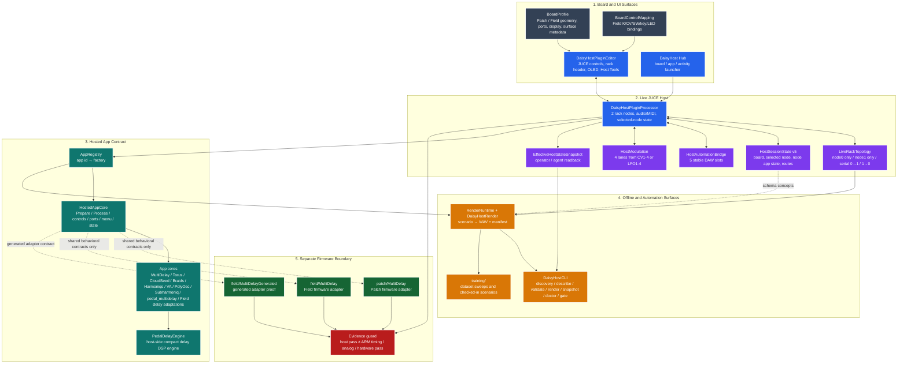
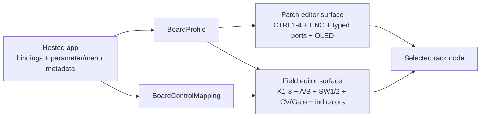

# DaisyHost Technical Architecture

This document is the source-oriented companion to the main DaisyHost README. It explains
how the current desktop host is divided, where board semantics live, how the two-node rack
is bounded, and which evidence can and cannot be carried from the desktop host to Daisy
firmware or hardware.

The goal is not to restate every tracker entry. It is to give a stable map that lets an
engineer find the right contract before changing code.

## 1. System map

## 2. Architectural boundaries

### Board metadata is data, not app logic

[`BoardProfile`](../include/daisyhost/BoardProfile.h) owns board identity and desktop
surface description:

- board ID and display name;
- controls and their panel bounds;
- typed virtual ports;
- 128 × 64 display description;
- editor-surface policy;
- decorations, labels, and indicators.

The factory currently accepts exactly `daisy_patch` and `daisy_field`. Unsupported IDs
return no profile through `TryCreateBoardProfile` and throw through `CreateBoardProfile`.
This is preferable to silently creating the wrong board.

Field-specific binding policy lives in
[`BoardControlMapping`](../include/daisyhost/BoardControlMapping.h), where K1-K8,
CV1-CV4, CV OUT monitors, SW1/SW2, A/B keys, and LEDs are represented as explicit
bindings with target kinds and availability state.

### The JUCE editor does not own DSP truth

[`DaisyHostPluginEditor`](../src/juce/DaisyHostPluginEditor.cpp) renders controls and
forwards user interaction. It gets labels, values, display/menu snapshots, app identities,
and rack state from the processor and board/app contracts.

This keeps three things from collapsing into one giant GUI object:

1. panel geometry;
2. live host state;
3. hosted-app DSP/control semantics.

A UI label is therefore presentation, not an independent parameter definition.

### The processor is the live integration point

[`DaisyHostPluginProcessor`](../src/juce/DaisyHostPluginProcessor.cpp) is the JUCE audio
processor and the current live-host integration layer. Its public API exposes:

- selected board profile;
- two rack nodes and selected-node control;
- per-node app selection;
- topology selection;
- top controls and Field controls;
- CV/gate state and CV generators;
- MIDI keyboard/tracking/learn support;
- test-input generators;
- host modulation lanes;
- OLED/menu/parameter snapshots;
- version/build identity;
- effective-state readback.

The header contains mutex/atomic state because the desktop host must bridge JUCE/UI/audio
concerns. Do **not** use this class as evidence that the same synchronization strategy is
suitable inside an embedded Daisy audio callback.

## 3. Hosted app contract

The stable app-side abstraction is
[`HostedAppCore`](../include/daisyhost/HostedAppCore.h).

An app must provide:

- stable app ID and display name;
- declared capabilities;
- Patch/Field binding metadata;
- `Prepare(sampleRate, maxBlockSize)`;
- block `Process(...)`;
- control and virtual-port setters;
- parameter descriptors and values;
- menu model and navigation;
- display model;
- state capture/restore/reset.

### Parameter metadata

`ParameterDescriptor` carries both generic host fields and the newer pedal-specific
contract. Pedal-style parameters can declare:

- `slotId`;
- musician-facing `label`;
- `engineeringLabel`;
- native unit/range/default;
- curve;
- exact `dspTargets`;
- smoothing time;
- macro flag;
- provisional flag.

That metadata is why README text should not become the canonical control database.
`DaisyHostCLI describe-app <app> --json` is the better inspection surface when exact
current ranges or DSP targets matter.

## 4. App registry and factories

[`AppRegistry`](../src/AppRegistry.cpp) maps supported app IDs to factories. Live JUCE,
CLI description, and offline render paths all use the same hosted-app contract rather than
maintaining separate lists of DSP implementations.

Representative registered app families in the current tree include:

- MultiDelay regression/reference core;
- Torus;
- CloudSeed;
- Braids;
- Harmoniqs;
- VA Synth;
- PolyOsc;
- Subharmoniq;
- `pedal_multidelay`;
- Field delay/Fx adaptations and bundle.

Use `DaisyHostCLI list-apps --json` for current machine-readable inventory instead of
copying this list into automation.

## 5. Two-node rack contract

The live runtime is deliberately bounded to two nodes. The visible IDs are `node0` and
`node1`.

[`LiveRackTopology`](../include/daisyhost/LiveRackTopology.h) owns legal topology presets
and role labels. The current operator-facing audio presets are:

- `node0_only`;
- `node1_only`;
- `node0_to_node1`;
- `node1_to_node0`.

This is a fixed topology family, not a graph editor. That constraint matters because it
keeps:

- session representation bounded;
- route validation explicit;
- UI targeting understandable;
- render scenarios deterministic;
- regression coverage finite.

### Selection and topology are orthogonal

The selected node determines where live control, Field/Patch surface input, keyboard MIDI,
CV/gate/test input, menu edits, and automation binding operate. Topology determines audio
ordering.

A serial topology can therefore have `node0` first in the audio chain while `node1` is the
currently selected edit target. This is intentional.

## 6. Session state

[`HostSessionState`](../include/daisyhost/HostSessionState.h) is the durable desktop-host
session contract. The current README/tracker identifies the live schema as v5, carrying
rack-global state plus node and route records while retaining backward compatibility with
legacy single-node sessions.

Treat session serialization as a host contract. It is not a firmware preset format unless a
firmware path explicitly adopts the same schema.

## 7. Automation and modulation

### Stable DAW automation slots

[`HostAutomationBridge`](../src/HostAutomationBridge.cpp) exposes five stable host slots:

- `daisyhost.slot1`
- `daisyhost.slot2`
- `daisyhost.slot3`
- `daisyhost.slot4`
- `daisyhost.slot5`

The slot IDs remain stable while their selected-app parameter targets can be rebound. App
state remains canonical by app parameter ID rather than by whichever DAW slot happened to
control it.

### Host modulation

[`HostModulation`](../include/daisyhost/HostModulation.h) defines four modulation lanes.
Each lane can select CV1-CV4 or LFO1-LFO4 and applies its contribution in the target
parameter's native range before normalization/clamping.

The effective result can be inspected through the live snapshot. This is valuable for
external tooling because it distinguishes base state from effective modulated state.

## 8. Patch and Field UI composition

Patch and Field should therefore remain visually distinct while sharing the same live app
and state machinery.

## 9. Test input and MIDI paths

The processor exposes these test-input modes in source:

- Host Input;
- Sine;
- Saw;
- Noise;
- Impulse;
- Triangle;
- Square.

The standalone default remains Host Input. Generated sources exist to separate app/DSP
problems from OS/device/input problems.

MIDI can arrive from:

- the DAW/plugin MIDI bus;
- the on-screen keyboard;
- the computer keyboard;
- an external standalone MIDI device enabled through JUCE settings.

MIDI learn is CC-based. Recent note/CC/program activity is also exposed through the host
tracker UI.

## 10. Offline render and CLI

[`RenderRuntime`](../src/RenderRuntime.cpp) is a separate headless path built on the same
hosted-app contracts. Scenario JSON can drive parameters, CV, gate, MIDI, test input, and
node-targeted events, then emit:

- `audio.wav`;
- `manifest.json`;
- render/debug JSON through CLI surfaces.

`DaisyHostCLI` currently provides the practical automation surface for:

- app/board discovery;
- app/board description;
- scenario validation;
- render;
- snapshot;
- smoke;
- doctor/preflight;
- gate orchestration;
- render assertions.

`doctor` is a readiness report, not a substitute for running the gate. Render assertions are
host evidence, not physical-audio evidence.

## 11. `pedal_multidelay` architecture

The compact delay app has two distinct layers:

1. [`PedalDelayEngine`](../include/daisyhost/PedalDelayEngine.h) and
   [`src/PedalDelayEngine.cpp`](../src/PedalDelayEngine.cpp): the host-side five-mode delay
   DSP engine;
2. [`PedalDelayCore`](../include/daisyhost/apps/PedalDelayCore.h) and
   [`src/apps/PedalDelayCore.cpp`](../src/apps/PedalDelayCore.cpp): hosted-app adapter,
   parameter/menu metadata, board bindings, state, and port semantics.

The current technical note documents host-measured policies and known gaps:
[`pedal-multidelay.md`](pedal-multidelay.md).

Important boundary: the host implementation can be useful for interaction and DSP-policy
experiments without becoming the accepted Daisy target-performance proof. ARM build,
Cortex-M7 cycle cost, SDRAM/cache behavior, physical audio, and pedal hardware remain
separate gates.

## 12. Firmware adapters are separate products of evidence

Current repository firmware references include:

- [`patch/MultiDelay`](../../patch/MultiDelay/README.md)
- [`field/MultiDelay`](../../field/MultiDelay/README.md)
- [`field/MultiDelayGenerated`](../../field/MultiDelayGenerated/README.md)

A shared core or matching control contract can reduce duplication, but each firmware target
still needs its own build and hardware evidence. Desktop JUCE controls, Windows scheduling,
and host memory behavior cannot be promoted into embedded facts by diagram.

## 13. Verification model

DaisyHost has several evidence levels. Keep them separate:

| Evidence | What it can prove | What it cannot prove |
|---|---|---|
| Unit/CTest | Host contracts and deterministic regressions covered by tests. | Physical GUI feel, DAW behavior, hardware. |
| Standalone smoke | Process can launch and survive the smoke harness. | Complete visual correctness or audio quality by ear. |
| CLI/render | Headless state/routing/scenario behavior and generated audio evidence. | Live DAW scheduling or physical Daisy timing. |
| VST3 build | Plugin artifact is generated. | Successful loading in every DAW. |
| Firmware `make` | A firmware target compiles/links. | Flash success, real-time margin, analog behavior. |
| Flash | Image reaches hardware. | Audio quality, control ergonomics, EMC, or timing margin. |
| Bench/listening | The measured/listened condition. | Conditions that were not exercised. |

The most recent repository tracker records a green Release host gate of `337/337` for the
2026-08-13 `pedal_multidelay` publication pass. That result is historical evidence from the
recorded checkout; documentation-only edits do not automatically make it a fresh test run.

## 14. Source map

| Concern | Primary source |
|---|---|
| App abstraction | `include/daisyhost/HostedAppCore.h` |
| App inventory/factory | `src/AppRegistry.cpp` |
| Board profiles | `include/daisyhost/BoardProfile.h`, `src/BoardProfile.cpp` |
| Field bindings | `include/daisyhost/BoardControlMapping.h`, `src/BoardControlMapping.cpp` |
| Rack topology | `include/daisyhost/LiveRackTopology.h`, `src/LiveRackTopology.cpp` |
| Session state | `include/daisyhost/HostSessionState.h`, `src/HostSessionState.cpp` |
| Automation | `src/HostAutomationBridge.cpp` |
| Modulation | `include/daisyhost/HostModulation.h`, `src/HostModulation.cpp` |
| Live processor | `src/juce/DaisyHostPluginProcessor.*` |
| Live editor | `src/juce/DaisyHostPluginEditor.*` |
| Readback | `include/daisyhost/EffectiveHostStateSnapshot.h`, `src/EffectiveHostStateSnapshot.cpp` |
| Offline render | `src/RenderRuntime.cpp`, `tools/render_app.cpp` |
| CLI | `src/CliPayloads.cpp`, `tools/cli_app.cpp` |
| Hub | `src/hub/` |
| Compact delay DSP | `include/daisyhost/PedalDelayEngine.h`, `src/PedalDelayEngine.cpp` |
| Compact delay app | `include/daisyhost/apps/PedalDelayCore.h`, `src/apps/PedalDelayCore.cpp` |
| Tests | `tests/` |
| Scenario/dataset tooling | `training/` |

## 15. Non-goals of this architecture

The current architecture does not claim:

- full STM32/libDaisy emulation;
- arbitrary firmware-source translation;
- arbitrary multi-node graph editing;
- mixed-board racks;
- Patch SM / Pod / custom-board runtime parity;
- Daisy target timing from desktop host timing;
- analog I/O, CV voltage, noise, headroom, EMI/EMC, or mechanical behavior from the UI model.

Those are intentionally separate engineering problems. Keeping the boundary explicit makes
DaisyHost useful instead of letting it become a desktop-shaped source of accidental hardware
claims.
