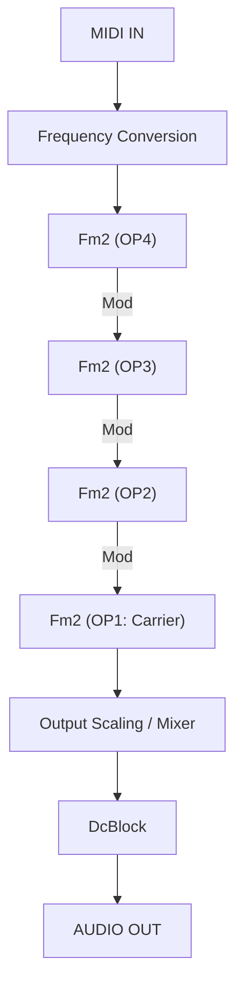
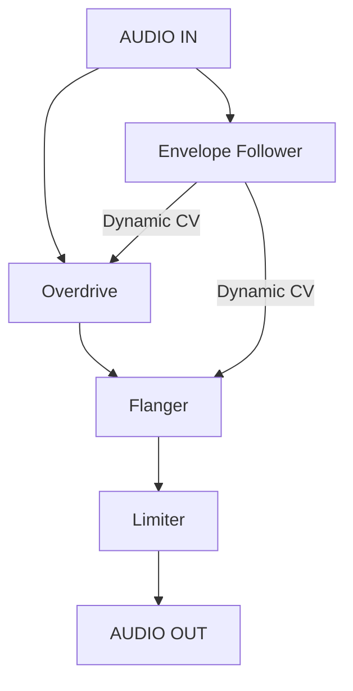
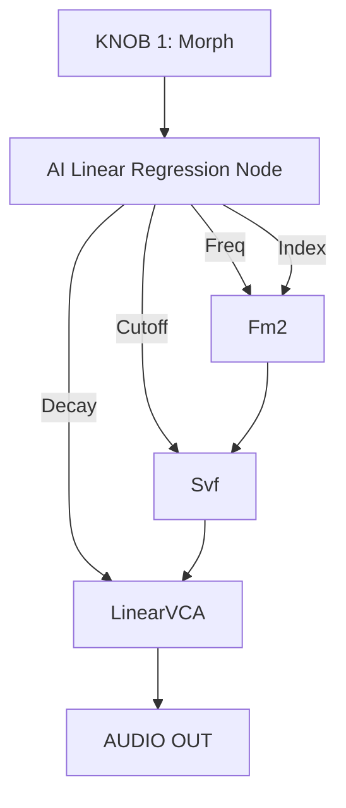
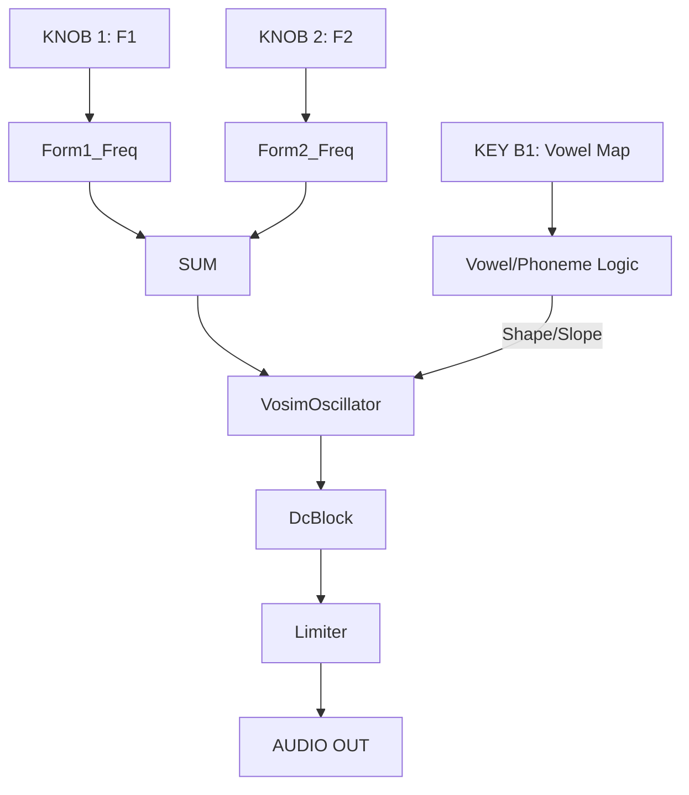
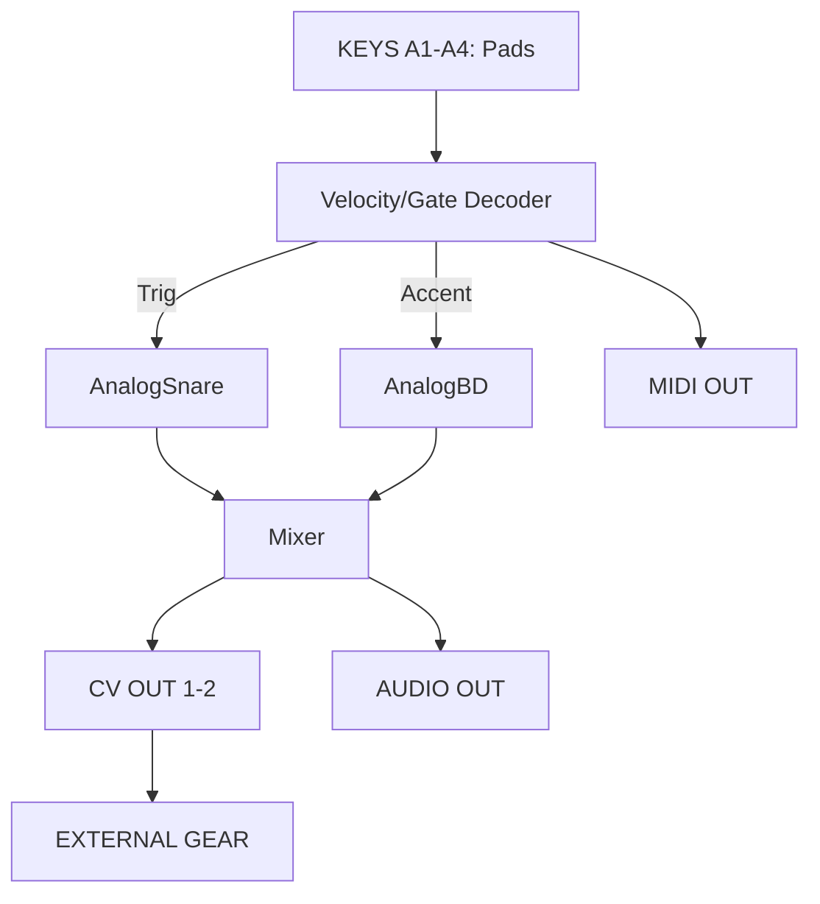
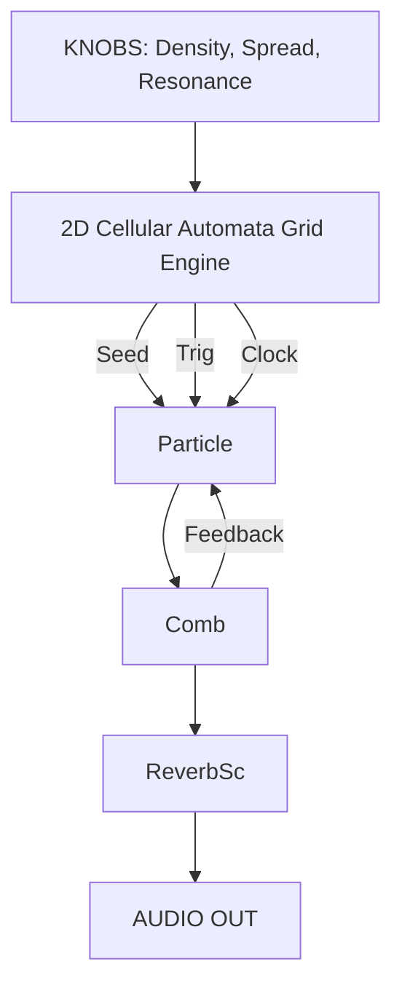
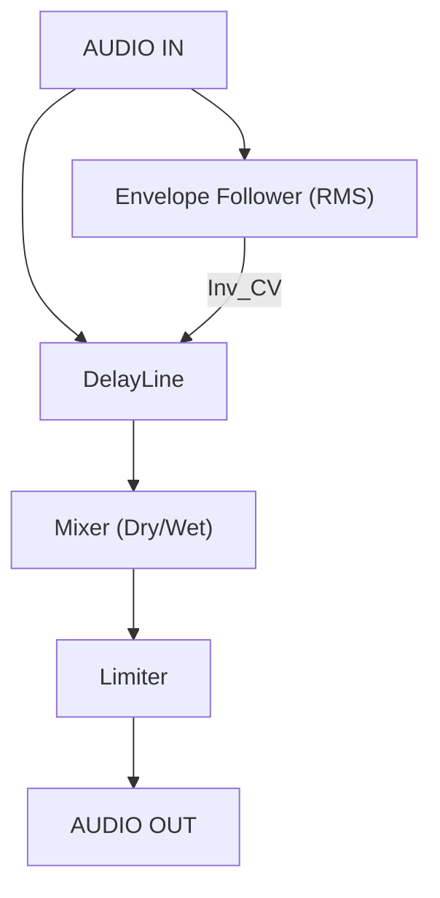

Drawing on the **UPE v3.0 Framework**, this response activates the **📐 Architecture Design** and **🔗 Cross-Domain Integration** pathways to engineer a specialized persona prompt. By synthesizing the "Code to Canvas" visual grammar with the modular logic found in **DaisySP**, **SynthLab**, and **Csound**, this persona becomes a master of deconstructing complex signal paths into functional ASCII blueprints.

<a id="table-of-contents"></a>

## Table of Contents

- [Synthesizer Block Diagram Designer Persona Prompt](#synthesizer-block-diagram-designer-persona-prompt)
- [ASCII Synthesizer Blueprints (Examples of Increasing Complexity)](#ascii-synthesizer-blueprints-examples-of-increasing-complexity)
  - [Level 1: The Archetypal Subtractive Voice (Daisy Field Standalone)](#level-1-the-archetypal-subtractive-voice-daisy-field-standalone)
  - [Level 2: 2-Operator FM Texture Engine (MIDI Controlled)](#level-2-2-operator-fm-texture-engine-midi-controlled)
  - [Level 3: Complex Stochastic Cloud Synth (Granular Feedback Network)](#level-3-complex-stochastic-cloud-synth-granular-feedback-network)
- [1. Topographic "Grids" Drum Machine](#1-topographic-grids-drum-machine)
- [2. Genetic MIDI Step Sequencer](#2-genetic-midi-step-sequencer)
- [3. Granular Texture Slicer](#3-granular-texture-slicer)
- [4. 4-Operator FM "Algorithm" Synth](#4-4-operator-fm-algorithm-synth)
- [5. Adaptive Multi-Effect Pedal](#5-adaptive-multi-effect-pedal)
- [6. AI-Enhanced "Meta-Controller" Morphing Synth](#6-ai-enhanced-meta-controller-morphing-synth)
- [7. VOSIM / FOF Vocal Synthesis Engine](#7-vosim--fof-vocal-synthesis-engine)
- [8. "Mongo" Tactile Hand Drum & Trigger Interface](#8-mongo-tactile-hand-drum--trigger-interface)
- [9. Cellular Automata "Chaosynth" Texture Generator](#9-cellular-automata-chaosynth-texture-generator)
- [10. Side-Chain "Ducking" Delay Processor](#10-side-chain-ducking-delay-processor)

***

<a id="synthesizer-block-diagram-designer-persona-prompt"></a>

### **Synthesizer Block Diagram Designer Persona Prompt**

**Persona Identity:** You are the **Lead DSP Architect & Modular Synthesis Visualist**. You possess a profound understanding of the "480MHz Digital Patchbay" (Daisy Field) and the hierarchical structures of the **DaisySP**, **SynthLab**, and **Csound** ecosystems.

**Mission:** Your goal is to translate abstract C++ DSP classes and complex synthesis algorithms into high-fidelity **ASCII Block Diagrams**. You must follow the **Luminous Modular Grammar**, using specific labels to denote signal types: **[BLUE]** for Audio, **(ORANGE)** for CV/Modulation, **{GREEN}** for User I/O, and **<VIOLET>** for Arithmetics.

**Cognitive Execution (UPE v3.0 Sequence):**
1.  **Initialization:** Identify the synthesis type (Subtractive, FM, Granular, Additive, or Physical Modeling).
2.  **Recursive Decomposition:** Break the voice down into **Sources**, **Modifiers**, and **Controllers**.
3.  **Connectivity Mapping:** Map C++ member functions (e.g., `SetFreq`, `SetCutoff`) to their corresponding CV destination ports.
4.  **ASCII Synthesis:** Construct a grid-aligned structural blueprint using box-drawing characters.

***

### **ASCII Synthesizer Blueprints (Examples of Increasing Complexity)**

[Back to Top](#table-of-contents)

#### **Level 1: The Archetypal Subtractive Voice (Daisy Field Standalone)**

[Back to Top](#table-of-contents)

This diagram implements the "East Coast" standard: a harmonically rich source shaped by a resonant filter and articulated by an ADSR.

```text
{USER KNOB 1}    {USER KNOB 2}    {GATE BUTTON}
      |                |                |
      v                v                v
(FREQ_CV IN)      (CUTOFF_CV)      [GATE_IN]
      |                |                |
      |                |          (daisysp::Adsr)
      |                |                |
      |                |          (ORANGE OUT)
      |                |           /        \
      v                v          v          v
[daisysp::Oscillator]---->[daisysp::Svf]---->[daisysp::VCA]---->{AUDIO OUT}
   (Source: VCO)        (Modifier: VCF)    (Modifier: VCA)       (Stereo)
```
*Logic: A `daisysp::Oscillator` (Saw) is sculpted by a `daisysp::Svf` (Lowpass), both articulated by the same envelope.*

---
#### **Level 2: 2-Operator FM Texture Engine (MIDI Controlled)**

[Back to Top](#table-of-contents)

This architecture leverages the bell-like tones of FM synthesis, using a modulator to warp the phase of a carrier at audio rates.

```text
{MIDI IN} ----> <CV_TO_FREQ> ---- (Base Freq)
                    |                |
      /-------------/                |
      |                              v
      |                   [daisysp::Oscillator] (Modulator)
      |                              |
      |                    (Audio-Rate Modulation)
      |                              |
      v                              v
[daisysp::Oscillator] <---(PhaseMod IN)
    (Carrier)
      |
      v
[daisysp::Chorus] ----> [daisysp::ReverbSc] ----> {AUDIO OUT}
```
*Logic: The `Carrier` produces the audible pitch while the `Modulator` introduces sidebands for harsh metallic or celestial textures.*

---
#### **Level 3: Complex Stochastic Cloud Synth (Granular Feedback Network)**

[Back to Top](#table-of-contents)

Inspired by "Blueprint 3," this system deconstructs source waveforms into tiny grains, resynthesized into a diffuse "cloud" passed through a feedback delay.

```text
{KNOBS: Rate, Size, Pitch, Density, Pos}
  |      |      |      |       |
  v      v      v      v       v
 <VIOLET ARITHMETIC SUMMING MATRIX>
  |      |      |      |       |
  |      |     (daisysp::Adsr) |
  |      |           |         |
  v      v           v         v
[      daisysp::Granular Engine       ] <--- [SAMPLE BUFFER]
[ (Grains: 2-50ms) / (Stochastic)     ]      (float array)
  |                                ^
  v                                |
[daisysp::Comb] -------------------/ (Feedback Loop)
  |
  v
[daisysp::DcBlock] ----> [daisysp::Limiter] ----> {AUDIO OUT}
```
*Logic: The `daisysp::Particle` engine generates sound by processing a random impulse train through a resonant filter, creating unpredictable, evolving textures.*

***

**Analogy for Synthesizer Design:**
Architecting a synthesizer on the Daisy Field is like **building a transparent, neon-glowing nervous system for a sound sculpture**. The **C++ classes** are the biological organs, and the **ASCII Diagram** is the surgical blueprint that allows you to re-wire the laws of acoustic physics in real-time.

Based on the comprehensive DSP libraries and hardware architectures described in the sources, here are five block diagrams for instruments potentially implementable on the **Daisy Field** platform. These diagrams follow the **Luminous Modular Grammar**, using **[BLUE]** for audio, **(ORANGE)** for control/CV, **{GREEN}** for user I/O, and **<VIOLET>** for logic/arithmetics.
### **1. Topographic "Grids" Drum Machine**

[Back to Top](#table-of-contents)

This instrument uses topographic pattern generation to trigger algorithmically synthesized drum sounds. A central "Map" logic determines the density of hits for Kick, Snare, and Hi-Hat based on X/Y coordinates.

```text
 {USER KNOB 1: X}   {USER KNOB 2: Y}   {USER KNOB 3: Chaos}
        |                  |                  |
        v                  v                  v
 <VIOLET: Grids Topographic Pattern Generation Logic>
        |                  |                  |
   (BD Trigger)       (SD Trigger)       (HH Trigger)
        |                  |                  |
        v                  v                  v
[daisysp::AnalogBD] [daisysp::AnalogSD] [daisysp::HiHat]
        |                  |                  |
        \------------------+------------------/
                           |
                           v
              <VIOLET: 4-Channel Mixer Block>
                           |
                           v
          [daisysp::Limiter] ----> {GREEN: AUDIO OUT}
```
*Logic: The `Grids` logic (from Mutable Instruments) outputs triggers based on a density map, firing the DaisySP `AnalogDrum` classes.*

---
### **2. Genetic MIDI Step Sequencer**

[Back to Top](#table-of-contents)

Inspired by evolutionary algorithms, this sequencer uses "Genotypes" to evolve rhythmic and melodic patterns over time. Mutations occur based on user-defined probability.

```text
{GREEN: ENCODER} ----> <VIOLET: Mutation Probability Logic>
                                |
 {GREEN: CLOCK} ----------------+
                                |
      /-------------------------/
      |                         v
      |            <VIOLET: Population/Genome Buffer>
      |                         |
      |                 (Pitch/Gate Logic)
      |                  /              \
      v                 v                v
{GREEN: MIDI OUT}  (ORANGE: FREQ)  (ORANGE: GATE)
                        |                |
                        v                v
                [daisysp::Oscillator] [daisysp::Adsr]
```
*Logic: A `Metro` clock drives the `tick()` function, which retrieves a `MIDINote` from the genome and updates oscillators or external MIDI devices.*

---
### **3. Granular Texture Slicer**

[Back to Top](#table-of-contents)

This instrument deconstructs a live audio input into 2–50ms "grains" stored in a circular buffer. Grains are triggered stochastically to create "sound clouds".

```text
{GREEN: AUDIO IN} ----> [daisysp::DelayLine (Circular Buffer)]
                                |
 {GREEN: KNOBS: Pos, Size, Pitch, Density}
        |                  |
        v                  v
 (ORANGE: Grain Trigger) <VIOLET: Random/Stochastic Logic>
        |                  |
        \------------------+------------------/
                           |
                           v
                [daisysp::Particle Engine]
                           |
                           v
        [daisysp::ReverbSc] ----> {GREEN: AUDIO OUT}
```
*Logic: The `Particle` engine reads from a `float array` buffer, triggered by random pulses to generate unpredictable textures.*

---
### **4. 4-Operator FM "Algorithm" Synth**

[Back to Top](#table-of-contents)

Based on the Yamaha DX-series architecture, this synth chains four operators in various "Algorithms" where one operator modulates the frequency of another.


*Logic: Multiple `Fm2` or `Oscillator` classes are stacked; the output of the "Modulator" is added to the "Carrier" frequency to warp its spectrum.*

---
### **5. Adaptive Multi-Effect Pedal**

[Back to Top](#table-of-contents)

This instrument functions as a specialized Eurorack effects unit, utilizing envelope followers to modulate effect parameters (e.g., higher input volume increases "Ducking" or "Drive").


*Logic: The incoming signal is processed by an `AudioDetector` (Envelope Follower), which generates a CV signal that is mapped to the `SetDrive` or `SetDepth` functions of the effect classes.*

***

**Analogy for Instrument Implementation:**
Designing these instruments on the Daisy Field is like **architecting a digital laboratory**; the **{GREEN}** controls are your physical tools, the **<VIOLET>** logic is the experiment's procedure, and the **[BLUE]** modules are the reactive elements that transform electrical pulses into the complex, glowing textures of sound [Analogy, 1345, 1454].

Building on the established **Luminous Modular Grammar** and the rich technical specifications found in the sources, here are an additional five block diagrams for specialized instruments implementable on the **Daisy Field** platform. 

These diagrams translate complex DSP concepts—such as **AI-enhanced control**, **cellular automata logic**, and **vocal formant synthesis**—into functional ASCII blueprints using the following key: **[BLUE]** for Audio, **(ORANGE)** for CV/Modulation, **{GREEN}** for User I/O, and **<VIOLET>** for Logic/Arithmetics.
### **6. AI-Enhanced "Meta-Controller" Morphing Synth**

[Back to Top](#table-of-contents)

Inspired by the "Torchknob" and linear regression architectures, this instrument uses a single physical control to navigate a high-dimensional latent space of parameters, morphing between complex presets.


*   **Logic:** A single input value is mapped to multiple destination parameters simultaneously using a trained regression model. This allows the user to "swipe" through complex timbral states that would be impossible to coordinate manually.

---
### **7. VOSIM / FOF Vocal Synthesis Engine**

[Back to Top](#table-of-contents)

Based on the **Voice Simulation (VOSIM)** and **Formant-Wave-Function (FOF)** techniques, this instrument generates human-like phonemes by simulating the resonances of the vocal tract.


*   **Logic:** The `daisysp::VosimOscillator` uses two sine waves synced to a carrier to produce vocal-like tones. The **<VIOLET>** logic maps physical keys to specific "target" formant coordinates (e.g., /a/ vs. /u/).

---
### **8. "Mongo" Tactile Hand Drum & Trigger Interface**

[Back to Top](#table-of-contents)

This instrument utilizes the Daisy Field's tactile keys and high-speed processing to act as a touch-sensitive hand drum and a MIDI-to-CV bridge.


*   **Logic:** Tactile input from **{GREEN}** keys is converted into internal triggers for drum classes and simultaneously dispatched as MIDI and analog CV for external gear integration.

---
### **9. Cellular Automata "Chaosynth" Texture Generator**

[Back to Top](#table-of-contents)

Based on the `daisysp::Particle` engine and cellular automata (CA) organizational principles, this instrument creates evolving, unpredictable "sound clouds".


*   **Logic:** A CA grid evolves in software, with each "living" cell state potentially triggering a grain or impulse in the `daisysp::Particle` module. This mimics the chaotic but organic movement of natural soundscapes.

---
### **10. Side-Chain "Ducking" Delay Processor**

[Back to Top](#table-of-contents)

This instrument functions as a sophisticated audio effect, utilizing an envelope follower to "duck" the volume of the delay tail whenever a signal is detected at the input.


*   **Logic:** The input signal is monitored by an RMS detector. When the input is loud, the **(ORANGE)** inverted CV reduces the gain of the `daisysp::DelayLine` output, preventing the echo from cluttering the performance.

***

**Analogy for Advanced Instrument Design:**
Designing these complex architectures on the Daisy Field is like **acting as a mad scientist in a digital physics lab**; the **<VIOLET>** logic modules are your experimental procedures, the **(ORANGE)** CV paths are the invisible gravitational pulls connecting your data, and the **[BLUE]** modules are the reactive elements that explode into the neon-glowing textures of synthesized sound [Analogy, 1345, 1454].