# Daisy Field Project Concepts v2.1

## Table of Contents
1. [The Ambient Wave](#1-the-ambient-wave) (Complexity: 2/10)
2. [Bloom Percussion](#2-bloom-percussion) (Complexity: 3/10)
3. [String Pluck Explorer](#3-string-pluck-explorer) (Complexity: 4/10)
4. [Industrial FM Crunch](#4-industrial-fm-crunch) (Complexity: 4/10)
5. [Vocal Formant Synth](#5-vocal-formant-synth) (Complexity: 5/10)
6. [Granular Texture Cloud](#6-granular-texture-cloud) (Complexity: 5/10)
7. [Modal Bell System](#7-modal-bell-system) (Complexity: 6/10)
8. [Dual Path FX Processor](#8-dual-path-fx-processor) (Complexity: 6/10)
9. [Wavetable Drone Lab](#9-wavetable-drone-lab) (Complexity: 7/10)
10. [The Spectral Orchestrator](#10-the-spectral-orchestrator) (Complexity: 9/10)

21. [Modular Concept A: The East-Coast Mono](#21-modular-concept-a-the-east-coast-mono) (Complexity: 3/10)
22. [Modular Concept B: The Paraphonic Modulator](#22-modular-concept-b-the-paraphonic-modulator) (Complexity: 5/10)
23. [Modular Concept C: The Virtual Matrix System](#23-modular-concept-c-the-virtual-matrix-system) (Complexity: 8/10)

---

## 1. The Ambient Wave
**Complexity**: 2/10
**Concept**: A fundamental subtractive synth. It uses a single high-quality oscillator morphing through waveforms, processed by a resonant state-variable filter.
**Algorithms**: `Oscillator`, `Svf`.
**Display**: Shows the current waveform shape (Sine -> Tri -> Saw -> Square) and the Filter Cutoff frequency in Hz.
**Architecture**:
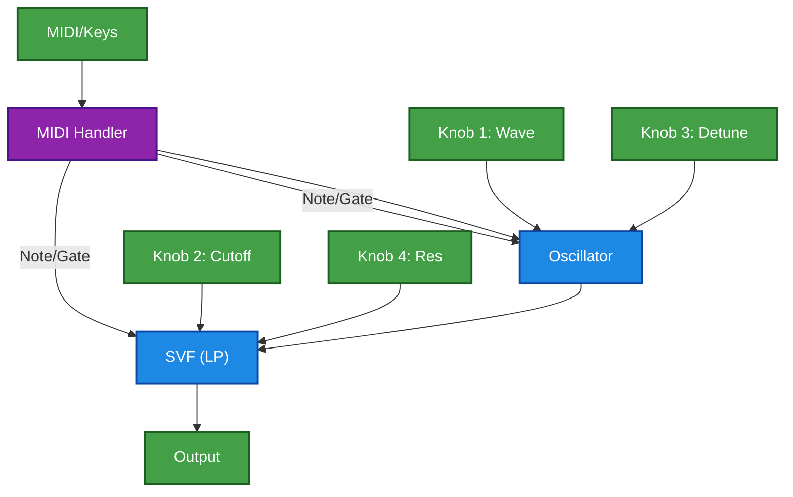

## 2. Bloom Percussion
**Complexity**: 3/10
**Concept**: A 4-voice trigger-based drum machine. Uses analog-style modeled drum circuits. Each button on the Field triggers a unique percussion engine.
**Algorithms**: `AnalogBassDrum`, `AnalogSnaredrum`, `HiHat`, `Metro`.
**Display**: Displays 4 circular "pads" that flash when triggered. Shows the name of the last modulated parameter (e.g., "Snare Decay: 45%").
**Architecture**:
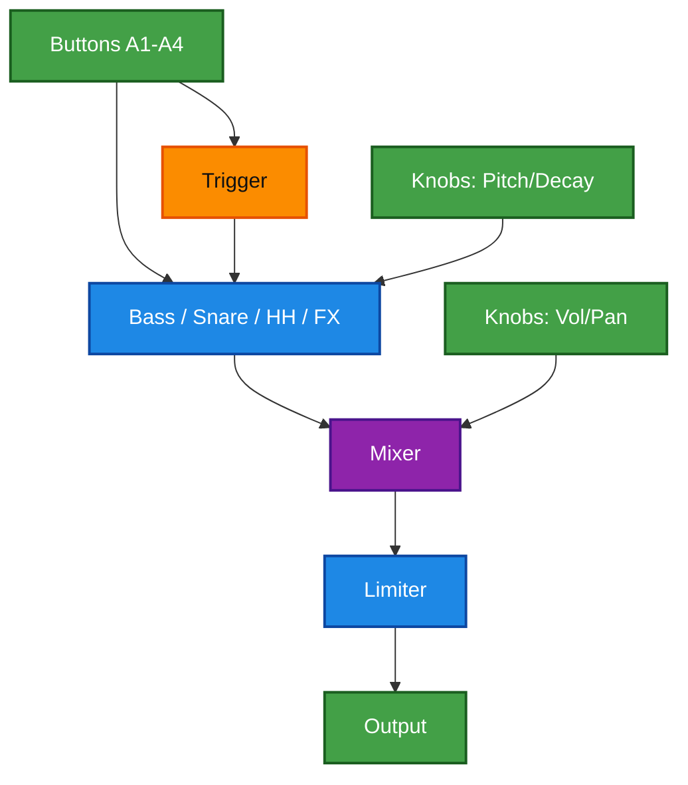

## 3. String Pluck Explorer
**Complexity**: 4/10
**Concept**: Physical modeling synthesis focusing on string vibration. Expressive control over the "physics" of the string (brightness, damping) using the Field's knobs.
**Algorithms**: `StringVoice`, `ReverbSc`.
**Display**: Visualizes a vibrating string line that changes color/thickness based on Brightness/Damping. Parameter values overlay on change.
**Architecture**:
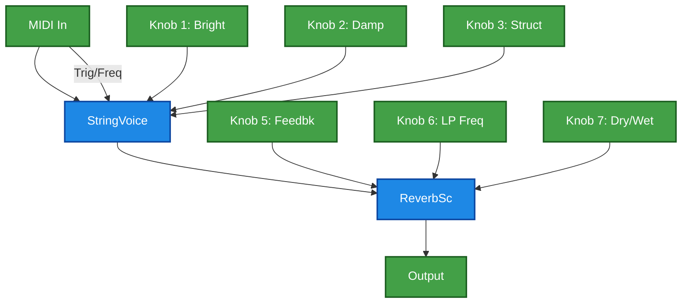

## 4. Industrial FM Crunch
**Complexity**: 4/10
**Concept**: A dual-operator FM synth capable of harsh, metallic textures. Output is further mangled by a bitcrusher and heavy overdrive.
**Algorithms**: `Fm2`, `Overdrive`, `Decimator`.
**Display**: Shows the FM Ratio (e.g., "1:2.0") and a "Crunch" meter representing the Drive/Bitcrush amount.
**Architecture**:
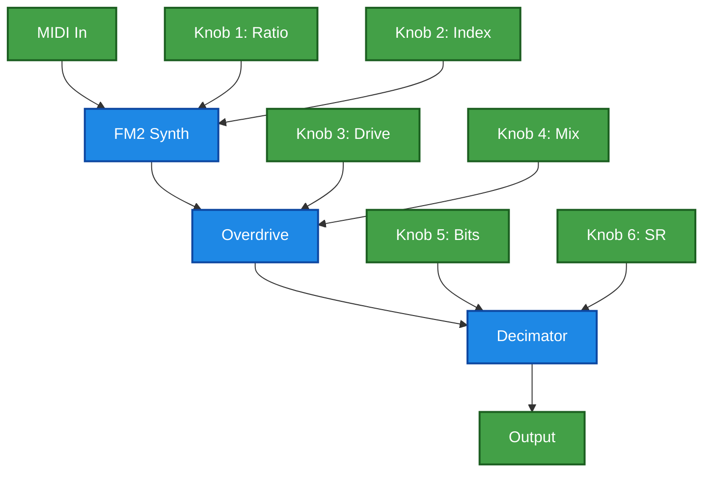

## 5. Vocal Formant Synth
**Complexity**: 5/10
**Concept**: Mimics human vocal sounds by filtering a rich harmonic source through formant-shifting filters. Knobs morph between A-E-I-O-U vowel spaces.
**Algorithms**: `FormantOsc`, `Svf` (Bandpass).
**Display**: Displays the current vowel phoneme (e.g., "A", "E", "O") and an XY plot of Formant Frequencies.
**Architecture**:
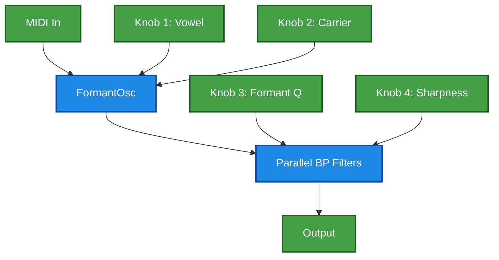

## 6. Granular Texture Cloud
**Complexity**: 5/10
**Concept**: Loads an audio sample and breaks it into tiny grains. The Field's buttons select grain playback patterns while knobs control spatial density and pitch jitter.
**Algorithms**: `GranularPlayer`, `Chorus`.
**Display**: A "Cloud" visualization where moving particles represent active grains. Shows Grain Size and Density values.
**Architecture**:
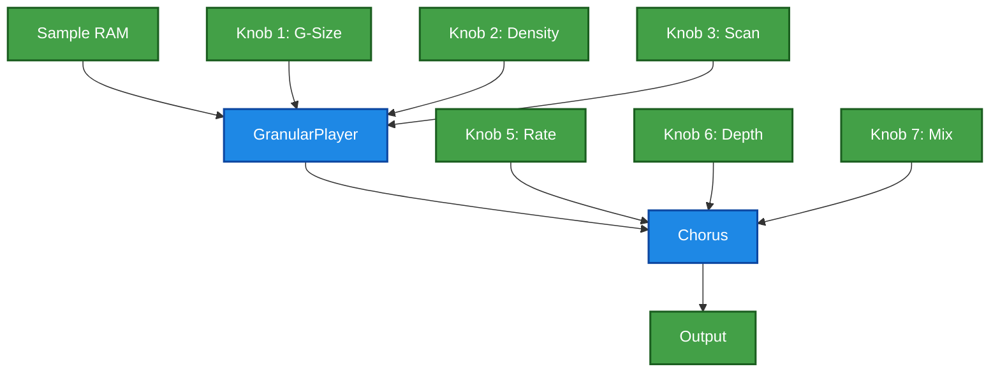

## 7. Modal Bell System
**Complexity**: 6/10
**Concept**: Using physics-based "modes" of a vibrating object. Combines an exciter (Drip/Noise) with a resonator. Ideal for bells, marimbas, and glass-like sounds.
**Algorithms**: `Drip`, `ModalVoice`, `Resonator`.
**Display**: Real-time FFT spectrum of the output tailored to show harmonic content (the "Modes").
**Architecture**:
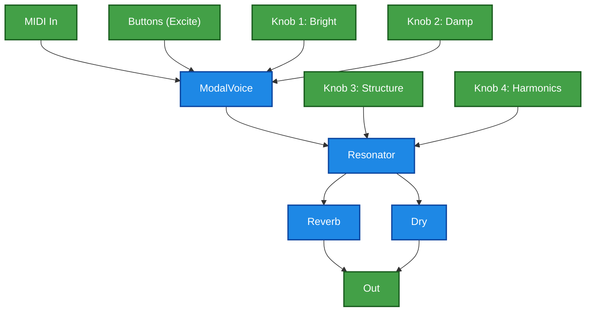

## 8. Dual Path FX Processor
**Complexity**: 6/10
**Concept**: Transforms the Field into an external FX unit. Audio input is split into two parallel paths: a timed-delay path and a frequency-shifted path, recombined with a dry/wet crossfader.
**Algorithms**: `DelayLine`, `Phaser`, `Crossfade`.
**Display**: Split screen standard: Left side shows Delay Time/FB, Right side shows Phaser Rate. Center bar shows X-Fade position.
**Architecture**:
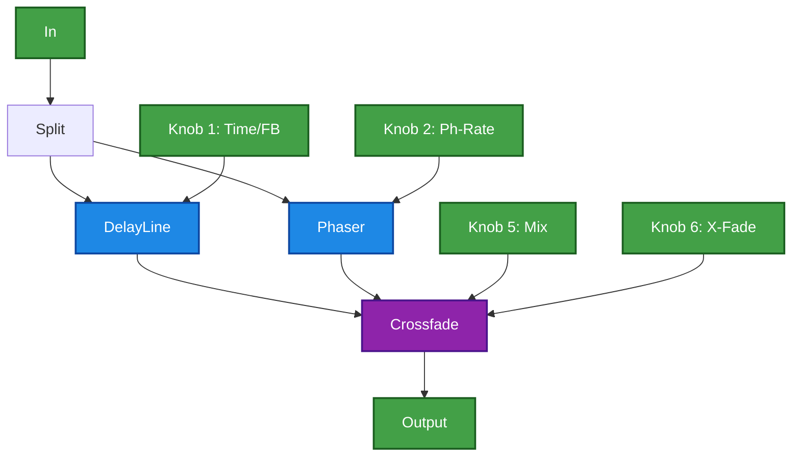

## 9. Wavetable Drone Lab
**Complexity**: 7/10
**Concept**: A self-evolving drone generator using wavetable morphing and multi-stage modulation. Uses LFOs to slowly sweep through spectral content without user input.
**Algorithms**: `VariableShapeOsc`, `VariableSawOsc`, `OscillatorBank`.
**Display**: Slow-moving "Oscilloscope" view of the LFOs and the resulting Morph position within the wavetable.
**Architecture**:
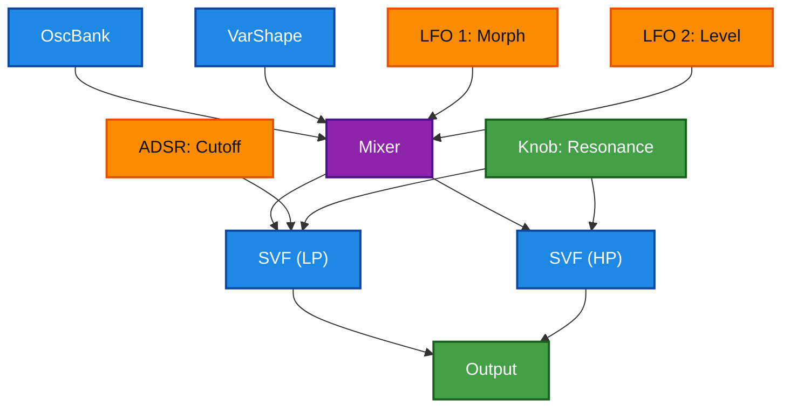

## 10. The Spectral Orchestrator
**Complexity**: 9/10
**Concept**: An 8-voice additive synthesis system. Each of the Field's 8 knobs is mapped to a specific harmonic frequency of a central oscillator bank, allowing for real-time spectral shaping and "drawing" of overtone structures.
**Algorithms**: `OscillatorBank`, `8x Svf`, `Limiter`.
**Display**: A Bar Graph showing the amplitude of all 8 harmonics in real-time. Turning a knob moves the corresponding bar.
**Architecture**:
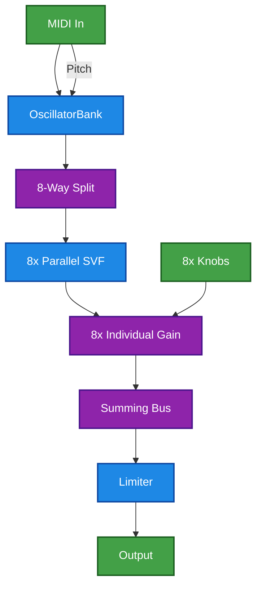

---

## 21. Modular Concept A: The East-Coast Mono
**Complexity**: 3/10
**Concept**: A classic subtractive voice structure accessible via MIDI. The twist is using the Field buttons to "break" the hardwired connections.
- **Keys A1-A4**: Toggle Waveforms (Saw, Square, Tri, Sine)
- **Keys B1-B2**: Toggle Filter Mode (LP, HP)
- **Keys B3-B4**: Toggle Envelope destination (VCA Only, VCA+VCF)
**Algorithms**: `Oscillator`, `Svf`, `Adsr`.
**Display**: Diagrammatic view of the signal path. Connections disappear/reappear on screen as buttons are toggled.
**Architecture**:
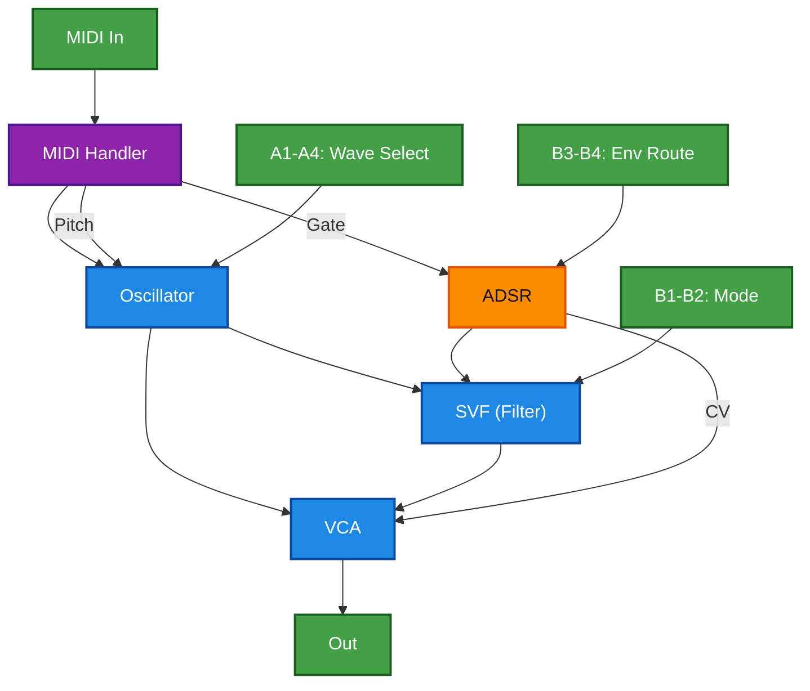

## 22. Modular Concept B: The Paraphonic Modulator
**Complexity**: 5/10
**Concept**: Dual oscillators (Paraphonic) that share one filter. The Field Buttons serve as a "Modulation Bus".
- **Keys A1-A8**: Activate LFO routing to specific targets (A1=Osc1 Pitch, A2=Osc2 Pitch, A3=Cutoff, etc.).
- **Keys B1-B8**: Select LFO Waveform and Speed Range (Slow/Fast).
This allows semi-modular patching without a screen menu.
**Algorithms**: `Oscillator` x2, `Svf`, `Oscillator` (LFO).
**Display**: List of modulations. Left column: Source LFO, Right column: Destination. Active routes use bold text or arrow icon.
**Architecture**:
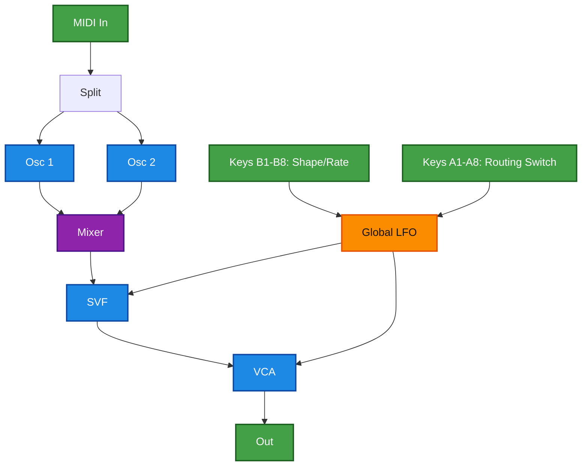

## 23. Modular Concept C: The Virtual Matrix System
**Complexity**: 8/10
**Concept**: A fully modular environment simulating a patch matrix.
- **MIDI Keyboard**: Provides Pitch/Gate sources (Rows 1-2).
- **Field Buttons**: Function as a "shift" key system to navigate the patch matrix.
    - **Mode 1 (Source Select)**: Press A1-A8 to select a Source (LFO, Env, Note, Velocity).
    - **Mode 2 (Dest Select)**: Press B1-B8 to select a Destination (Freq, Res, Amp, FM, Pan).
    - **Knob 1**: Adjusts the "Patch Cable Amount" (Bipolar) for the selected Source/Dest pair.
**Algorithms**: `Oscillator` x2, `Svf` x2, `Adsr` x2, `LFO` x2.
**Display**: A Grid (Matrix) View. Rows = Sources, Cols = Destinations. Cells show the bi-polar amount (-99 to +99). Current cell highlighted.
**Architecture**:
```mermaid
flowchart TD
    SRC["MIDI Pitch/Gate, LFOs, Envs"]:::ctrl --> MAT["VIRTUAL MATRIX"]:::math
    MAT --> DEST["Osc Freq, Cutoff, VCA, Pan"]:::audio

    IF["Field Interface: Route & Attenuation"]:::ui --> MAT
    IF -->|Hold A(Src) + Press B(Dst) + Turn Knob(Amt)| MAT

    classDef audio fill:#1E88E5,stroke:#0D47A1,stroke-width:2px,color:#ffffff;
    classDef ctrl  fill:#FB8C00,stroke:#E65100,stroke-width:2px,color:#111111;
    classDef ui    fill:#43A047,stroke:#1B5E20,stroke-width:2px,color:#ffffff;
    classDef math  fill:#8E24AA,stroke:#4A148C,stroke-width:2px,color:#ffffff;
```
