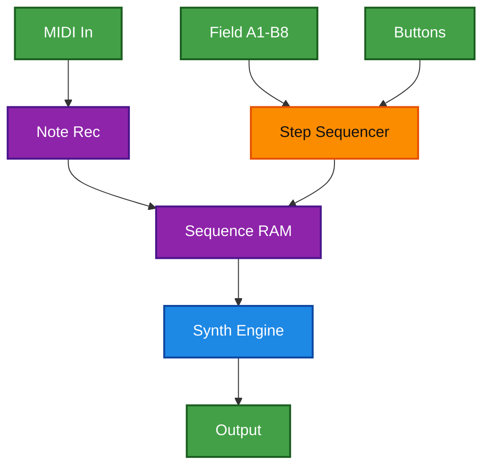
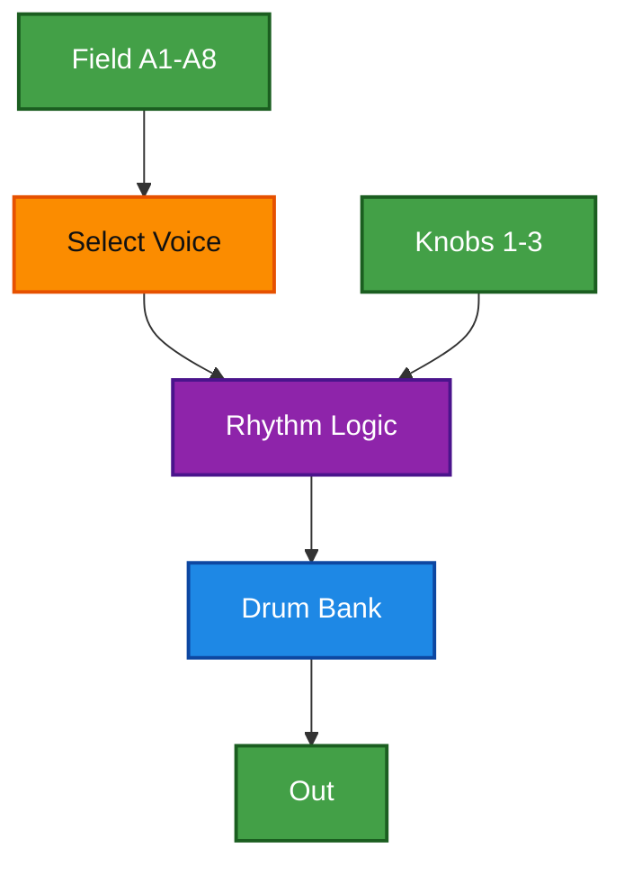
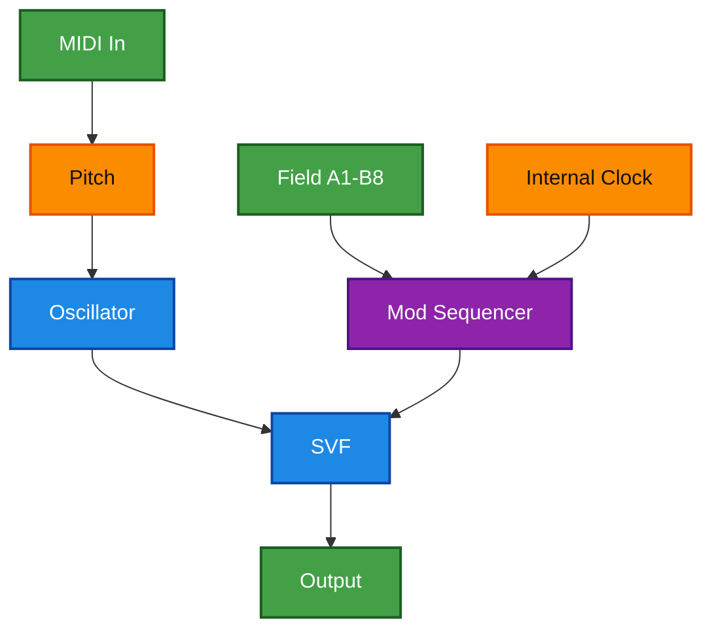
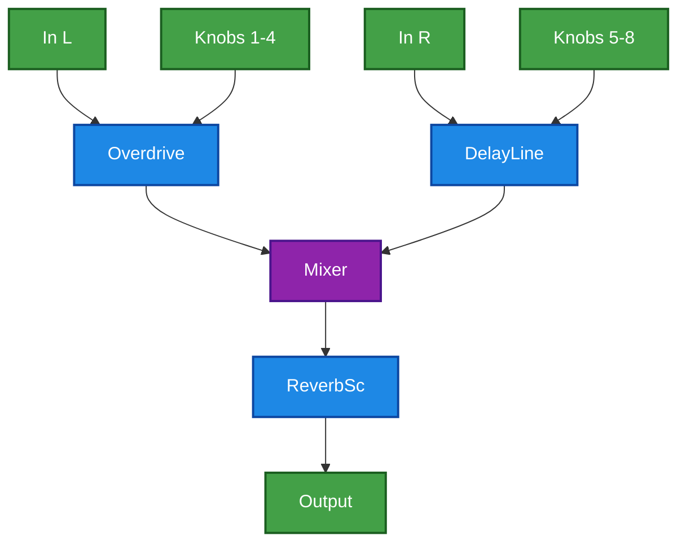
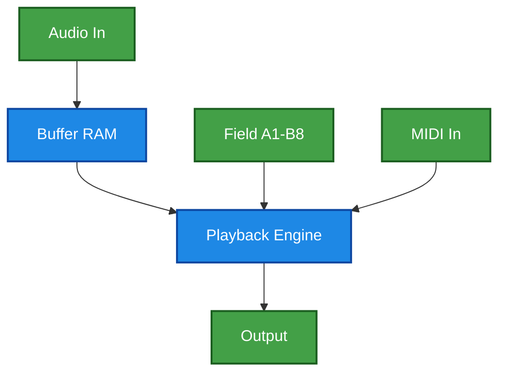
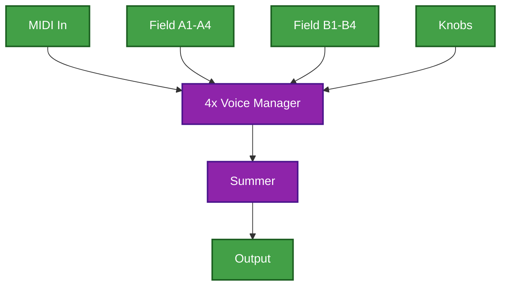
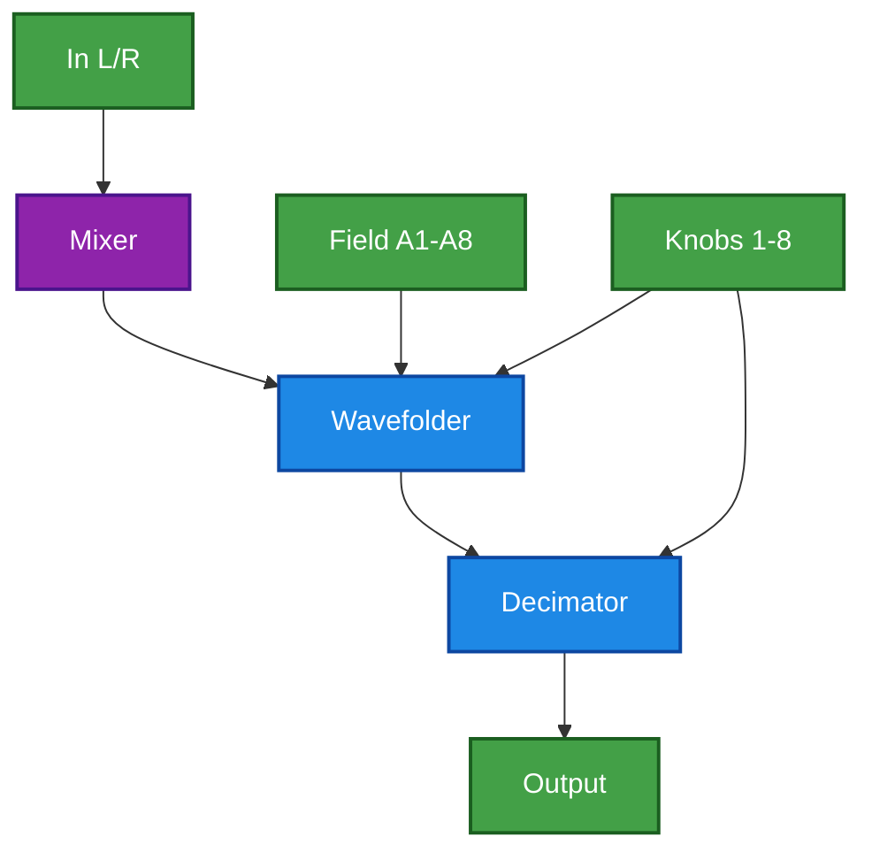
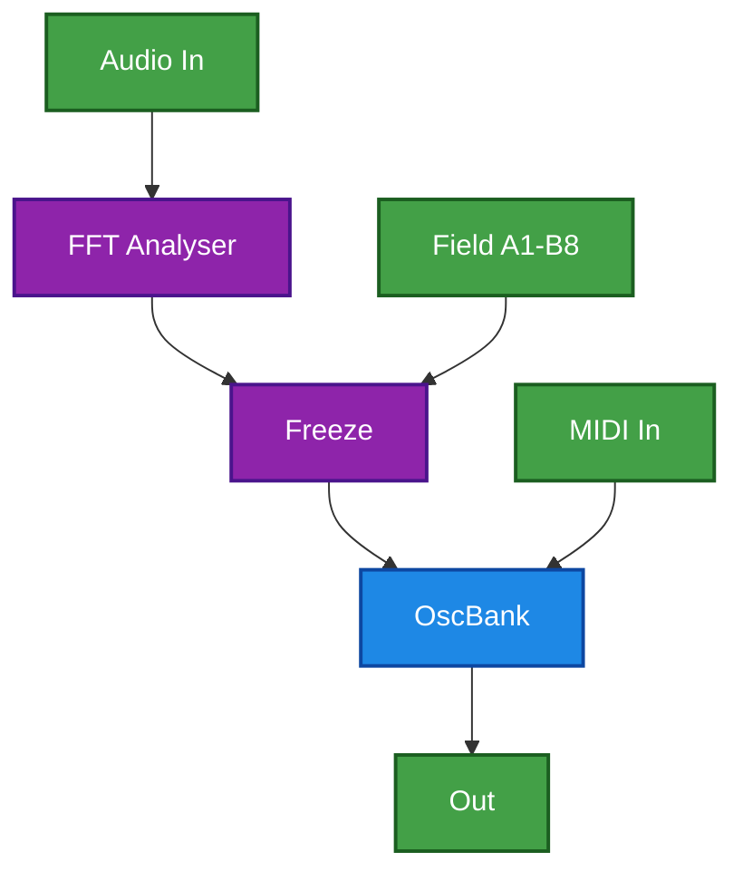
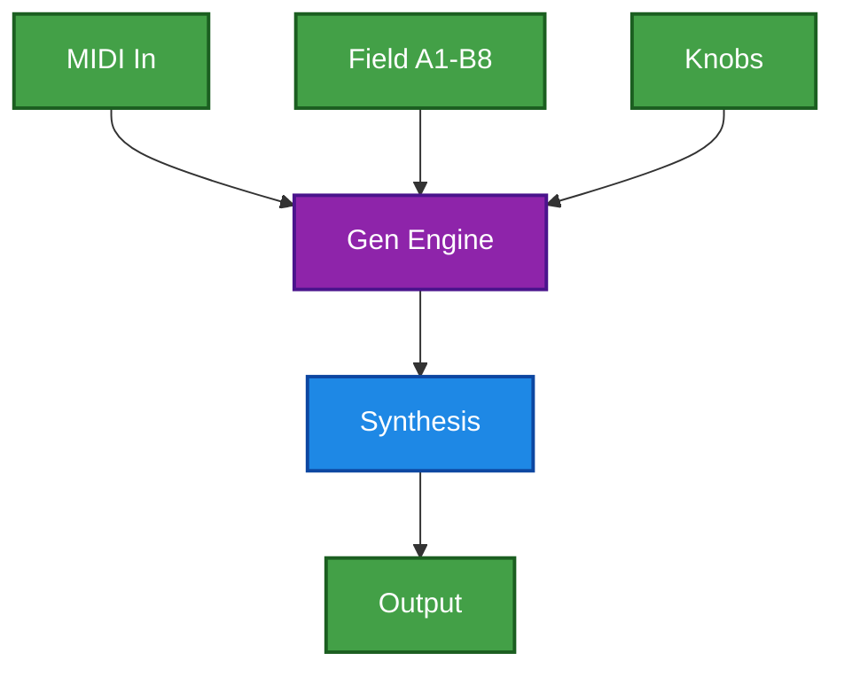
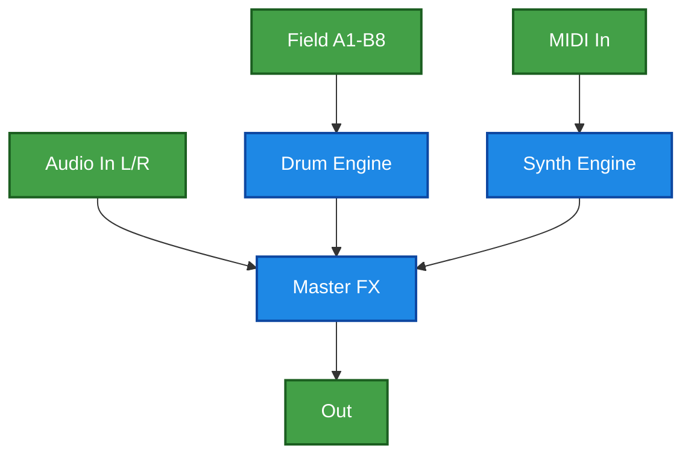

# Daisy Field Project Concepts v2.1

## Table of Contents

11. [MIDI Groove Box](#11-midi-groove-box) (Complexity: 5/10)
12. [Euclidean Rhythmist](#12-euclidean-rhythmist) (Complexity: 5/10)
13. [Polymetric Step Modulator](#13-polymetric-step-modulator) (Complexity: 6/10)
14. [Dual Mono Multi-FX Mixer](#14-dual-mono-multi-fx-mixer) (Complexity: 5/10)
15. [Glitch Sample Slicer](#15-glitch-sample-slicer) (Complexity: 6/10)
16. [Quad-Voice Physical Ensemble](#16-quad-voice-physical-ensemble) (Complexity: 7/10)
17. [Performance "Dirt" Box](#17-performance-dirt-box) (Complexity: 4/10)
18. [Spectral Freeze Looper](#18-spectral-freeze-looper) (Complexity: 7/10)
19. [Generative Ambient Workspace](#19-generative-ambient-workspace) (Complexity: 8/10)
20. [The Master Workstation](#20-the-master-workstation) (Complexity: 10/10)

---

## 11. MIDI Groove Box
**Complexity**: 5/10
**Concept**: A 16-step sequencer and synth combo. External MIDI keyboard handles note entry, while Field keys A1-A8 and B1-B8 act as a step-sequencer interface (On/Off/Velocity) for internal pattern generation.
**Algorithms**: `VariableShapeOsc`, `ADSR`, `Metro`.
**Display**: 16-step grid view with a moving playhead indicator. Active steps are filled, inactive are empty.
**Architecture**:

## 12. Euclidean Rhythmist
**Complexity**: 5/10
**Concept**: An 8-channel Euclidean sequencer for drums. Field keys select the drum voice (Kick, Snare, etc.), and knobs control the Euclidean Fill/Offset/Length for the selected voice.
**Algorithms**: `AnalogBassDrum`, `AnalogSnaredrum`, `HiHat`, `SynthBassDrum`.
**Display**: Circular "Euclidean Ring" visualization for the selected track, showing pulses spaced around the circle.
**Architecture**:

## 13. Polymetric Step Modulator
**Complexity**: 6/10
**Concept**: External MIDI keyboard plays a synth, but the Field's keys (A1-B8) act as a rhythmic modulation buffer. Each key represents a different modulation depth or filter state triggered in sequence.
**Algorithms**: `Oscillator`, `Svf`, `Phasor`.
**Display**: Shows the current step index and the modulation value associated with it.
**Architecture**:

---

## 14. Dual Mono Multi-FX Mixer
**Complexity**: 5/10
**Concept**: A workspace for external gear. Audio In L and R are treated as independent channels with their own FX chains (e.g., L = Distortion, R = Delay) and mixed into a master reverb.
**Algorithms**: `Overdrive`, `DelayLine`, `ReverbSc`, `Mixer`.
**Display**: Dual VU meters for L and R input levels. Text indicates enabled FX per channel.
**Architecture**:

---

## 15. Glitch Sample Slicer
**Complexity**: 6/10
**Concept**: Real-time buffer sampling. Audio input is continuously recorded into RAM. External MIDI plays the samples at different pitches, while Field keys trigger "stutter" or "reverse" playback modes.
**Algorithms**: `GranularPlayer`, `Decimator`.
**Display**: Waveform view of the recorded buffer with a playhead marker that jumps around during glitching.
**Architecture**:

---

## 16. Quad-Voice Physical Ensemble
**Complexity**: 7/10
**Concept**: 4 independent physical modeling voices (Strings/Bells). External MIDI keyboard plays them polyphonically. Field keys A1-A4 mute/unmute voices, and B1-B4 cycle through acoustic "materials".
**Algorithms**: `StringVoice` x2, `ModalVoice` x2.
**Display**: 4 horizontal bars representing the 4 voices. Brighter bars = louder output. Icons indicate material (Wood/Metal/String).
**Architecture**:

---

## 17. Performance "Dirt" Box
**Complexity**: 4/10
**Concept**: A heavy distortion/filtering unit for live signals. Dual inputs (L/R) are mixed. Field keys A1-A8 act as "Presets" that instantly jump parameter values for dramatic filter sweeps.
**Algorithms**: `Wavefolder`, `Decimator`, `Soap`.
**Display**: Large text "PRESET X" when a button is pressed. Default view is an input/output clipping monitor.
**Architecture**:

---

## 18. Spectral Freeze Looper
**Complexity**: 7/10
**Concept**: Captures the frequency spectrum of the input. MIDI keyboard controls the transposition of the frozen cloud. Field keys select between 16 different "frozen" slots.
**Algorithms**: `OscillatorBank`, `Svf`, `Limiter`.
**Display**: Waterfall spectrogram or simple Frequency vs Amplitude line plot that "freezes" when capture is engaged.
**Architecture**:

---

## 19. Generative Ambient Workspace
**Complexity**: 8/10
**Concept**: The synth plays itself! MIDI keyboard sets the "Root Note" and "Scale". Field keys A1-A8 change the generative "Complexity" or "Density" (probabilistic density).
**Algorithms**: `Grainlet`, `Particle`, `ReverbSc`.
**Display**: "Game of Life" or random particle simulator style visualization. Text overlay of Current Scale and Root.
**Architecture**:

---

## 20. The Master Workstation
**Complexity**: 10/10
**Concept**: A complete workstation. 16-step drum sequencer (A1-B8), 1x Mono Synth (controlled by MIDI), and a Master FX chain for External Input. This uses the full potential of the Daisy Field.
**Algorithms**: `AnalogBassDrum`, `Oscillator`, `DelayLine`, `Limiter`.
**Display**: Multi-page menu system. Main page shows Mixer levels. Sub-pages for Sequencer and Synth params.
**Architecture**:

