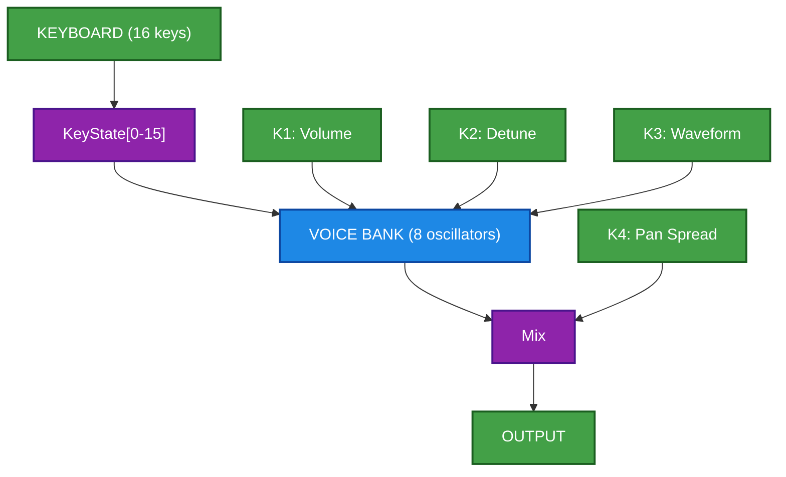
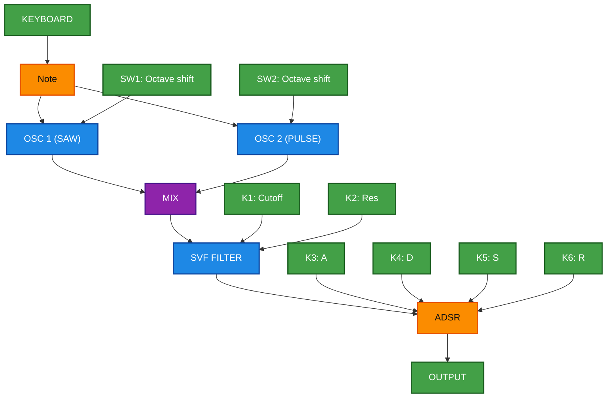
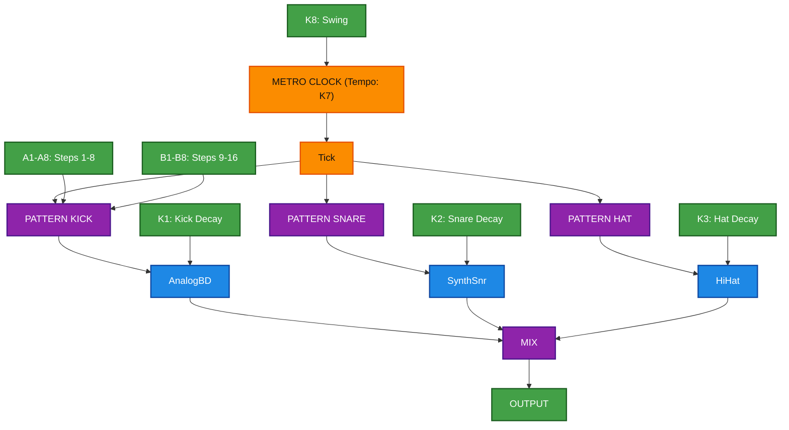
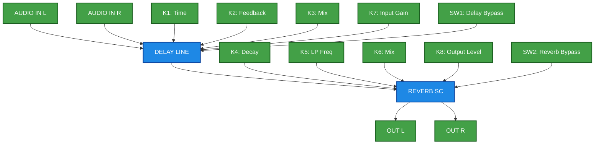
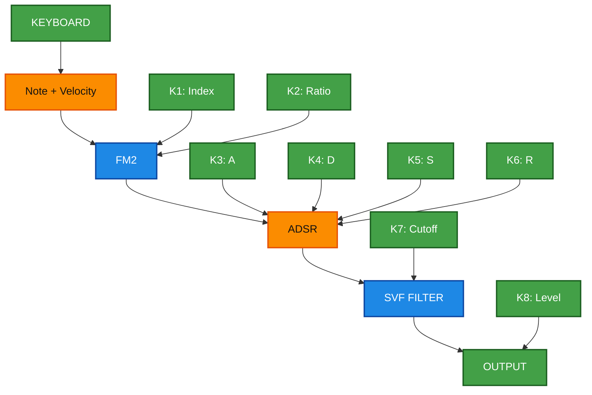
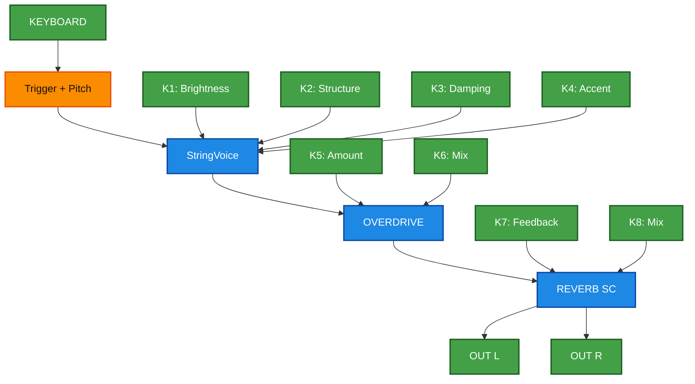
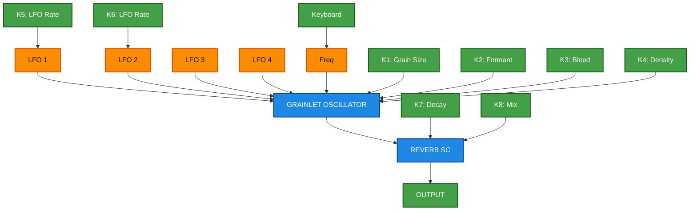

# Daisy Field Architecture Ideas

## Table of Contents

### Part 1: Keyboard-Based Concepts (1-10)
1. [Drone Station](#1-drone-station-beginner) ★☆☆☆☆
2. [Subtractive Monosynth](#2-subtractive-monosynth-beginner) ★★☆☆☆
3. [Mini Drum Machine](#3-mini-drum-machine-intermediate) ★★☆☆☆
4. [Delay + Reverb FX](#4-delay--reverb-effect-unit-intermediate) ★★★☆☆
5. [FM Synthesizer](#5-fm-synthesizer-intermediate) ★★★☆☆
6. [StringVoice Synth](#6-physical-modeling-stringvoice-intermediate) ★★★☆☆
7. [Granular Texture](#7-granular-texture-generator-advanced) ★★★★☆
8. [Poly Modal Synth](#8-polyphonic-modal-synthesizer-advanced) ★★★★☆
9. [Formant Vowel Synth](#9-formant-vowel-synthesizer-advanced) ★★★★☆
10. [Performance Workstation](#10-complete-performance-workstation-expert) ★★★★★

### Part 3: Modular Synthesizer Integration (21-23)
21. [Basic Modular Voice](#21-basic-modular-voice-complexity-) ★★★☆☆
22. [Modular FX + Mixer Hub](#22-modular-fx--mixer-hub-complexity-) ★★★★★☆
23. [Complete Modular Workstation](#23-complete-modular-workstation-complexity-) ★★★★★★★★☆☆

---

# Part 1: Keyboard-Based Concepts


## 1. Drone Station (Beginner)
**Complexity: ★☆☆☆☆**

8 oscillators controlled by keyboard. Press keys to layer drones.

```
┌──────────────────────────────────────────────────────┐
│                   KEYBOARD (16 keys)                 │
└───────────────────────┬──────────────────────────────┘
                         │ KeyState[0-15]
                         ▼
┌──────────────────────────────────────────────────────┐
│  VOICE BANK (8 oscillators)                          │
│  ┌─────┐ ┌─────┐ ┌─────┐ ┌─────┐ ┌─────┐            │
│  │ OSC │ │ OSC │ │ OSC │ │ OSC │ │...  │            │
│  └──┬──┘ └──┬──┘ └──┬──┘ └──┬──┘ └──┬──┘            │
│     └───────┴───────┴───────┴───────┘                │
│                   │ Mix                              │
└───────────────────┼──────────────────────────────────┘
                    ▼
              ┌───────────┐
              │  OUTPUT   │
              └───────────┘
```


---

## 2. Subtractive Monosynth (Beginner)
**Complexity: ★★☆☆☆**

Classic synth: Osc → Filter → Amp Envelope.

```
┌──────────────────────────────────────────────────────┐
│                    KEYBOARD                          │
└───────────────────────┬──────────────────────────────┘
                         │ Note
         ┌───────────────┴───────────────┐
         ▼                               ▼
   ┌───────────┐                   ┌───────────┐
   │   OSC 1   │                   │   OSC 2   │
   │   (SAW)   │                   │  (PULSE)  │
   └─────┬─────┘                   └─────┬─────┘
         │                               │
         └───────────┬───────────────────┘
                     │ MIX
                     ▼
           ┌───────────────────┐
           │     SVF FILTER    │◄── Cutoff (K1), Res (K2)
           └─────────┬─────────┘
                     ▼
           ┌───────────────────┐
           │       ADSR        │◄── A(K3) D(K4) S(K5) R(K6)
           └─────────┬─────────┘
                     ▼
               ┌───────────┐
               │  OUTPUT   │
               └───────────┘
```


---

## 3. Mini Drum Machine (Intermediate)
**Complexity: ★★☆☆☆**

4-voice drums with pattern sequencer.

```
┌──────────────────────────────────────────────────────┐
│                    METRO CLOCK                       │
│                  (Tempo: Knob 7)                     │
└───────────────────────┬──────────────────────────────┘
                         │ Tick
         ┌───────────────┼───────────────┐
         ▼               ▼               ▼
   ┌───────────┐   ┌───────────┐   ┌───────────┐
   │ PATTERN   │   │ PATTERN   │   │ PATTERN   │
   │   KICK    │   │  SNARE    │   │   HAT     │
   └─────┬─────┘   └─────┬─────┘   └─────┬─────┘
         ▼               ▼               ▼
   ┌───────────┐   ┌───────────┐   ┌───────────┐
   │ AnalogBD  │   │ SynthSnr  │   │  HiHat    │
   └─────┬─────┘   └─────┬─────┘   └─────┬─────┘
         └───────────────┼───────────────┘
                         │ MIX
                         ▼
                   ┌───────────┐
                   │  OUTPUT   │
                   └───────────┘
```


---

## 4. Delay + Reverb Effect Unit (Intermediate)
**Complexity: ★★★☆☆**

Stereo FX processor for external audio.

```
┌─────────────┐               ┌─────────────┐
│  AUDIO IN L │               │  AUDIO IN R │
└──────┬──────┘               └──────┬──────┘
       │                             │
       ▼                             ▼
┌─────────────────────────────────────────────────────┐
│                   DELAY LINE                        │
│  Time ◄── K1,  Feedback ◄── K2,  Mix ◄── K3         │
└───────────────────────┬─────────────────────────────┘
                         ▼
┌─────────────────────────────────────────────────────┐
│                    REVERB SC                        │
│  Decay ◄── K4,  LP Freq ◄── K5,  Mix ◄── K6         │
└───────────────────────┬─────────────────────────────┘
                   ┌─────┴─────┐
                   ▼           ▼
             ┌─────────┐ ┌─────────┐
             │ OUT L   │ │ OUT R   │
             └─────────┘ └─────────┘
```


---

## 5. FM Synthesizer (Intermediate)
**Complexity: ★★★☆☆**

Two-operator FM with envelope.

```
┌──────────────────────────────────────────────────────┐
│                    KEYBOARD                          │
└───────────────────────┬──────────────────────────────┘
                         │ Note + Velocity
                         ▼
           ┌───────────────────────────────┐
           │            FM2                │
           │  ┌─────────────────────────┐  │
           │  │     MODULATOR OSC       │◄─┼── Ratio (K2)
           │  └───────────┬─────────────┘  │
           │              │ FM             │
           │  ┌───────────▼─────────────┐  │
           │  │      CARRIER OSC        │◄─┼── Index (K1)
           │  └─────────────────────────┘  │
           └───────────────┬───────────────┘
                           ▼
           ┌───────────────────────────────┐
           │            ADSR               │◄── K3-K6
           └───────────────┬───────────────┘
                           ▼
           ┌───────────────────────────────┐
           │         SVF FILTER            │◄── Cutoff (K7)
           └───────────────┬───────────────┘
                           ▼
                     ┌───────────┐
                     │  OUTPUT   │◄── Level (K8)
                     └───────────┘
```


---

## 6. Physical Modeling StringVoice (Intermediate+)
**Complexity: ★★★☆☆**

Plucked string with overdrive and reverb.

```
┌──────────────────────────────────────────────────────┐
│                    KEYBOARD                          │
└───────────────────────┬──────────────────────────────┘
                         │ Trigger + Pitch
                         ▼
           ┌───────────────────────────────┐
           │         StringVoice           │
           │  Brightness ◄── K1            │
           │  Structure ◄── K2             │
           │  Damping ◄── K3               │
           │  Accent ◄── K4                │
           └───────────────┬───────────────┘
                           ▼
           ┌───────────────────────────────┐
           │          OVERDRIVE            │
           │  Amount ◄── K5,  Mix ◄── K6   │
           └───────────────┬───────────────┘
                           ▼
           ┌───────────────────────────────┐
           │          REVERB SC            │
           │  Feedback ◄── K7, Mix ◄── K8  │
           └───────────────┬───────────────┘
                     ┌─────┴─────┐
                     ▼           ▼
               ┌─────────┐ ┌─────────┐
               │ OUT L   │ │ OUT R   │
               └─────────┘ └─────────┘
```


---

## 7. Granular Texture Generator (Advanced)
**Complexity: ★★★★☆**

Evolving textures via grain modulation.

```
┌─────────────────────────────────────────────────────┐
│                    LFO BANK                         │
│  ┌─────┐   ┌─────┐   ┌─────┐   ┌─────┐              │
│  │LFO 1│   │LFO 2│   │LFO 3│   │LFO 4│              │
│  └──┬──┘   └──┬──┘   └──┬──┘   └──┬──┘              │
└─────┼────────┼────────┼────────┼────────────────────┘
      │        │        │        │
      ▼        ▼        ▼        ▼
┌─────────────────────────────────────────────────────┐
│              GRAINLET OSCILLATOR                    │
│  Freq ◄── Keyboard                                  │
│  Shape ◄── LFO1,  Formant ◄── LFO2                  │
│  Bleed ◄── K3                                       │
└───────────────────────┬─────────────────────────────┘
                         ▼
┌─────────────────────────────────────────────────────┐
│                   REVERB SC                         │
│  Decay ◄── K7,  Mix ◄── K8                          │
└───────────────────────┬─────────────────────────────┘
                         ▼
                   ┌───────────┐
                   │  OUTPUT   │
                   └───────────┘
```


---

## 8. Polyphonic Modal Synthesizer (Advanced)
**Complexity: ★★★★☆**

8-voice poly with VoiceManager pattern.

```
┌──────────────────────────────────────────────────────┐
│                  MIDI / KEYBOARD                     │
└───────────────────────┬──────────────────────────────┘
                        │ Note On/Off
                        ▼
┌──────────────────────────────────────────────────────┐
│                  VOICE MANAGER                       │
│  ┌────────┐ ┌────────┐ ┌────────┐      ┌────────┐   │
│  │ Modal  │ │ Modal  │ │ Modal  │      │ Modal  │   │
│  │Voice 1 │ │Voice 2 │ │Voice 3 │ ...  │Voice 8 │   │
│  └───┬────┘ └───┬────┘ └───┬────┘      └───┬────┘   │
│      └──────────┴──────────┴───────────────┘        │
│                        │ SUM                        │
└────────────────────────┼────────────────────────────┘
                         ▼
               ┌───────────────────┐
               │    MASTER SVF     │◄── Cutoff (K5)
               └─────────┬─────────┘
                         ▼
               ┌───────────────────┐
               │      CHORUS       │◄── Depth (K6)
               └─────────┬─────────┘
                         ▼
               ┌───────────────────┐
               │    REVERB SC      │◄── Mix (K7)
               └─────────┬─────────┘
                         ▼
                   ┌───────────┐
                   │  OUTPUT   │◄── Level (K8)
                   └───────────┘

K1-K4: Brightness, Structure, Damping, Accent (all voices)
OLED: Active voice count, note visualization
```

---

## 9. Formant Vowel Synthesizer (Advanced)
**Complexity: ★★★★☆**

Speech synthesis with vowel morphing.

```
┌─────────────────────────────────────────────────────┐
│              VOWEL TABLE (A, E, I, O, U)            │
│  A: F1=730Hz  F2=1090Hz                             │
│  E: F1=530Hz  F2=1840Hz                             │
│  I: F1=270Hz  F2=2290Hz                             │
│  O: F1=570Hz  F2=840Hz                              │
│  U: F1=300Hz  F2=870Hz                              │
└───────────────────────┬─────────────────────────────┘
                        │ Interpolated F1/F2
                        ▼
┌─────────────────────────────────────────────────────┐
│              FORMANT OSCILLATORS                    │
│  ┌───────────────────┐    ┌───────────────────┐     │
│  │  Formant Osc 1    │    │  Formant Osc 2    │     │
│  │  (Low F1)         │    │  (High F2)        │     │
│  └─────────┬─────────┘    └─────────┬─────────┘     │
│            └────────────┬───────────┘               │
│                         │ MIX                       │
└─────────────────────────┼───────────────────────────┘
                          ▼
                ┌───────────────────┐
                │       ADSR        │◄── Keyboard Gate
                └─────────┬─────────┘
                          ▼
                ┌───────────────────┐
                │      PHASER       │◄── Depth (K6)
                └─────────┬─────────┘
                          ▼
                    ┌───────────┐
                    │  OUTPUT   │
                    └───────────┘

K1=Carrier Freq, K2=Vowel Morph, K3=Vibrato
K4=Attack, K5=Release, K6=Phaser, K7-K8=FX
KEYS: Each key = different vowel + pitch
OLED: Current vowel, formant frequencies
```

---

## 10. Complete Performance Workstation (Expert)
**Complexity: ★★★★★**

Multi-mode: Synth + Drums + FX.

```
┌─────────────────────────────────────────────────────────────┐
│                    MODE SELECT (SW1 + SW2)                  │
│  ┌────────┐  ┌────────┐  ┌────────┐  ┌────────┐             │
│  │ SYNTH  │  │ DRUMS  │  │   FX   │  │ LOOPER │             │
│  └────────┘  └────────┘  └────────┘  └────────┘             │
└─────────────────────────────────────────────────────────────┘

┌─ SYNTH MODE ────────────────────────────────────────────────┐
│  KEYBOARD ──► StringVoice ──► Overdrive ──► FX Bus          │
└─────────────────────────────────────────────────────────────┘

┌─ DRUMS MODE ────────────────────────────────────────────────┐
│  METRO ──► 16-Step Sequencer ──► 6 Drums ──► FX Bus         │
│  KEYS: Pattern programming                                  │
└─────────────────────────────────────────────────────────────┘

┌─ FX MODE ───────────────────────────────────────────────────┐
│  AUDIO IN ──► Serial FX Chain ──► FX Bus                    │
└─────────────────────────────────────────────────────────────┘

┌─ LOOPER MODE ───────────────────────────────────────────────┐
│  AUDIO IN ──► 8-slot Looper ──► FX Bus                      │
└─────────────────────────────────────────────────────────────┘
                              │
                              ▼
┌─────────────────────────────────────────────────────────────┐
│                       FX BUS                                │
│  ┌─────────┐  ┌─────────┐  ┌─────────┐                      │
│  │ CHORUS  │──► DELAY   │──► REVERB  │                      │
│  └─────────┘  └─────────┘  └─────────┘                      │
└───────────────────────────┬─────────────────────────────────┘
                            ▼
                    ┌───────────────┐
                    │  OUTPUT L/R   │
                    └───────────────┘

OLED: Mode-specific UI with parameter zoom
MIDI: Full I/O, clock sync
CV: 4 in + 2 out for modular
```

---


# Part 3: Modular Synthesizer Concepts

*Designed for integration with Eurorack/modular systems. External MIDI keyboard for notes, Field keys as modular control surface, CV I/O for patching.*

---

## 21. Basic Modular Voice (Complexity ★★★☆☆)

A single VCO-VCF-VCA voice module with CV/Gate inputs. Perfect starting point for modular integration.

### Signal Flow
```
┌─────────────────────────────────────────────────────────────────────┐
│                        CV/GATE INPUTS                               │
│  ┌──────────┐  ┌──────────┐  ┌──────────┐  ┌──────────┐             │
│  │ CV IN 1  │  │ CV IN 2  │  │ CV IN 3  │  │ CV IN 4  │             │
│  │  V/Oct   │  │  Filter  │  │  VCA CV  │  │  Gate    │             │
│  └────┬─────┘  └────┬─────┘  └────┬─────┘  └────┬─────┘             │
│       │             │             │             │                   │
└───────┼─────────────┼─────────────┼─────────────┼───────────────────┘
        │             │             │             │
        ▼             │             │             │
┌───────────────────┐ │             │             │
│        VCO        │ │             │             │
│  ┌─────────────┐  │ │             │             │
│  │ Waveform    │◄─┼─┼─ KEYS A1-A4 (Saw/Sq/Tri/Sin)
│  │ Sub Octave  │◄─┼─┼─ KEYS A5: Sub -1 oct      │
│  │ PWM Depth   │◄─┼─┼─ Knob 1                   │
│  │ Detune      │◄─┼─┼─ Knob 2                   │
│  └─────────────┘  │ │             │             │
└─────────┬─────────┘ │             │             │
          │           │             │             │
          ▼           ▼             │             │
┌─────────────────────────────────┐ │             │
│             VCF                 │ │             │
│  ┌─────────────────────────┐    │ │             │
│  │ Cutoff ◄── Knob 3 + CV2 │    │ │             │
│  │ Resonance ◄── Knob 4    │    │ │             │
│  │ Env Depth ◄── Knob 5    │    │ │             │
│  │ Type ◄── KEYS A6-A8     │    │ │             │
│  │   (LP / BP / HP)        │    │ │             │
│  └─────────────────────────┘    │ │             │
└─────────────────┬───────────────┘ │             │
                  │                 │             │
                  ▼                 ▼             ▼
┌───────────────────────────────────────────────────┐
│                    VCA + ENV                      │
│  ┌─────────────────────────────────────────────┐  │
│  │ Attack ◄── Knob 6                           │  │
│  │ Decay ◄── Knob 7                            │  │
│  │ Sustain/Release ◄── Knob 8                  │  │
│  │ CV3 = VCA modulation input                  │  │
│  │ CV4 = Gate trigger                          │  │
│  └─────────────────────────────────────────────┘  │
└───────────────────────────┬───────────────────────┘
                            │
                            ▼
┌───────────────────────────────────────────────────┐
│                  CV OUTPUTS                       │
│  ┌──────────┐  ┌──────────┐                       │
│  │ CV OUT 1 │  │ CV OUT 2 │                       │
│  │ Envelope │  │ Gate Out │                       │
│  └──────────┘  └──────────┘                       │
└───────────────────────────┬───────────────────────┘
                            │
                            ▼
                    ┌───────────────┐
                    │  AUDIO OUT    │
                    │    L / R      │
                    └───────────────┘
```

### Key Assignments
| Key Row | Function |
|---------|----------|
| A1-A4 | Waveform: Saw, Square, Triangle, Sine |
| A5-A6 | Sub oscillator: Off, -1 Oct, -2 Oct |
| A7-A8 | Oscillator sync: Off, On |
| B1-B3 | Filter type: Lowpass, Bandpass, Highpass |
| B4-B6 | Env mode: AD, ASR, ADSR |
| B7-B8 | CV IN routing presets |

### OLED Display Layout
```
┌────────────────────────────────┐
│ MODULAR VOICE      CV1: +2.3V  │
│ ░░░░░░░░░░░░░░░░░░░░░░░░░░░░░░ │
│ Wave: SAW    Flt: LP 1.2kHz    │
│ Env: ████▒▒▒░░░  A:50 D:200    │
└────────────────────────────────┘

Line 1: Mode name, CV1 voltage display
Line 2: Waveform visualization (real-time)
Line 3: Current wave, filter type and cutoff
Line 4: Envelope visualization with A/D values
```

### DaisySP Modules
- `Oscillator` (main + sub)
- `Svf` (multimode filter)
- `Adsr` (envelope)
- CV I/O via ADC/DAC

---

## 22. Modular FX + Mixer Hub (Complexity ★★★★★☆☆☆☆☆)

A utility module: 2-channel mixer with send/return FX, CV-controllable parameters, clock output for sequencers.

### Signal Flow
```
┌─────────────────────────────────────────────────────────────────────┐
│                     AUDIO INPUTS (from modular)                     │
│  ┌─────────────┐  ┌─────────────┐                                   │
│  │ AUDIO IN L  │  │ AUDIO IN R  │                                   │
│  │  (Ch 1)     │  │  (Ch 2)     │                                   │
│  └──────┬──────┘  └──────┬──────┘                                   │
│         │                │                                          │
└─────────┼────────────────┼──────────────────────────────────────────┘
          │                │
          ▼                ▼
┌─────────────────────────────────────────────────────────────────────┐
│                        CHANNEL STRIP                                │
│  ┌───────────────────────────────────────────────────────────────┐  │
│  │ CH1: Gain(K1) ─► Pan(K2) ─► FX Send(K3) ─┬─► Main Bus         │  │
│  │ CH2: Gain(K4) ─► Pan(K5) ─► FX Send(K6) ─┤                    │  │
│  │                                          │                    │  │
│  │ KEYS A1-A4: CH1 routing (Pre/Post/Mute/Solo)                  │  │
│  │ KEYS A5-A8: CH2 routing (Pre/Post/Mute/Solo)                  │  │
│  └───────────────────────────────────────────┼───────────────────┘  │
└──────────────────────────────────────────────┼──────────────────────┘
                                               │
          ┌────────────────────────────────────┘
          │
          ▼
┌─────────────────────────────────────────────────────────────────────┐
│                      FX PROCESSOR                                   │
│  ┌───────────────────────────────────────────────────────────────┐  │
│  │                                                               │  │
│  │  ┌─────────┐    ┌─────────┐    ┌─────────┐                    │  │
│  │  │ DELAY   │───►│ REVERB  │───►│ RETURN  │                    │  │
│  │  └─────────┘    └─────────┘    └─────────┘                    │  │
│  │       │              │                                        │  │
│  │  Time ◄── CV1   Decay ◄── CV2                                 │  │
│  │  Feedback◄──K7  Mix ◄── CV3                                   │  │
│  │                                                               │  │
│  │  KEYS B1-B4: FX1 select (Delay/Chorus/Flanger/Phaser)         │  │
│  │  KEYS B5-B8: FX2 select (Reverb/Plate/Hall/Shimmer)           │  │
│  └───────────────────────────────────────────────────────────────┘  │
└───────────────────────────────────────────────┬─────────────────────┘
                                                │
┌───────────────────────────────────────────────┼─────────────────────┐
│                   MASTER OUTPUT + CLOCK                             │
│  ┌───────────────────────────────────────────────────────────────┐  │
│  │ Main Mix ◄── Knob 8                                           │  │
│  │                                                               │  │
│  │ CV OUT 1: LFO (synced to tempo)                               │  │
│  │ CV OUT 2: Clock pulses (ppqn selectable)                      │  │
│  │                                                               │  │
│  │ SW1: Tap tempo                                                │  │
│  │ SW2: Clock start/stop                                         │  │
│  └───────────────────────────────────────────────────────────────┘  │
└───────────────────────────────────────────────┬─────────────────────┘
                                                │
                                                ▼
                                    ┌───────────────────┐
                                    │    AUDIO OUT      │
                                    │      L / R        │
                                    └───────────────────┘
```

### Key Assignments
| Key Row | Function |
|---------|----------|
| A1-A2 | CH1: Mute, Solo |
| A3-A4 | CH1: Pre-fader FX, Post-fader FX |
| A5-A6 | CH2: Mute, Solo |
| A7-A8 | CH2: Pre-fader FX, Post-fader FX |
| B1-B4 | FX1 type: Delay, Chorus, Flanger, Phaser |
| B5-B8 | FX2 type: Reverb, HallVerb, Plate, Shimmer |

### OLED Display Layout
```
┌────────────────────────────────┐
│ MIXER HUB        BPM: 120.0    │
│ CH1:▓▓▓▓▓▓░░  CH2:▓▓▓▓░░░░     │
│ FX: Delay→Reverb  Send: 45%    │
│ CLK: ● ○ ○ ○  LFO: ∿∿∿∿        │
└────────────────────────────────┘

Line 1: Mode, current tempo
Line 2: Channel meters (real-time VU)
Line 3: Active FX chain, send level
Line 4: Clock visualization, LFO wave
```

### DaisySP Modules
- `DelayLine<>` (tempo-synced)
- `Chorus` / `Flanger` / `Phaser`
- `ReverbSc`
- `Metro` (clock)
- `Oscillator` (LFO for CV out)

---

## 23. Complete Modular Workstation (Complexity ★★★★★★★★☆☆)

Full-featured modular companion: dual VCO, multimode filter, dual envelope, LFO bank, sequencer, FX, and comprehensive modulation matrix.

### Signal Flow
```
┌─────────────────────────────────────────────────────────────────────────────┐
│                              CV INPUTS (4)                                  │
│  ┌─────────┐  ┌─────────┐  ┌─────────┐  ┌─────────┐                         │
│  │ CV1     │  │ CV2     │  │ CV3     │  │ CV4     │                         │
│  │ V/Oct   │  │ Mod     │  │ Mod     │  │ Gate    │                         │
│  └────┬────┘  └────┬────┘  └────┬────┘  └────┬────┘                         │
└───────┼───────────┼───────────┼───────────┼─────────────────────────────────┘
        │           │           │           │
        │           └───────────┴───────────┘
        │                       │
        ▼                       ▼
┌─────────────────────────────────────────────────────────────────────────────┐
│                          SOUND ENGINE                                       │
│                                                                             │
│  ┌───────────────────────────────────────────────────────────────────────┐  │
│  │                        DUAL VCO                                       │  │
│  │  ┌─────────────────┐        ┌─────────────────┐                       │  │
│  │  │      VCO 1      │        │      VCO 2      │                       │  │
│  │  │ Wave: SAW/SQ/TRI│        │ Wave: SAW/SQ/TRI│                       │  │
│  │  │ Tune: ±24 semi  │        │ Tune: ±24 semi  │                       │  │
│  │  │ PWM: 0-100%     │        │ FM Input: VCO1  │                       │  │
│  │  └────────┬────────┘        └────────┬────────┘                       │  │
│  │           │                          │                                │  │
│  │           └──────────┬───────────────┘                                │  │
│  │                      │ MIX (Knob 1)                                   │  │
│  └──────────────────────┼────────────────────────────────────────────────┘  │
│                         │                                                   │
│                         ▼                                                   │
│  ┌───────────────────────────────────────────────────────────────────────┐  │
│  │                    MULTIMODE FILTER                                   │  │
│  │  ┌─────────────────────────────────────────────────────────────────┐  │  │
│  │  │ Mode: LP12 / LP24 / BP / HP / Notch / Formant                   │  │  │
│  │  │ Cutoff ◄── Knob 2 + CV2 + Env1                                  │  │  │
│  │  │ Resonance ◄── Knob 3                                            │  │  │
│  │  │ Drive ◄── Knob 4                                                │  │  │
│  │  └─────────────────────────────────────────────────────────────────┘  │  │
│  └──────────────────────┬────────────────────────────────────────────────┘  │
│                         │                                                   │
│                         ▼                                                   │
│  ┌───────────────────────────────────────────────────────────────────────┐  │
│  │                     VCA + ENVELOPES                                   │  │
│  │  ┌────────────────────────┐  ┌────────────────────────┐               │  │
│  │  │        ENV 1           │  │        ENV 2           │               │  │
│  │  │ (VCF Modulation)       │  │ (VCA Amplitude)        │               │  │
│  │  │ A: Knob 5  D: Knob 6   │  │ A: Knob 5  D: Knob 6   │               │  │
│  │  │ S: Knob 7  R: Knob 8   │  │ S: Knob 7  R: Knob 8   │               │  │
│  │  └────────────────────────┘  └────────────────────────┘               │  │
│  │                                                                       │  │
│  │  SW1 (hold): Edit ENV1        SW2 (hold): Edit ENV2                   │  │
│  └──────────────────────┬────────────────────────────────────────────────┘  │
│                         │                                                   │
└─────────────────────────┼───────────────────────────────────────────────────┘
                          │
┌─────────────────────────┼───────────────────────────────────────────────────┐
│                    LFO BANK + MODULATION MATRIX                             │
│                         │                                                   │
│  ┌───────────────────────────────────────────────────────────────────────┐  │
│  │  LFO 1: Rate(K1), Shape(A1-A4), Dest(B1-B4)                           │  │
│  │  LFO 2: Rate(K2), Shape(A5-A8), Dest(B5-B8)                           │  │
│  │                                                                       │  │
│  │  Shapes: Sine, Tri, Saw, Square, S&H, Random                          │  │
│  │                                                                       │  │
│  │  Destinations:                                                        │  │
│  │    VCO1 Pitch, VCO2 Pitch, VCO1 PWM, VCO2 PWM                         │  │
│  │    Filter Cutoff, Filter Res, VCA, Pan                                │  │
│  │                                                                       │  │
│  │  Depth controlled by Knobs when destination selected                  │  │
│  └───────────────────────────────────────────────────────────────────────┘  │
│                         │                                                   │
└─────────────────────────┼───────────────────────────────────────────────────┘
                          │
┌─────────────────────────┼───────────────────────────────────────────────────┐
│                      8-STEP SEQUENCER                                       │
│                         │                                                   │
│  ┌───────────────────────────────────────────────────────────────────────┐  │
│  │  ┌────┬────┬────┬────┬────┬────┬────┬────┐                            │  │
│  │  │ S1 │ S2 │ S3 │ S4 │ S5 │ S6 │ S7 │ S8 │  ◄── KEYS A1-A8 select    │  │
│  │  └────┴────┴────┴────┴────┴────┴────┴────┘                            │  │
│  │                                                                       │  │
│  │  KEYS B1-B8: Step gate on/off for current step                        │  │
│  │  Knob in Seq mode: Pitch for selected step                            │  │
│  │                                                                       │  │
│  │  Output: V/Oct CV, Gate CV, Accent CV                                 │  │
│  │  Clock: Internal (tap tempo) or External CV4                          │  │
│  └───────────────────────────────────────────────────────────────────────┘  │
│                         │                                                   │
└─────────────────────────┼───────────────────────────────────────────────────┘
                          │
┌─────────────────────────┼───────────────────────────────────────────────────┐
│                      FX SECTION                                             │
│                         │                                                   │
│  ┌───────────────────────────────────────────────────────────────────────┐  │
│  │  ┌─────────┐    ┌─────────┐    ┌─────────┐                            │  │
│  │  │OVERDRIVE│───►│  DELAY  │───►│ REVERB  │                            │  │
│  │  │  Mix:K  │    │ Time:K  │    │ Decay:K │                            │  │
│  │  └─────────┘    └─────────┘    └─────────┘                            │  │
│  │                                                                       │  │
│  │  FX Bypass: SW1 tap                                                   │  │
│  │  FX type cycle: SW2 tap                                               │  │
│  └───────────────────────────────────────────────────────────────────────┘  │
│                         │                                                   │
└─────────────────────────┼───────────────────────────────────────────────────┘
                          │
┌─────────────────────────┼───────────────────────────────────────────────────┐
│                    OUTPUTS                                                  │
│                         │                                                   │
│  ┌───────────────┐  ┌───────────────┐  ┌───────────────┐  ┌───────────────┐ │
│  │  AUDIO OUT L  │  │  AUDIO OUT R  │  │  CV OUT 1     │  │  CV OUT 2     │ │
│  │    (Main)     │  │    (Main)     │  │  (Env/LFO)    │  │  (Seq V/Oct)  │ │
│  └───────────────┘  └───────────────┘  └───────────────┘  └───────────────┘ │
└─────────────────────────────────────────────────────────────────────────────┘
```

### Mode System (SW1 + SW2 combinations)
| SW1 | SW2 | Mode | Keys Function |
|-----|-----|------|---------------|
| Off | Off | PLAY | A=Waveform select, B=Filter type |
| On  | Off | LFO  | A=LFO1 shape, B=LFO1 routing |
| Off | On  | SEQ  | A=Step select, B=Gate toggle |
| On  | On  | FX   | A=FX type, B=FX routing |

### OLED Display - Multi-Page System
```
PAGE 1 - OSCILLATORS:
┌────────────────────────────────┐
│ VCO1: SAW ▸▸▸▸  VCO2: SQR ████ │
│ Mix: ████▒▒░░  Tune: +3 semi   │
│ PWM1: 45%  FM: VCO1→VCO2       │
│ ─────────────────────────────  │
└────────────────────────────────┘

PAGE 2 - FILTER + ENV:
┌────────────────────────────────┐
│ FILTER: LP24  Cutoff: 2.4kHz   │
│ Res: ▓▓▓▓░░░  Drive: ▓▓░░░░░   │
│ ENV1: ╱‾‾╲__  ENV2: ╱‾\_       │
│ A:30 D:150 S:60% R:200         │
└────────────────────────────────┘

PAGE 3 - LFO + MOD:
┌────────────────────────────────┐
│ LFO1: ∿∿∿ 0.5Hz → Cutoff  25%  │
│ LFO2: ▁▂▃▄ 2Hz → VCO1 PWM 40%  │
│ Mod Matrix: 4 active routes    │
│ [View Matrix]                  │
└────────────────────────────────┘

PAGE 4 - SEQUENCER:
┌────────────────────────────────┐
│ SEQ: ●○●●○●○●  BPM: 120        │
│ Step 3: C#4  Gate: 75%         │
│ ▓░░░░░░░ Playing               │
│ [PLAY] [STOP] [REC]            │
└────────────────────────────────┘
```

### DaisySP Modules
- `Oscillator` (×2 for dual VCO)
- `MoogLadder` or `Svf` (filter)
- `Adsr` (×2 for dual envelopes)
- `Oscillator` (×2 for LFOs)
- `DelayLine<>`, `ReverbSc`, `Overdrive`
- `Metro` (sequencer clock)
- Custom modulation matrix routing

---

## Modular Concepts Summary

| # | Concept | Complexity | CV I/O | Primary Use |
|---|---------|------------|--------|-------------|
| 21 | Basic Modular Voice | ★★★☆☆☆☆☆☆☆ | 4 in, 2 out | Single voice module |
| 22 | FX + Mixer Hub | ★★★★★☆☆☆☆☆ | 3 in, 2 out | Utility/FX processor |
| 23 | Complete Workstation | ★★★★★★★★☆☆ | 4 in, 2 out | Full modular companion |

---
