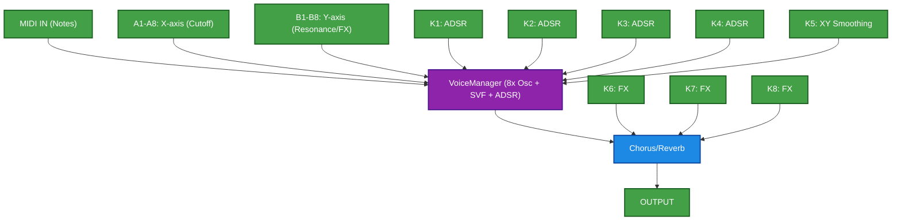
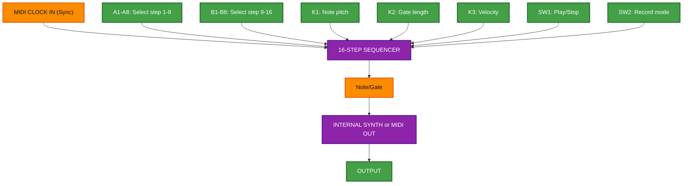
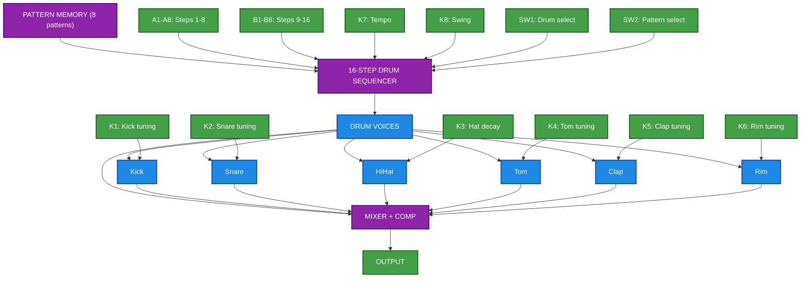
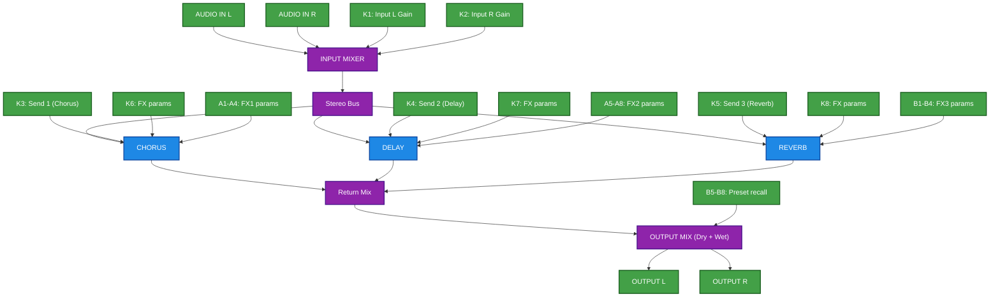
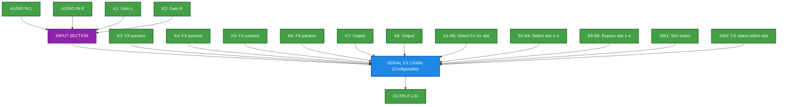
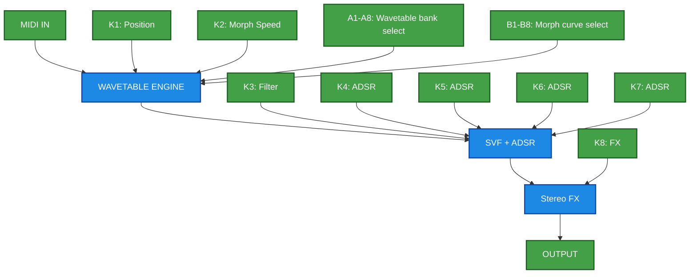
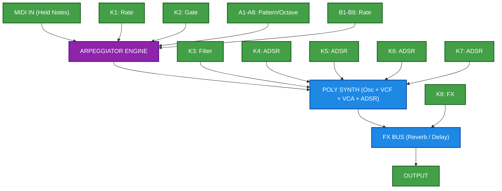
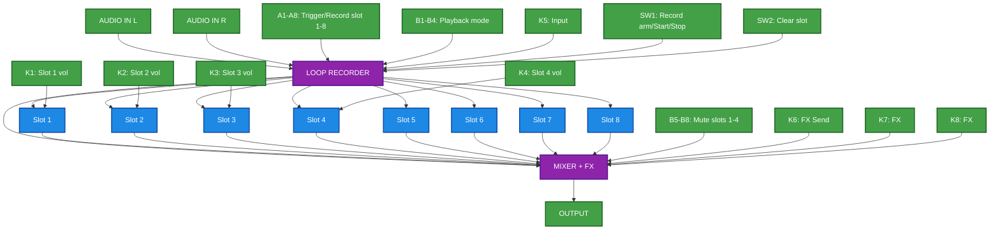
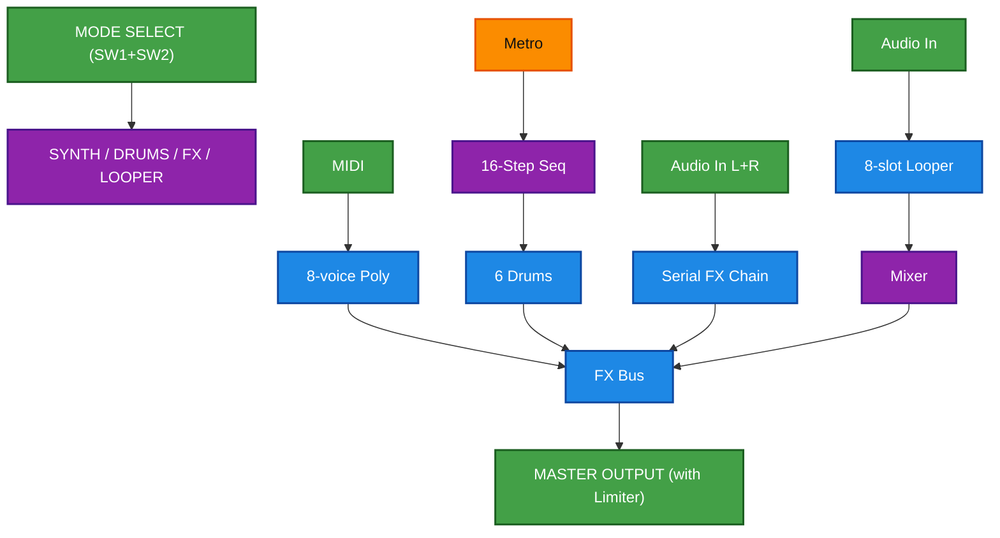

```mermaid
flowchart TD
    OSC1["OSC 1"]:::audio --> PATCH["PATCH MATRIX"]:::math
    OSC2["OSC 2"]:::audio --> PATCH
    LFO1["LFO 1"]:::ctrl --> PATCH
    LFO2["LFO 2"]:::ctrl --> PATCH
    ENV1["ENV 1"]:::ctrl --> PATCH
    ENV2["ENV 2"]:::ctrl --> PATCH
    NOISE["Noise"]:::audio --> PATCH
    AUDIN["AudioIn"]:::ui --> PATCH

    PATCH --> OUT["Audio Output"]:::ui

    K1["K1: Adjust param"]:::ui --> OSC1
    K2["K2: Adjust param"]:::ui --> LFO1
    K3["K3: Adjust param"]:::ui --> ENV1
    K4["K4: Adjust param"]:::ui --> FLT
    K5["K5: Adjust param"]:::ui --> VCA
    K6["K6: Adjust param"]:::ui --> LFO2
    K7["K7: Adjust param"]:::ui --> PATCH
    K8["K8: Adjust param"]:::ui --> PATCH

    A1["A1: OSC1 Out"]:::ui --> PATCH
    A2["A2: OSC2 Out"]:::ui --> PATCH
    A3["A3: LFO1"]:::ui --> PATCH
    A4["A4: LFO2"]:::ui --> PATCH
    A5["A5: ENV1"]:::ui --> PATCH
    A6["A6: ENV2"]:::ui --> PATCH
    A7["A7: Noise"]:::ui --> PATCH
    A8["A8: AudioIn"]:::ui --> PATCH

    B1["B1: OSC1 Freq"]:::ui --> PATCH
    B2["B2: OSC2 Freq"]:::ui --> PATCH
    B3["B3: Filter Cutoff"]:::ui --> PATCH
    B4["B4: Filter Res"]:::ui --> PATCH
    B5["B5: VCA Amp"]:::ui --> PATCH
    B6["B6: LFO Rate"]:::ui --> PATCH
    B7["B7: Pan"]:::ui --> PATCH
    B8["B8: FX Send"]:::ui --> PATCH

    SW1["SW1: Hold to remove patch"]:::ui --> PATCH

    classDef audio fill:#1E88E5,stroke:#0D47A1,stroke-width:2px,color:#ffffff;
    classDef ctrl  fill:#FB8C00,stroke:#E65100,stroke-width:2px,color:#111111;
    classDef ui    fill:#43A047,stroke:#1B5E20,stroke-width:2px,color:#ffffff;
    classDef math  fill:#8E24AA,stroke:#4A148C,stroke-width:2px,color:#ffffff;
```

# Daisy Field Architecture Ideas

## Table of Contents


### Part 2: MIDI + Keys as Control Surface (11-20)
11. [MIDI Poly Synth + XY Pad](#11-midi-poly-synth-with-xy-pad) ★★★☆☆
12. [Step Sequencer](#12-step-sequencer-with-midi-sync) ★★★☆☆
13. [Drum Machine Pro](#13-drum-machine-pro) ★★★☆☆
14. [Multi-FX Box A: Parallel](#14-multi-fx-box-a-parallel-mixer) ★★★☆☆
15. [Multi-FX Box B: Serial](#15-multi-fx-box-b-serial-chain) ★★★★☆
16. [Wavetable Synth](#16-wavetable-synth-with-morph) ★★★★☆
17. [Arpeggiator Synth](#17-arpeggiator-synth) ★★★★☆
18. [Looper + Sampler](#18-looper-sampler) ★★★★☆
19. [Modular-Style Patcher](#19-modular-style-semi-patcher) ★★★★★
20. [Live Performance Hub](#20-live-performance-hub) ★★★★★


---


# Part 2: MIDI Keyboard + Keys as Control Surface

*All concepts assume external MIDI keyboard for notes. Field keys A1-A8 and B1-B8 repurposed for controls.*

---

## 11. MIDI Poly Synth with XY Pad
**Complexity: ★★★☆☆**

Keys A1-A8 = X-axis zones, B1-B8 = Y-axis zones for real-time parameter morphing.

```
┌─────────────────────────────────────────────────────┐
│  MIDI IN (Notes)                                    │
└───────────────────────┬─────────────────────────────┘
                         ▼
               ┌───────────────────┐
               │   VoiceManager    │
               │   8× Oscillator   │
               │   + SVF + ADSR    │
               └─────────┬─────────┘
                         │
┌───────────────────────┼─────────────────────────────┐
│  FIELD KEYS AS XY PAD                               │
│  A1-A8: X-axis (Filter Cutoff interpolation)        │
│  B1-B8: Y-axis (Resonance / FX Mix)                 │
└───────────────────────┼─────────────────────────────┘
                         ▼
               ┌───────────────────┐
               │   Chorus/Reverb   │
               └─────────┬─────────┘
                         ▼
                     OUTPUT
```


---

## 12. Step Sequencer with MIDI Sync
**Complexity: ★★★☆☆**

16-step CV/Gate sequencer. Keys program steps, MIDI clock sync.

```
┌─────────────────────────────────────────────────────┐
│              MIDI CLOCK IN (Sync)                   │
└───────────────────────┬─────────────────────────────┘
                         ▼
┌─────────────────────────────────────────────────────┐
│              16-STEP SEQUENCER                      │
│  ┌─────────────────────────────────────────────┐    │
│  │ Step: 1  2  3  4  5  6  7  8  ...  16       │    │
│  │ Note: C  -  E  -  G  -  C  -  ...  -        │    │
│  │ Gate: ●  ○  ●  ○  ●  ●  ●  ○  ...  ○        │    │
│  └─────────────────────────────────────────────┘    │
│                                                     │
│  KEYS A1-A8: Select step 1-8                        │
│  KEYS B1-B8: Select step 9-16                       │
│  KNOB 1: Note pitch for selected step               │
│  KNOB 2: Gate length                                │
│  KNOB 3: Velocity                                   │
└───────────────────────┬─────────────────────────────┘
                         │ Note/Gate
                         ▼
               ┌───────────────────┐
               │   INTERNAL SYNTH  │
               │   or MIDI OUT     │
               └─────────┬─────────┘
                         ▼
                     OUTPUT
```


---

## 13. Drum Machine Pro
**Complexity: ★★★☆☆**

6-voice drums, 16-step pattern, 8 patterns stored.

```
┌─────────────────────────────────────────────────────┐
│              PATTERN MEMORY (8 patterns)            │
└───────────────────────┬─────────────────────────────┘
                         │
┌───────────────────────┼─────────────────────────────┐
│            16-STEP DRUM SEQUENCER                   │
│                                                     │
│  KEYS A1-A8: Steps 1-8 toggle (current drum)        │
│  KEYS B1-B8: Steps 9-16 toggle                      │
│  SW1: Drum select (cycle Kick/Snare/Hat/Tom/Clap/Rim)│
│  SW2: Pattern select (cycle 1-8)                    │
└───────────────────────┬─────────────────────────────┘
                         ▼
┌─────────────────────────────────────────────────────┐
│              DRUM VOICES                            │
│  ┌────────┐ ┌────────┐ ┌────────┐                   │
│  │ Analog │ │ Synth  │ │ HiHat  │ ...               │
│  │BassDrum│ │SnareDrm│ │        │                   │
│  └───┬────┘ └───┬────┘ └───┬────┘                   │
│      └──────────┴──────────┘                        │
└───────────────────────┬─────────────────────────────┘
                         ▼
               ┌───────────────────┐
               │   MIXER + COMP    │
               └─────────┬─────────┘
                         ▼
                     OUTPUT
```


---

## 14. Multi-FX Box A: Parallel Mixer
**Complexity: ★★★☆☆**

Two mono inputs mixed with parallel FX sends.

```
┌─────────────┐                     ┌─────────────┐
│  AUDIO IN L │                     │  AUDIO IN R │
└──────┬──────┘                     └──────┬──────┘
       │                                   │
       ▼                                   ▼
┌─────────────────────────────────────────────────────┐
│                    INPUT MIXER                      │
│  ┌─────────────────┐     ┌─────────────────┐        │
│  │ Input L Gain    │     │ Input R Gain    │        │
│  │ (Knob 1)        │     │ (Knob 2)        │        │
│  └────────┬────────┘     └────────┬────────┘        │
│           └──────────┬───────────┘                  │
│                      │ Stereo Bus                   │
└──────────────────────┼──────────────────────────────┘
                       │
       ┌───────────────┼───────────────┐
       ▼               ▼               ▼
┌────────────┐  ┌────────────┐  ┌────────────┐
│   CHORUS   │  │   DELAY    │  │   REVERB   │
│  (Send 1)  │  │  (Send 2)  │  │  (Send 3)  │
└─────┬──────┘  └─────┬──────┘  └─────┬──────┘
      │               │               │
      └───────────────┼───────────────┘
                      │ Return Mix
                      ▼
              ┌───────────────┐
              │  OUTPUT MIX   │
              │  Dry + Wet    │
              └───────┬───────┘
                      ▼
              ┌───────────────┐
              │   OUTPUT L/R  │
              └───────────────┘
```


---

## 15. Multi-FX Box B: Serial Chain
**Complexity: ★★★★☆**

Two mono inputs, 6 FX in configurable serial order.

```
┌─────────────┐                     ┌─────────────┐
│  AUDIO IN L │                     │  AUDIO IN R │
└──────┬──────┘                     └──────┬──────┘
       │                                   │
       ▼                                   ▼
┌─────────────────────────────────────────────────────┐
│              INPUT SECTION                          │
│  Gain L (K1) ──┬── Pan ──┬── Gain R (K2)            │
│                │  MIX    │                          │
└────────────────┼─────────┼──────────────────────────┘
                 └────┬────┘
                      ▼
┌─────────────────────────────────────────────────────┐
│            SERIAL FX CHAIN (Configurable)           │
│                                                     │
│  ┌──────┐   ┌──────┐   ┌──────┐   ┌──────┐          │
│  │SLOT 1│──►│SLOT 2│──►│SLOT 3│──►│SLOT 4│──► ...   │
│  └──────┘   └──────┘   └──────┘   └──────┘          │
│                                                     │
│  Available FX per slot:                             │
│  - Overdrive    - Chorus    - Flanger              │
│  - Phaser       - Delay     - Reverb               │
│  - Bitcrush     - Tremolo   - Autowah              │
│                                                     │
│  KEYS A1-A8: Select FX for current slot             │
│  KEYS B1-B4: Select slot 1-4 to edit                │
│  KEYS B5-B8: Bypass slot 1-4                        │
└───────────────────────┬─────────────────────────────┘
                        ▼
              ┌───────────────────┐
              │   OUTPUT L/R     │
              └───────────────────┘
```


---

## 16. Wavetable Synth with Morph
**Complexity: ★★★★☆**

Custom wavetables with position morphing.

```
┌─────────────────────────────────────────────────────┐
│                  MIDI IN                            │
└───────────────────────┬─────────────────────────────┘
                         ▼
┌─────────────────────────────────────────────────────┐
│              WAVETABLE ENGINE                       │
│  ┌─────────────────────────────────────────────┐    │
│  │  Table: [Sine|Saw|Square|Custom1|Custom2]   │    │
│  │  Position ◄── Knob 1 + LFO                  │    │
│  │  Morph Speed ◄── Knob 2                     │    │
│  └─────────────────────────────────────────────┘    │
│                                                     │
│  KEYS A1-A8: Wavetable bank select                  │
│  KEYS B1-B8: Morph curve select                     │
└───────────────────────┬─────────────────────────────┘
                         ▼
               ┌───────────────────┐
               │   SVF + ADSR      │
               └─────────┬─────────┘
                         ▼
               ┌───────────────────┐
               │   Stereo FX       │
               └─────────┬─────────┘
                         ▼
                     OUTPUT
```


---

## 17. Arpeggiator Synth
**Complexity: ★★★★☆**

Hold chords on MIDI, keys control arp pattern/direction.

```
┌─────────────────────────────────────────────────────┐
│              MIDI IN (Held Notes)                   │
└───────────────────────┬─────────────────────────────┘
                         ▼
┌─────────────────────────────────────────────────────┐
│              ARPEGGIATOR ENGINE                     │
│  ┌─────────────────────────────────────────────┐    │
│  │ Direction: Up | Down | UpDown | Random      │    │
│  │ Octaves: 1-4                                 │    │
│  │ Pattern: Straight | Dotted | Swing          │    │
│  │ Gate: 25% | 50% | 75% | 100%                │    │
│  └─────────────────────────────────────────────┘    │
│                                                     │
│  KEYS A1-A8: Pattern/Octave (1-4, up, down, random) │
│  KEYS B1-B8: Rate (Free, 1/4, 1/8, 1/16, etc.)     │
└───────────────────────┬─────────────────────────────┘
                         ▼
               ┌───────────────────┐
               │   POLY SYNTH      │
               │   (Osc + VCF +    │
               │    VCA + ADSR)    │
               └─────────┬─────────┘
                         ▼
               ┌───────────────────┐
               │   FX BUS          │
               │ (Reverb / Delay)  │
               └─────────┬─────────┘
                         ▼
                     OUTPUT
```


---

## 18. Looper + Sampler
**Complexity: ★★★★☆**

Record loops from audio input, trigger via keys.

```
┌─────────────┐                     ┌─────────────┐
│  AUDIO IN L │                     │  AUDIO IN R │
└──────┬──────┘                     └──────┬──────┘
       │                                   │
       └───────────────┬───────────────────┘
                       ▼
┌─────────────────────────────────────────────────────┐
│              LOOP RECORDER                          │
│  ┌─────────────────────────────────────────────┐    │
│  │ Buffer: 8 slots × 4 seconds each            │    │
│  │ Overdub: Layer on existing loops            │    │
│  └─────────────────────────────────────────────┘    │
│                                                     │
│  KEYS A1-A8: Trigger/Record slot 1-8               │
│  KEYS B1-B4: Playback mode (OneShot/Loop/Rev/Half) │
│  KEYS B5-B8: Mute slots 1-4                        │
│                                                     │
│  SW1 (hold): Record arm                             │
│  SW1 (tap): Start/Stop recording                    │
│  SW2: Clear selected slot                           │
└───────────────────────┬─────────────────────────────┘
                         ▼
               ┌───────────────────┐
               │   MIXER + FX      │
               └─────────┬─────────┘
                         ▼
                     OUTPUT
```


---

## 19. Modular-Style Semi-Patcher
**Complexity: ★★★★★**

Keys select source→destination routing. Virtual patch cables.

```
┌─────────────────────────────────────────────────────┐
│                 MODULES                             │
│  ┌─────┐  ┌─────┐  ┌─────┐  ┌─────┐  ┌─────┐       │
│  │ OSC │  │ LFO │  │ ENV │  │ FLT │  │ VCA │       │
│  │  1  │  │  1  │  │  1  │  │  1  │  │  1  │       │
│  └──┬──┘  └──┬──┘  └──┬──┘  └──┬──┘  └──┬──┘       │
│     │        │        │        │        │          │
└─────┼────────┼────────┼────────┼────────┼──────────┘
      │        │        │        │        │
      └────────┴────────┴────────┴────────┘
                       │
┌──────────────────────┼──────────────────────────────┐
│          PATCH MATRIX (Keys)                        │
│                                                     │
│  KEYS A1-A8: Select SOURCE module                   │
│    A1=OSC1 Out, A2=OSC2 Out, A3=LFO1, A4=LFO2      │
│    A5=ENV1, A6=ENV2, A7=Noise, A8=AudioIn          │
│                                                     │
│  KEYS B1-B8: Select DESTINATION                     │
│    B1=OSC1 Freq, B2=OSC2 Freq, B3=Filter Cutoff    │
│    B4=Filter Res, B5=VCA Amp, B6=LFO Rate          │
│    B7=Pan, B8=FX Send                               │
│                                                     │
│  Press A+B simultaneously = Create patch            │
│  Hold SW1 + Press A+B = Remove patch                │
└───────────────────────┬─────────────────────────────┘
                         ▼
               ┌───────────────────┐
               │   Audio Output    │
               └───────────────────┘
```


---

## 20. Live Performance Hub
**Complexity: ★★★★★**

Unified synth + drums + FX + sequencer + looper.

```
┌─────────────────────────────────────────────────────────────┐
│                    MODE SYSTEM                              │
│  SW1+SW2 combo selects mode:                                │
│  ┌────────┐ ┌────────┐ ┌────────┐ ┌────────┐                │
│  │ SYNTH  │ │ DRUMS  │ │  FX    │ │ LOOPER │                │
│  └────────┘ └────────┘ └────────┘ └────────┘                │
└─────────────────────────────────────────────────────────────┘

┌─ SYNTH MODE ────────────────────────────────────────────────┐
│  MIDI ──► 8-voice Poly ──► FX Bus                           │
│  KEYS A: Waveform select, KEYS B: Preset recall             │
└─────────────────────────────────────────────────────────────┘

┌─ DRUMS MODE ────────────────────────────────────────────────┐
│  Metro ──► 16-Step Seq ──► 6 Drums ──► FX Bus               │
│  KEYS A: Step edit, KEYS B: Pattern select                  │
└─────────────────────────────────────────────────────────────┘

┌─ FX MODE ───────────────────────────────────────────────────┐
│  Audio In L+R ──► Serial FX Chain ──► Output                │
│  KEYS A: FX slot select, KEYS B: FX type select             │
└─────────────────────────────────────────────────────────────┘

┌─ LOOPER MODE ───────────────────────────────────────────────┐
│  Audio In ──► 8-slot Looper ──► Mixer ──► Output            │
│  KEYS A: Record/Play slots, KEYS B: Playback modes          │
└─────────────────────────────────────────────────────────────┘
                              │
                              ▼
                    ┌───────────────────┐
                    │   MASTER OUTPUT   │
                    │   with Limiter    │
                    └───────────────────┘
```


---

## Summary Table

| # | Project | Complexity | Key Modules | Keys Function |
|---|---------|------------|-------------|---------------|
| 1 | Drone Station | ★☆☆☆☆ | Oscillator | Note triggers |
| 2 | Subtractive Monosynth | ★★☆☆☆ | Osc+Svf+Adsr | Note triggers |
| 3 | Mini Drum Machine | ★★☆☆☆ | DrumSynths | Pattern steps |
| 4 | Delay + Reverb FX | ★★★☆☆ | DelayLine+Reverb | Bypass toggles |
| 5 | FM Synthesizer | ★★★☆☆ | Fm2 | Note triggers |
| 6 | StringVoice Synth | ★★★☆☆ | StringVoice | Note triggers |
| 7 | Granular Texture | ★★★★☆ | GrainletOsc | Param select |
| 8 | Poly Modal Synth | ★★★★☆ | ModalVoice | Param select |
| 9 | Formant Vowel Synth | ★★★★☆ | FormantOsc | Vowel select |
| 10 | Performance Workstation | ★★★★★ | All | Mode-dependent |
| 11 | MIDI Poly + XY Pad | ★★★☆☆ | Osc+Svf | XY pad zones |
| 12 | Step Sequencer | ★★★☆☆ | Metro+MIDI | Step select |
| 13 | Drum Machine Pro | ★★★☆☆ | DrumSynths | Step toggle |
| 14 | Multi-FX Parallel | ★★★☆☆ | Chorus+Delay+Reverb | FX select |
| 15 | Multi-FX Serial | ★★★★☆ | 9 FX types | Chain config |
| 16 | Wavetable Synth | ★★★★☆ | Custom tables | Bank select |
| 17 | Arpeggiator Synth | ★★★★☆ | Arp+Synth | Pattern select |
| 18 | Looper Sampler | ★★★★☆ | DelayLine buffers | Slot trigger |
| 19 | Modular Patcher | ★★★★★ | All modules | Patch matrix |
| 20 | Live Performance Hub | ★★★★★ | Everything | Mode-specific |

---

**Generated per DAISY_EXPERT_SYSTEM_PROMPT_v5.2 guidelines**
**All designs use OLED Zoom Visualization and fonepole smoothing**

---