# Mermaid Tutorial: Colors & Block Positioning for Synth Diagrams

> A practical guide for creating color-coded block diagrams in Obsidian, optimized for synthesizer architecture documentation.

---

## 1. Color Selection and Setting

### 1.1 The Synth Color System

This tutorial uses a consistent 4-color coding system for synthesizer block diagrams:

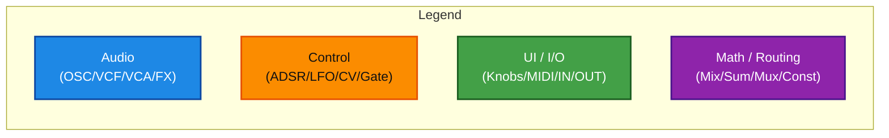

### 1.2 Color Definitions

**Audio (Blue)**
- Use for: Oscillators, Filters (VCF), Amplifiers (VCA), Effects, Engines
- DaisySP examples: `Oscillator`, `Svf`, `Fm2`, `ReverbSc`, `DelayLine`
- Fill: `#1E88E5` (Blue 600)
- Stroke: `#0D47A1` (Blue 900)

**Control (Orange)**
- Use for: Envelopes (ADSR), LFOs, Gates, Triggers, Clocks, CV signals
- DaisySP examples: `AdEnv`, `Metro`, `AudioDetector`
- Fill: `#FB8C00` (Orange 600)
- Stroke: `#E65100` (Orange 900)
- Text color: `#111111` (Black - for contrast on orange)

**UI / I/O (Green)**
- Use for: Physical inputs/outputs, Knobs, Buttons, Keys, MIDI ports, Audio jacks
- Fill: `#43A047` (Green 600)
- Stroke: `#1B5E20` (Green 900)

**Math / Routing (Violet)**
- Use for: Mixers, Summing buses, Mux/Demux, Constants, Voice managers, Sequencers
- Fill: `#8E24AA` (Purple 600)
- Stroke: `#4A148C` (Purple 900)

### 1.3 Applying Colors to Nodes

**Method 1: Inline Class Tag (Recommended)**

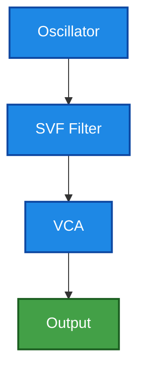

**Method 2: Separate classDef Block**

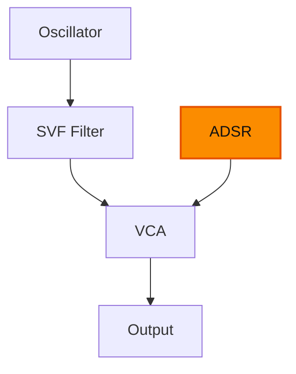

### 1.4 Color Assignment Rules

| Signal Type | Color | Example |
|-------------|-------|---------|
| Audio-rate oscillators | Blue | `Oscillator`, `Fm2`, `VosimOscillator` |
| Audio processing | Blue | `Svf`, `Overdrive`, `DelayLine`, `ReverbSc` |
| Control voltage (CV) | Orange | ADSR output, LFO output, Gate, Trigger |
| Physical controls | Green | Knobs, Buttons, Keys, Audio In/Out |
| MIDI input | Green | `MIDI In`, `MIDI Note` |
| Routing/Mixing | Violet | `Mixer`, `Sum`, `VoiceManager`, `Sequencer` |

### 1.5 Low-Contrast Alternative (Optional)

For users who prefer lighter colors:

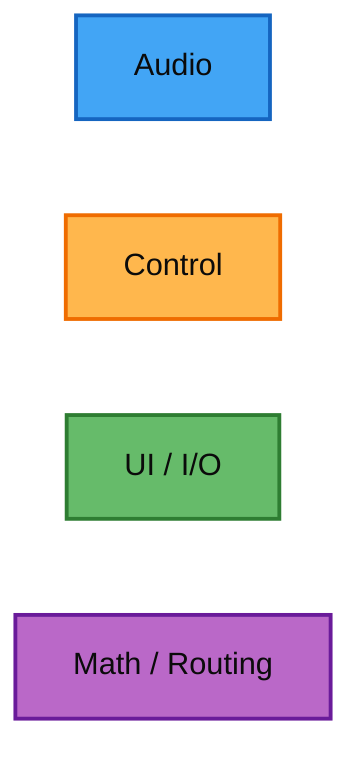

---

## 2. Block Position Setting

### 2.1 Flow Direction

**Top-to-Bottom (TD)** - Recommended for signal flow diagrams:

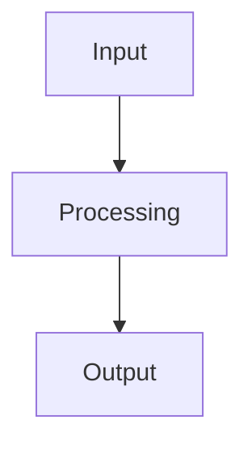

**Left-to-Right (LR)** - Alternative for horizontal layouts:

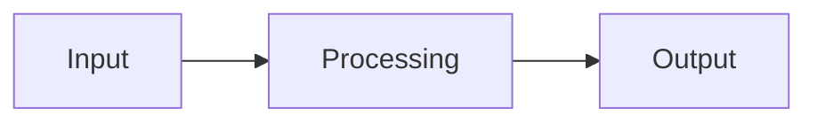

### 2.2 Single Block Positioning

Mermaid auto-layout positions nodes based on declaration order and connections.

**Basic Chain (Spine Pattern)**

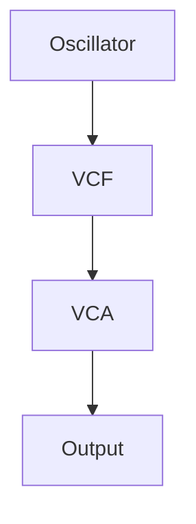

**Branching Paths**

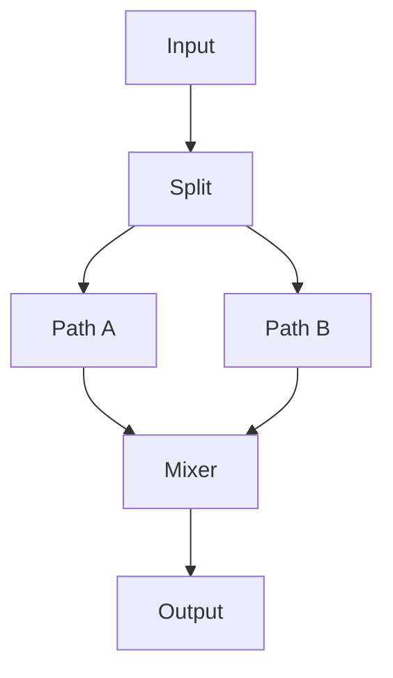

### 2.3 Multiple Block Grouping with Subgraphs

**Subgraph for Logical Grouping**

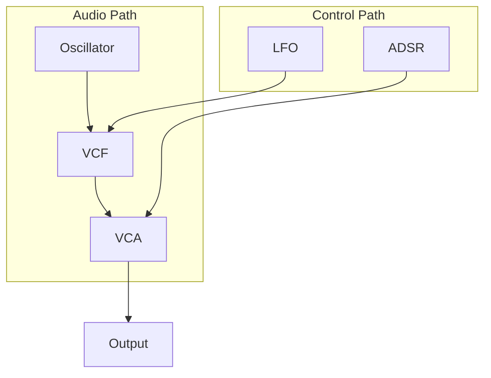

**Subgraph for Parallel Processing**

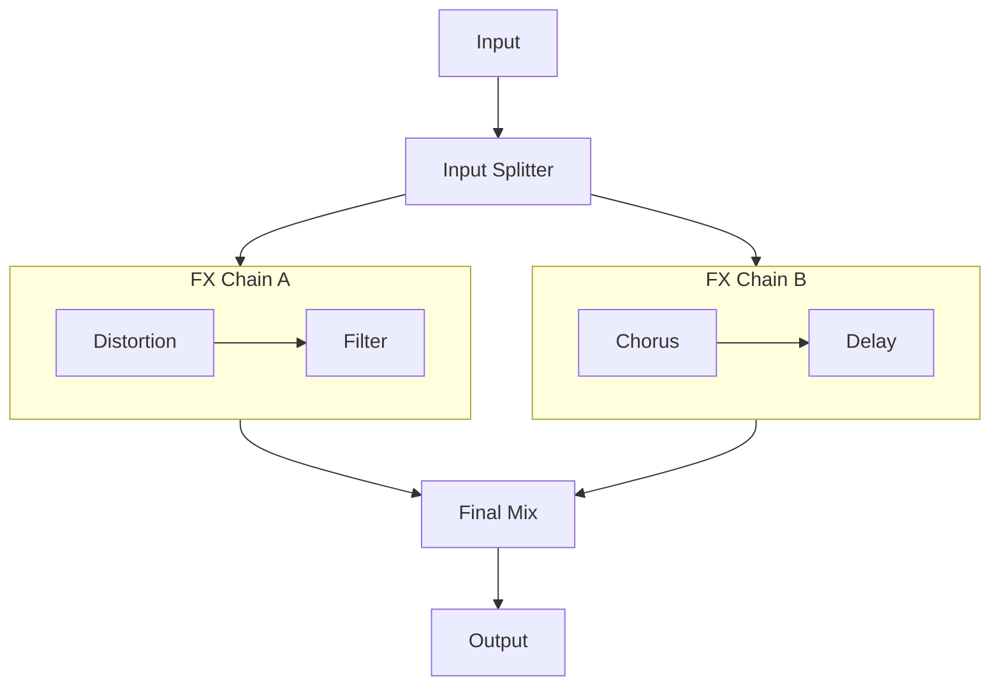

### 2.4 Complex Routing Patterns

**Modulation Injection Pattern**

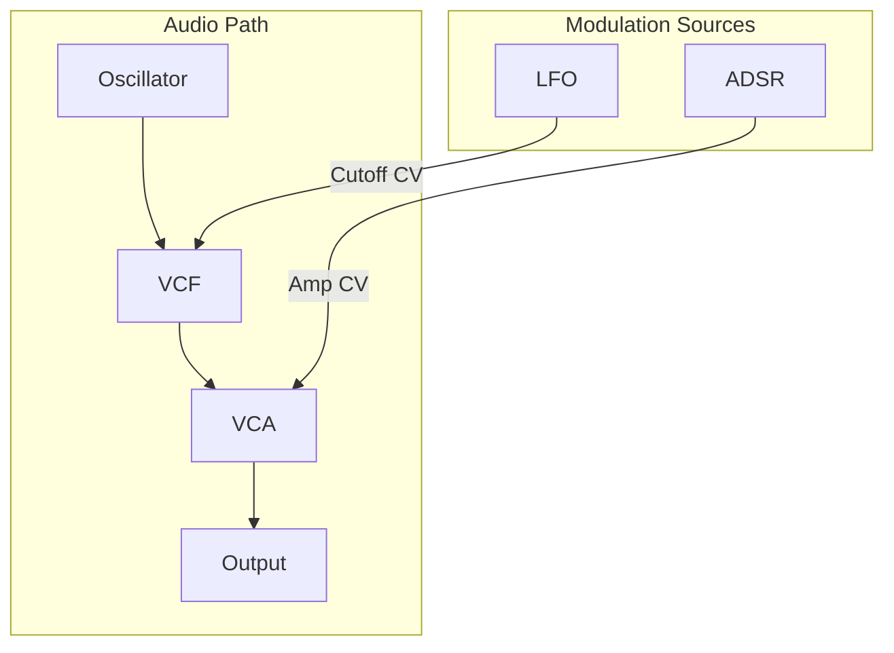

**Feedback Loop Pattern**

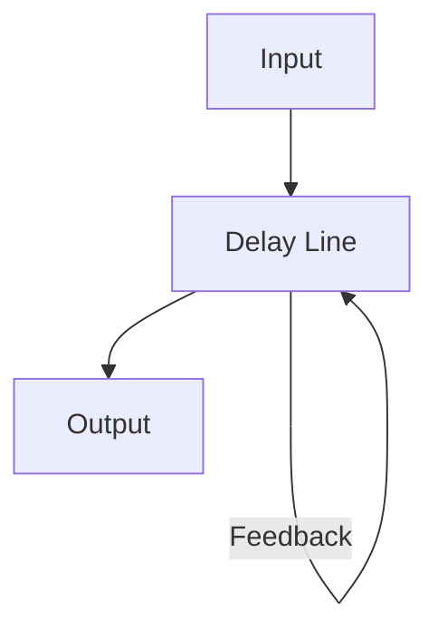

**Mixer Summing Pattern**

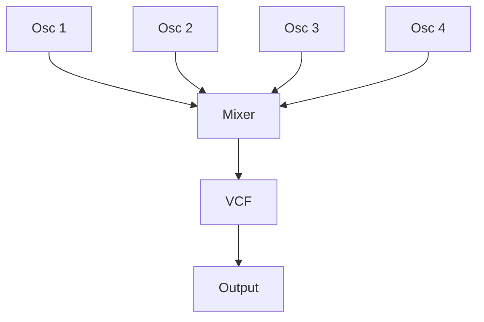

### 2.5 Layout Control Techniques

**Anchor Nodes for Alignment**

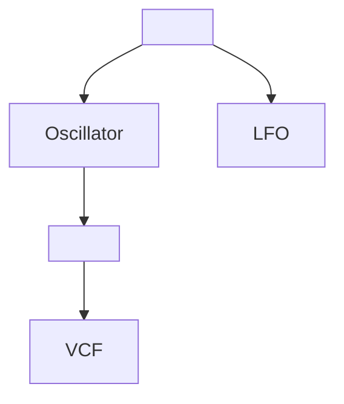

**Note:** Label invisible anchor nodes with a space or dot (`[" "]` or `["·"]`) if they appear.

**Bus Architecture Pattern**

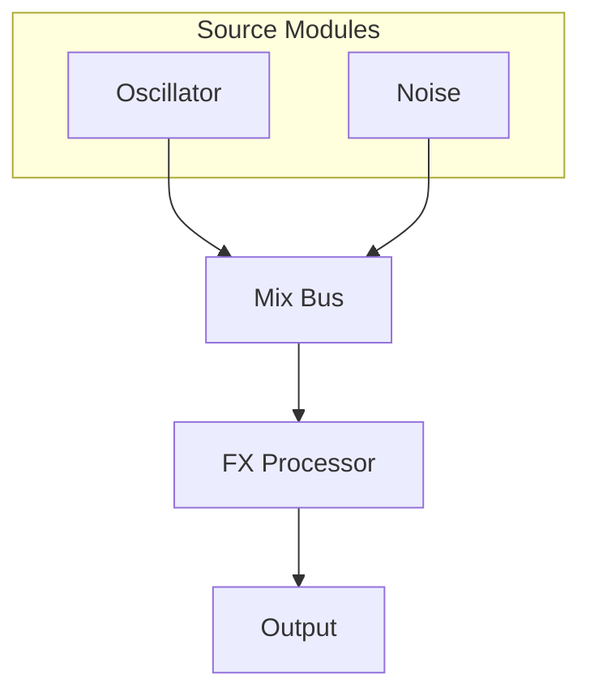

### 2.6 Complete Synth Voice Template

This template demonstrates a complete subtractive synth voice:

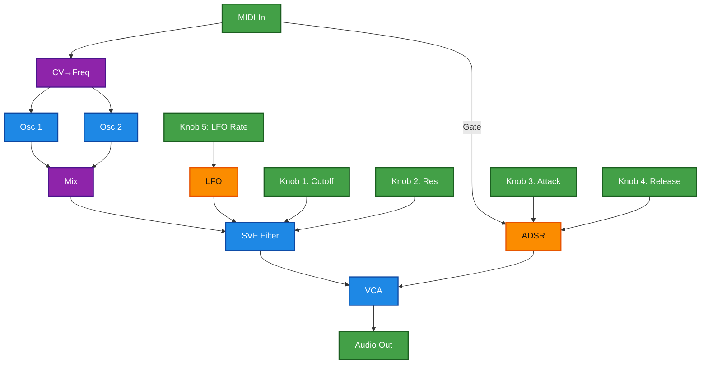

### 2.7 Common Layout Mistakes & Fixes

| Mistake | Fix |
|---------|-----|
| Diagram too wide | Use `flowchart TD` instead of `LR`, or split into multiple diagrams |
| Nodes overlapping | Declare main chain first, modulation later |
| Messy modulation lines | Group modulation sources in a subgraph |
| Too many nodes at once | Split into Audio diagram + Control diagram |

---

## 3. Quick Reference

### 3.1 Copy-Paste Color Block

### 3.2 Legend Macro

---

## 4. Related Notes

- [[Mermaid Workbook (Part 2): ASCII → Color-Coded Synth Diagrams]]
- [[Mermaid Style Guide (Synth Diagrams): Obsidian-First]]
- [[Daisy Field Architecture Ideas]]
- [[Daisy Pod Architecture Ideas]]

---

*Generated per the Luminous Modular Grammar color system for synth diagram documentation.*
