# Daisy Pod Project Concepts v1.0

This document outlines 16 project ideas tailored for the **Electrosmith Daisy Pod**. The Pod features **2 Knobs**, **2 Buttons**, **1 Encoder**, and **2 RGB LEDs**.

**Table of Contents**

**A. [Line In (Audio Processing)](#a-line-in-audio-processing)**
1. [Warm Saturation](#1-warm-saturation) (Complexity: 2/10)
2. [Auto-Wah Funke](#2-auto-wah-funke) (Complexity: 3/10)
3. [Stereo Ping-Pong Delay](#3-stereo-ping-pong-delay) (Complexity: 4/10)
4. [Glitch Stutterer](#4-glitch-stutterer) (Complexity: 5/10)
5. [Resonant Filter Bank](#5-resonant-filter-bank) (Complexity: 7/10)
6. [Granular Pitch Shifter](#6-granular-pitch-shifter) (Complexity: 8/10)

**B. [MIDI In (Synthesizers)](#b-midi-in-synthesizers)**
7. [Classic Mono Bass](#7-classic-mono-bass) (Complexity: 2/10)
8. [Dual Detune Lead](#8-dual-detune-lead) (Complexity: 3/10)
9. [Pocket Arpeggiator](#9-pocket-arpeggiator) (Complexity: 5/10)
10. [FM Bell Box](#10-fm-bell-box) (Complexity: 6/10)
11. [Wavetable Morph Pad](#11-wavetable-morph-pad) (Complexity: 7/10)
12. [8-Voice Virtual Analog](#12-8-voice-virtual-analog) (Complexity: 8/10)

**C. [Hybrid Inputs (Audio + MIDI)](#c-hybrid-inputs-audio--midi)**
13. [Gated Fuzz](#13-gated-fuzz) (Complexity: 3/10)
14. [Ring Modulator](#14-ring-modulator) (Complexity: 5/10)
15. [The Vocoder](#15-the-vocoder) (Complexity: 7/10)
16. [Live Sampler Synth](#16-live-sampler-synth) (Complexity: 8/10)

---

## A. Line In (Audio Processing)

### 1. Warm Saturation
**Complexity**: 2/10
**Description**: A simple yet high-quality drive unit. Adds harmonic content to stereo line inputs using a soft-clipping algorithm.
**Mapping**:
- **Knob 1**: Drive Amount
- **Knob 2**: Output Level
- **Encoder**: Tone (Tilt EQ)
- **Button 1**: Bypass (LED 1 Red = Active)
**Diagram**:
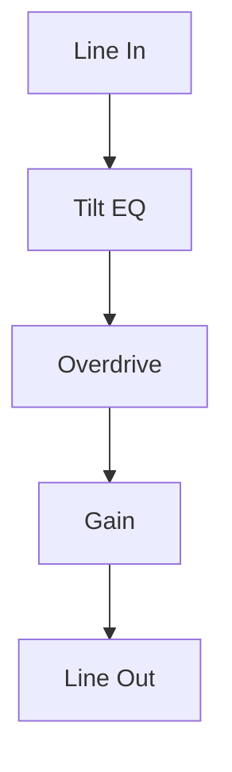

### 2. Auto-Wah Funke
**Complexity**: 3/10
**Description**: An envelope follower modulating a Bandpass filter. Reacts to the dynamic range of the incoming audio.
**Mapping**:
- **Knob 1**: Sensitivity (Envelope Threshold)
- **Knob 2**: Filter Resonance
- **Encoder**: Base Frequency
- **Button 1**: Filter Mode Toggle (BP/LP)
**Diagram**:
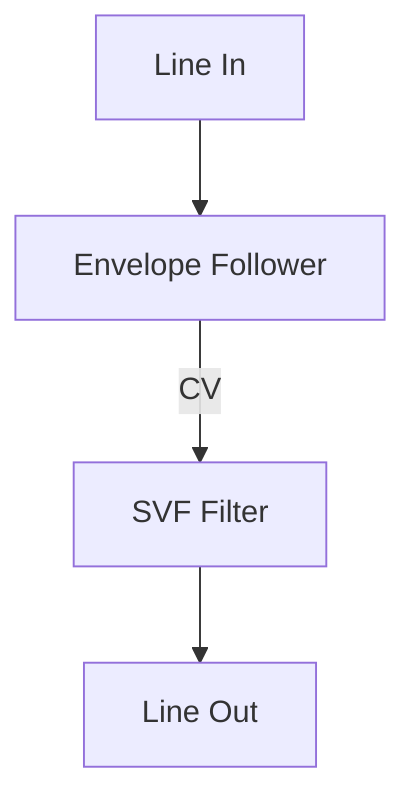

### 3. Stereo Ping-Pong Delay
**Complexity**: 4/10
**Description**: Distinct delay lines for Left and Right channels, with cross-feedback capability.
**Mapping**:
- **Knob 1**: Delay Time
- **Knob 2**: Feedback Amount
- **Encoder**: Dry/Wet Mix (Click to Tap Tempo)
- **Button 1**: Ping-Pong Mode Toggle (Cross-feed vs Parallel)
**Diagram**:
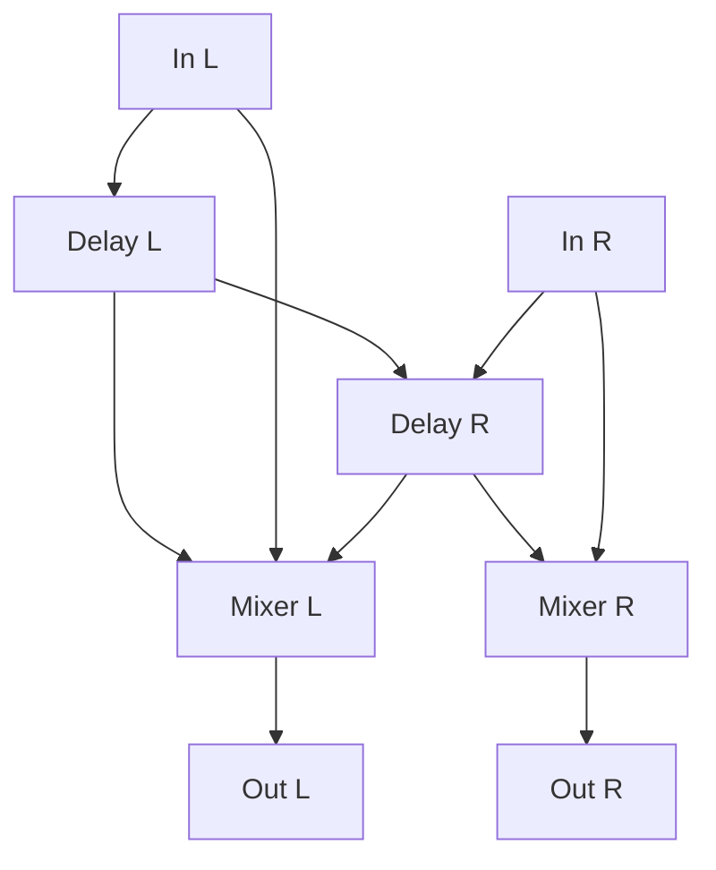

### 4. Glitch Stutterer
**Complexity**: 5/10
**Description**: Continuously records to a buffer. When activated, it loops a short segment of the immediate past (stutter effect).
**Mapping**:
- **Knob 1**: Stutter Length (10ms - 200ms)
- **Knob 2**: Pitch Speed (+/- 2 octaves)
- **Button 1 (Hold)**: Engage Stutter (Momentary)
- **Button 2**: Reverse Toggle
**Diagram**:
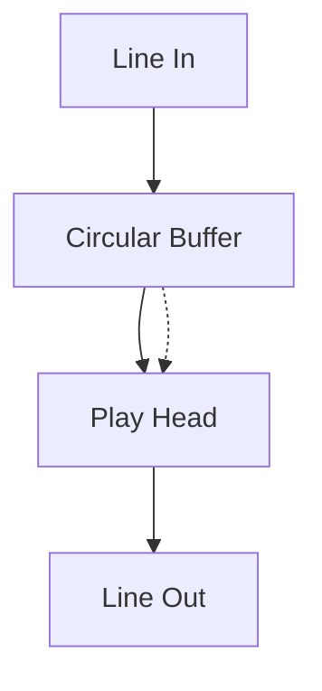

### 5. Resonant Filter Bank
**Complexity**: 7/10
**Description**: A bank of 4 parallel bandpass filters tuned to harmonic intervals. Creates metallic, robotic textures from any audio source.
**Mapping**:
- **Knob 1**: Fundamental Frequency
- **Knob 2**: Spectral Spread (Interval spacing)
- **Encoder**: Q (Resonance) for all bands
- **Button 1**: Cycle Scale (Major/Minor/Chromatic)
**Diagram**:
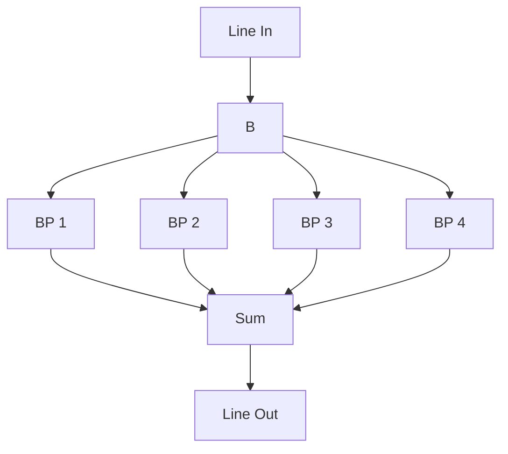

### 6. Granular Pitch Shifter
**Complexity**: 8/10
**Description**: Real-time granular processing to pitch-shift audio without affecting duration, or to smear audio into a texture.
**Mapping**:
- **Knob 1**: Pitch Shift (-12 to +12 semitones)
- **Knob 2**: Grain Size / Texture
- **Encoder**: Randomization Amount (Jitter)
- **Button 1**: Freeze Input Buffer
**Diagram**:
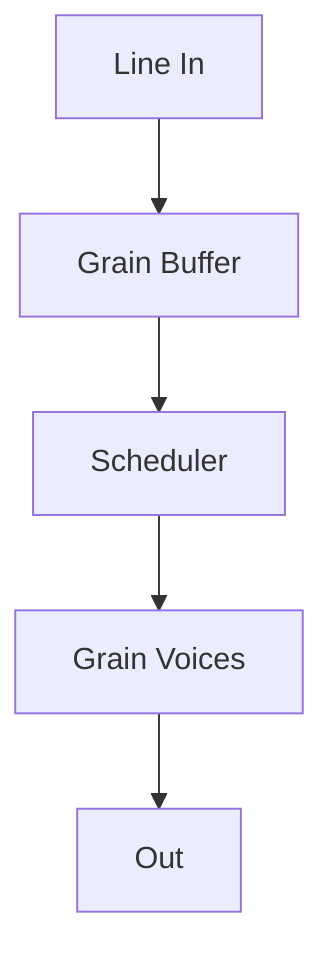

---

## B. MIDI In (Synthesizers)

### 7. Classic Mono Bass
**Complexity**: 2/10
**Description**: A solid subtractive monophonic synthesizer designed for basslines.
**Mapping**:
- **Knob 1**: Filter Cutoff
- **Knob 2**: Filter Resonance
- **Encoder**: Envelope Decay Time
- **Button 1**: Waveform Select (Saw/Square)
**Diagram**:
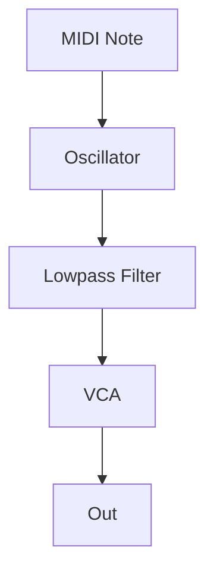

### 8. Dual Detune Lead
**Complexity**: 3/10
**Description**: Two oscillators slightly detuned for a thick lead sound.
**Mapping**:
- **Knob 1**: Detune Amount
- **Knob 2**: VCA Release Time
- **Encoder**: Filter Cutoff
- **Button 1**: Glide On/Off
**Diagram**:
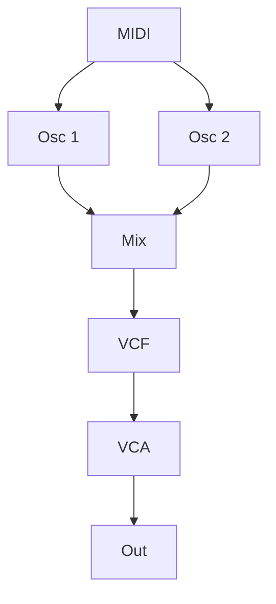

### 9. Pocket Arpeggiator
**Complexity**: 5/10
**Description**: Takes held MIDI chords and turns them into a rhythmic arpeggio pattern.
**Mapping**:
- **Knob 1**: Tempo (BPM)
- **Knob 2**: Gate Length
- **Encoder**: Arp Mode (Up, Down, Random, Order)
- **Button 1**: Latch On/Off
**Diagram**:
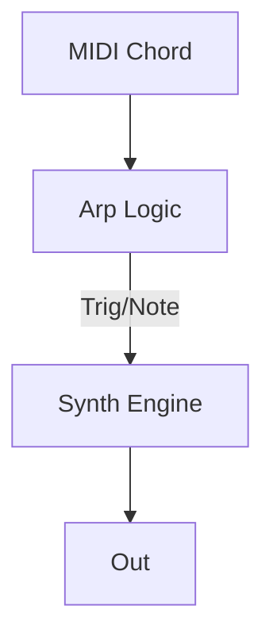

### 10. FM Bell Box
**Complexity**: 6/10
**Description**: 2-Operator FM synthesis tuned for metallic and glass sounds.
**Mapping**:
- **Knob 1**: Modulator Index (Brightness)
- **Knob 2**: Modulator Ratio (Harmonic)
- **Encoder**: Decay Time (for both Carrier and Mod)
- **Button 1**: Velocity Sensitivity Toggle
**Diagram**:
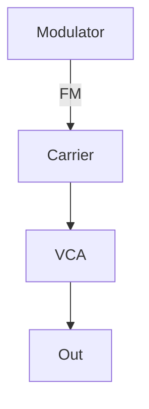

### 11. Wavetable Morph Pad
**Complexity**: 7/10
**Description**: Smoothly scans through a wavetable using an internal LFO. Polyphonic (4 voices).
**Mapping**:
- **Knob 1**: LFO Speed (Morph Rate)
- **Knob 2**: Wavetable Position Offset
- **Encoder**: Attack Time
- **Button 1**: Select Wavetable Bank
**Diagram**:
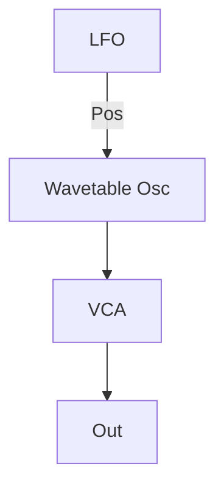

### 12. 8-Voice Virtual Analog
**Complexity**: 8/10
**Description**: A stress-test for the Pod. 8-voice polyphony with band-limited oscillators and per-voice envelopes.
**Mapping**:
- **Knob 1**: Filter Cutoff (Global)
- **Knob 2**: Filter Env Amount
- **Encoder**: Waveform Morph (Tri -> Saw -> Square)
- **Button 1**: Unison Mode (Reduces polyphony to 2, thickens sound)
**Diagram**:
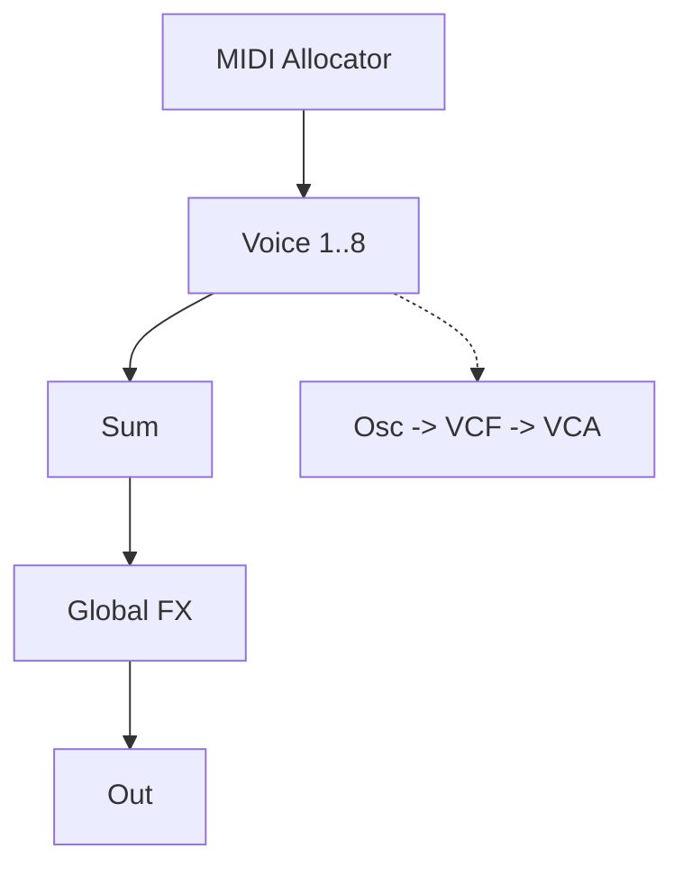

---

## C. Hybrid Inputs (Audio + MIDI)

### 13. Gated Fuzz
**Complexity**: 3/10
**Description**: Takes Line In audio and only lets it pass when a MIDI note is active. Also applies distortion.
**Mapping**:
- **Knob 1**: Fuzz Distortion Amount
- **Knob 2**: Output Volume
- **Encoder**: Release Time (Gate Tail)
- **Button 1**: Invert Gate (Duck mode)
**Diagram**:
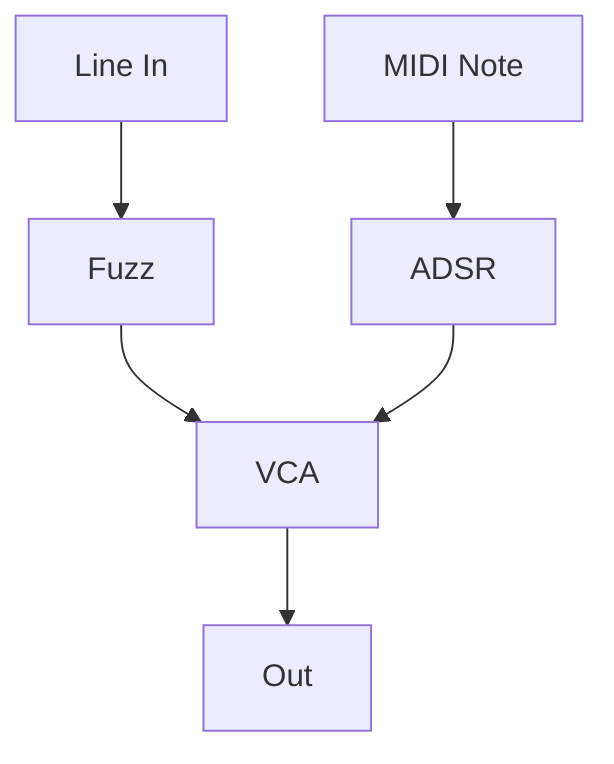

### 14. Ring Modulator
**Complexity**: 5/10
**Description**: Classic sci-fi effect. Multiplies Line In audio with a MIDI-controlled internal oscillator.
**Mapping**:
- **Knob 1**: Oscillator Fine Tune / Detune
- **Knob 2**: Dry/Wet Mix
- **Encoder**: Select Waveform (Sine/Saw/Square)
- **MIDI**: Controls Carrier Frequency
**Diagram**:
```mermaid
graph TD
    A[Line In] --> C{X (Multiply)}
    B[MIDI Osc] --> C
    C --> D[Mix] --> E[Out]
```

### 15. The Vocoder
**Complexity**: 7/10
**Description**: Uses Line In as the Modulator (Speech) and MIDI Synth as the Carrier. 8-band filter bank implementation.
**Mapping**:
- **Knob 1**: Formant Shift
- **Knob 2**: High Frequency Enhancement (Sibilance)
- **Encoder**: Carrier Saw/Pulse Width
- **MIDI**: Plays the Carrier Notes
**Diagram**:
```mermaid
graph TD
    A[Line In (Mod)] --> B[Analysis Filters] --> D[VCA Bank] --> E[Out]
    C[MIDI Synth (Car)] --> F[Synthesis Filters] --> D
```

### 16. Live Sampler Synth
**Complexity**: 8/10
**Description**: Press a button to record Line In. Play it back chromatically via MIDI immediately.
**Mapping**:
- **Knob 1**: Start Point
- **Knob 2**: End Point
- **Button 1 (Hold)**: Record Input
- **Encoder**: Filter Cutoff (Playback)
**Diagram**:
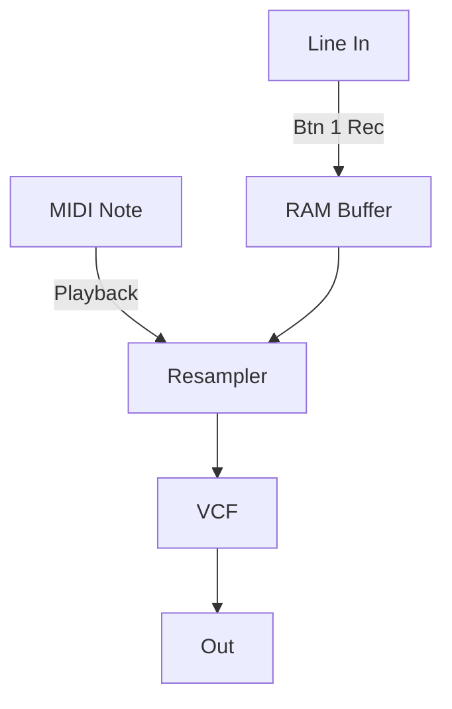
