# Daisy Pod Architecture Ideas

*16 project concepts for Daisy Pod hardware, organized by input type and complexity.*

## Table of Contents

### Part 1: Line In Projects (1-6)
1. [Simple Tremolo](#1-simple-tremolo) ★★☆☆☆☆☆☆
2. [Bitcrusher](#2-bitcrusher) ★★★☆☆☆☆☆
3. [Delay Pedal](#3-delay-pedal) ★★★★☆☆☆☆
4. [Chorus + Flanger](#4-chorus--flanger) ★★★★★☆☆☆
5. [Multi-FX Chain](#5-multi-fx-chain) ★★★★★★☆☆
6. [Reverb + Shimmer](#6-reverb--shimmer) ★★★★★★★★

### Part 2: MIDI IN Projects (7-12)
7. [Mono Synth](#7-mono-synth) ★★☆☆☆☆☆☆
8. [FM Synth](#8-fm-synth) ★★★☆☆☆☆☆
9. [Pluck Synth](#9-pluck-synth) ★★★★☆☆☆☆
10. [Poly Synth 4-Voice](#10-poly-synth-4-voice) ★★★★★☆☆☆
11. [Drum Synth](#11-drum-synth) ★★★★★★☆☆
12. [Physical Model Synth](#12-physical-model-synth) ★★★★★★★★

### Part 3: Line In + MIDI Projects (13-16)
13. [Vocoder Lite](#13-vocoder-lite) ★★★☆☆☆☆☆
14. [MIDI-Controlled Filter](#14-midi-controlled-filter) ★★★★★☆☆☆
15. [Harmonizer](#15-harmonizer) ★★★★★★☆☆
16. [Synth + FX Workstation](#16-synth--fx-workstation) ★★★★★★★★

---

## Pod Hardware Reference

```
┌─────────────────────────────────────────┐
│              DAISY POD                  │
│    ┌───┐                    ┌───┐       │
│    │ K1│                    │ K2│       │  K1, K2 = Knobs
│    └───┘                    └───┘       │
│         ┌───┐        ┌───┐              │
│         │ B1│        │ B2│              │  B1, B2 = Buttons
│         └───┘        └───┘              │
│              ◉ RGB LED                  │
│  AUDIO IN ──►         ──► AUDIO OUT     │
│  MIDI IN ──►                            │
└─────────────────────────────────────────┘
```

---

# Part 1: Line In Projects

---

## 1. Simple Tremolo
**Complexity: ★★☆☆☆☆☆☆**

Classic amplitude modulation effect.

```
AUDIO IN ──► TREMOLO ──► AUDIO OUT
             │             │
             ├── Rate ◄── K1
             └── Depth ◄── K2
```
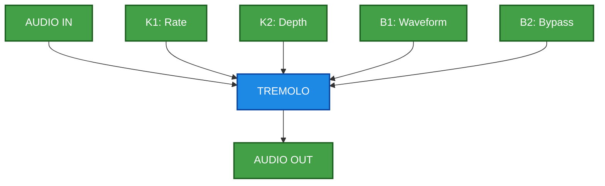

**Modules:** `Tremolo`

---

## 2. Bitcrusher
**Complexity: ★★★☆☆☆☆☆**

Lo-fi destruction: reduce bit depth and sample rate.

```
AUDIO IN ──► BITCRUSH ──► DECIMATOR ──► AUDIO OUT
             │             │
             Bits ◄── K1   Downsample ◄── K2
```
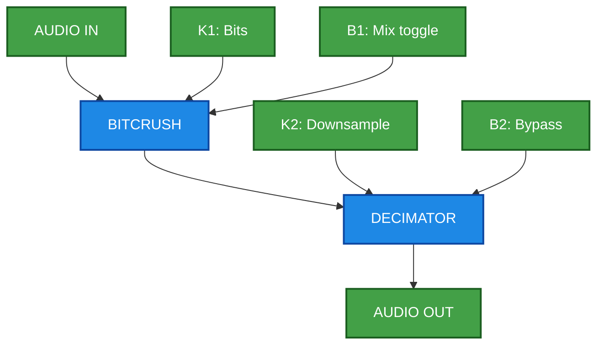

**Modules:** `Bitcrush`, `Decimator`

---

## 3. Delay Pedal
**Complexity: ★★★★☆☆☆☆**

Digital delay with tap tempo.

```
AUDIO IN ──► DELAY LINE ──┬──► AUDIO OUT
             ▲            │
             └────────────┘ (feedback)

Time ◄── K1 (10ms-1s)    Feedback ◄── K2 (0-95%)
```
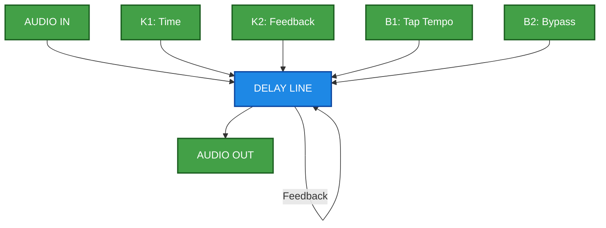

**Modules:** `DelayLine<float, MAX_DELAY>`

---

## 4. Chorus + Flanger
**Complexity: ★★★★★☆☆☆**

Dual modulation with mode switch.

```
AUDIO IN ──► [CHORUS / FLANGER] ──► STEREO OUT

Chorus: Depth ◄── K1, Rate ◄── K2
Flanger: Depth ◄── K1, Feedback ◄── K2
```
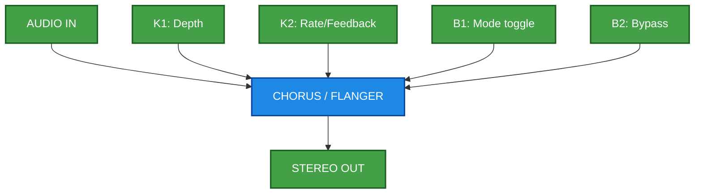

**Modules:** `Chorus`, `Flanger`

---

## 5. Multi-FX Chain
**Complexity: ★★★★★★☆☆**

3-stage serial: Overdrive → Delay → Reverb.

```
AUDIO IN ──► OVERDRIVE ──► DELAY ──► REVERB ──► AUDIO OUT
```
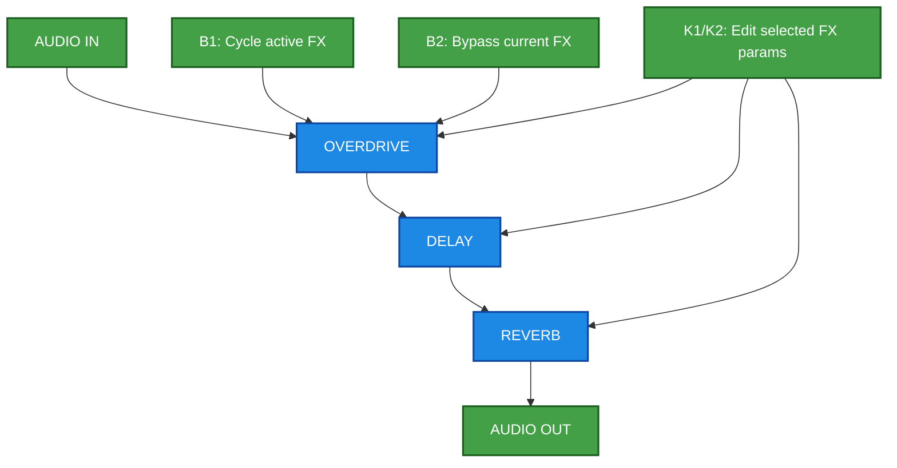

**Modules:** `Overdrive`, `DelayLine<>`, `ReverbSc`

---

## 6. Reverb + Shimmer
**Complexity: ★★★★★★★★**

Lush reverb with pitch-shifted feedback.

```
AUDIO IN ──► REVERB ──► PITCH SHIFT (+12) ──┐
                  ▲                          │
                  └──────────────────────────┘
```
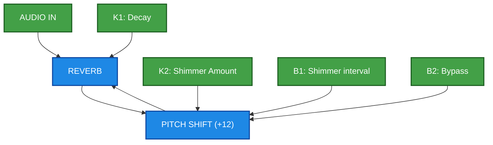

**Modules:** `ReverbSc`, `PitchShifter`

---

# Part 2: MIDI IN Projects

---

## 7. Mono Synth
**Complexity: ★★☆☆☆☆☆☆**

Simple monophonic synthesizer.

```
MIDI IN ──► OSCILLATOR ──► SVF FILTER ──► ENV ──► AUDIO OUT

Cutoff ◄── K1    Resonance ◄── K2
```
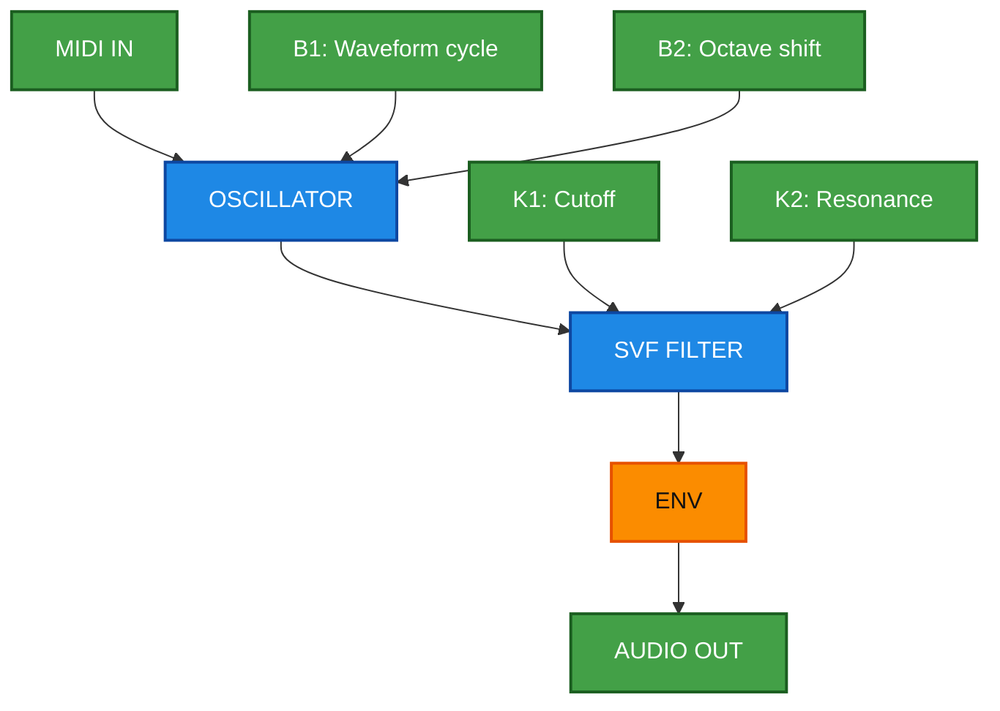

**Modules:** `Oscillator`, `Svf`, `AdEnv`

---

## 8. FM Synth
**Complexity: ★★★☆☆☆☆☆**

Two-operator FM synthesis.

```
MIDI IN ──► FM2 ──► ADSR ──► AUDIO OUT
            │
            ├── Index ◄── K1
            └── Ratio ◄── K2
```
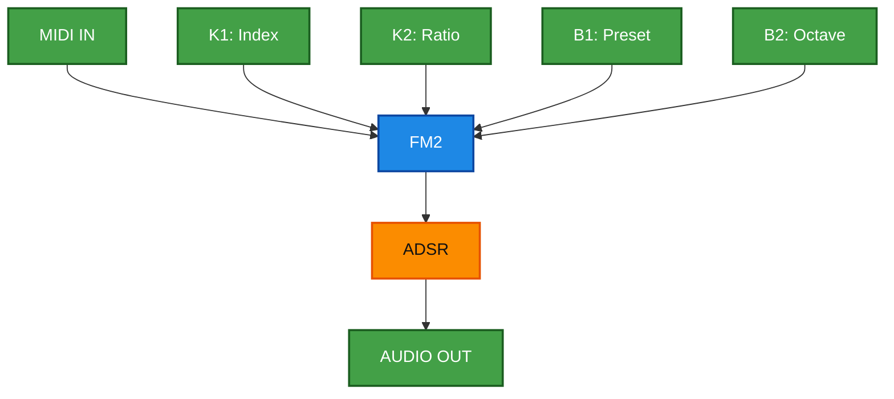

**Modules:** `Fm2`, `Adsr`

---

## 9. Pluck Synth
**Complexity: ★★★★☆☆☆☆**

Karplus-Strong plucked string synthesis.

```
MIDI IN ──► PLUCK ──► AUDIO OUT

Decay ◄── K1 (0.8-0.99)    Damping ◄── K2
```
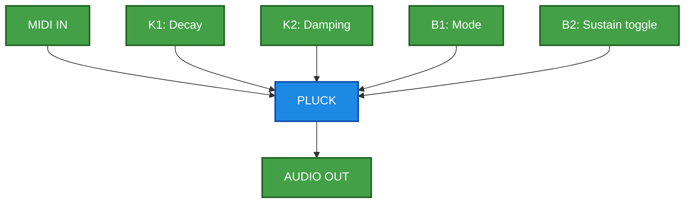

**Modules:** `Pluck`

---

## 10. Poly Synth 4-Voice
**Complexity: ★★★★★☆☆☆**

4-voice polyphonic with voice stealing.

```
MIDI IN ──► VOICE MANAGER ──► MIX ──► AUDIO OUT
            │
            ├── Voice 1 (OSC+FLT+ENV)
            ├── Voice 2
            ├── Voice 3
            └── Voice 4

Cutoff ◄── K1 (all)    Res ◄── K2 (all)
```
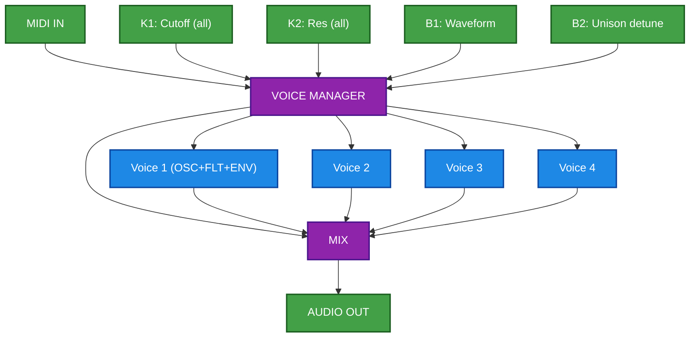

**Modules:** `Oscillator`×4, `Svf`×4, `Adsr`×4

---

## 11. Drum Synth
**Complexity: ★★★★★★☆☆**

MIDI-triggered drums (C1-B1 = different drums).

```
MIDI IN ──► DRUM MAPPER ──► MIX ──► STEREO OUT
            │
            ├── C1: Kick (AnalogBassDrum)
            ├── D1: Snare (SynthSnareDrum)
            ├── E1: Closed HiHat
            ├── F1: Open HiHat
            └── G1: Clap

Tune ◄── K1    Decay ◄── K2
```
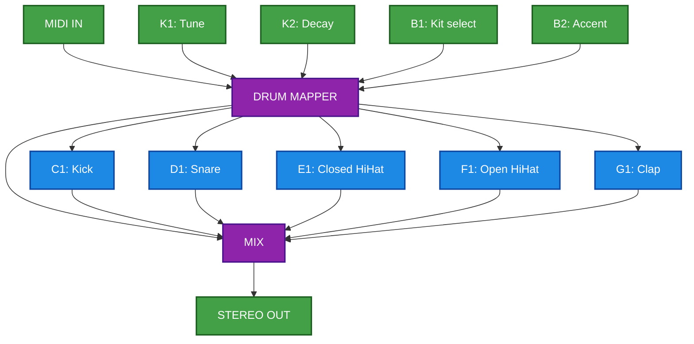

**Modules:** `AnalogBassDrum`, `SynthSnareDrum`, `HiHat<>`

---

## 12. Physical Model Synth
**Complexity: ★★★★★★★★**

StringVoice + ModalVoice physical modeling.

```
MIDI IN ──► [STRING / MODAL] ──► REVERB ──► STEREO OUT

Brightness ◄── K1    Structure ◄── K2
```
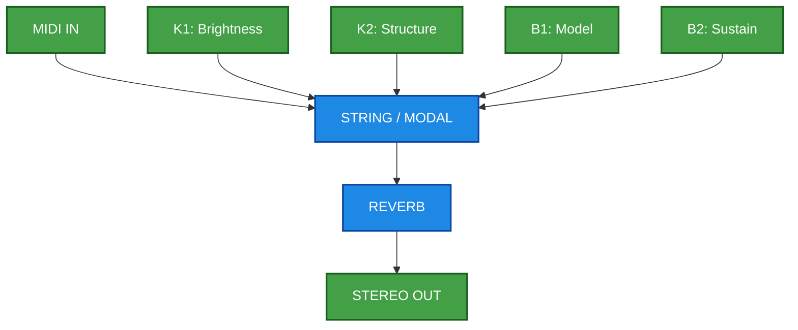

**Modules (LGPL):** `StringVoice`, `ModalVoice`, `ReverbSc`

---

# Part 3: Line In + MIDI Projects

---

## 13. Vocoder Lite
**Complexity: ★★★☆☆☆☆☆**

Audio = modulator, MIDI = carrier.

```
AUDIO IN ──► Envelope Follower ──┐
                                 â–¼
MIDI IN ──► Carrier OSC ──► VCA ──► Filter ──► OUT

Bands ◄── K1 (4/8/16)    Carrier Mix ◄── K2
```
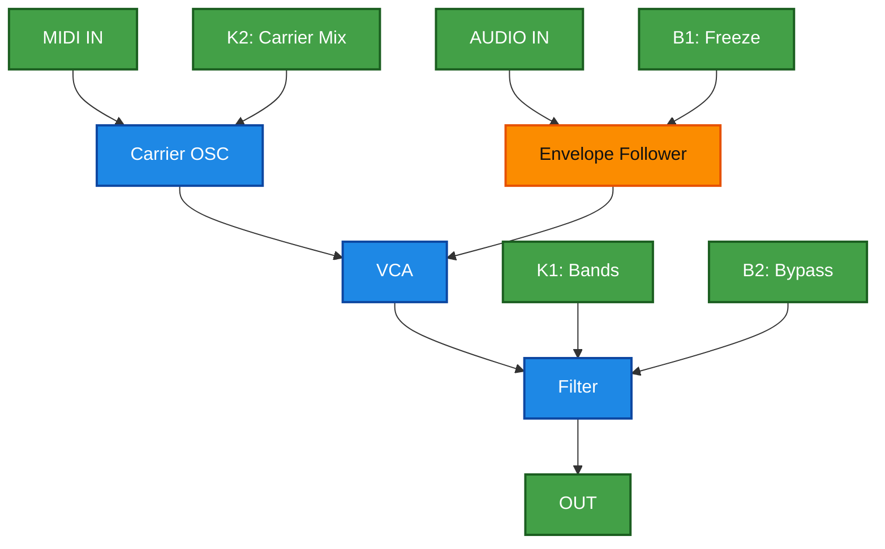

**Modules:** `Oscillator`, `Svf`

---

## 14. MIDI-Controlled Filter
**Complexity: ★★★★★☆☆☆**

Filter audio with MIDI note = cutoff.

```
AUDIO IN ──► MOOG LADDER ──► AUDIO OUT
             │
             └── Cutoff ◄── MIDI Note (mtof)
                 Res ◄── MIDI Velocity

Offset ◄── K1    Env Follow ◄── K2
```
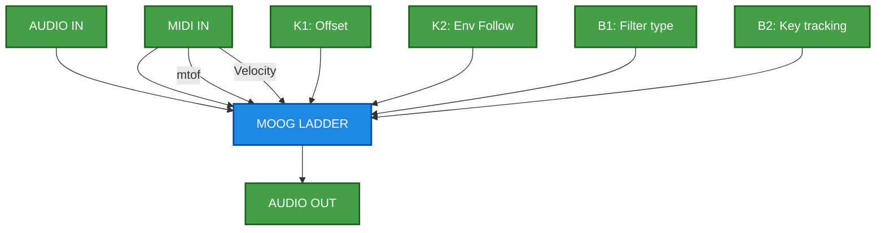

**Modules:** `MoogLadder`, `Svf`

---

## 15. Harmonizer
**Complexity: ★★★★★★☆☆**

Pitch shift audio based on held MIDI notes.

```
AUDIO IN ──┬──────────────────── DRY ──┐
           │                           │
           ├──► PitchShift (int 1) ───┤
           │                           ├──► MIX ──► OUT
           └──► PitchShift (int 2) ───┘

Dry/Wet ◄── K1    Detune ◄── K2
```
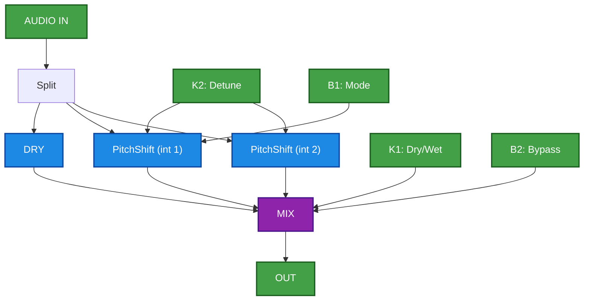

**Modules:** `PitchShifter`

---

## 16. Synth + FX Workstation (No Audio In)
**Complexity: **********

Internal synth workstation with no external audio input.

### Suggested Oscillator Voice (Grainlet + Particle + Dust)

- `Grainlet`: main pitched body from MIDI note.
- `Particle`: noisy micro-burst layer for texture and attack grit.
- `Dust`: sparse random impulses to excite movement and organic transients.
- Blend suggestion:
  - `voice = 0.62 * Grainlet + 0.24 * Particle + 0.14 * DustEnv`
  - Then `voice -> SVF -> ADSR -> MIXER`.

```
MIDI IN -> VOICE CORE (Grainlet + Particle + Dust) -> MIXER -> FX BUS -> DISTORTION -> STEREO OUT
                  |                                                |
       Timbre/Blend <- K1                                      +-> Chorus
                                                                +-> Delay
                                                                +-> Reverb

FX Amount / Drive <- K2
```
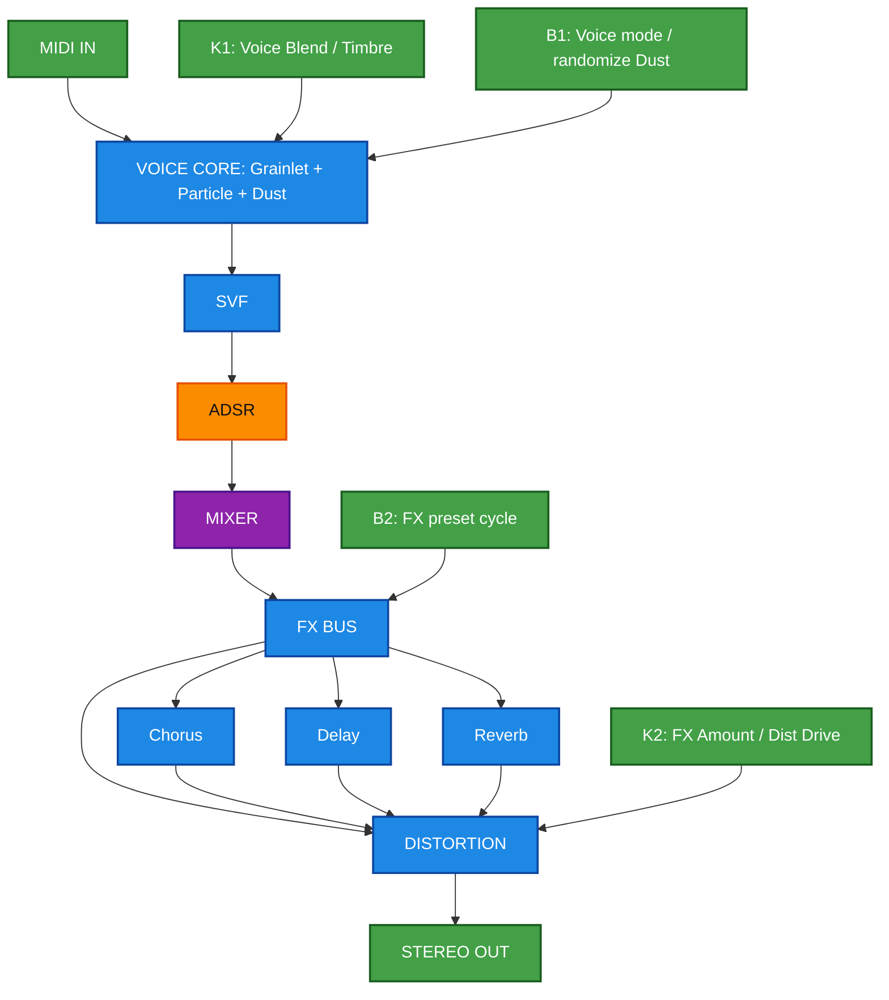

**Modules:** `Grainlet`, `Particle`, `Dust`, `Svf`, `Adsr`, `Chorus`, `DelayLine<>`, `ReverbSc`, `Overdrive`

---
## Summary Table

| # | Project | Complexity | Input | Key Modules |
|---|---------|------------|-------|-------------|
| 1 | Tremolo | ★★☆ | Line | Tremolo |
| 2 | Bitcrusher | ★★★☆ | Line | Bitcrush |
| 3 | Delay | ★★★★☆ | Line | DelayLine |
| 4 | Chorus/Flanger | ★★★★★☆ | Line | Chorus, Flanger |
| 5 | Multi-FX | ★★★★★★☆ | Line | OD, Delay, Reverb |
| 6 | Shimmer Reverb | ★★★★★★★★ | Line | ReverbSc, PitchShift |
| 7 | Mono Synth | ★★☆ | MIDI | Osc, Svf |
| 8 | FM Synth | ★★★☆ | MIDI | Fm2 |
| 9 | Pluck Synth | ★★★★☆ | MIDI | Pluck |
| 10 | Poly Synth | ★★★★★☆ | MIDI | Osc×4 |
| 11 | Drum Synth | ★★★★★★☆ | MIDI | DrumSynths |
| 12 | Physical Model | ★★★★★★★★ | MIDI | StringVoice |
| 13 | Vocoder | ★★★☆ | Both | Osc, EnvFollow |
| 14 | MIDI Filter | ★★★★★☆ | Both | MoogLadder |
| 15 | Harmonizer | ★★★★★★☆ | Both | PitchShifter |
| 16 | Synth+FX (No Audio In) | ********** | MIDI | Grainlet, Particle, Dust, FX, Distortion |

---

**Generated per DAISY_EXPERT_SYSTEM_PROMPT_v5.2 guidelines**

