````markdown
---
title: "Mermaid Workbook (Part 2): ASCII → Color-Coded Synth Diagrams (Daisy Field Concepts)"
tags: [obsidian, mermaid, workbook, daisy, synth, diagrams]
created: 2026-01-11
aliases: ["Mermaid Workbook Part 2", "Synth Diagram Workbook"]
version: "v1.0"
source: "field_concepts_OPUS_1-3.md"
purpose: "Hands-on conversion workbook: convert synth / FX / instrument concepts into stable Mermaid diagrams with consistent color coding."
---

# Mermaid Workbook (Part 2): ASCII → Color-Coded Synth Diagrams

> [!note]
> This workbook continues the tutorial note: **[[Obsidian + Mermaid Tutorial: Color-Coded Synth Block Diagrams (Daisy Field Concepts)]]**  
> It converts multiple ideas from `field_concepts_OPUS_1-3.md` into **Mermaid Minimal Stable** and **Mermaid Full Colored** versions. :contentReference[oaicite:0]{index=0}

# Contents
- [[#Legend (Reusable)|Legend (Reusable)]]
- [[#Workbook Format (How to use this note)|Workbook Format (How to use this note)]]
- [[#1 Drone Station (8 Osc Voice Bank)|1 Drone Station (8 Osc Voice Bank)]]
- [[#2 Subtractive Monosynth (2 VCO SVF ADSR)|2 Subtractive Monosynth (2 VCO SVF ADSR)]]
- [[#3 FM Synth (Modulator → Carrier)|3 FM Synth (Modulator → Carrier)]]
- [[#4 FX Unit: Distortion → Filter → Chorus/Reverb|4 FX Unit: Distortion → Filter → Chorus/Reverb]]
- [[#5 Looper Station + FX|5 Looper Station + FX]]
- [[#6 Granular / Texture Generator|6 Granular / Texture Generator]]
- [[#7 Multi-Tap Delay Router (Feedback Matrix)|7 Multi-Tap Delay Router (Feedback Matrix)]]
- [[#8 Drum Voice: Kick + Snare + Hat Mixer|8 Drum Voice: Kick + Snare + Hat Mixer]]
- [[#9 Voice + Mod Matrix (Semi-Modular)|9 Voice + Mod Matrix (Semi-Modular)]]
- [[#10 Full Performance Rack (Workstation)|10 Full Performance Rack (Workstation)]]
- [[#Debugging Checklist (Copy/Paste Ready)|Debugging Checklist (Copy/Paste Ready)]]
- [[#Exercises (Do it yourself)|Exercises (Do it yourself)]]
- [[#Next improvements|Next improvements]]

---

## Legend (Reusable)

> [!tip]
> Copy/paste this legend into any diagram if you want the color meaning visible inside the Mermaid graph.

```mermaid
flowchart LR
  subgraph LEGEND["Legend"]
    A["Audio\nOSC / VCF / VCA / FX"]:::audio
    B["Control\nADSR / LFO / CV / Gate"]:::ctrl
    C["UI / External I/O\nKnobs / MIDI / IN/OUT"]:::ui
    D["Math / Routing\nMix / Sum / Mux / Const"]:::math
  end

  classDef audio fill:#1E88E5,stroke:#0D47A1,stroke-width:2px,color:#ffffff;
  classDef ctrl  fill:#FB8C00,stroke:#E65100,stroke-width:2px,color:#111111;
  classDef ui    fill:#43A047,stroke:#1B5E20,stroke-width:2px,color:#ffffff;
  classDef math  fill:#8E24AA,stroke:#4A148C,stroke-width:2px,color:#ffffff;
````

---

## Workbook Format (How to use this note)

Each entry contains:

1. **ASCII source (concept)** (easy to edit)
    
2. **Mermaid Minimal Stable Render**
    
3. **Mermaid Full Colored Diagram**
    
4. **Common mistakes & fixes**
    

> [!warning]  
> Mermaid positioning is auto-layout. You control placement through:
> 
> - `flowchart LR/TD`
>     
> - declaration order
>     
> - `subgraph` grouping
>     
> - anchor nodes (layout shims)
>     

---

## 1) Drone Station (8 Osc Voice Bank)

Concept from file: drone/voice-bank idea (multi osc → mix → output).

### ASCII source (concept)

```text
[UI knobs] --> (tuning, mix, detune)
[8x OSC Bank] --> [Voice Mix] --> [Output]
(optional) --> [Filter] --> [FX]
```

### Mermaid — Minimal Stable Render


### Mermaid — Full Colored Diagram

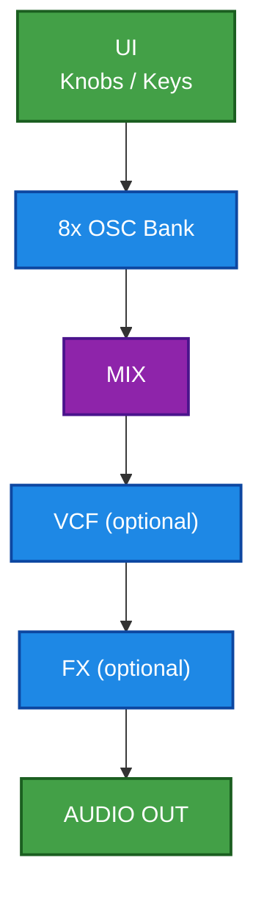

### Common mistakes

- Osc bank drawn as 8 nodes → diagram becomes too wide  
    Fix: collapse into one node `8x OSC Bank`, then expand only if needed.
    

---

## 2) Subtractive Monosynth (2 VCO SVF ADSR)

Subtractive voice concept (osc → vcf → vca) with envelope.

### ASCII source (concept)

```text
[MIDI Note/Gate] -> (note->Hz) -> [VCO1] ->\
                                    +->[Mixer]->[VCF]->[VCA]->[OUT]
[MIDI Note/Gate] -> (note->Hz) -> [VCO2] ->/
[MIDI Gate] -> [ADSR] -> VCA CV
```

### Mermaid — Minimal Stable Render

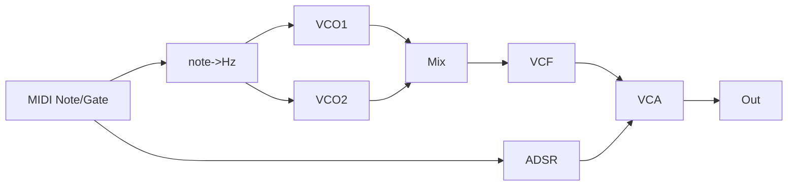

### Mermaid — Full Colored Diagram

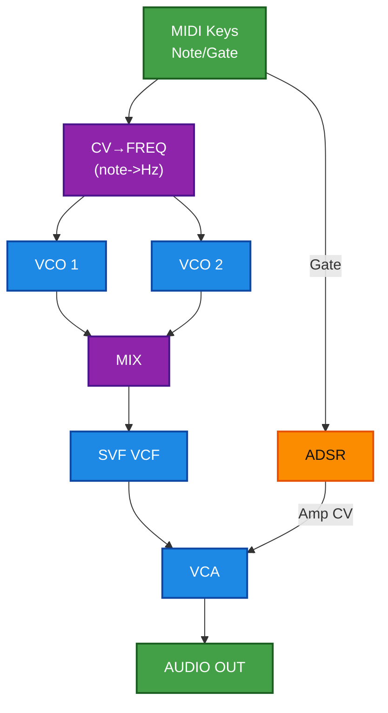

---

## 3) FM Synth (Modulator → Carrier)

FM synth idea: mod oscillator drives carrier phase/freq; envelope + UI for index/ratio.

### ASCII source (concept)

```text
[MIDI Note/Gate]->(note->Hz)-> Carrier Freq
[MIDI Note/Gate]->(note->Hz)-> Mod Freq (ratio)
Mod OSC -> (* index) -> (+ carrier freq) -> Carrier OSC -> OUT
ADSR -> index CV
```

### Mermaid — Minimal Stable Render

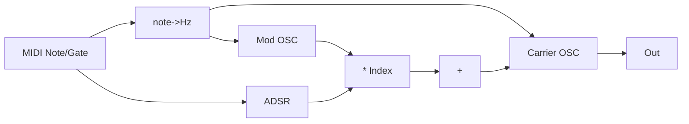

### Mermaid — Full Colored Diagram

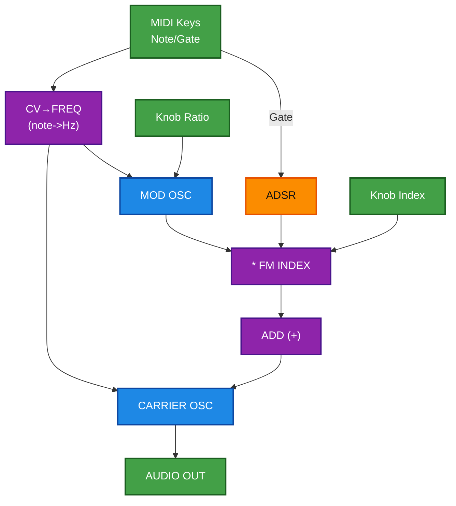

> [!tip]  
> FM graphs often become messy because the mod path is both “audio-rate” and also functions like control.  
> Your rule says: if it is audio input/output → **blue**. So keep MOD OSC blue, but index math violet.

---

## 4) FX Unit: Distortion → Filter → Chorus/Reverb

Multi-effect chain concept (waveshape/distort, nonlinear filtering, modulation FX).

### ASCII source (concept)

```text
Audio In -> Distortion -> Nonlinear Filter -> (Chorus/Reverb) -> Out
Knobs: drive, cutoff, feedback/res, mix
LFO -> chorus / filter modulation
Safety: DC block + limiter
```

### Mermaid — Minimal Stable Render

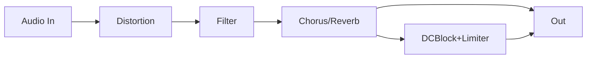

### Mermaid — Full Colored Diagram

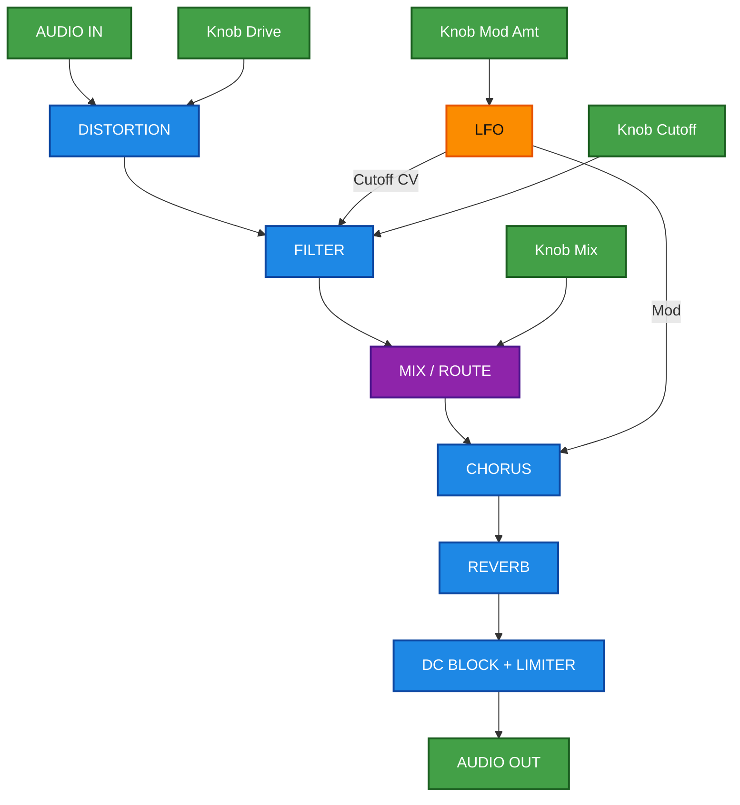

---

## 5) Looper Station + FX

Concept from file: looper, recording buffer, playback + effects.

### ASCII source (concept)

```text
Audio In -> Record Buffer -> Playback -> FX -> Out
Buttons: Rec/Play/Stop/Undo
Knobs: loop length, overdub, FX mix
```

### Mermaid — Minimal Stable Render

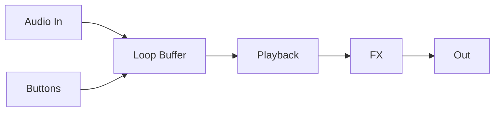

### Mermaid — Full Colored Diagram

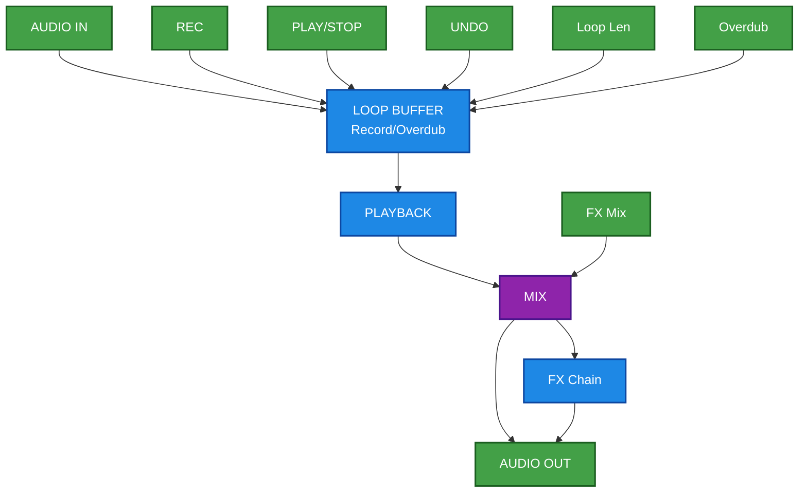

---

## 6) Granular / Texture Generator

Granular concept: sample input -> grains -> spread -> FX.

### ASCII source (concept)

```text
Audio In / Sample -> Grain Engine -> Stereo Spread -> FX -> Out
Controls: density, size, pitch, freeze
LFO/ENV -> grain pitch/position
```

### Mermaid — Minimal Stable Render


### Mermaid — Full Colored Diagram

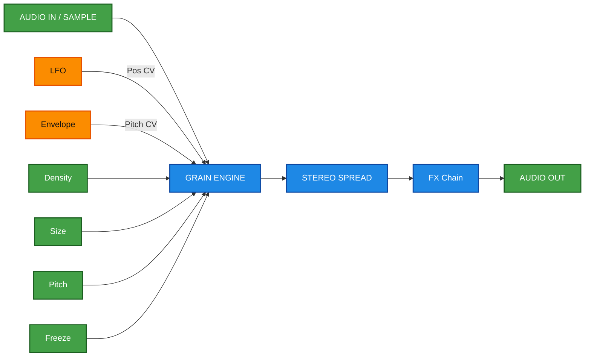

---

## 7) Multi-Tap Delay Router (Feedback Matrix)

Delay network concept: taps + feedback routing.

### ASCII source (concept)

```text
Audio In -> Delay Tap 1 -> Tap 2 -> Tap 3 -> Mix -> Out
Feedback: taps routed back into earlier taps (matrix)
```

### Mermaid — Minimal Stable Render

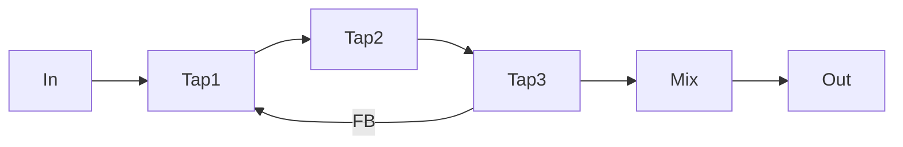

### Mermaid — Full Colored Diagram

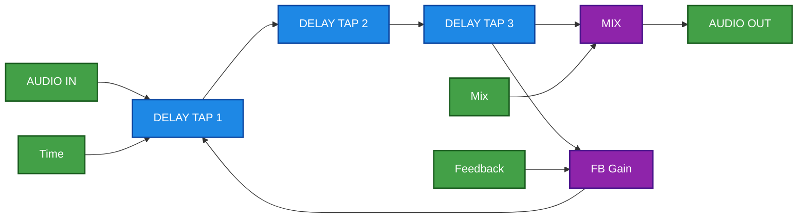

---

## 8) Drum Voice: Kick + Snare + Hat Mixer

Percussion concept: 3 voices -> mixer -> output.

### Mermaid — Minimal Stable Render

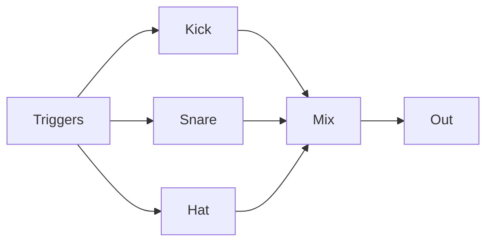

### Mermaid — Full Colored Diagram

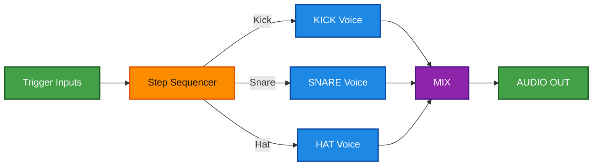

---

## 9) Voice + Mod Matrix (Semi-Modular)

Concept: one voice + modulation routing.

### Mermaid — Minimal Stable Render

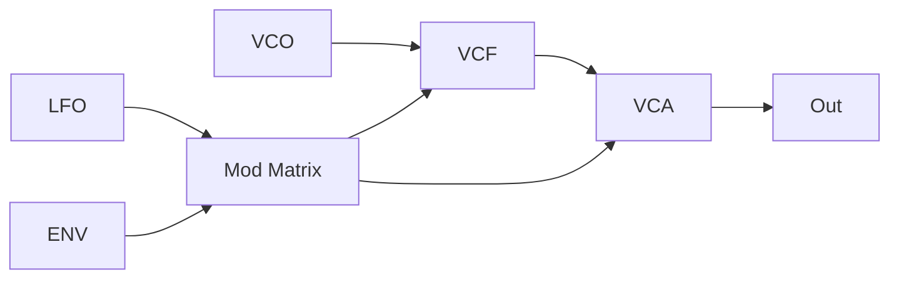

### Mermaid — Full Colored Diagram (with explicit mod routing)

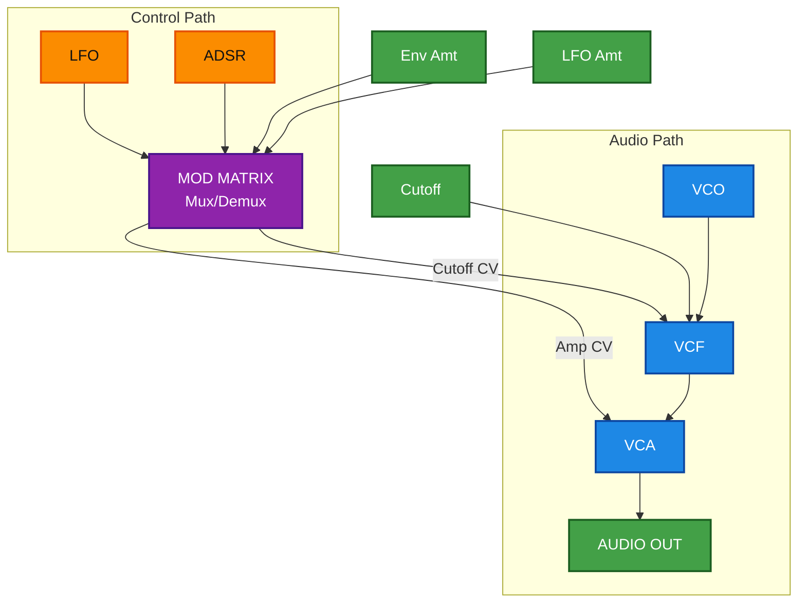

---

## 10) Full Performance Rack (Workstation)

Large concept: multiple sources + FX + routing + UI.

> [!warning]  
> Complex systems should be split into 2 diagrams. Below is an “overview” only.

### Mermaid — Minimal Stable Render

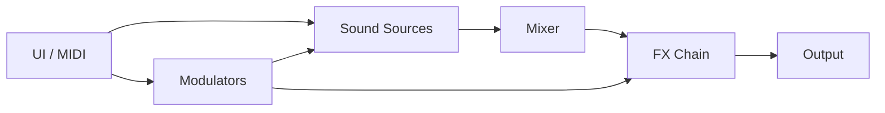

### Mermaid — Full Colored Diagram (overview)

```mermaid
flowchart TB
  UI["UI / MIDI / Keys"]:::ui

  SRC["Sources\n(VCO/Granular/Sampler)"]:::audio
  MIX["Mixer / Bus"]:::math
  FX["FX Chain\n(Delay/Reverb/Dist)"]:::audio
  OUT["Audio Out"]:::ui

  MOD["Modulators\n(LFO/ENV/SEQ)"]:::ctrl
  MAT["Routing / Matrix"]:::math

  UI --> SRC --> MIX --> FX --> OUT
  UI --> MOD --> MAT
  MAT --> SRC
  MAT --> FX

  classDef audio fill:#1E88E5,stroke:#0D47A1,stroke-width:2px,color:#ffffff;
  classDef ctrl  fill:#FB8C00,stroke:#E65100,stroke-width:2px,color:#111111;
  classDef ui    fill:#43A047,stroke:#1B5E20,stroke-width:2px,color:#ffffff;
  classDef math  fill:#8E24AA,stroke:#4A148C,stroke-width:2px,color:#ffffff;
```

---

## Debugging Checklist (Copy/Paste Ready)

> [!warning]  
> Use this sequence _exactly_ when Obsidian fails to render.

1. Ensure full Mermaid fence:
    
    - ` ```mermaid ` … ` ``` `
        
2. Remove styling:
    
    - delete `classDef`
        
    - remove `:::audio` etc.
        
3. Shorten labels:
    
    - remove punctuation
        
    - replace quotes
        
4. Comment out branches with `%%`
    
5. Re-add stepwise:
    
    - nodes/edges → subgraph → class tags → classDef
        

---

## Exercises (Do it yourself)

### Exercise A — Add a CV Mixer Block (violet)

Pick Entry #2 and insert:

- `SUM` (violet) combining LFO+ENV modulation into VCF cutoff
    

### Exercise B — Add bypass (violet)

Pick Entry #4 and add:

- `MUX` bypass for distortion and filter
    
- switch control from UI (green)
    

### Exercise C — Split workstation into 2 diagrams

Take Entry #10 and create:

1. “Audio Engine” only
    
2. “Control + Routing” only  
    Use cross-links to jump between them.
    

---

## Next improvements

- Convert **every concept** from `field_concepts_OPUS_1-3.md` into a numbered entry with:
    
    - ASCII → minimal → colored versions.
        
- Add a “layout anchors toolkit” section with reusable:
    
    - `ROW1/ROW2` invisible aligners
        
    - “bus” nodes for audio/control separation
        
- Create a dedicated style note:
    
    - `[[Mermaid Style Guide (Synth Diagrams)]]` with enforced node naming patterns:
        
        - `A_*` for audio
            
        - `C_*` for control
            
        - `U_*` for UI
            
        - `M_*` for math/routing
            

```

---

## Next improvements (optional fast follow-up)
If you want, I can also generate a **third note**: `Mermaid Style Guide (Synth Diagrams)` containing:
- the full color palette (as stable Obsidian-friendly classDefs)
- standardized node naming conventions
- reusable “macro” blocks (Legend subgraph, bypass block, mod-matrix block, FX chain block)
```