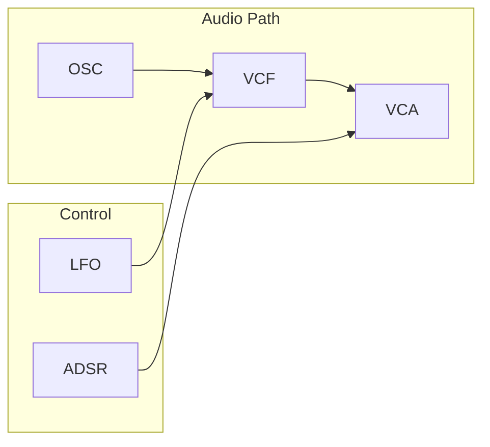
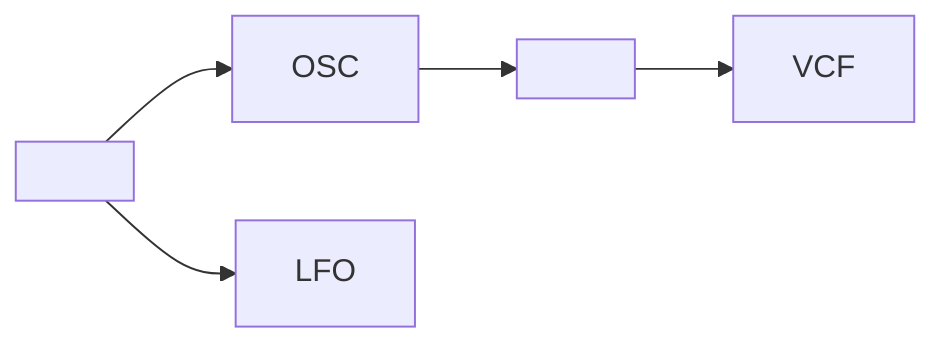
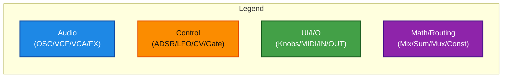
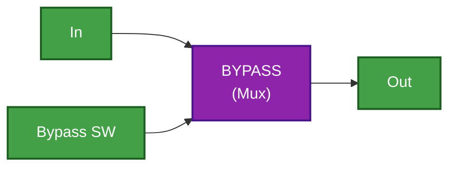
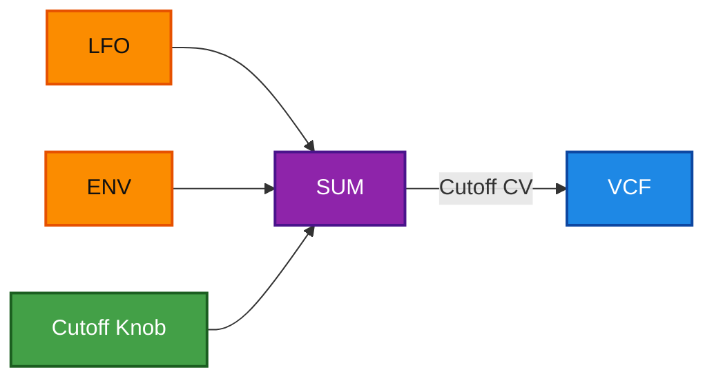
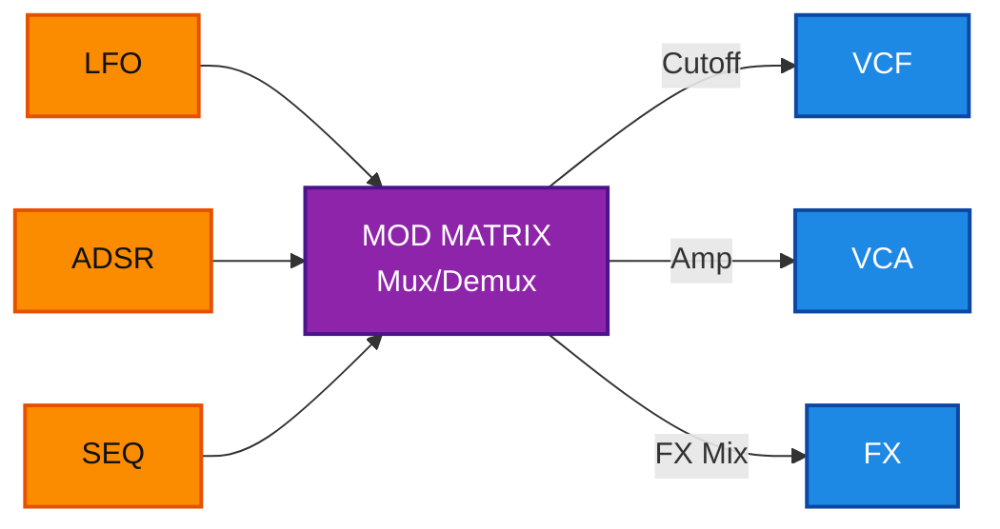
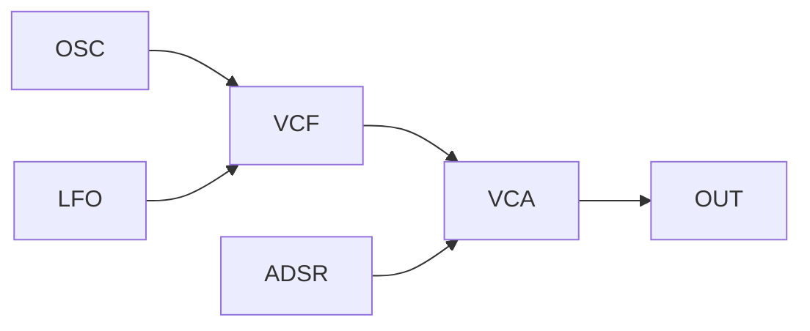

````markdown
---
title: "Mermaid Style Guide (Synth Diagrams): Obsidian-First, Color-Coded Blocks"
tags: [obsidian, mermaid, styleguide, synth, diagrams, daisy]
created: 2026-01-11
aliases: ["Mermaid Synth Style Guide", "Synth Mermaid House Style", "Diagram Style Guide"]
version: "v1.0"
source: "field_concepts_OPUS_1-3.md"
purpose: "Define a stable Mermaid house style for synth/effects block diagrams in Obsidian: color code, node naming, layout patterns, and reusable macros."
---

# Mermaid Style Guide (Synth Diagrams): Obsidian-First, Color-Coded Blocks

> [!note]
> This style guide is designed to make the concepts in `field_concepts_OPUS_1-3.md` more engaging and visually consistent across your vault. :contentReference[oaicite:0]{index=0}

# Contents
- [[#House rules (Non-negotiable)|House rules (Non-negotiable)]]
- [[#Color system (Class definitions)|Color system (Class definitions)]]
- [[#Node naming conventions (Stable IDs)|Node naming conventions (Stable IDs)]]
- [[#Block labeling rules (Readable labels)|Block labeling rules (Readable labels)]]
- [[#Positioning and layout control (Practical patterns)|Positioning and layout control (Practical patterns)]]
- [[#Reusable macros (Copy-paste blocks)|Reusable macros (Copy-paste blocks)]]
- [[#Recommended diagram patterns for synth projects|Recommended diagram patterns for synth projects]]
- [[#Compatibility fallback (When colors break)|Compatibility fallback (When colors break)]]
- [[#Acceptance tests (Paste-ready checklist)|Acceptance tests (Paste-ready checklist)]]
- [[#Next improvements|Next improvements]]

---

## House rules (Non-negotiable)

1) **One diagram = one main story**
   - If the graph has > ~20 nodes OR many cross-links, split it:
     - Diagram A: Audio path
     - Diagram B: Control + routing

2) **Always start with a minimal stable render**
   - No `subgraph`
   - No styling
   - Short labels
   - Verify it renders in Obsidian

3) **Add grouping (subgraph), then styling last**
   - Order:
     1) nodes + edges
     2) subgraph containers
     3) class tags (`:::audio`)
     4) `classDef` block

4) **Preserve semantic meaning of signal types**
   - Audio signals (audio-rate IO) → **blue**
   - Control signals (CV, ADSR, LFO, Gate, Trigger) → **orange**
   - UI / external interfaces (knobs, MIDI, audio I/O) → **green**
   - Math/routing (mixers, sum, mux/demux, constants, bypass) → **violet**

---

## Color system (Class definitions)

> [!warning]
> Some Obsidian Mermaid renderers may choke on styling. If anything breaks, remove `classDef` lines first, then remove the `:::class` tags.

### Standard palette (recommended)
```mermaid
flowchart LR
  %% Example nodes just to show the palette
  A["Audio"]:::audio
  C["Control"]:::ctrl
  U["UI / I/O"]:::ui
  M["Math / Routing"]:::math

  classDef audio fill:#1E88E5,stroke:#0D47A1,stroke-width:2px,color:#ffffff;
  classDef ctrl  fill:#FB8C00,stroke:#E65100,stroke-width:2px,color:#111111;
  classDef ui    fill:#43A047,stroke:#1B5E20,stroke-width:2px,color:#ffffff;
  classDef math  fill:#8E24AA,stroke:#4A148C,stroke-width:2px,color:#ffffff;
````

### Optional “lighter contrast” variant (use only if you prefer)

```mermaid
flowchart LR
  A["Audio"]:::audio
  C["Control"]:::ctrl
  U["UI / I/O"]:::ui
  M["Math / Routing"]:::math

  classDef audio fill:#42A5F5,stroke:#1565C0,stroke-width:2px,color:#0b0b0b;
  classDef ctrl  fill:#FFB74D,stroke:#EF6C00,stroke-width:2px,color:#0b0b0b;
  classDef ui    fill:#66BB6A,stroke:#2E7D32,stroke-width:2px,color:#0b0b0b;
  classDef math  fill:#BA68C8,stroke:#6A1B9A,stroke-width:2px,color:#0b0b0b;
```

---

## Node naming conventions (Stable IDs)

Mermaid distinguishes:

- **Node ID** (internal, must be “safe”)
    
- **Node label** (display text)
    

### House standard: Prefix by category

Use stable, searchable IDs:

- **Audio blocks (blue)**: `A_*`
    
    - `A_OSC1`, `A_VCF`, `A_VCA`, `A_DLY`, `A_RVB`, `A_DIST`, `A_SAMPLER`
        
- **Control blocks (orange)**: `C_*`
    
    - `C_ADSR1`, `C_LFO1`, `C_GATE`, `C_TRIG`, `C_SEQ`
        
- **UI / I/O blocks (green)**: `U_*`
    
    - `U_MIDI`, `U_KNOB1`, `U_BTN1`, `U_AUDIO_IN`, `U_AUDIO_OUT`
        
- **Math / routing blocks (violet)**: `M_*`
    
    - `M_MIX`, `M_SUM`, `M_MUL`, `M_MUX`, `M_DEMUX`, `M_CONST1`, `M_BYP1`
        

> [!tip]  
> Keep IDs:
> 
> - uppercase with underscores
>     
> - no spaces
>     
> - no punctuation  
>     This prevents subtle renderer failures and makes diffs readable.
>     

---

## Block labeling rules (Readable labels)

### Labels: short, informative, consistent

- Prefer 1–2 words + optional newline:
    
    - `"SVF\nVCF"`
        
    - `"Delay\nTime/FB/Mix"`
        
    - `"ADSR\nAmp Env"`
        
- Avoid:
    
    - long sentences
        
    - heavy punctuation
        
    - nested quotes
        

### Always separate “concept name” from “implementation”

If relevant, show:

- line 1: concept (`VCF`)
    
- line 2: implementation (`daisysp::Svf`)
    

Example label:

- `["VCF\n(daisysp::Svf)"]`
    

---

## Positioning and layout control (Practical patterns)

Mermaid is auto-layout; “positioning” is achieved by constraints.

### Pattern 1 — Choose orientation intentionally

- Use `flowchart LR` for compact architecture overviews
    
- Use `flowchart TD` for pipeline/process or step-based flows
    

### Pattern 2 — Declare the main audio chain first (the “spine rule”)

Write the audio path as one contiguous chain:


Then add modulation edges afterward.

### Pattern 3 — Use `subgraph` containers to enforce clustering



### Pattern 4 — Use “bus nodes” to reduce cross-link chaos

Instead of many edges into a block, feed through a bus (violet):

- `M_CUTOFF_BUS` gathers multiple cutoff sources
    
- `M_AMP_BUS` gathers multiple amp sources
    

### Pattern 5 — “Anchor nodes” to force row/column feel

If you need consistent alignment, create anchor nodes:

- `X_ROW1`, `X_ROW2`  
    Connect blocks through them to keep ordering stable.
    

Example (conceptual):



> [!warning]  
> Some renderers display the blank anchor node. If so, label it `["·"]` or keep it very small text.

### Pattern 6 — Split diagrams when modulation dominates

When the control network is dense (matrix routing, sequencers):

- Diagram 1: audio chain only
    
- Diagram 2: modulation matrix only  
    Link them with Obsidian links:
    
- `[[Project Note#Audio Path]]`
    
- `[[Project Note#Mod Matrix]]`
    

---

## Reusable macros (Copy-paste blocks)

### Macro A — Legend (inline)



### Macro B — Bypass block (violet routing)



### Macro C — Cutoff modulation bus (clean injection)



### Macro D — FX chain skeleton


### Macro E — Mod Matrix (routing hub)



---

## Recommended diagram patterns for synth projects

Based on your concept set (synth voices, FX, modular routing), use these “standard diagrams” repeatedly.

### Pattern S1 — Voice diagram (classic subtractive)

- `U_MIDI → M_CV2F → A_OSC → M_MIX → A_VCF → A_VCA → U_OUT`
    
- `C_ADSR → A_VCA`
    
- `C_LFO → A_VCF`
    

### Pattern S2 — FX unit diagram (input → chain → safety → output)

- `U_AUDIO_IN → A_FX_CHAIN → A_DC_BLOCK → A_LIMITER → U_AUDIO_OUT`
    
- UI knobs connect into FX blocks
    

### Pattern S3 — Instrument diagram (performance workstation)

Split into 2 diagrams:

1. Audio engine overview
    
2. Modulation/routing overview
    

---

## Compatibility fallback (When colors break)

If Obsidian fails to render when colors are enabled:

### Step-down fallback strategy

1. Remove `classDef` lines (keep `:::audio` tags)
    
2. If still broken, remove `:::audio` tags (unstyled)
    
3. Replace long labels with short ones
    
4. Remove `subgraph` temporarily
    
5. Restore features stepwise
    

### Minimal “always safe” snippet



---

## Acceptance tests (Paste-ready checklist)

Use this checklist before committing a diagram to your vault:

-  Diagram renders in Obsidian Reading View
    
-  All code fences are closed
    
-  Exactly one H1 per note
    
-  Main audio chain is readable as a single “spine”
    
-  Control lines are injected after the audio chain
    
-  Color classes match semantics (audio/control/ui/math)
    
-  If diagram is large, split into Audio vs Control diagrams
    
-  Diagram has a legend (inline or referenced)
    

---

## Next improvements

- Add a “house style index” note:
    
    - `[[Synth Diagram Patterns Index]]` linking to patterns (S1/S2/S3) + macro library.
        
- Convert the most important entries in `field_concepts_OPUS_1-3.md` into standardized “architecture cards”:
    
    - concept summary
        
    - diagram
        
    - controls table
        
    - implementation mapping (DaisySP classes)
        
- Build a “diagram lint” checklist for Mermaid:
    
    - label length limits
        
    - max edges per node (suggestion thresholds)
        
    - recommended splits when density is high