# Daisy Field Project Ideas
*Generated from literature research - Complexity 5-10/10*
*Revised: CV/Gate controls replaced with Daisy Field-appropriate interfaces*

---

## Project 1: Quantized Pitch Arpeggiator (Complexity: 5/10)

### Description
A simple step sequencer that takes incoming MIDI notes and arpeggiates them through user-defined patterns. Based on discrete MIDI note sequencing methods from "Sound and Music Projects for Eurorack."

### Controls Mapping
| Control | Function |
|---------|----------|
| Keyboard | Input notes to arpeggiate |
| Knob 1 | Tempo (BPM) |
| Knob 2 | Pattern selection (Up, Down, Up-Down, Random) |
| Knob 3 | Octave range (1-4) |
| Knob 4 | Gate length |
| Knob 5 | Note duration |
| Button 1 | Hold/Latch notes |
| Button 2 | Reset sequence |
| MIDI In | External note input |
| MIDI Out | Arpeggiated sequence output |

### Block Diagram
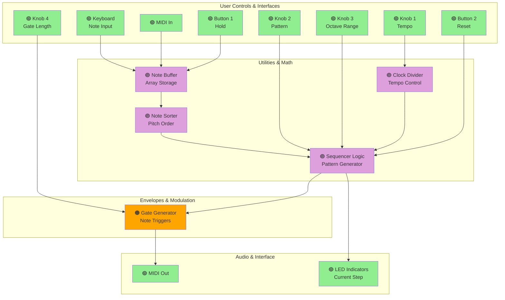

---

## Project 2: Wave Sequencing Synthesizer (Complexity: 6/10)

### Description
Multi-lane wave sequencing synthesizer inspired by Korg Wavestate, implementing concepts from "Designing Software Synthesizer Plugins in C++." Each lane can have different waveforms sequenced independently.

### Controls Mapping
| Control | Function |
|---------|----------|
| Keyboard | Pitch control |
| Knob 1 | Lane 1 wave select |
| Knob 2 | Lane 2 wave select |
| Knob 3 | Lane 3 wave select |
| Knob 4 | Sequence speed |
| Knob 5 | Filter cutoff |
| Knob 6 | Filter resonance |
| Knob 7 | Lane mix |
| Knob 8 | Master volume |
| MIDI CC 1 | Sequence speed modulation |
| MIDI CC 2 | Filter cutoff modulation |

### Block Diagram
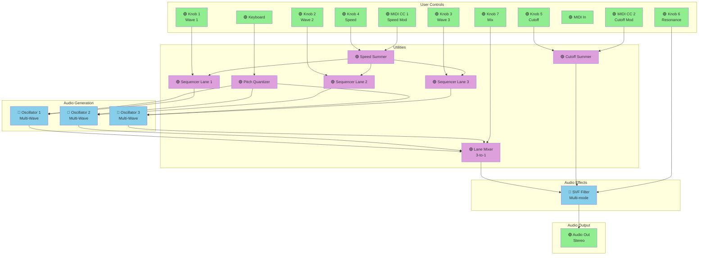

---

## Project 3: Harmonizer Effect (Complexity: 5/10)

### Description
Real-time pitch harmonizer creating parallel harmony voices at musical intervals (thirds, fifths). Based on DAFX Digital Audio Effects techniques.

### Controls Mapping
| Control | Function |
|---------|----------|
| Audio In | Input signal |
| Knob 1 | Voice 1 interval (semitones) |
| Knob 2 | Voice 2 interval (semitones) |
| Knob 3 | Voice 3 interval (semitones) |
| Knob 4 | Dry/Wet mix |
| Knob 5 | Voice 1 level |
| Knob 6 | Voice 2 level |
| Knob 7 | Voice 3 level |
| Knob 8 | Key/Scale selection |
| Toggle | Bypass |

### Block Diagram
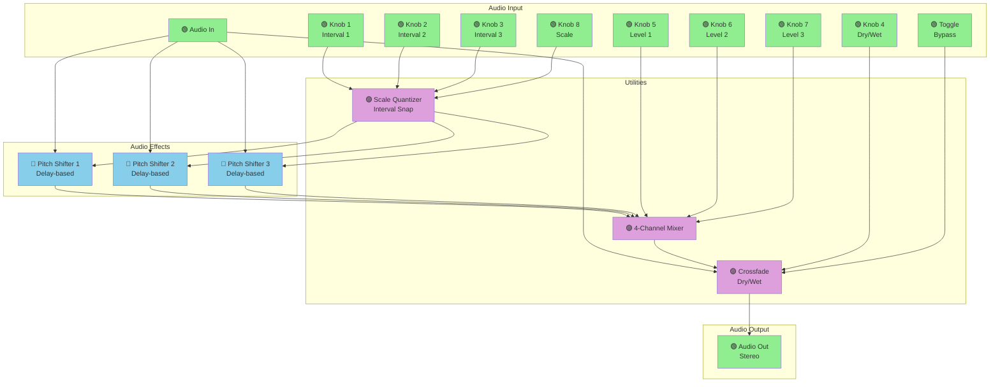

---

## Project 4: MIDI-Controlled Polyphonic Synthesizer (Complexity: 7/10)

### Description
6-voice polyphonic synthesizer with MIDI control over pitch, filter, and amplitude. Implements voice allocation and envelope generation per voice.

### Controls Mapping
| Control | Function |
|---------|----------|
| Keyboard | Polyphonic note input |
| Knob 1 | Filter cutoff |
| Knob 2 | Filter resonance |
| Knob 3 | Attack time |
| Knob 4 | Decay time |
| Knob 5 | Sustain level |
| Knob 6 | Release time |
| Knob 7 | Oscillator detune |
| Knob 8 | Master volume |
| MIDI CC 1 | Filter cutoff modulation |
| MIDI CC 2 | Resonance modulation |
| MIDI CC 74 | Filter envelope amount |
| MIDI Velocity | VCA dynamics |

### Block Diagram
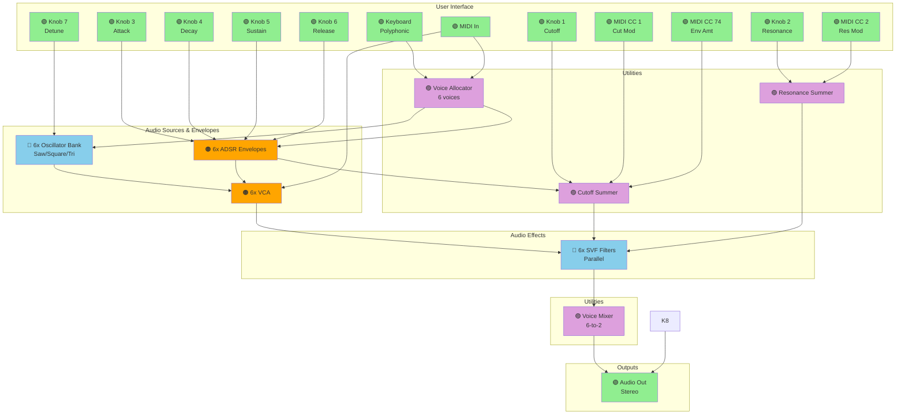

---

## Project 5: Markov Chain Melody Generator (Complexity: 8/10)

### Description
AI-enhanced melodic sequence generator using Markov models for probabilistic note generation. Based on "Build AI-Enhanced Audio Plugins with C++."

### Controls Mapping
| Control | Function |
|---------|----------|
| Keyboard | Train Markov model |
| Knob 1 | Randomness/Temperature |
| Knob 2 | Note density |
| Knob 3 | Scale root |
| Knob 4 | Scale type |
| Knob 5 | Octave range |
| Knob 6 | Rhythm variation |
| Knob 7 | Sequence length |
| Knob 8 | Tempo |
| Button 1 | Record pattern |
| Button 2 | Generate/Play |
| MIDI In | Pattern training input |
| MIDI Out | Generated melody |

### Block Diagram
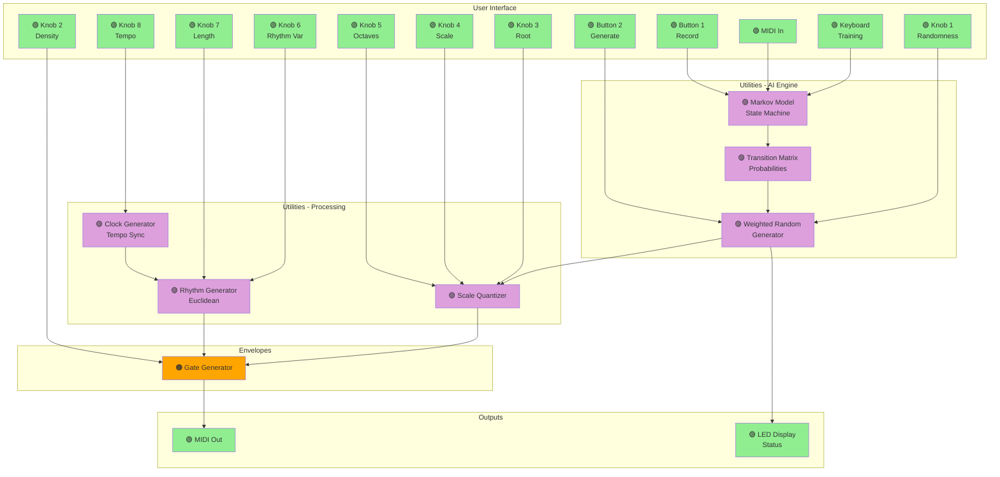

---

## Project 6: Granular Sampler with LFO Modulation (Complexity: 8/10)

### Description
Real-time granular synthesis engine with SD card sample loading and extensive internal LFO modulation capabilities.

### Controls Mapping
| Control | Function |
|---------|----------|
| Keyboard | Pitch/playback speed |
| Knob 1 | Grain size |
| Knob 2 | Grain density |
| Knob 3 | Grain position |
| Knob 4 | Grain pitch shift |
| Knob 5 | Grain envelope shape |
| Knob 6 | Spray/randomness |
| Knob 7 | Filter cutoff |
| Knob 8 | Dry/wet mix |
| Button 1 | Load previous sample / Trigger grain |
| Button 2 | Load next sample |
| Toggle | LFO modulation routing |

### Block Diagram
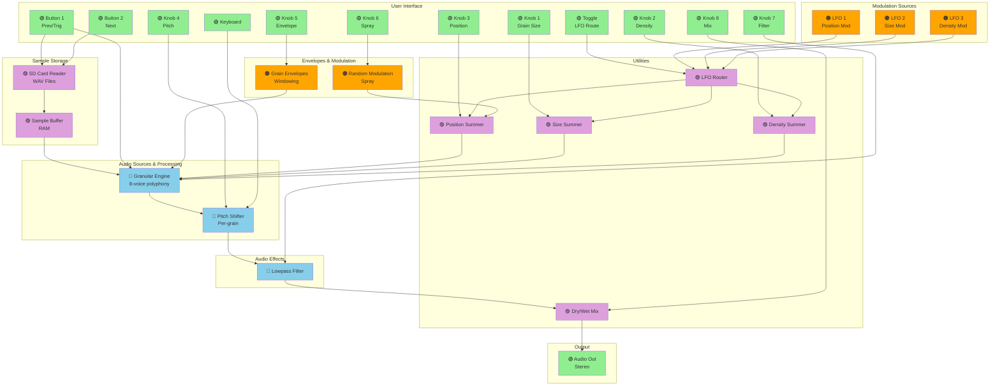

---

## Project 7: Euclidean Rhythm Synthesizer (Complexity: 6/10)

### Description
Percussion synthesizer with Euclidean rhythm generation for up to 4 voices. Each voice has its own synthesis engine and rhythm pattern. MIDI output for external sync.

### Controls Mapping
| Control | Function |
|---------|----------|
| Knob 1 | Voice 1 steps |
| Knob 2 | Voice 1 hits |
| Knob 3 | Voice 2 steps |
| Knob 4 | Voice 2 hits |
| Knob 5 | Voice 3 steps |
| Knob 6 | Voice 3 hits |
| Knob 7 | Voice 4 steps |
| Knob 8 | Voice 4 hits |
| MIDI CC 1 | Master tempo modulation |
| Button 1 | Start/Stop / Pattern rotation trigger |
| Button 2 | Reset all patterns |
| MIDI Out | Clock output (24 PPQN) |

### Block Diagram
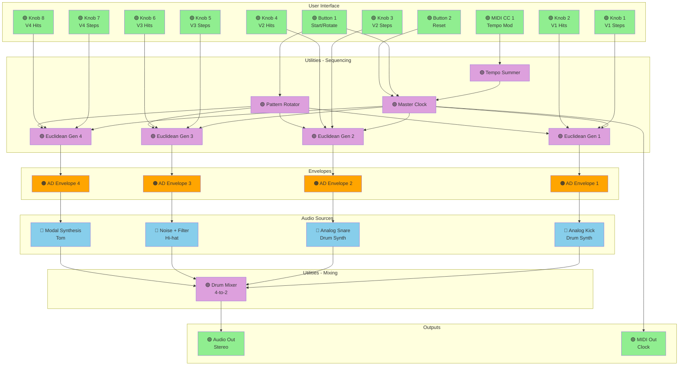

---

## Project 8: Multi-FX Processor with Preset Management (Complexity: 7/10)

### Description
Chain-able multi-effects processor with 8 effect slots and preset save/recall via SD card.

### Controls Mapping
| Control | Function |
|---------|----------|
| Knob 1 | Effect 1 parameter |
| Knob 2 | Effect 2 parameter |
| Knob 3 | Effect 3 parameter |
| Knob 4 | Effect 4 parameter |
| Knob 5 | Effect 5 parameter |
| Knob 6 | Effect 6 parameter |
| Knob 7 | Effect 7 parameter |
| Knob 8 | Effect 8 parameter |
| Keyboard | Effect selection per slot |
| Button 1 | Save preset |
| Button 2 | Load preset |
| Toggle | Bypass all |

### Block Diagram
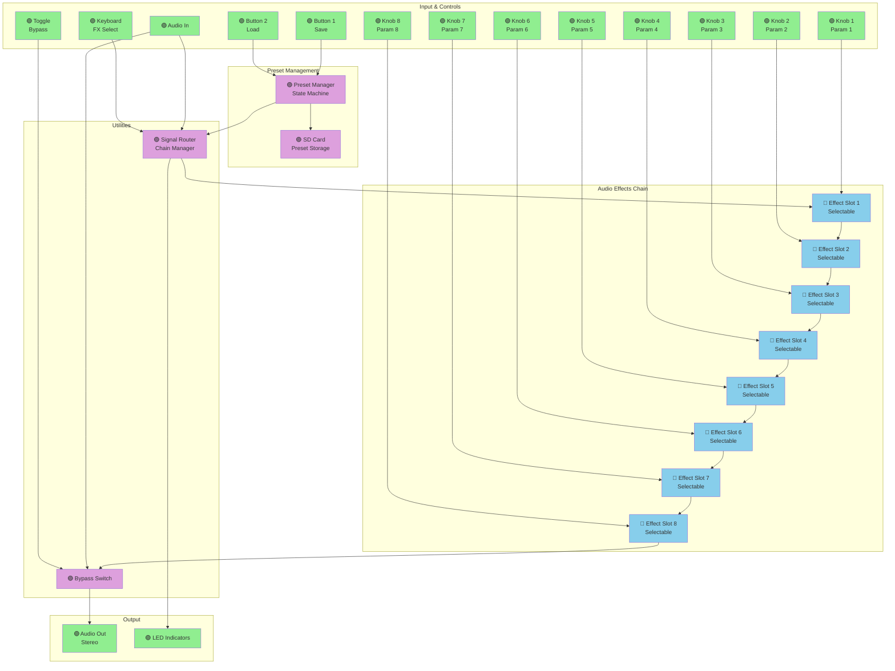

---

## Project 9: Modal Resonator Bank (Complexity: 6/10)

### Description
Physical modeling synthesizer using modal synthesis to simulate resonant materials (metal, wood, glass). Based on modal voice techniques with internal LFO modulation.

### Controls Mapping
| Control | Function |
|---------|----------|
| Keyboard | Strike/excitation trigger + pitch |
| Knob 1 | Material selection |
| Knob 2 | Brightness/harmonic content |
| Knob 3 | Damping/decay time |
| Knob 4 | Structure/geometry |
| Knob 5 | Accent/strike hardness |
| Knob 6 | Resonator mix |
| Knob 7 | Reverb amount |
| Knob 8 | Master volume |
| Toggle | LFO modulation on/off |

### Block Diagram
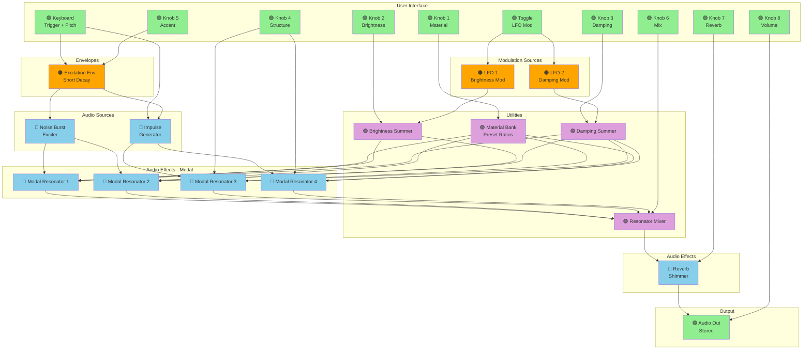

---

## Project 10: MIDI Sequence Recorder and Looper (Complexity: 7/10)

### Description
4-track MIDI sequence recorder/looper with quantization and playback speed control. Can record keyboard, knobs, and external MIDI.

### Controls Mapping
| Control | Function |
|---------|----------|
| Keyboard | MIDI input source 1 |
| Knob 1 | Track 1 transpose |
| Knob 2 | Track 2 transpose |
| Knob 3 | Track 3 transpose |
| Knob 4 | Track 4 transpose |
| Knob 5 | Playback speed (all tracks) |
| Knob 6 | Quantization amount |
| Knob 7 | Loop length |
| Knob 8 | Track select (1-4) |
| MIDI In | External MIDI inputs |
| MIDI Out | Playback outputs |
| Button 1 | Rec/Overdub |
| Button 2 | Clear selected track |

### Block Diagram
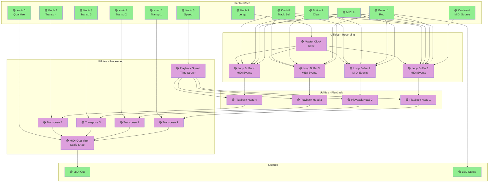

---

## Project 11: West Coast Style Synthesizer (Complexity: 8/10)

### Description
Complex modulation synthesizer with wavefolding, FM, and low-pass gate. Inspired by Buchla synthesizers and west coast synthesis philosophy. Uses internal modulation routing.

### Controls Mapping
| Control | Function |
|---------|----------|
| Keyboard | Base pitch + trigger |
| Knob 1 | Oscillator 1 waveform |
| Knob 2 | Oscillator 2 waveform |
| Knob 3 | FM amount (Osc 2 -> Osc 1) |
| Knob 4 | Wavefolder depth |
| Knob 5 | LPG resonance |
| Knob 6 | Envelope attack |
| Knob 7 | Envelope decay |
| Knob 8 | LFO rate |
| Toggle | LFO routing (FM/Fold/LPG) |
| Button 1 | Retrigger envelope |

### Block Diagram
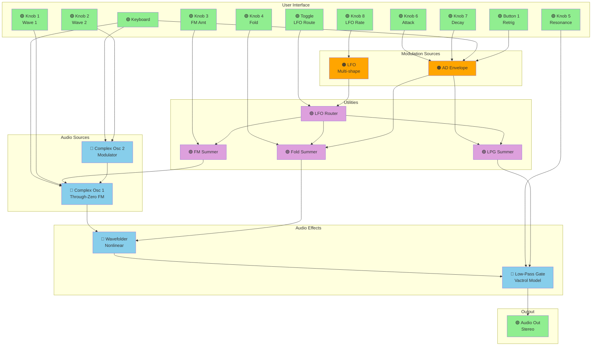

---

## Project 12: Probabilistic Step Sequencer (Complexity: 9/10)

### Description
Advanced 16-step sequencer with per-step probability, ratcheting, slides, and multiple simultaneous sequences. Inspired by modern Eurorack sequencers. MIDI-based control and output.

### Controls Mapping
| Control | Function |
|---------|----------|
| Keyboard | Step selection (12 keys) + note input |
| Knob 1 | Pitch (selected step) |
| Knob 2 | Probability (selected step) |
| Knob 3 | Ratchet count (selected step) |
| Knob 4 | Slide time (selected step) |
| Knob 5 | Master tempo |
| Knob 6 | Sequence length (1-16) |
| Knob 7 | Swing amount |
| Knob 8 | Gate length |
| MIDI CC 1 | Tempo modulation |
| MIDI CC 2 | Probability bias |
| Button 1 | Play/Stop |
| Button 2 | Reset sequence |
| MIDI Out | Sequence output |

### Block Diagram
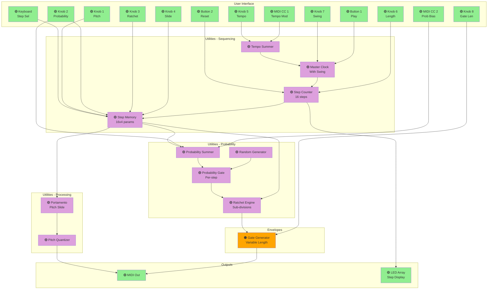

---

## Project 13: Spectral Freezer and Processor (Complexity: 9/10)

### Description
FFT-based spectral effect that can freeze, scramble, and process the frequency spectrum of incoming audio. Advanced DSP project with LFO modulation.

### Controls Mapping
| Control | Function |
|---------|----------|
| Audio In | Input signal |
| Knob 1 | Freeze amount (blend) |
| Knob 2 | Spectral shift (pitch) |
| Knob 3 | Bin scramble amount |
| Knob 4 | Formant preservation |
| Knob 5 | Spectral blur |
| Knob 6 | Freeze decay time |
| Knob 7 | Dry/wet mix |
| Knob 8 | Output gain |
| Button 1 | Capture spectrum |
| Button 2 | Clear freeze buffer |
| Toggle | Freeze on/off |
| MIDI CC 1 | Spectral shift modulation |

### Block Diagram
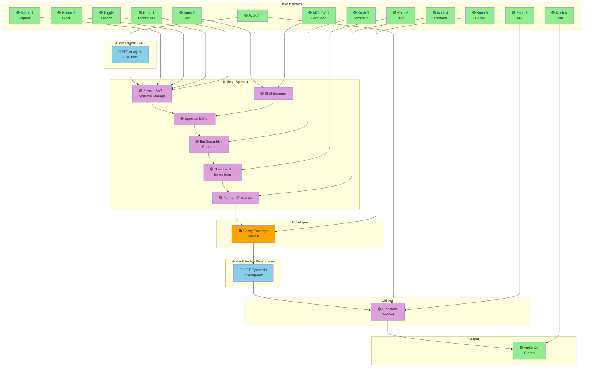

---

## Project 14: Quad Envelope Follower and VCA (Complexity: 6/10)

### Description
Four-channel envelope follower with individual VCA controls. Perfect for sidechain compression, ducking, and dynamic processing chains. Uses audio input for external sidechain.

### Controls Mapping
| Control | Function |
|---------|----------|
| Audio In L | Channel 1 & 2 input |
| Audio In R | Channel 3 & 4 input (or sidechain) |
| Knob 1 | Ch1 attack time |
| Knob 2 | Ch1 release time |
| Knob 3 | Ch2 attack time |
| Knob 4 | Ch2 release time |
| Knob 5 | Ch3 attack time |
| Knob 6 | Ch3 release time |
| Knob 7 | Ch4 attack time |
| Knob 8 | Ch4 release time |
| Toggle | External sidechain mode |
| MIDI Out | Envelope follower outputs (MIDI CC) |

### Block Diagram
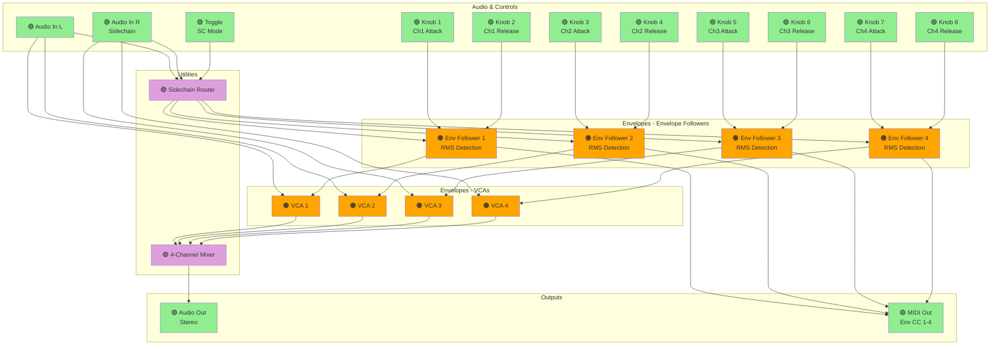

---

## Project 15: Hybrid Analog/Digital Synthesizer Voice (Complexity: 10/10)

### Description
Full-featured synthesizer voice combining digital oscillators with analog-style filters, dual LFOs, dual envelopes, modulation matrix, and extensive MIDI integration. Professional-level complexity.

### Controls Mapping
| Control | Function |
|---------|----------|
| Keyboard | Note input (mono priority) |
| Knob 1 | Osc 1 waveform + PWM |
| Knob 2 | Osc 2 waveform + detune |
| Knob 3 | Oscillator mix |
| Knob 4 | Filter cutoff |
| Knob 5 | Filter resonance |
| Knob 6 | Envelope 1 amount (filter) |
| Knob 7 | LFO 1 rate |
| Knob 8 | Master output level |
| MIDI In | Note + velocity + CC control |
| MIDI CC 1 | Pitch modulation |
| MIDI CC 2 | Filter cutoff modulation |
| MIDI CC 3 | PWM modulation |
| MIDI CC 74 | Filter brightness |
| Toggle | Modulation routing mode |
| Button 1 | Retrigger envelopes |

### Block Diagram
```mermaid
graph TB
    subgraph Input["User Interface"]
        KB["🟢 Keyboard<br/>Mono"]
        MIDI["🟢 MIDI In"]
        K1["🟢 Knob 1<br/>Osc1 Wave"]
        K2["🟢 Knob 2<br/>Osc2 Det"]
        K3["🟢 Knob 3<br/>Mix"]
        K4["🟢 Knob 4<br/>Cutoff"]
        K5["🟢 Knob 5<br/>Res"]
        K6["🟢 Knob 6<br/>Env Amt"]
        K7["🟢 Knob 7<br/>LFO Rate"]
        K8["🟢 Knob 8<br/>Level"]
        CC1["🟢 MIDI CC 1<br/>Pitch Mod"]
        CC2["🟢 MIDI CC 2<br/>Cut Mod"]
        CC3["🟢 MIDI CC 3<br/>PWM Mod"]
        CC74["🟢 MIDI CC 74<br/>Brightness"]
        TOG["🟢 Toggle<br/>Mod Route"]
        B1["🟢 Button 1<br/>Retrig"]
    end

    subgraph PitchProc["Utilities - Pitch"]
        PITCHSUM["🟣 Pitch Summer"]
        GLIDE["🟣 Portamento"]
    end

    subgraph Oscillators["Audio Sources"]
        OSC1["🔵 Digital Osc 1<br/>Multi-wave + PWM"]
        OSC2["🔵 Digital Osc 2<br/>Multi-wave + Sync"]
        NOISE["🔵 Noise Generator<br/>White/Pink"]
    end

    subgraph Modulation["Modulation Sources"]
        LFO1["🟠 LFO 1<br/>Multi-shape"]
        LFO2["🟠 LFO 2<br/>Multi-shape"]
        ENV1["🟠 ADSR 1<br/>Filter Env"]
        ENV2["🟠 ADSR 2<br/>Amp Env"]
    end

    subgraph ModMatrix["Utilities - Mod Matrix"]
        MATRIX["🟣 Modulation Matrix<br/>4x8 routing"]
        PWMSUM["🟣 PWM Summer"]
        CUTSUM["🟣 Cutoff Summer"]
    end

    subgraph Mixer["Utilities - Mixing"]
        OSCMIX["🟣 Oscillator Mixer<br/>3-channel"]
    end

    subgraph Filter["Audio Effects - Filter"]
        FILT["🔵 SVF Filter<br/>4-pole ladder"]
    end

    subgraph VCA["Envelopes - VCA"]
        VCA["🟠 VCA<br/>Exponential"]
    end

    subgraph Output["Outputs"]
        AOUT["🟢 Audio Out<br/>Stereo"]
    end

    KB --> PITCHSUM
    MIDI --> PITCHSUM
    CC1 --> PITCHSUM
    PITCHSUM --> GLIDE
    GLIDE --> OSC1
    GLIDE --> OSC2
    K1 --> OSC1
    K2 --> OSC2
    CC3 --> PWMSUM
    K1 --> PWMSUM
    K7 --> LFO1
    LFO1 --> MATRIX
    LFO2 --> MATRIX
    ENV1 --> MATRIX
    TOG --> MATRIX
    MATRIX --> PWMSUM
    PWMSUM --> OSC1
    OSC1 --> OSCMIX
    OSC2 --> OSCMIX
    NOISE --> OSCMIX
    K3 --> OSCMIX
    OSCMIX --> FILT
    K4 --> CUTSUM
    CC2 --> CUTSUM
    CC74 --> CUTSUM
    K6 --> CUTSUM
    ENV1 --> CUTSUM
    MATRIX --> CUTSUM
    CUTSUM --> FILT
    K5 --> FILT
    KB --> ENV1
    MIDI --> ENV1
    B1 --> ENV1
    KB --> ENV2
    MIDI --> ENV2
    B1 --> ENV2
    FILT --> VCA
    ENV2 --> VCA
    VCA --> AOUT
    K8 --> AOUT

    style KB fill:#90EE90
    style MIDI fill:#90EE90
    style K1 fill:#90EE90
    style K2 fill:#90EE90
    style K3 fill:#90EE90
    style K4 fill:#90EE90
    style K5 fill:#90EE90
    style K6 fill:#90EE90
    style K7 fill:#90EE90
    style K8 fill:#90EE90
    style CC1 fill:#90EE90
    style CC2 fill:#90EE90
    style CC3 fill:#90EE90
    style CC74 fill:#90EE90
    style TOG fill:#90EE90
    style B1 fill:#90EE90
    style PITCHSUM fill:#DDA0DD
    style GLIDE fill:#DDA0DD
    style OSC1 fill:#87CEEB
    style OSC2 fill:#87CEEB
    style NOISE fill:#87CEEB
    style LFO1 fill:#FFA500
    style LFO2 fill:#FFA500
    style ENV1 fill:#FFA500
    style ENV2 fill:#FFA500
    style MATRIX fill:#DDA0DD
    style PWMSUM fill:#DDA0DD
    style CUTSUM fill:#DDA0DD
    style OSCMIX fill:#DDA0DD
    style FILT fill:#87CEEB
    style VCA fill:#FFA500
    style AOUT fill:#90EE90
```

---

*End of Daisy Field Project Ideas*
*All projects revised to use MIDI CC, buttons, toggle, and internal modulation instead of CV/Gate*
