# Daisy Field Project Ideas (Complexity 5-10)

Generated based on DSP literature and the DVPE Module Catalog.
**Date**: 2026-02-08

## Color Coding Reference
- <span style="color:#2980b9">**Blue**</span>: Audio Signal (Sources, Effects, Filters)
- <span style="color:#e67e22">**Orange**</span>: Control Signals (Envelopes, LFOs, Modulation)
- <span style="color:#8e44ad">**Violet**</span>: Math & Utility (Mixers, Logic)
- <span style="color:#27ae60">**Green**</span>: User I/O (Hardware Controls)

---

## 1. Spectral Freeze & Glitch Texture
**Complexity**: 8/10  
**Description**: Real-time granular freezing and spectral glitching of incoming audio. Based on granular synthesis concepts from *Microsound (Roads)*.  
**Controls**:
- **Knob 1**: Freeze Threshold
- **Knob 2**: Grain Size
- **Knob 3**: Pitch Shift
- **Knob 4**: Texture/Scatter
- **Knob 5**: Reverb Mix
- **Button 1**: Freeze Momentary

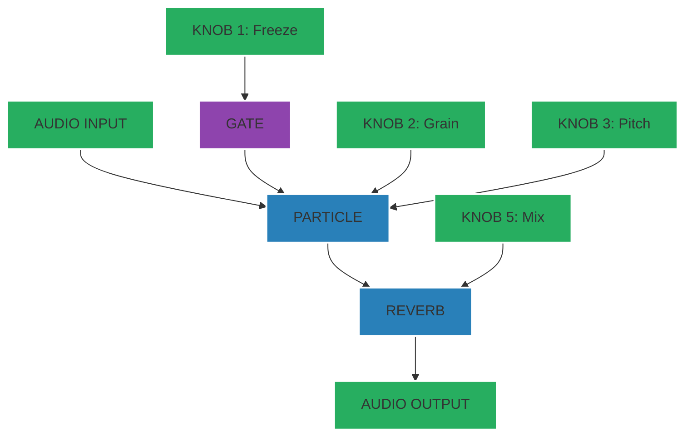

---

## 2. Euclidean Polyrhythmic Drum Machine
**Complexity**: 9/10
**Description**: 3-track generative drum sequencer using Euclidean algorithms. Concepts from *Godfried Toussaint's Geometry of Musical Rhythm*.
**Controls**:
- **Knob 1-3**: Density (Kick, Snare, Hat)
- **Knob 4-6**: Decay (Kick, Snare, Hat)
- **Knob 7**: Tempo
- **Knob 8**: Master Distortion

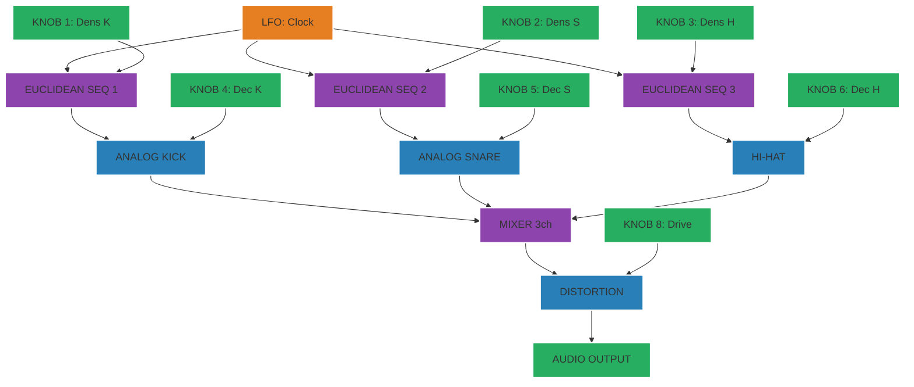

---

## 3. Wavetable Morphing Synthesizer
**Complexity**: 7/10
**Description**: Classic wavetable synthesis with LFO-driven table morphing. Inspired by *Pirkle's Designing Software Synthesizers*.
**Controls**:
- **Knob 1**: Morph Position
- **Knob 2**: Filter Cutoff
- **Knob 3**: Resonance
- **Knob 4**: LFO Body
- **Keys**: Pitch/Gate

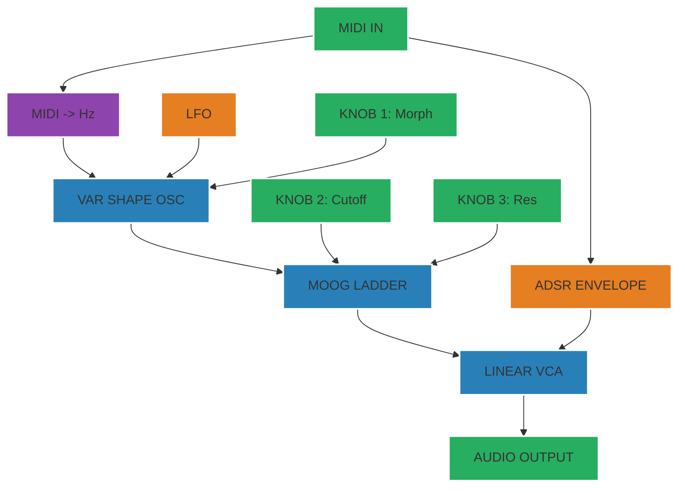

---

## 4. Physical Modeling Flute
**Complexity**: 8/10
**Description**: Waveguide synthesis simulation of a wind instrument. Based on *Perry Cook's Real Sound Synthesis*.
**Controls**:
- **Knob 1**: Breath Pressure (Noise gain)
- **Knob 2**: Tube Length (Pitch)
- **Knob 3**: Jet Delay
- **Knob 4**: Output Level

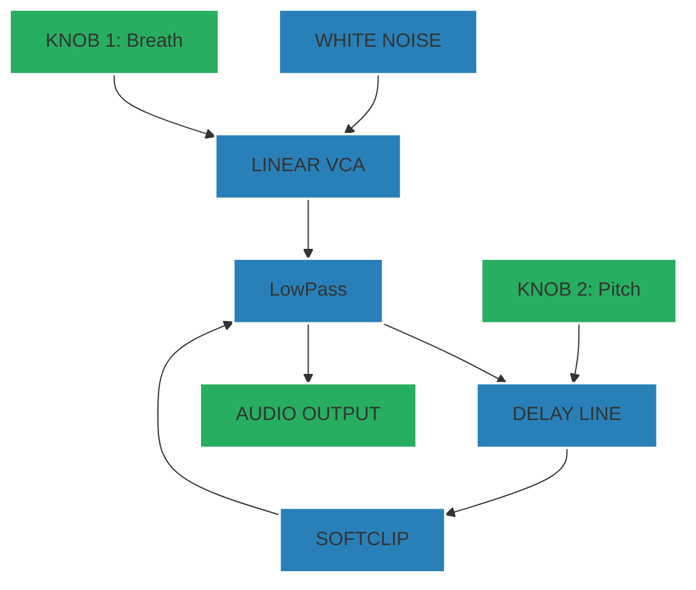

---

## 5. Dual-Band Compressor
**Complexity**: 6/10
**Description**: Mastering-style dynamics processor splitting audio into Low/High bands.
**Controls**:
- **Knob 1**: Crossover Freq
- **Knob 2**: Low Threshold
- **Knob 3**: High Threshold
- **Knob 4**: Makeup Gain

```mermaid
graph TD
    classDef audio fill:#2980b9,stroke:#fff,stroke-width:2px;
    classDef control fill:#e67e22,stroke:#fff,stroke-width:2px;
    classDef math fill:#8e44ad,stroke:#fff,stroke-width:2px;
    classDef io fill:#27ae60,stroke:#fff,stroke-width:2px;

    AudioIn[AUDIO INPUT]:::io --> Split[SPLITTER]:::math
    Knob1[KNOB 1: X-Over]:::io --> LPF[LPF (1-POLE)]:::audio
    Knob1 --> HPF[HPF (1-POLE)]:::audio
    
    Split --> LPF
    Split --> HPF

    LPF --> CompL[COMPRESSOR]:::audio
    HPF --> CompH[COMPRESSOR]:::audio

    Knob2[KNOB 2: Thresh L]:::io --> CompL
    Knob3[KNOB 3: Thresh H]:::io --> CompH

    CompL --> Mix[ADD]:::math
    CompH --> Mix
    Mix --> AudioOut[AUDIO OUTPUT]:::io
```

---

## 6. Stereo Image Widener & Mid-Side Proc
**Complexity**: 6/10
**Description**: Manipulates the stereo field using Mid-Side encoding/decoding.
**Controls**:
- **Knob 1**: Width (Side Gain)
- **Knob 2**: Center (Mid Gain)
- **Knob 3**: HPF Side (remove mud)
- **Knob 4**: Saturation Side

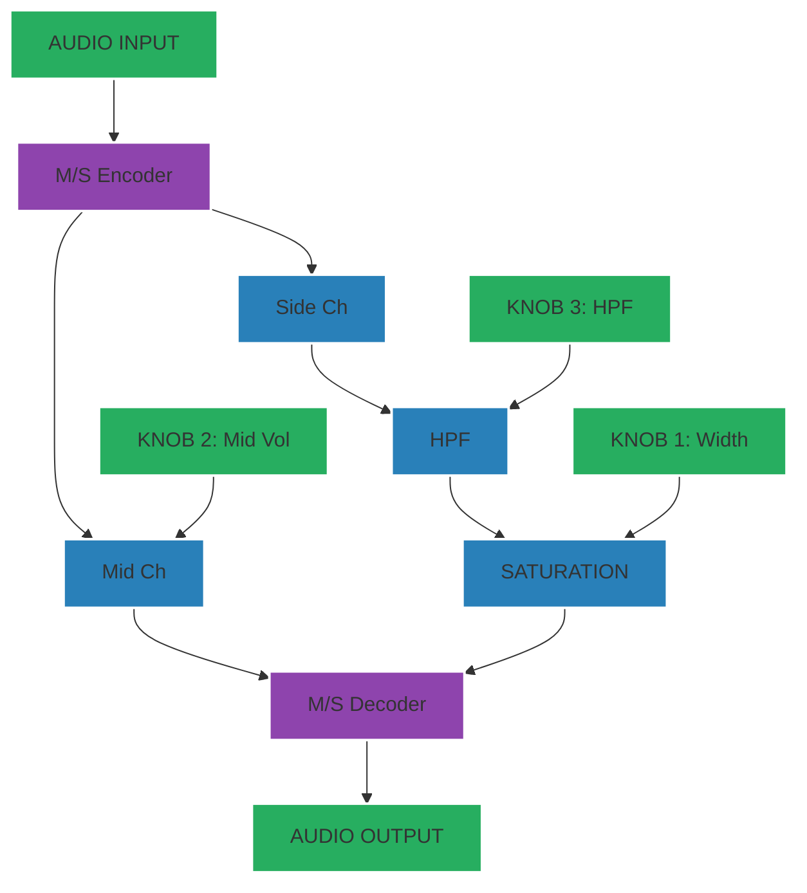

---

## 7. Formant Vocal Synthesizer
**Complexity**: 7/10
**Description**: Generates vowel sounds using Formant Synthesis (FOF/VOSIM).
**Controls**:
- **Knob 1**: Vowel A-E-I-O-U (Formant Freqs)
- **Knob 2**: Pitch
- **Knob 3**: Vibrato Depth
- **Knob 4**: Throat Size (Shift)

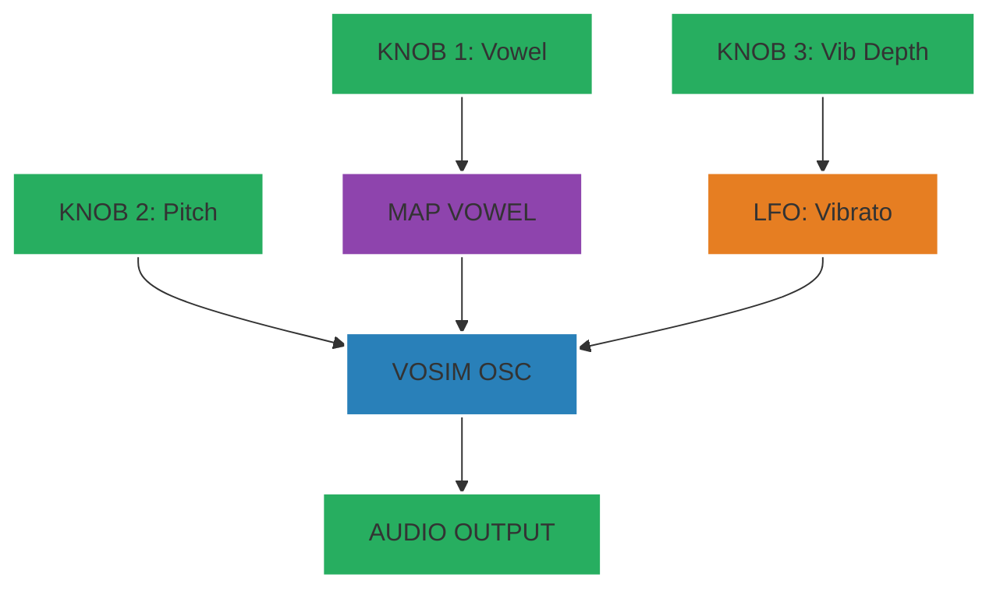

---

## 8. Resonant Filter Bank
**Complexity**: 8/10
**Description**: 8 parallel bandpass filters for vocoder-like or spectral shaping effects.
**Controls**:
- **Knob 1**: Base Freq
- **Knob 2**: Spacing
- **Knob 3**: Resonance
- **Knob 4-8**: Band Gains

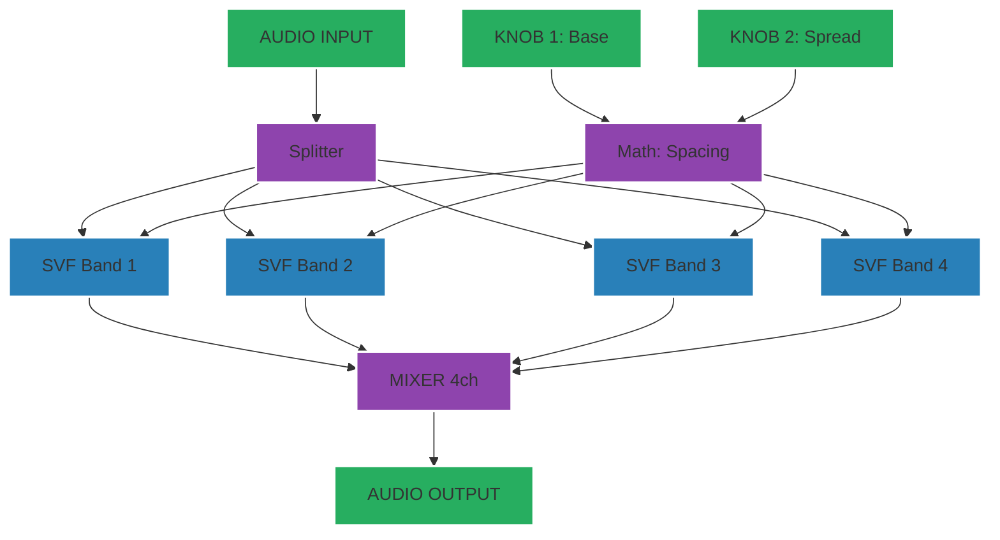

---

## 9. Lo-Fi Tape Deck
**Complexity**: 6/10
**Description**: Simulates tape degradation with wow, flutter, noise, and saturation.
**Controls**:
- **Knob 1**: Wow/Flutter (LFO Depth)
- **Knob 2**: Hiss Level
- **Knob 3**: Saturation (Drive)
- **Knob 4**: Tone (Filter)

```mermaid
graph TD
    classDef audio fill:#2980b9,stroke:#fff,stroke-width:2px;
    classDef control fill:#e67e22,stroke:#fff,stroke-width:2px;
    classDef math fill:#8e44ad,stroke:#fff,stroke-width:2px;
    classDef io fill:#27ae60,stroke:#fff,stroke-width:2px;

    AudioIn[AUDIO INPUT]:::io --> Delay[DELAY (Modulated)]:::audio
    LFO[LFO: Flutter]:::control --> Delay
    Knob1[KNOB 1: Wow]:::io --> LFO

    Noise[WHITE NOISE]:::audio --> Mix1[ADD]:::math
    Knob2[KNOB 2: Hiss]:::io --> Noise
    Delay --> Mix1
    Noise --> Mix1
    
    Mix1 --> Sat[OVERDRIVE]:::audio
    Knob3[KNOB 3: Drive]:::io --> Sat

    Sat --> Tone[TONE STACK]:::audio
    Knob4[KNOB 4: Tone]:::io --> Tone
    
    Tone --> AudioOut[AUDIO OUTPUT]:::io
```

---

## 10. Generative Ambient Garden
**Complexity**: 9/10
**Description**: Self-playing patch using probabilistic logic and Modal synthesis.
**Controls**:
- **Knob 1**: Density / Activity
- **Knob 2**: Scale Root
- **Knob 3**: Reverb Size
- **Knob 4**: Harmony Spread

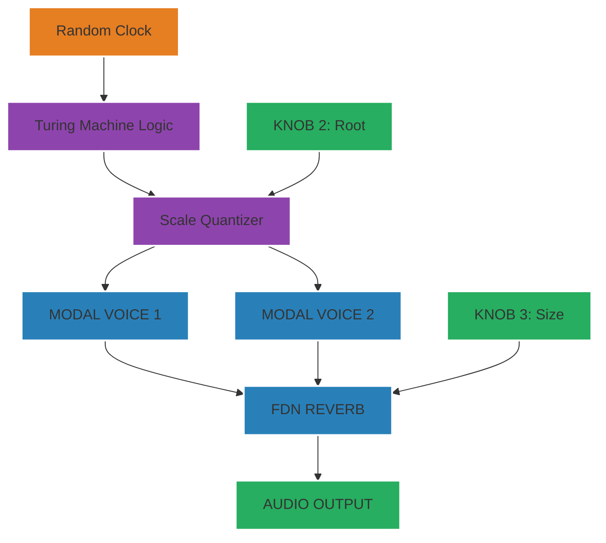

---

## 11. Phase Vocoder Time-Stretcher
**Complexity**: 10/10
**Description**: Frequency-domain time stretching of real-time audio. From *DAFX (Zolzer)*.
**Controls**:
- **Knob 1**: Stretch Factor
- **Knob 2**: Pitch Shift
- **Knob 3**: Window Size
- **Knob 4**: Dry/Wet

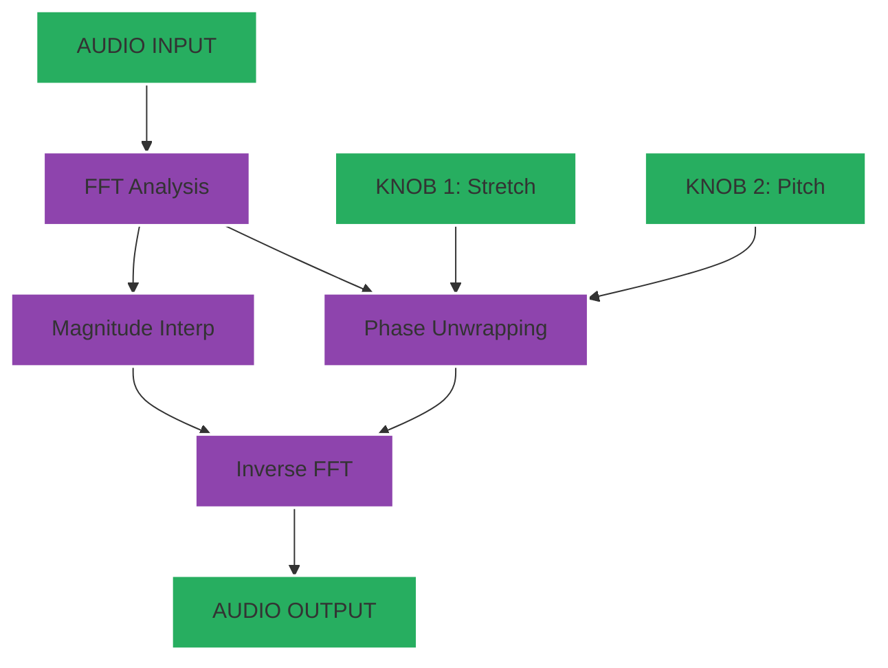

---

## 12. FM Percussion Synth
**Complexity**: 7/10
**Description**: 2-Operator FM synthesis tailored for metallic percussion.
**Controls**:
- **Knob 1**: Carrier Freq
- **Knob 2**: Modulator Ratio
- **Knob 3**: FM Index (Amount)
- **Knob 4**: Decay Time

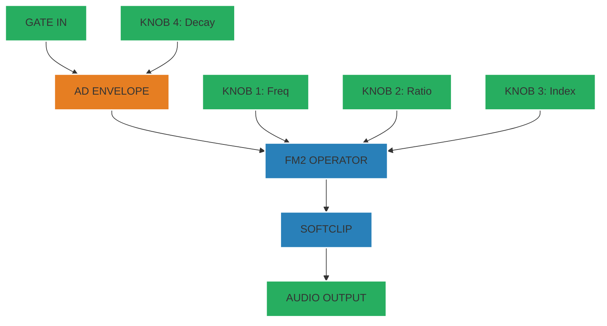

---

## 13. Super Saw Pluck
**Complexity**: 6/10
**Description**: Massive detuned saw stack for trance/dance leads.
**Controls**:
- **Knob 1**: Detune Amount
- **Knob 2**: Cutoff Frequency
- **Knob 3**: Pluck Decay
- **Knob 4**: Reverb

```mermaid
graph TD
    classDef audio fill:#2980b9,stroke:#fff,stroke-width:2px;
    classDef control fill:#e67e22,stroke:#fff,stroke-width:2px;
    classDef math fill:#8e44ad,stroke:#fff,stroke-width:2px;
    classDef io fill:#27ae60,stroke:#fff,stroke-width:2px;

    Midi[MIDI NOTE]:::io --> OscBank[OSC BANK (7x)]:::audio
    Knob1[KNOB 1: Detune]:::io --> OscBank
    
    Midi --> Env[AD ENVELOPE]:::control
    Knob3[KNOB 3: Decay]:::io --> Env

    OscBank --> Filter[MOOG LADDER]:::audio
    Env --> Filter
    Knob2[KNOB 2: Cutoff]:::io --> Filter

    Filter --> Reverb[REVERB]:::audio
    Reverb --> AudioOut[AUDIO OUTPUT]:::io
```

---

## 14. Karplus-Strong String Ensemble
**Complexity**: 8/10
**Description**: Physical modeling of plucked strings using filtered delay loops.
**Controls**:
- **Knob 1**: String Tension (Pitch)
- **Knob 2**: Damping (Filter)
- **Knob 3**: Pluck Pos (Comb Filter)
- **Knob 4**: Body Resonance

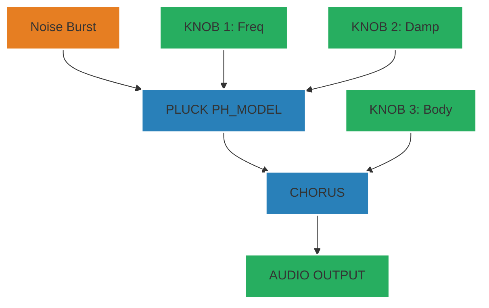

---

## 15. Chaos-Modulated Drone
**Complexity**: 9/10
**Description**: Drone synthesizer where parameters are controlled by chaotic attractors (Lorenz/Rossler).
**Controls**:
- **Knob 1**: Chaos Rate
- **Knob 2**: Pitch Spread
- **Knob 3**: Timbre (FM)
- **Knob 4**: Space (Reverb)

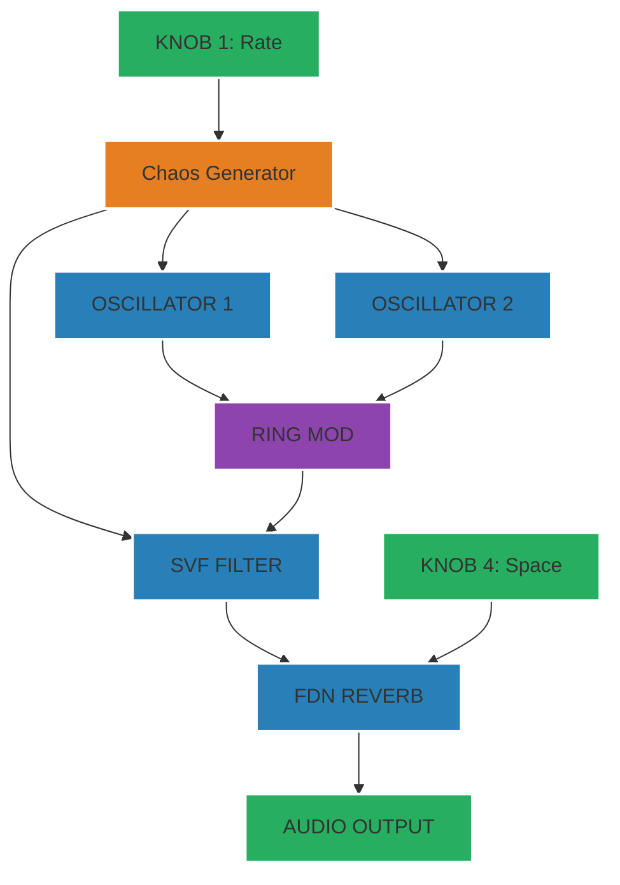
