# Daisy Pod Project Ideas
*Generated from literature research - Complexity 5-10/10*

---

## Project 1: Dual LFO Modulated Delay (Complexity: 5/10)

### Description
Stereo delay effect with two independent LFOs modulating delay time and feedback, creating lush modulated delay textures.

### Controls Mapping
| Control | Function |
|---------|----------|
| Knob 1 | Delay time |
| Knob 2 | Feedback amount |
| Encoder Rotate | LFO 1 rate |
| Encoder Press | Toggle between LFO shapes |
| Button 1 | Tap tempo |
| Button 2 | Freeze delay buffer |
| LED 1 | Tempo indicator (blinks) |
| LED 2 | Freeze status |
| Audio In | Stereo input |
| Audio Out | Stereo delayed output |

### Block Diagram
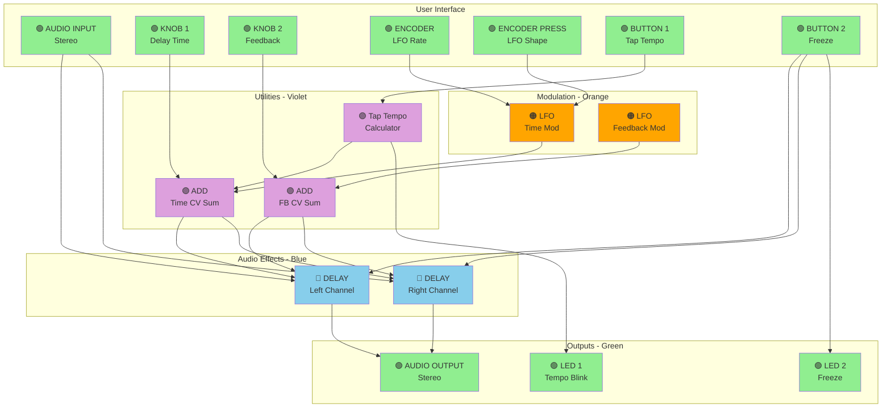

---

## Project 2: Generative Euclidean Melody Box (Complexity: 6/10)

### Description
Generative music box using Euclidean rhythm patterns to trigger melodic sequences. Inspired by "Introduction to Digital Music with Python Programming."

### Controls Mapping
| Control | Function |
|---------|----------|
| Knob 1 | Tempo (BPM) |
| Knob 2 | Sequence density |
| Encoder Rotate | Select scale (Major, Minor, Pentatonic, etc.) |
| Encoder Press | Regenerate melody |
| Button 1 | Start/Stop |
| Button 2 | Change Euclidean pattern |
| LED 1 | Beat indicator |
| LED 2 | Pattern indicator (color = pattern) |
| MIDI Out | Generated melody output |

### Block Diagram
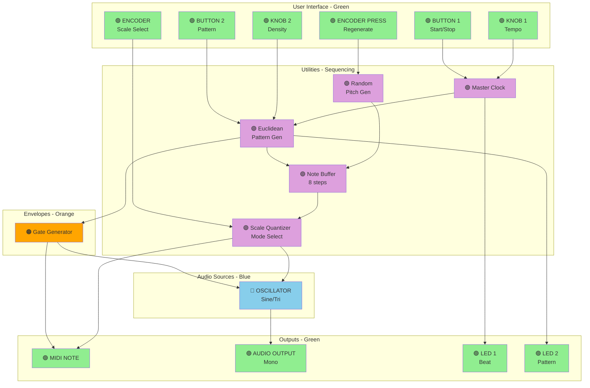

---

## Project 3: Stereo Wavefolder and Filter (Complexity: 5/10)

### Description
Parallel wavefolder effect with state-variable filtering. Creates aggressive harmonic distortion with tonal control.

### Controls Mapping
| Control | Function |
|---------|----------|
| Knob 1 | Fold amount/drive |
| Knob 2 | Filter cutoff |
| Encoder Rotate | Filter resonance |
| Encoder Press | Cycle filter mode (LP/BP/HP/Notch) |
| Button 1 | Bypass wavefolder |
| Button 2 | Bypass filter |
| LED 1 | Wavefolder active |
| LED 2 | Filter mode (color coded) |

### Block Diagram
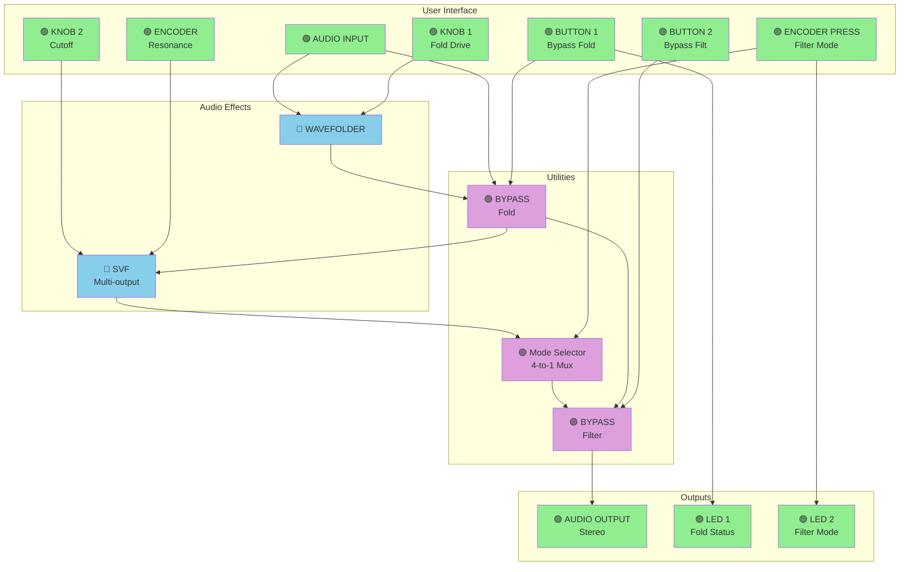

---

## Project 4: Sample and Hold Noise Synthesizer (Complexity: 5/10)

### Description
Random stepped voltage synthesizer using sample and hold on white noise, creating retro computer game sounds and random melodies.

### Controls Mapping
| Control | Function |
|---------|----------|
| Knob 1 | Clock rate (sample rate) |
| Knob 2 | Filter cutoff |
| Encoder Rotate | Quantization (steps) |
| Encoder Press | Toggle quantization on/off |
| Button 1 | External clock mode |
| Button 2 | Hold current value |
| LED 1 | Clock indicator |
| LED 2 | Quantization on/off |
| MIDI In | External clock input |

### Block Diagram
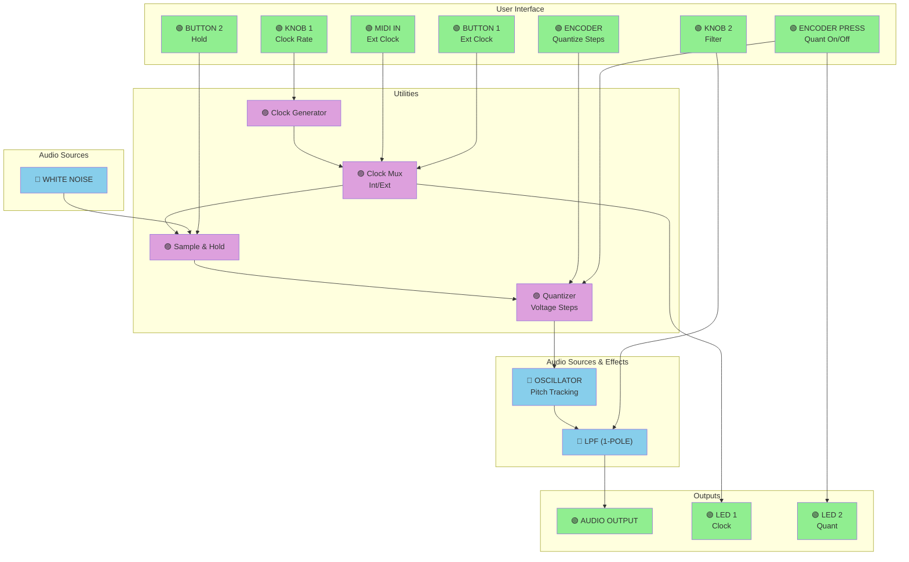

---

## Project 5: Dual Oscillator FM Synth Voice (Complexity: 6/10)

### Description
Classic 2-operator FM synthesis voice with ADSR envelope. Simple but powerful synthesis engine.

### Controls Mapping
| Control | Function |
|---------|----------|
| Knob 1 | FM index (modulation amount) |
| Knob 2 | FM ratio (frequency ratio) |
| Encoder Rotate | Filter cutoff |
| Encoder Press | Cycle waveforms (sine/tri/saw/square) |
| Button 1 | Retrigger envelope |
| Button 2 | Hold note |
| LED 1 | Envelope status |
| LED 2 | Waveform indicator |
| MIDI In | Note + velocity input |

### Block Diagram
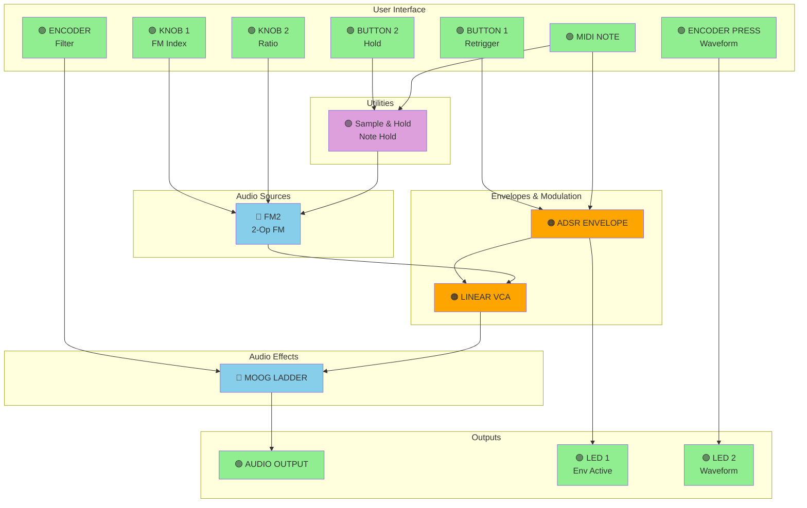

---

## Project 6: Granular Looper (Complexity: 7/10)

### Description
Real-time granular synthesis looper that captures and processes audio into grains with variable size, density, and pitch. Inspired by granular synthesis techniques from the literature.

### Controls Mapping
| Control | Function |
|---------|----------|
| Knob 1 | Grain size |
| Knob 2 | Grain density/playback rate |
| Encoder Rotate | Loop position/scrubbing |
| Encoder Press | Record/Overdub toggle |
| Button 1 | Clear loop buffer |
| Button 2 | Freeze grains |
| LED 1 | Recording status |
| LED 2 | Loop position indicator |

### Block Diagram
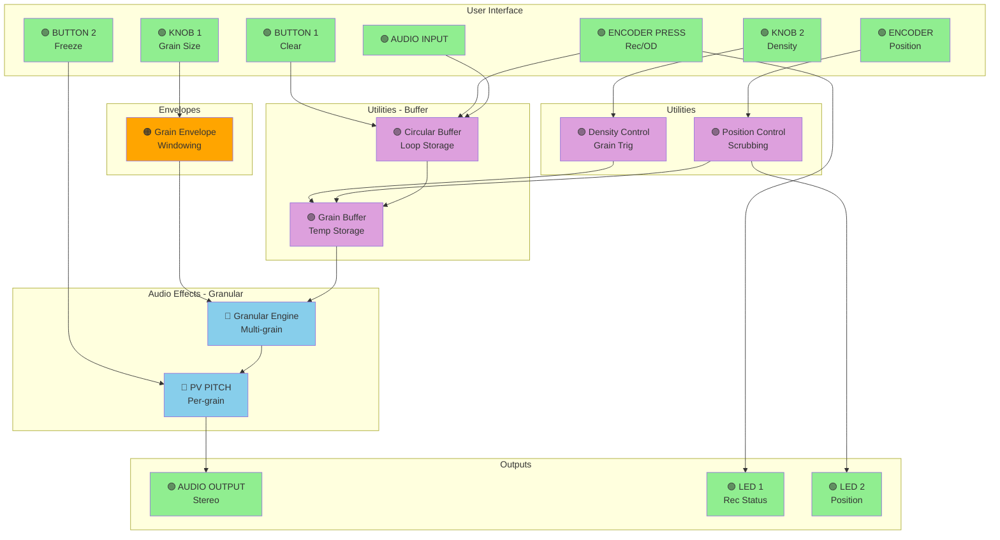

---

## Project 7: Chaotic Modulation Source (Complexity: 6/10)

### Description
Dual chaotic LFO system with cross-modulation creating unpredictable but musical modulation patterns. Great for experimental sound design.

### Controls Mapping
| Control | Function |
|---------|----------|
| Knob 1 | Chaos amount/feedback |
| Knob 2 | Cross-modulation amount |
| Encoder Rotate | Master rate |
| Encoder Press | Reset chaos state |
| Button 1 | Sample chaos to CV out |
| Button 2 | Sync both LFOs |
| LED 1 | LFO 1 activity (brightness) |
| LED 2 | LFO 2 activity (brightness) |
| Audio Out | Chaotic audio rate oscillation |

### Block Diagram
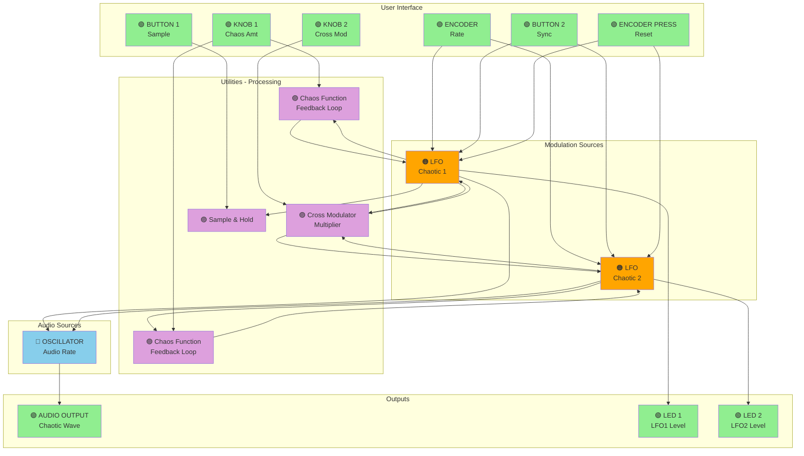

---

## Project 8: Chord Memory and Strum (Complexity: 7/10)

### Description
Chord memory bank with strumming patterns. Records MIDI chords and plays them back with adjustable strum timing. Based on chord machine concepts.

### Controls Mapping
| Control | Function |
|---------|----------|
| Knob 1 | Strum speed |
| Knob 2 | Chord inversion |
| Encoder Rotate | Select chord bank (1-8) |
| Encoder Press | Record current chord |
| Button 1 | Trigger strum up |
| Button 2 | Trigger strum down |
| LED 1 | Chord bank indicator (color) |
| LED 2 | Strum direction |
| MIDI In | Chord input |
| MIDI Out | Strummed notes |

### Block Diagram
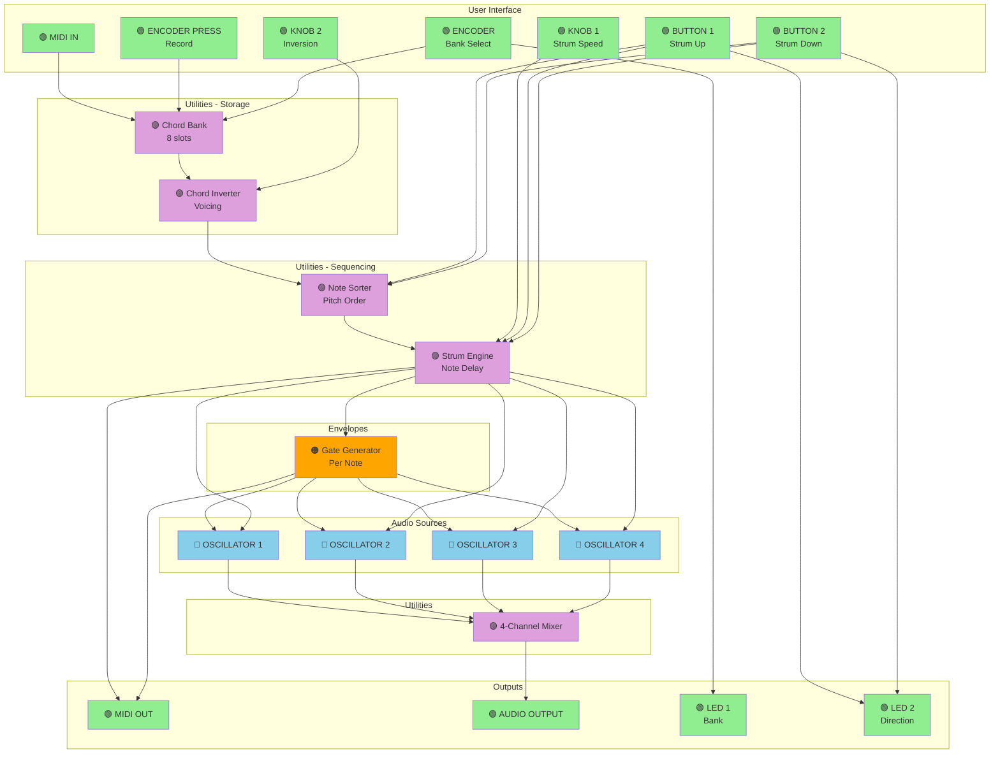

---

## Project 9: Probability Gate Sequencer (Complexity: 8/10)

### Description
8-step gate sequencer with per-step probability and pattern chaining. Creates evolving rhythmic patterns. Inspired by modern Eurorack sequencers.

### Controls Mapping
| Control | Function |
|---------|----------|
| Knob 1 | Master tempo |
| Knob 2 | Global probability bias |
| Encoder Rotate | Select step (1-8) |
| Encoder Press | Toggle step on/off |
| Button 1 | Set step probability |
| Button 2 | Reset sequence |
| LED 1 | Current step (blinks) |
| LED 2 | Probability indicator (brightness) |
| MIDI In | External clock |
| MIDI Out | Gate output |

### Block Diagram
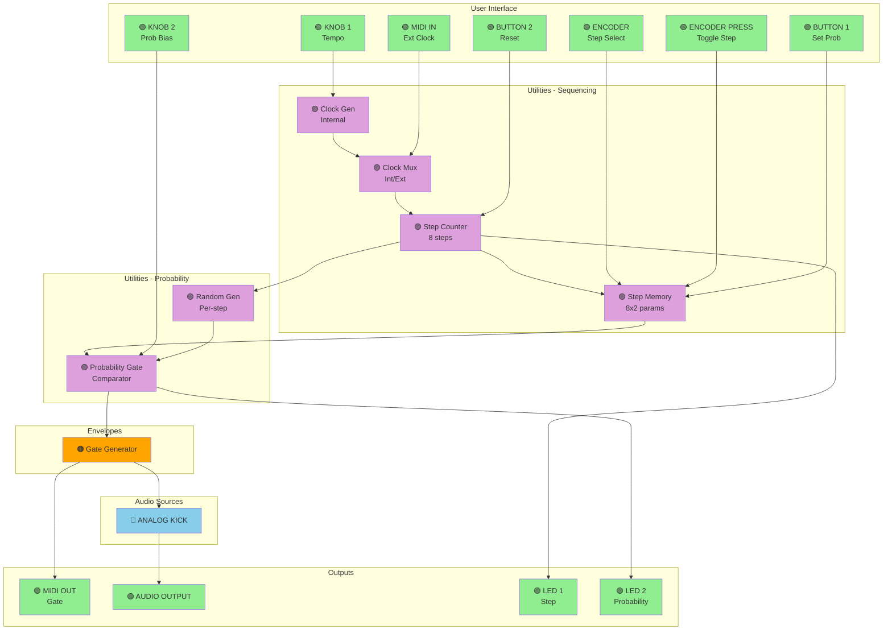

---

## Project 10: Spectral Delay (Complexity: 8/10)

### Description
FFT-based spectral delay that can delay different frequency bands independently, creating unique rhythmic textures.

### Controls Mapping
| Control | Function |
|---------|----------|
| Knob 1 | Spectral shift (rotate bands) |
| Knob 2 | Feedback amount |
| Encoder Rotate | Band delay spread |
| Encoder Press | Freeze spectrum |
| Button 1 | Clear delay buffer |
| Button 2 | Toggle stereo/mono |
| LED 1 | Freeze status |
| LED 2 | Processing indicator |

### Block Diagram
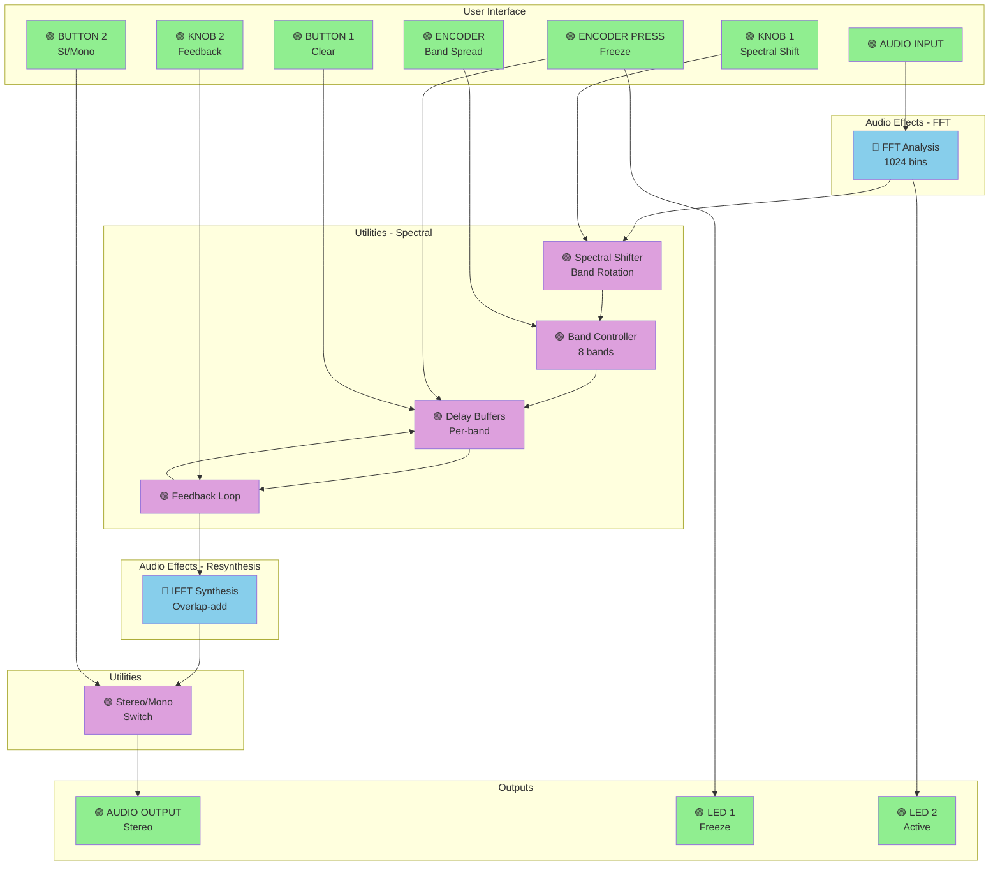

---

## Project 11: Resonant Filter Bank (Complexity: 7/10)

### Description
8-band resonant filter bank for spectral processing, creating formant-like sounds and vowel filtering effects.

### Controls Mapping
| Control | Function |
|---------|----------|
| Knob 1 | Filter spread (spacing) |
| Knob 2 | Global resonance |
| Encoder Rotate | Center frequency |
| Encoder Press | Cycle filter modes |
| Button 1 | Odd harmonics only |
| Button 2 | Even harmonics only |
| LED 1 | Odd/even indicator |
| LED 2 | Mode indicator |

### Block Diagram
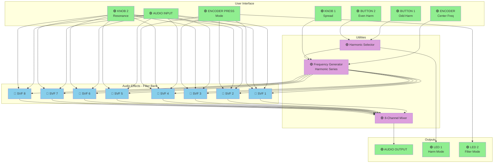

---

## Project 12: Rhythmic Gate Effect (Complexity: 6/10)

### Description
Tempo-synced rhythmic gate/tremolo effect with pattern memory. Creates rhythmic choppy effects.

### Controls Mapping
| Control | Function |
|---------|----------|
| Knob 1 | Tempo (BPM) |
| Knob 2 | Gate width |
| Encoder Rotate | Pattern select (16 patterns) |
| Encoder Press | Record custom pattern |
| Button 1 | Tap tempo |
| Button 2 | Gate/Tremolo mode |
| LED 1 | Beat indicator |
| LED 2 | Mode (gate=red, trem=blue) |

### Block Diagram
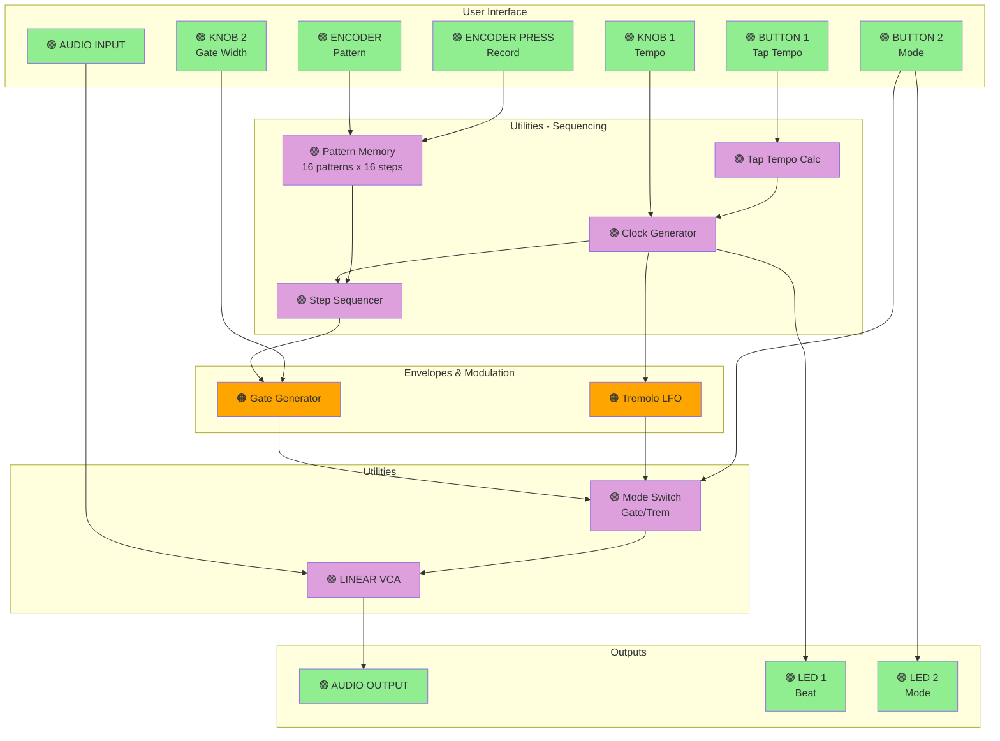

---

## Project 13: Physical Modeling Percussion Synth (Complexity: 8/10)

### Description
Dual physical modeling percussion synthesizer using modal synthesis and resonators. Create bell, wood, and metal percussion sounds.

### Controls Mapping
| Control | Function |
|---------|----------|
| Knob 1 | Material/brightness |
| Knob 2 | Damping/decay |
| Encoder Rotate | Structure/geometry |
| Encoder Press | Trigger both voices |
| Button 1 | Trigger voice 1 |
| Button 2 | Trigger voice 2 |
| LED 1 | Voice 1 envelope |
| LED 2 | Voice 2 envelope |
| MIDI In | Trigger notes + velocity |

### Block Diagram
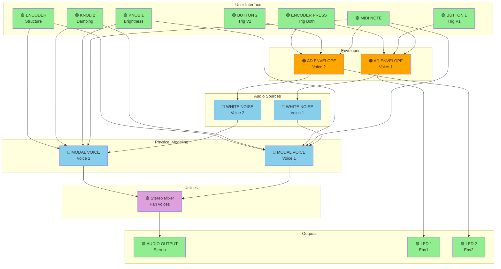

---

## Project 14: Adaptive Envelope Follower Effect (Complexity: 7/10)

### Description
Dynamics-responsive multi-effect that uses envelope following to control multiple parameters simultaneously. Great for reactive sound design.

### Controls Mapping
| Control | Function |
|---------|----------|
| Knob 1 | Envelope attack time |
| Knob 2 | Envelope release time |
| Encoder Rotate | Modulation depth |
| Encoder Press | Select target (filter/delay/reverb) |
| Button 1 | Invert envelope |
| Button 2 | Sidechain input mode |
| LED 1 | Envelope level (brightness) |
| LED 2 | Target indicator |

### Block Diagram
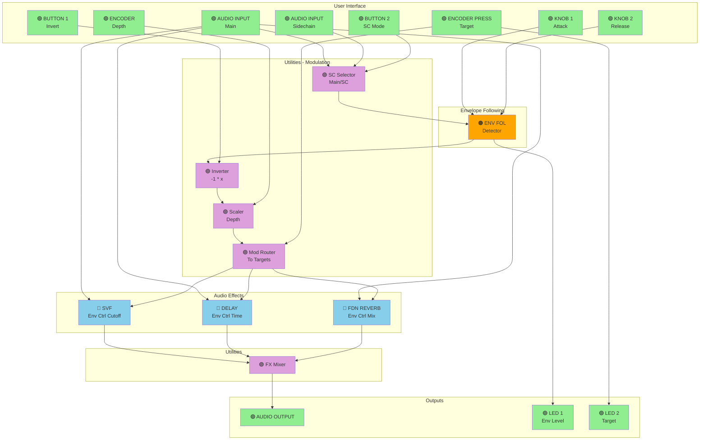

---

## Project 15: Karplus-Strong String Synthesizer (Complexity: 9/10)

### Description
Advanced physical modeling string synthesizer using Karplus-Strong algorithm with damping, pickup position simulation, and sympathetic resonance. Professional-level string synthesis.

### Controls Mapping
| Control | Function |
|---------|----------|
| Knob 1 | String damping |
| Knob 2 | Pickup position |
| Encoder Rotate | String brightness/harmonics |
| Encoder Press | Trigger pluck |
| Button 1 | Sustain/damper pedal |
| Button 2 | Sympathetic resonance on/off |
| LED 1 | Note activity |
| LED 2 | Resonance status |
| MIDI In | Note input + velocity |

### Block Diagram
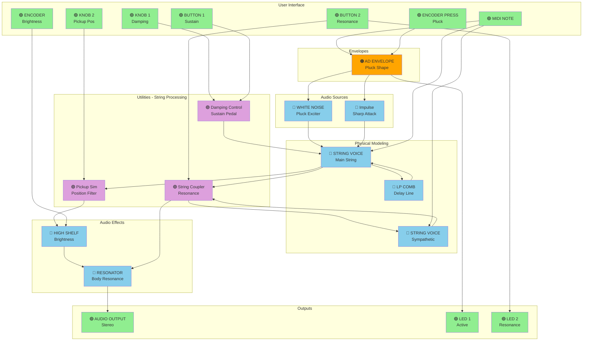

---

*End of Daisy Pod Project Ideas*
