# Daisy Pod Project Ideas (Complexity 5-10)

Generated based on DSP literature and the DVPE Module Catalog.
**Date**: 2026-02-08

## Color Coding Reference
- **Blue**: Audio Signal (Sources, Effects, Filters)
- **Orange**: Control Signals (Envelopes, LFOs, Modulation)
- **Violet**: Math & Utility (Mixers, Logic)
- **Green**: User I/O (Hardware Controls)

---

## 1. Shimmer Reverb
**Complexity**: 8/10
**Description**: Ethereal reverb with pitch-shifted feedback loop. Inspired by *Valhalla DSP* algorithms.
**Controls**:
- **Knob 1**: Decay Time
- **Knob 2**: Shimmer Amount (Pitch Mix)
- **Button 1**: Octave Up/Down

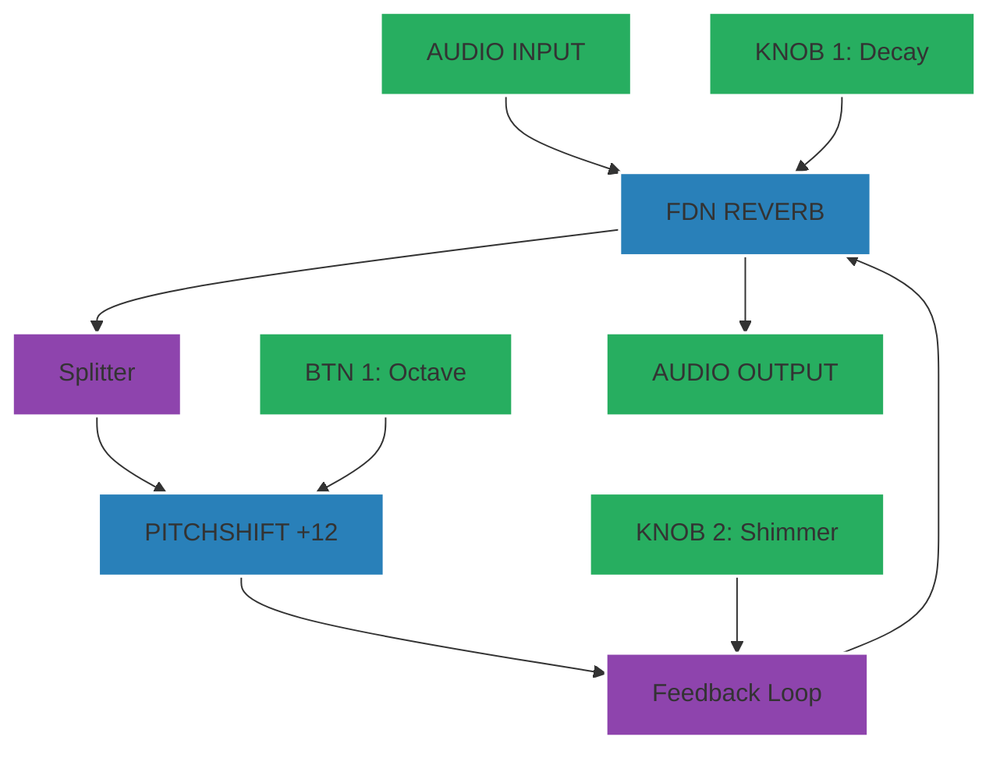

---

## 2. Auto-Wah Funky Filter
**Complexity**: 6/10
**Description**: Envelope-controlled bandpass filter for funk guitar/bass.
**Controls**:
- **Knob 1**: Sensitivity (Threshold)
- **Knob 2**: Resonance (Q)
- **Button 1**: Filter Type (BP/LP)

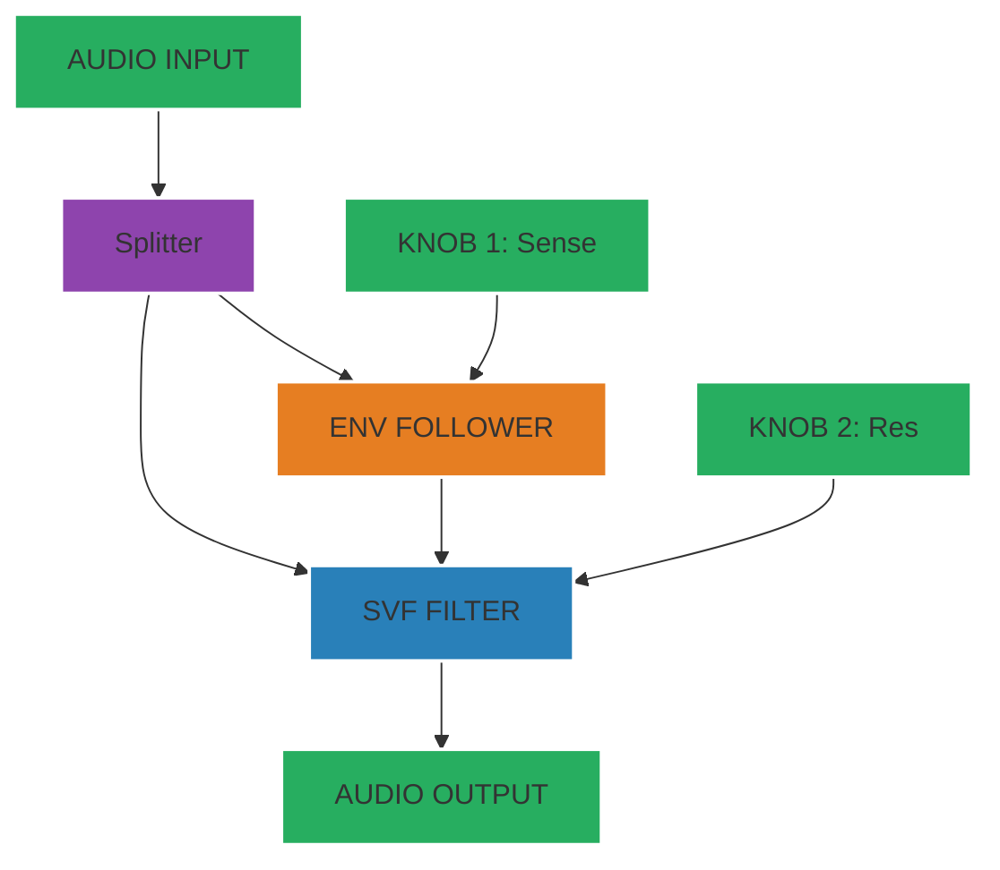

---

## 3. Fuzz Distortion
**Complexity**: 5/10
**Description**: Aggressive hard-clipping distortion with tone control.
**Controls**:
- **Knob 1**: Drive (Gain)
- **Knob 2**: Tone (Filter)
- **Button 1**: Clip Mode (Hard/Soft)

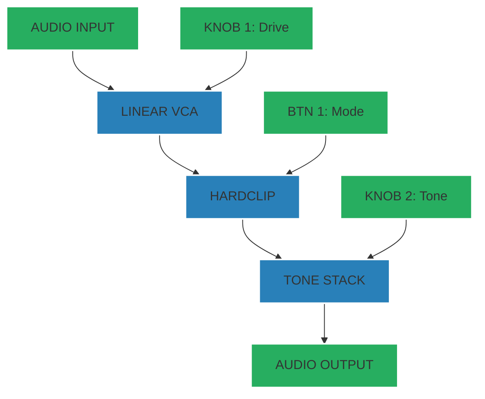

---

## 4. Bitcrusher & Downsampler
**Complexity**: 5/10
**Description**: Digital degradation effect for lo-fi textures.
**Controls**:
- **Knob 1**: Sample Rate (Decimate)
- **Knob 2**: Bit Depth
- **Button 1**: Bypass

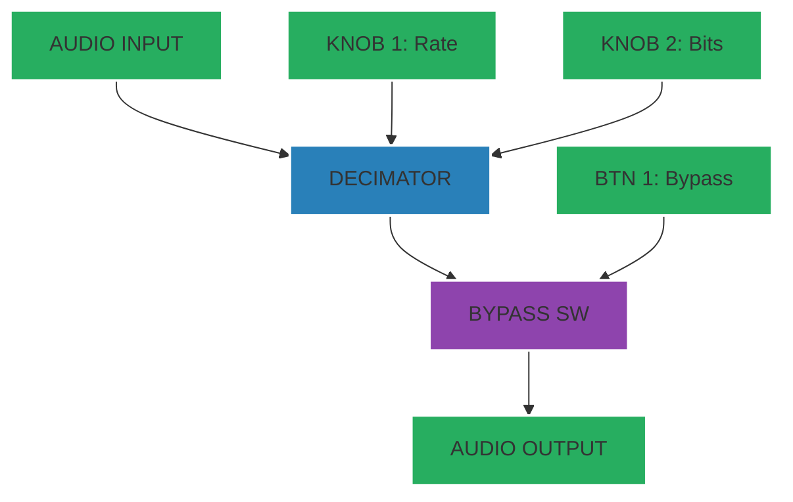

---

## 5. Optical Tremolo
**Complexity**: 6/10
**Description**: Amplitude modulation simulating vintage optical tremolo circuits.
**Controls**:
- **Knob 1**: Rate (Speed)
- **Knob 2**: Depth (Intensity)
- **Button 1**: Waveform (Sine/Square)

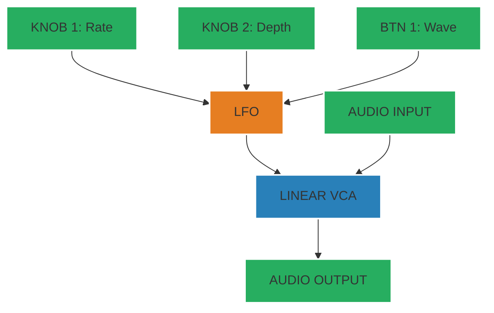

---

## 6. Sub-Octave Generator
**Complexity**: 7/10
**Description**: Adds a synthesized bass note one octave below the input signal.
**Controls**:
- **Knob 1**: Sub Octave Level
- **Knob 2**: Dry Signal Level
- **Button 1**: Octave Select (-1/-2)

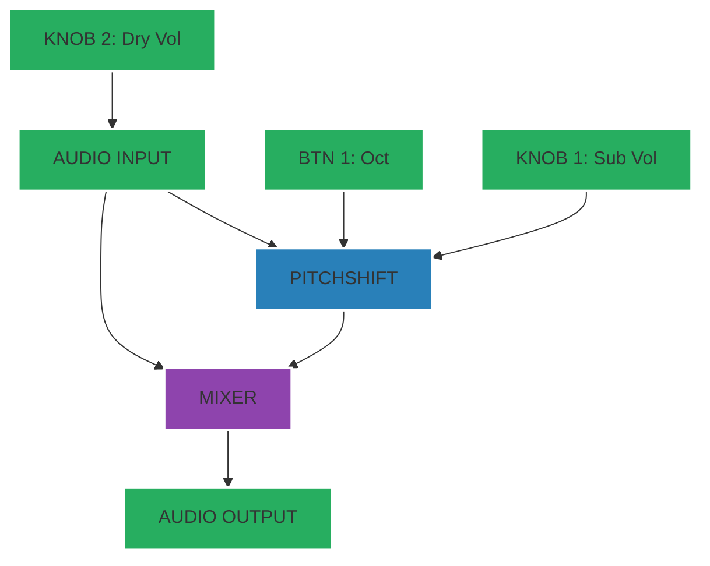

---

## 7. Triple-Oscillator Drone
**Complexity**: 7/10
**Description**: Three detuned oscillators for thick drone textures.
**Controls**:
- **Knob 1**: Pitch
- **Knob 2**: Detune Spread
- **Button 1**: Waveform Select

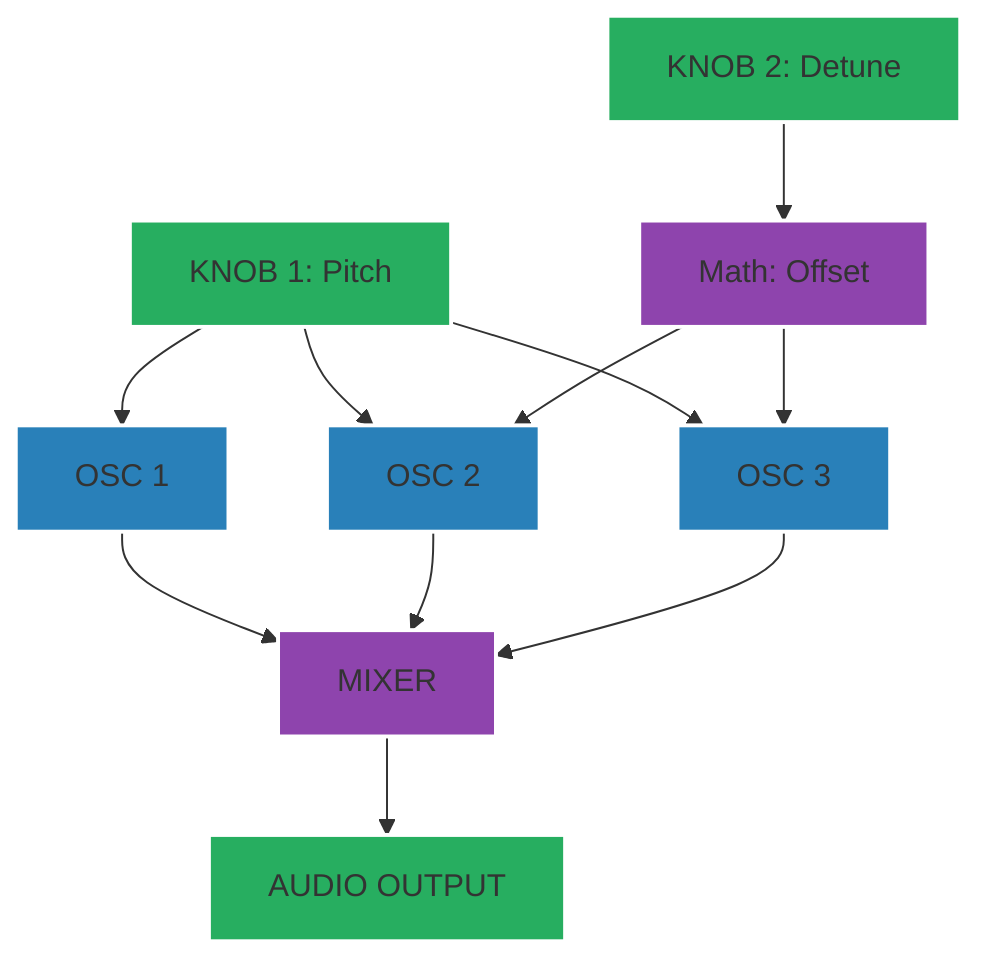

---

## 8. Filtered Noise Generator
**Complexity**: 5/10
**Description**: White noise source with a sweeping bandpass filter, useful for risers/fx.
**Controls**:
- **Knob 1**: Filter Cutoff
- **Knob 2**: Resonance
- **Button 1**: Noise Color (White/Pink/Red)

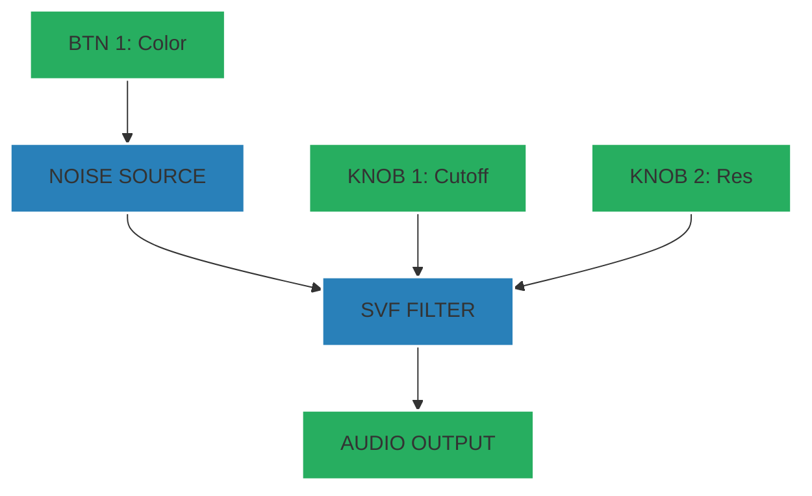

---

## 9. LFO Modulator Utility
**Complexity**: 6/10
**Description**: Outputs CV signals (0-3.3V) to control other voltage-controlled gear.
**Controls**:
- **Knob 1**: Rate
- **Knob 2**: Shape Skew
- **Buttons**: Waveform Select

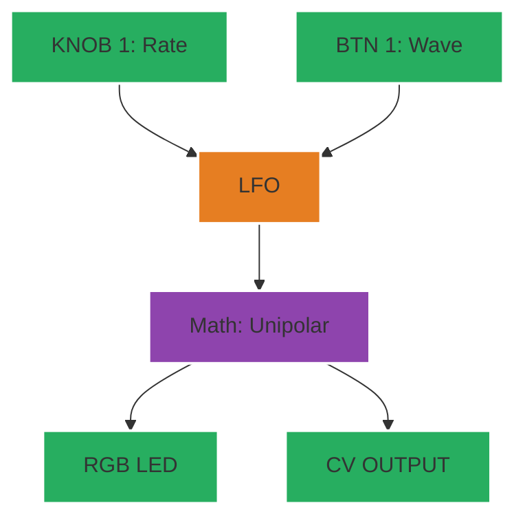

---

## 10. Ping Pong Delay
**Complexity**: 7/10
**Description**: Stereo delay bouncing repeats between left and right channels.
**Controls**:
- **Knob 1**: Delay Time
- **Knob 2**: Feedback
- **Button 1**: Tap Tempo

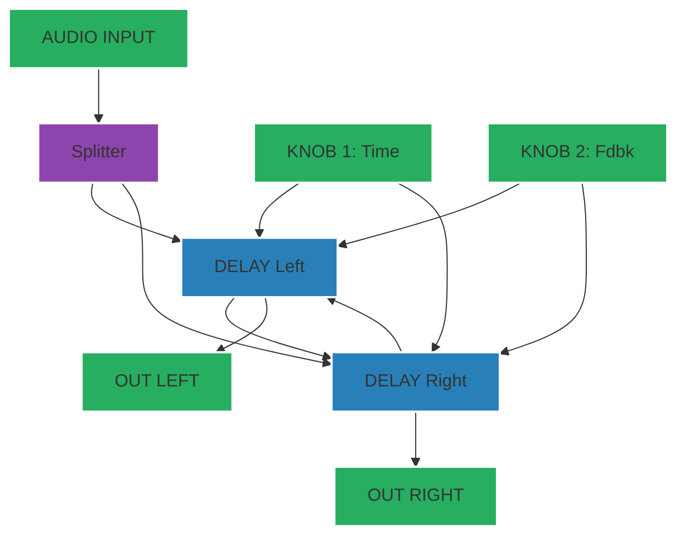

---

## 11. Kick Drum Synth (Trigger)
**Complexity**: 5/10
**Description**: Dedicated analog-style kick drum synthesizer triggered by button or gate.
**Controls**:
- **Knob 1**: Tuning
- **Knob 2**: Decay
- **Button 1**: Manual Trigger

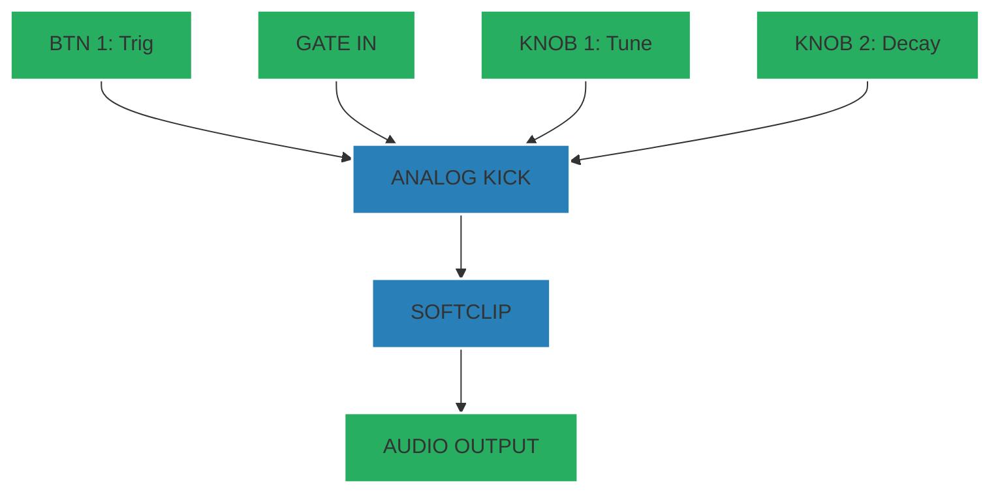

---

## 12. Stereo Chorus
**Complexity**: 7/10
**Description**: Widens the stereo image using modulated delay lines.
**Controls**:
- **Knob 1**: Rate
- **Knob 2**: Depth
- **Button 1**: Voice Count (2/4)

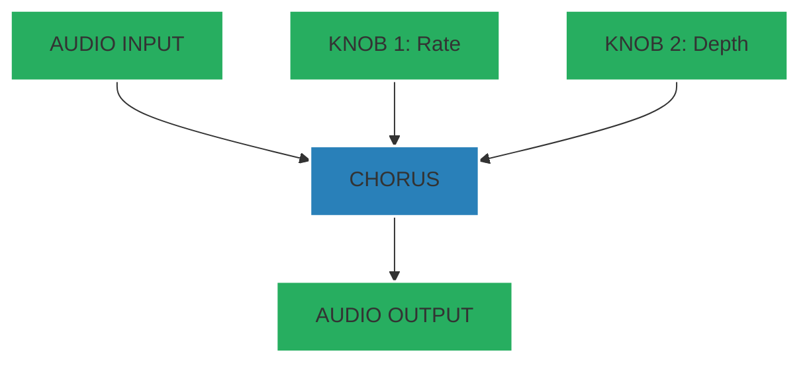

---

## 13. Vocal Robot Voice
**Complexity**: 8/10
**Description**: Robotic voice effect using FFT-based robotization.
**Controls**:
- **Knob 1**: Pitch/Frequency
- **Knob 2**: Dry/Wet Mix
- **Button 1**: Freeze Buffer

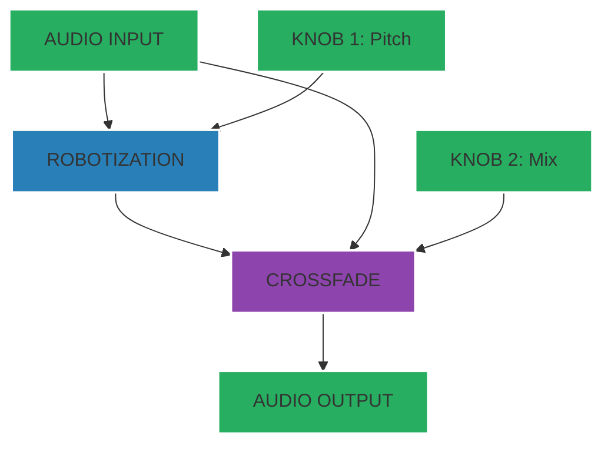

---

## 14. Slew Limiter (Portamento)
**Complexity**: 5/10
**Description**: Utility to smooth out CV steps or audio transitions.
**Controls**:
- **Knob 1**: Rise Time
- **Knob 2**: Fall Time
- **Button 1**: Shape (Linear/Exp)

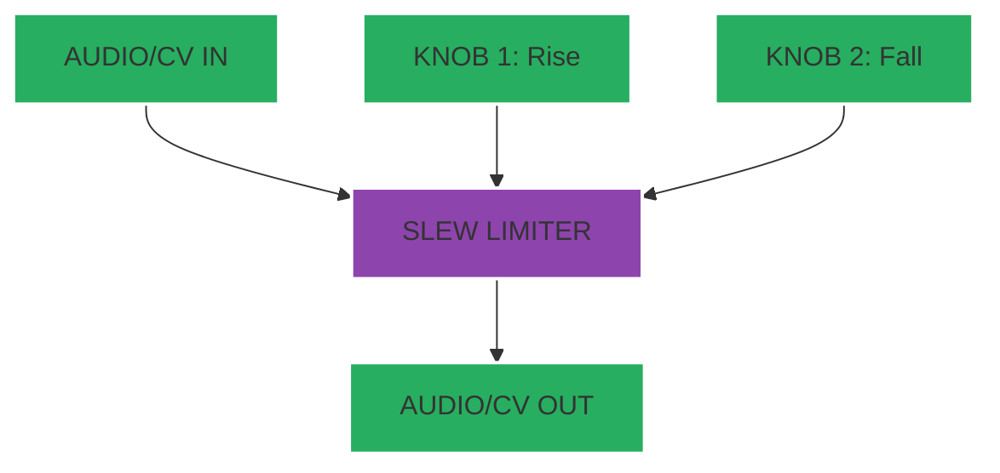

---

## 15. Ring Modulator
**Complexity**: 6/10
**Description**: Sci-fi metallic sounds by multiplying input with an internal oscillator.
**Controls**:
- **Knob 1**: Carrier Frequency
- **Knob 2**: Mix
- **Button 1**: Waveform (Sine/Square)

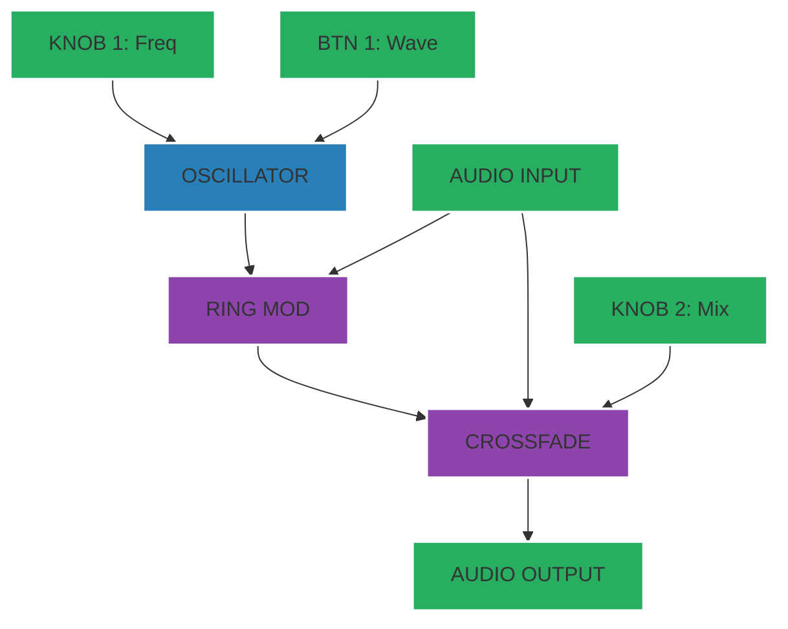
