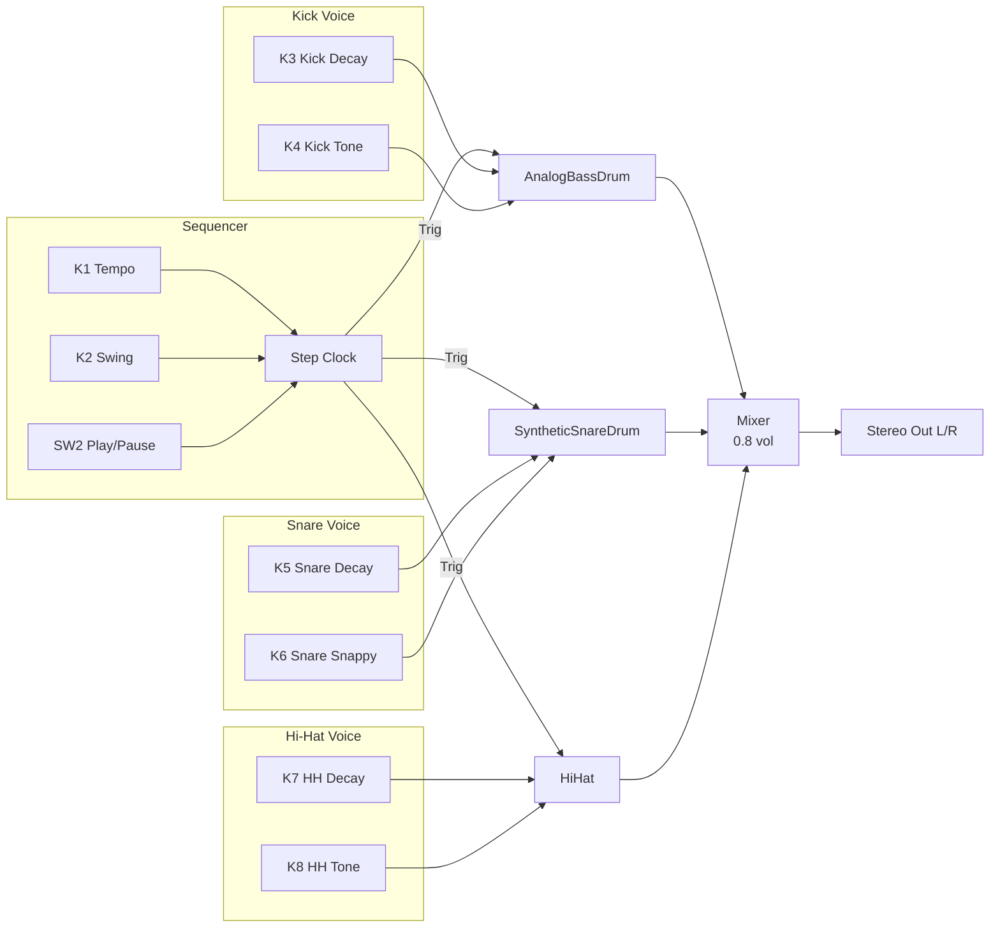
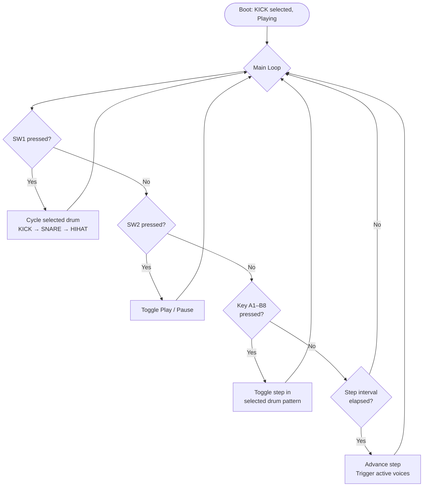

# DrumMachine — Daisy Field

16-step drum machine with 3 voices: `AnalogBassDrum`, `SyntheticSnareDrum`, `HiHat<>`.
Voices run on the Daisy Field with a 16-key step sequencer, swing timing, and live OLED feedback.

Build: `make clean && make` — Flash: `make program`

---

## Controls

All 8 knobs are always active (no page switching — knobs are always live).

| Knob | Parameter     | Range              | Notes                           |
|------|---------------|--------------------|---------------------------------|
| K1   | Tempo         | 40–240 BPM         | Linear; 120 BPM ≈ K1=0.40      |
| K2   | Swing         | 0–50%              | Delays every other 16th note    |
| K3   | Kick Decay    | 0.0–1.0            | Short = punchy, long = boomy    |
| K4   | Kick Tone     | 0.0–1.0            | Low = sub, high = click         |
| K5   | Snare Decay   | 0.0–1.0            | Short = tight, long = open      |
| K6   | Snare Snappy  | 0.0–1.0            | Noise content / rattle amount   |
| K7   | Hi-Hat Decay  | 0.0–1.0            | Short = closed, long = open     |
| K8   | Hi-Hat Tone   | 2000–8000 Hz       | Dark metallic ↔ bright airy     |

---

## Switches

| Switch | Function                          | Notes                          |
|--------|-----------------------------------|--------------------------------|
| SW1    | Cycle selected drum               | KICK → SNARE → HIHAT → KICK   |
| SW2    | Play / Pause                      | OLED shows `[STOP]` when paused |

---

## Keyboard (16 Steps)

Keys A1–B8 map to sequencer steps 1–16 for the **currently selected drum**.
SW1 changes which drum's pattern is displayed and edited.

| LED State  | Meaning                                      |
|------------|----------------------------------------------|
| Dim (10%)  | Step off                                     |
| Mid (50%)  | Step on                                      |
| Full (100%)| Current playhead position (during playback)  |

**Default patterns on boot:**
- Kick: 4-on-the-floor (steps 1, 5, 9, 13)
- Snare: Backbeat (steps 5, 13)
- Hi-Hat: 8th notes (steps 1, 3, 5, 7, 9, 11, 13, 15)

---

## OLED Display

128×64 px, updated every main loop cycle (~5 ms).

| Row     | Content                                                    |
|---------|------------------------------------------------------------|
| y=0     | `DRUM MACHINE` (playing) or `DRUMS [STOP]` (paused)       |
| y=12    | Selected drum name + BPM + Swing — e.g. `KICK 128BPM Sw:30%` |
| y=24–34 | Pattern boxes, steps 1–8 (filled = on, cursor = playhead) |
| y=38–48 | Pattern boxes, steps 9–16                                  |
| y=54    | Current step counter — e.g. `Step: 5/16`                  |

Knob LEDs reflect raw knob position (brightness = knob value).

---

## Signal Flow



---

## Interaction Flow



---

## Patch Examples

Knob values are 0.0–1.0 (physical position). BPM shown for reference.

### Patch 1: Classic House 4/4

Tight, punchy kick with crisp high-hat. No swing.

| Knob | Param        | Value | Notes             |
|------|--------------|-------|-------------------|
| K1   | Tempo        | 0.44  | 128 BPM           |
| K2   | Swing        | 0.00  | Straight           |
| K3   | Kick Decay   | 0.50  | Medium punch      |
| K4   | Kick Tone    | 0.30  | Low-mid thump     |
| K5   | Snare Decay  | 0.30  | Short snap        |
| K6   | Snare Snappy | 0.70  | Crisp rattle      |
| K7   | HH Decay     | 0.20  | Tight closed hat  |
| K8   | HH Tone      | 0.80  | Bright (~6800 Hz) |

Pattern: Kick on 1/5/9/13, Snare on 5/13, HH on all odd steps.

---

### Patch 2: Slow Hip-Hop Groove

Swung feel, deep kick, dark low-freq hi-hat.

| Knob | Param        | Value | Notes              |
|------|--------------|-------|--------------------|
| K1   | Tempo        | 0.23  | 85 BPM             |
| K2   | Swing        | 0.60  | Heavy swing (30%)  |
| K3   | Kick Decay   | 0.70  | Long, rolling      |
| K4   | Kick Tone    | 0.15  | Deep sub           |
| K5   | Snare Decay  | 0.45  | Medium open snap   |
| K6   | Snare Snappy | 0.30  | Warm, less rattle  |
| K7   | HH Decay     | 0.40  | Half-open hat      |
| K8   | HH Tone      | 0.20  | Dark (~3200 Hz)    |

Pattern: Kick on 1/9/13, Snare on 5/13, HH on odd steps with a few gaps.

---

### Patch 3: Hard Techno

Fast tempo, hard kick tone, metallic clipped hat. Kick-only pattern.

| Knob | Param        | Value | Notes               |
|------|--------------|-------|---------------------|
| K1   | Tempo        | 0.50  | 140 BPM             |
| K2   | Swing        | 0.00  | Straight grid       |
| K3   | Kick Decay   | 0.35  | Short, tight        |
| K4   | Kick Tone    | 0.70  | Hard transient click|
| K5   | Snare Decay  | 0.20  | Very tight          |
| K6   | Snare Snappy | 0.50  | Balanced rattle     |
| K7   | HH Decay     | 0.15  | Very short closed   |
| K8   | HH Tone      | 0.60  | Metallic (~5600 Hz) |

Pattern: Kick on 1/3/5/9/11/13, Snare on 5/13, HH on every step.

---

## Build & Flash

```bash
cd DaisyExamples/MyProjects/_projects/DrumMachine
make clean && make
make program          # ST-Link (primary)
make program-dfu      # DFU (fallback only)
```
