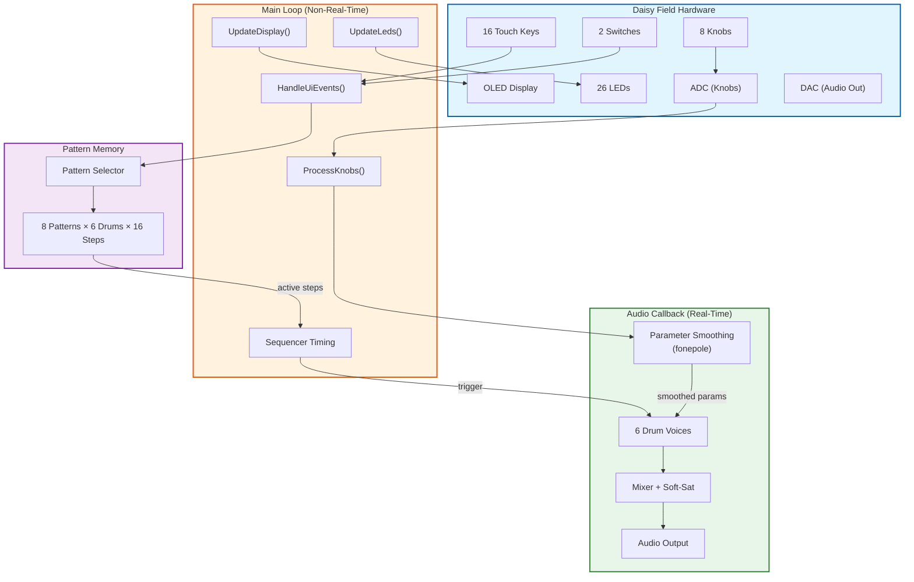
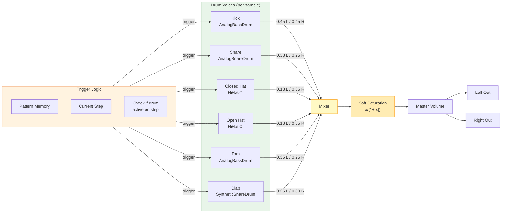
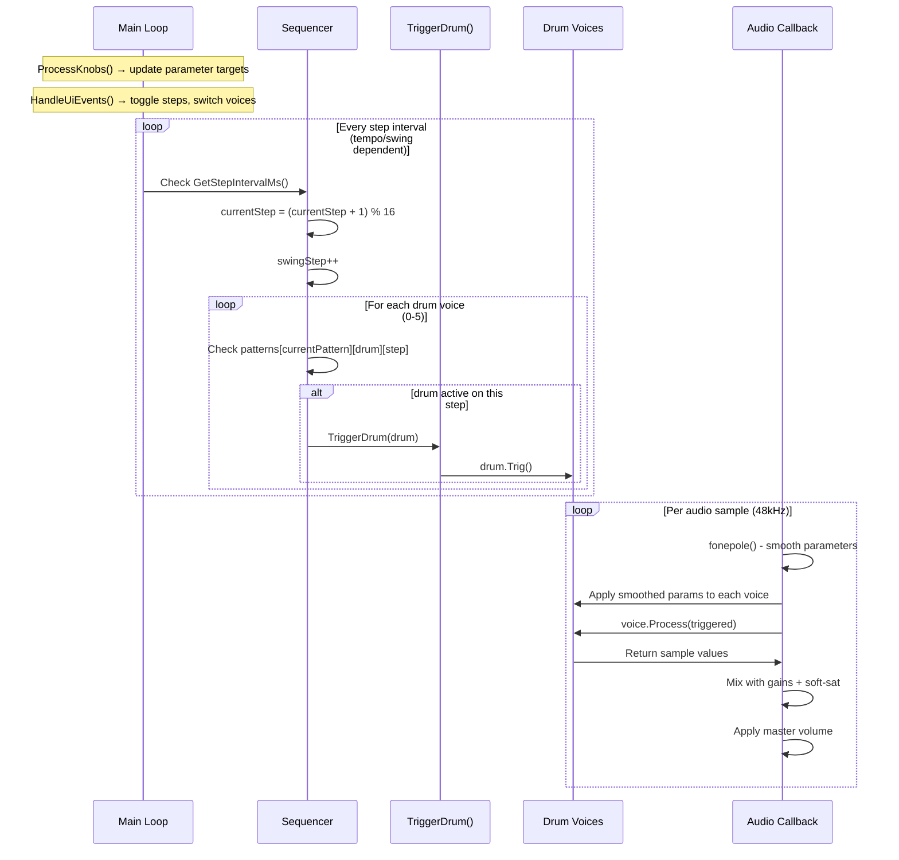
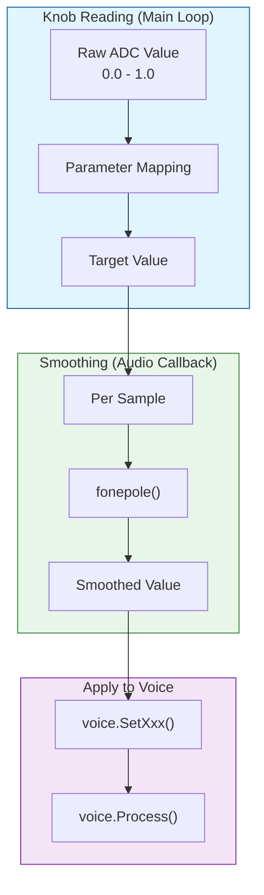

# FieldOpus_DrumMachinePro

**Platform**: Daisy Field  
**Category**: Drum Machine / Step Sequencer  
**Complexity**: ★★★☆☆ (Intermediate)  
**Origin**: Rewrite of `Field_DrumMachinePro` (Pod build) — now properly targeting Daisy Field

---

## Overview

A **6-voice, 16-step drum machine** with 8 pattern memory slots for the Daisy Field platform. Features proper Field HAL integration with OLED display, 16 capacitive touch keys for step editing, 8 knobs for parameter control, and correct swing implementation.

### What was fixed from the original

| Issue | Original (Pod build) | This version (Field) |
|-------|---------------------|----------------------|
| Platform | `daisy_pod.h` / DaisyPod | `daisy_field.h` / DaisyField |
| Swing | Drops beats (broken) | Proportional delay (correct) |
| Gain staging | Hard-clip at ±0.95 | Soft-saturation (tanh) |
| Tom voice | SyntheticSnareDrum (wrong) | AnalogBassDrum at higher pitch |
| Snare voice | SyntheticSnareDrum | AnalogSnareDrum (authentic) |
| Pattern slots | 1 (hardcoded) | 8 |
| Default patterns | All empty | 4 preset grooves loaded |
| OLED display | None | Full grid + BPM + voice display |
| Keys | 2 buttons + encoder | 16 capacitive touch keys |
| Knobs | 2 (4-page menu) | 8 direct-mapped |
| Boot | Blocks without serial | Non-blocking |
| Parameter smoothing | None | Per-sample fonepole |

---

## Features

- 6 drum voices (Kick, Snare, Closed HiHat, Open HiHat, Tom, Clap)
- 16-step sequencer with visual grid on OLED
- 8 pattern memory slots (4 pre-loaded with genre grooves)
- Adjustable tempo (40–240 BPM)
- Swing control (0–50%) with correct proportional delay
- Per-sample parameter smoothing (no zipper noise)
- Soft-saturation mix bus (no harsh digital clipping)
- Full LED feedback on all 16 keys + 8 knobs + 2 switches

---

## Control Mapping

### Touch Keyboard

| Control | Function |
|---------|----------|
| **Keys A1–A8** | Toggle steps 1–8 for selected drum voice |
| **Keys B1–B8** | Toggle steps 9–16 for selected drum voice |
| **SW1** | Cycle drum voice: Kick → Snare → C.Hat → O.Hat → Tom → Clap |
| **SW2** | Play / Stop |

### Knob Controls

| Knob | Parameter | Range | Description |
|------|-----------|-------|-------------|
| **K1** | Kick Decay | 0.1–1.0s | Kick drum decay time |
| **K2** | Snare Decay | 0.1–1.0s | Snare drum decay time |
| **K3** | HiHat Decay | 0.05–0.55s (closed) / 0.1–1.0s (open) | Both hihats share this knob |
| **K4** | Tom Tune | 80–300 Hz | Tom pitch |
| **K5** | Clap Decay | 0.1–1.0s | Clap decay time |
| **K6** | Master Vol | 0–100% | Output level with soft saturation |
| **K7** | Tempo | 40–240 BPM | Sequence speed |
| **K8** | Swing | 0–50% | Delays odd 16th-notes for groove |

### OLED Display

```
DRUM PRO  P1          ← Pattern number
KICK 120BPM Sw:0%     ← Voice / tempo / swing
[■][■][□][□][■][■][□][□]  ← Steps 1-8 grid
[■][□][□][□][■][□][□][□]  ← Steps 9-16 grid
PLAY  Step:5/16       ← Transport state
```

---

## Drum Voices

| Voice | DaisySP Class | Synthesis | Stereo Pan |
|-------|---------------|-----------|------------|
| **Kick** | AnalogBassDrum | Analog-modeled resonant filter + envelope | Center |
| **Snare** | AnalogSnareDrum | Analog-modeled body + noise snare wires | Left-Center |
| **C.Hat** | HiHat<> | Metallic square noise burst | Right |
| **O.Hat** | HiHat<> | Metallic noise with longer decay | Right |
| **Tom** | AnalogBassDrum | Analog kick model at higher pitch (80–300Hz) | Left-Center |
| **Clap** | SyntheticSnareDrum | High-freq body + high snappy noise | Center-Right |

---

## Preset Patterns

### Pattern 1: Basic 4/4 Rock (Default)
```
KICK:  X . . . X . . . X . . . X . . .
SNARE: . . . . X . . . . . . . X . . .
C.HAT: X . X . X . X . X . X . X . X .
O.HAT: . . . . . . . . . . . . . . . .
TOM:   . . . . . . . . . . . . . . . .
CLAP:  . . . . . . . . . . . . . . . .
```

### Pattern 2: House
```
KICK:  X . . . X . . . X . . . X . . .
SNARE: . . . . X . . . . . . . X . . .
C.HAT: . . X . . . X . . . X . . . X .
O.HAT: . . . . . . . X . . . . . . . X
TOM:   . . . . . . . . . . . . . . . .
CLAP:  . . . . X . . . . . . . X . . .
```

### Pattern 3: Breakbeat
```
KICK:  X . . . . . X . . . X . . . . .
SNARE: . . . . X . . . . . . . X . . X
C.HAT: . X . X . X . X . X . X . X . X
O.HAT: X . . . . . . . X . . . . . . .
TOM:   . . . . . . . . . . . . . X X .
CLAP:  . . . . X . . . . . . . X . . .
```

### Pattern 4: Techno
```
KICK:  X . . X . . X . X . . X . . X .
SNARE: . . . . . . . . . . . . . . . .
C.HAT: . X . X . X . X . X . X . X . X
O.HAT: . . X . . . X . . . X . . . X .
TOM:   . . . . X . . . . . . . X . . .
CLAP:  . . . . . . . . X . . . . . . .
```

Patterns 5–8 are empty — program your own!

---

## Technical Specifications

| Specification | Value |
|---------------|-------|
| Sample Rate | 48 kHz |
| Block Size | 48 samples (1ms latency) |
| Audio Mode | Non-interleaved (Field standard) |
| CPU Budget | ~10–18% estimated (6 lightweight voices) |
| Mix Bus | Soft-saturation via `x/(1+|x|)` — no hard clipping |
| Parameter Smoothing | `fonepole()` per-sample at 0.002 coefficient |
| Sequencer Timing | Main-loop ms-based (not audio-rate Metro) |
| Swing Method | Proportional step interval: odd steps × (1+swing) |

### Gain Staging

Individual voice gains are reduced to prevent mix overflow:

| Voice | Left Gain | Right Gain |
|-------|-----------|------------|
| Kick | 0.45 | 0.45 |
| Snare | 0.38 | 0.25 |
| C.Hat | 0.18 | 0.35 |
| O.Hat | 0.18 | 0.35 |
| Tom | 0.35 | 0.25 |
| Clap | 0.25 | 0.30 |

**Theoretical max per channel**: ~1.5 before master volume — well within soft-clip range.

---

## Build

```bash
cd DaisyExamples/MyProjects/_projects/FieldOpus_DrumMachinePro
make clean && make
```

### Flash to Daisy Field

```bash
make program-dfu
```

---

## Architecture Notes

### Why main-loop timing instead of Metro?

The original used `Metro::Process()` inside the audio callback for sample-accurate step timing. However, swing requires modifying the interval between steps, and `Metro` fires at a fixed rate. Implementing swing with Metro requires a secondary delay mechanism — the original attempted this with `System::GetNow()` in the audio callback, resulting in dropped beats.

The main-loop approach (as used here and in `DrumMachine.cpp`) calculates a per-step interval that varies based on swing, then advances when the interval expires. This produces correct swing at ~1ms resolution — more than adequate for musical timing (typical MIDI jitter is 1–3ms).

### Why soft-saturation instead of fclamp?

`fclamp(x, -0.95, 0.95)` is a hard limiter that creates harsh distortion when the mix exceeds headroom. With 6 voices, this happened on every beat in the original.

`SoftClip(x) = x / (1 + |x|)` is a smooth saturation curve that:
- Passes small signals unchanged (quasi-linear below ±0.5)
- Gently compresses peaks above ±0.5
- Asymptotically approaches ±1.0 (never hard-clips)
- Adds pleasant harmonic saturation (even harmonics)
- Costs ~3 extra cycles per sample (negligible)

---

## Architecture Diagrams

### Block Diagram: Overall System Architecture



### Audio Signal Flow



### Control Flow: Sequencer



### Control Flow: Parameter Smoothing



---

**Generated per DAISY_EXPERT_SYSTEM_PROMPT_v5.2 guidelines**  
**Project Type**: Hand-coded C++ (16-step sequencer, 8-pattern, 6-voice drum machine)
