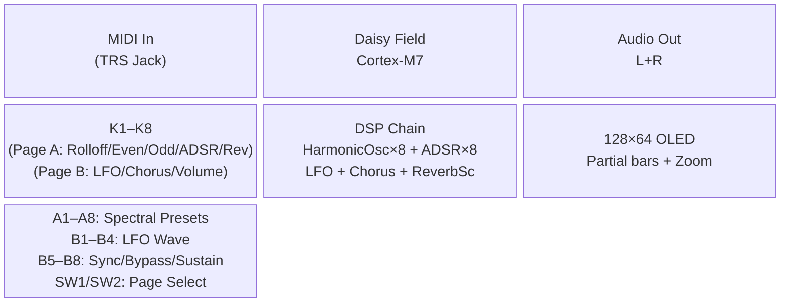
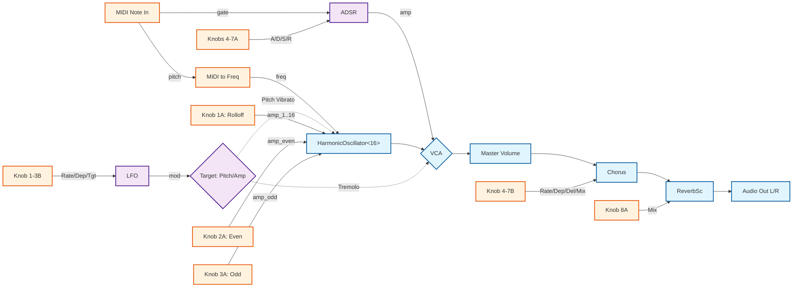
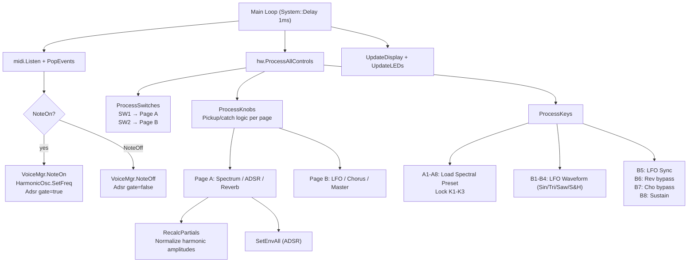

# Field_AdditiveSynth Architecture & Patch Examples

## 1. Block Diagram (System Architecture)

## 2. Signal Flow (Audio Path per Voice)

## 3. Interaction Flow (Control Processing)

---

## 4. Patch Examples

### Patch 1: "Glass Pad"
*A slow, ethereal pad with a bell-like harmonic structure and heavy reverberation.*

| Control | Parameter | Value / Position | Comments |
|---------|-----------|------------------|----------|
| **K1 (A)** | Rolloff | `0.4` | Slow rolloff to preserve higher harmonics |
| **K2 (A)** | Even Harms | `0.1` | Very few even harmonics |
| **K3 (A)** | Odd Harms | `0.9` | Rich odd harmonics (bell-like) |
| **K4 (A)** | Attack | `0.7` (~500ms) | Slow, swelling attack |
| **K6 (A)** | Sustain | `1.0` (100%) | Sustains at full volume |
| **K7 (A)** | Release | `0.8` (~2s) | Long, graceful release |
| **K8 (A)** | Reverb Mix | `0.7` (70%) | Heavy, washing reverberation |
| **K4 (B)** | Chorus Rate | `0.2` (~0.5 Hz) | Very slow, subtle chorus movement |

### Patch 2: "Tremolo Organ"
*A classic tonewheel organ sound with a fast amplitude tremolo.*

| Control | Parameter | Value / Position | Comments |
|---------|-----------|------------------|----------|
| **Key A7** | Preset: Organ | `Active` | Sets flat/even drawbar spectrum |
| **K4 (A)** | Attack | `0.0` (1ms) | Instant attack |
| **K6 (A)** | Sustain | `1.0` (100%) | Full sustain while key held |
| **K7 (A)** | Release | `0.1` (~10ms) | Fast release, similar to real organ |
| **K1 (B)** | LFO Rate | `0.6` (~5 Hz) | Fast rotating speaker speed |
| **K2 (B)** | LFO Depth | `0.8` (80%) | Deep modulation |
| **K3 (B)** | LFO Target | `1.0` (Amp) | Targets amplitude (Tremolo) |
| **K7 (B)** | Chorus Mix | `0.5` (50%) | Adds Leslie-like spatial widening |

### Patch 3: "Wobble Bass"
*An aggressive, low-end focused patch with a synchronized LFO modulating pitch.*

| Control | Parameter | Value / Position | Comments |
|---------|-----------|------------------|----------|
| **Key A3** | Preset: Saw | `Active` | Full 1/n harmonic spectrum |
| **K4 (A)** | Attack | `0.0` (1ms) | Snappy attack |
| **K5 (A)** | Decay | `0.4` (~150ms) | Short, punchy decay |
| **K6 (A)** | Sustain | `0.0` (0%) | Plucky envelope, no sustain |
| **K1 (B)** | LFO Rate | `0.7` (~8 Hz) | Fast wobble |
| **K2 (B)** | LFO Depth | `0.5` (±1 st) | 1 semitone pitch modulation |
| **K3 (B)** | LFO Target | `0.0` (Pitch) | Targets pitch (Vibrato) |
| **Key B5** | LFO Sync | `Active` | LFO resets phase on NoteOn |

### Patch 4: "Spacy Chimes"
*Randomized, aggressive pitch modulation on a pure sine wave, washed in delay and reverb.*

| Control | Parameter | Value / Position | Comments |
|---------|-----------|------------------|----------|
| **Key A1** | Preset: Sine | `Active` | Pure fundamental only |
| **Key B4** | LFO Wave | `Active` | Sample & Hold (Random) waveform |
| **K1 (B)** | LFO Rate | `0.8` (~12 Hz) | Fast, chaotic modulation |
| **K2 (B)** | LFO Depth | `1.0` (±2 st) | Maximum pitch jump depth |
| **K3 (B)** | LFO Target | `0.0` (Pitch) | Targets pitch |
| **K8 (A)** | Reverb Mix | `0.85` (85%) | Drenches the chimes in reverb |
| **K6 (B)** | Cho Delay | `0.9` (90%) | Pushes chorus into delay territory |
