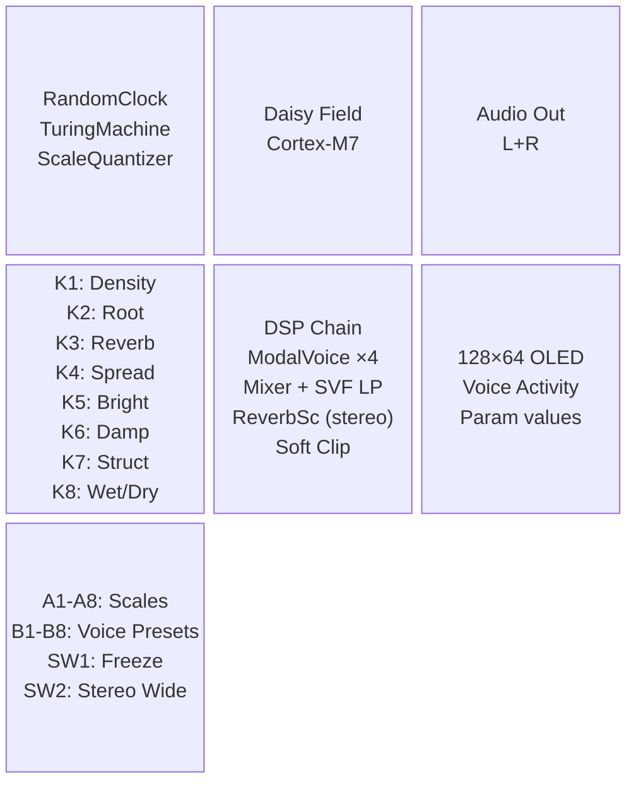
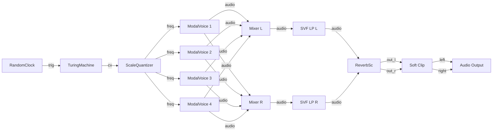
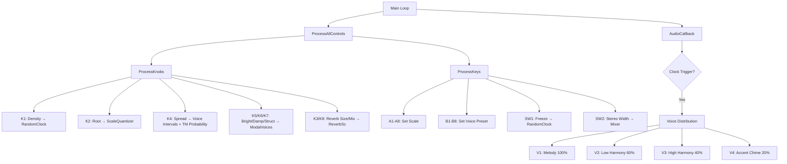

# Field_AmbientGarden — Diagrams & Patch Examples

## 1. Block Diagram (Hardware & Architecture)

---

## 2. Signal Flow (Audio Path)

---

## 3. Interaction Flow (Control Visualization)

---

## 4. Patch Examples

### Patch 1: "Zen Garden"
*A sparse, meditative, and consonant soundscape.*

| Control | Parameter | Value | Comments |
|---------|-----------|-------|----------|
| **Key A1** | Scale | Pentatonic Maj | Safe, consonant, world music feel |
| **Key B1** | Voice Preset | Glass Bells | Crystalline, bright tone |
| **K1** | Density | 0.25 | Sparse, slow generative rhythm |
| **K2** | Root | C (0) | Root note C |
| **K3** | Reverb Size | 0.8 | Large, expansive space |
| **K4** | Harmony Spread | 0.2 | Close harmony, tight intervals |
| **K5** | Brightness | 0.6 | Moderately bright |
| **K6** | Damping | 0.3 | Long decay, notes ring out |
| **K7** | Structure | 0.4 | Slightly metallic timbre |
| **K8** | Wet/Dry | 0.7 | Mostly wet, atmospheric |
| **SW2** | Stereo Width| ON (Wide) | Immersive stereo field |

### Patch 2: "Dark Forest"
*A dark, huge, and slightly melancholic atmosphere.*

| Control | Parameter | Value | Comments |
|---------|-----------|-------|----------|
| **Key A3** | Scale | Minor (Aeolian) | Melancholy, dark feel |
| **Key B8** | Voice Preset | Temple Bowl | Deep, sustained ring |
| **K1** | Density | 0.35 | Moderate activity |
| **K2** | Root | A (9) | Root note A (A minor) |
| **K3** | Reverb Size | 0.9 | Huge space, cathedral-like |
| **K4** | Harmony Spread | 0.6 | Wide intervals, more unpredictable |
| **K5** | Brightness | 0.2 | Dark, muted highs |
| **K6** | Damping | 0.5 | Medium decay |
| **K7** | Structure | 0.7 | Woody, hollow body resonance |
| **K8** | Wet/Dry | 0.8 | Very wet, washed out |
| **SW2** | Stereo Width| ON (Wide) | Immersive stereo field |

### Patch 3: "Gamelan Rain"
*A fast, plucky, and metallic polyrhythmic texture.*

| Control | Parameter | Value | Comments |
|---------|-----------|-------|----------|
| **Key A7** | Scale | Whole Tone | Dreamy, floating |
| **Key B5** | Voice Preset | Gamelan | Metallic, detuned |
| **K1** | Density | 0.7 | Dense, rapid triggers (like rain) |
| **K2** | Root | D (2) | Root note D |
| **K3** | Reverb Size | 0.5 | Medium room, keeps attacks clear |
| **K4** | Harmony Spread | 0.45 | Medium spread |
| **K5** | Brightness | 0.5 | Balanced tone |
| **K6** | Damping | 0.4 | Balanced decay |
| **K7** | Structure | 0.5 | Balanced |
| **K8** | Wet/Dry | 0.5 | 50/50 mix |
| **SW2** | Stereo Width| OFF (Mono) | Focused center image |

### Patch 4: "Frozen Cathedral"
*An almost static, extremely ambient pad texture.*

| Control | Parameter | Value | Comments |
|---------|-----------|-------|----------|
| **Key A4** | Scale | Dorian | Jazz/ambient color |
| **Key B6** | Voice Preset | Wind Chimes | Airy, long tails |
| **K1** | Density | 0.15 | Very sparse, notes play rarely |
| **K2** | Root | E (4) | Root note E |
| **K3** | Reverb Size | 1.0 | Maximum reverb, infinite tail |
| **K4** | Harmony Spread | 0.8 | Very wide harmony, high chaos |
| **K5** | Brightness | 0.7 | Bright, emphasizes upper harmonics |
| **K6** | Damping | 0.15 | Very long decay on the physical model |
| **K7** | Structure | 0.3 | highly metallic |
| **K8** | Wet/Dry | 0.9 | Almost fully wet |
| **SW1** | Freeze | ON | Pauses new notes, lets current ones ring forever |
