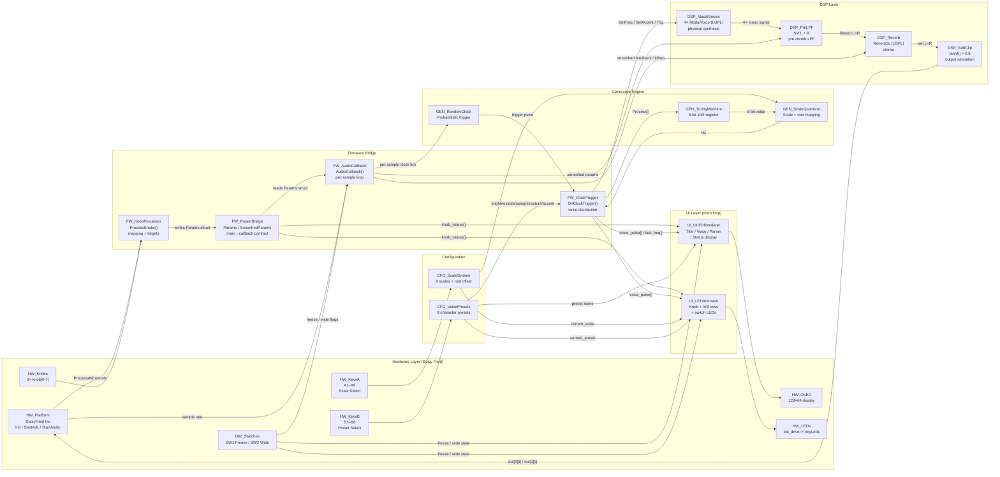

# Noderr Architecture: Field_AmbientGarden Firmware

**Last Updated:** 2026-03-06
**NodeID Count:** 22

---

## System Topology

---

## NodeID Quick Reference

| NodeID | File / Location | Category |
|--------|----------------|----------|
| `HW_Platform` | `Field_AmbientGarden.cpp:39, 373-431` | Hardware |
| `HW_Knobs` | `Field_AmbientGarden.cpp:233-242` | Hardware |
| `HW_KeysA` | `Field_AmbientGarden.cpp:445-456` | Hardware |
| `HW_KeysB` | `Field_AmbientGarden.cpp:460-478` | Hardware |
| `HW_Switches` | `Field_AmbientGarden.cpp:483-494` | Hardware |
| `HW_OLED` | `Field_AmbientGarden.cpp:513-584` | Hardware |
| `HW_LEDs` | `Field_AmbientGarden.cpp:589-607` | Hardware |
| `GEN_TuringMachine` | `turing_machine.h` | Generative |
| `GEN_ScaleQuantizer` | `scale_quantizer.h` | Generative |
| `GEN_RandomClock` | `random_clock.h` | Generative |
| `DSP_ModalVoices` | `Field_AmbientGarden.cpp:49, 399-409` | DSP (LGPL) |
| `DSP_PreLPF` | `Field_AmbientGarden.cpp:51-52, 416-425` | DSP |
| `DSP_Reverb` | `Field_AmbientGarden.cpp:50, 412-414` | DSP (LGPL) |
| `DSP_SoftClip` | `Field_AmbientGarden.cpp:361-362` | DSP |
| `FW_AudioCallback` | `Field_AmbientGarden.cpp:278-364` | Firmware |
| `FW_ParamBridge` | `Field_AmbientGarden.cpp:80-104` | Firmware |
| `FW_ClockTrigger` | `Field_AmbientGarden.cpp:163-223` | Firmware |
| `FW_KnobProcessor` | `Field_AmbientGarden.cpp:229-272` | Firmware |
| `UI_OLEDRenderer` | `Field_AmbientGarden.cpp:509-584` | UI |
| `UI_LEDAnimator` | `Field_AmbientGarden.cpp:589-607` | UI |
| `CFG_VoicePresets` | `Field_AmbientGarden.cpp:110-128` | Config |
| `CFG_ScaleSystem` | `scale_quantizer.h + cpp:61, 257` | Config |
