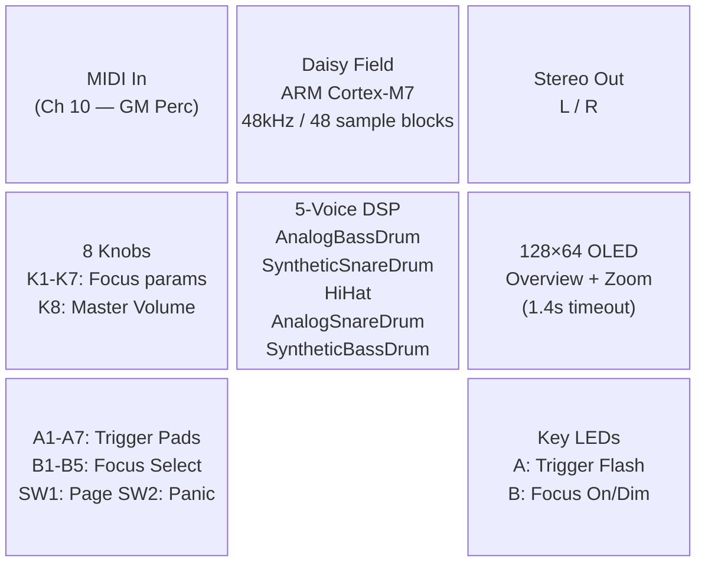
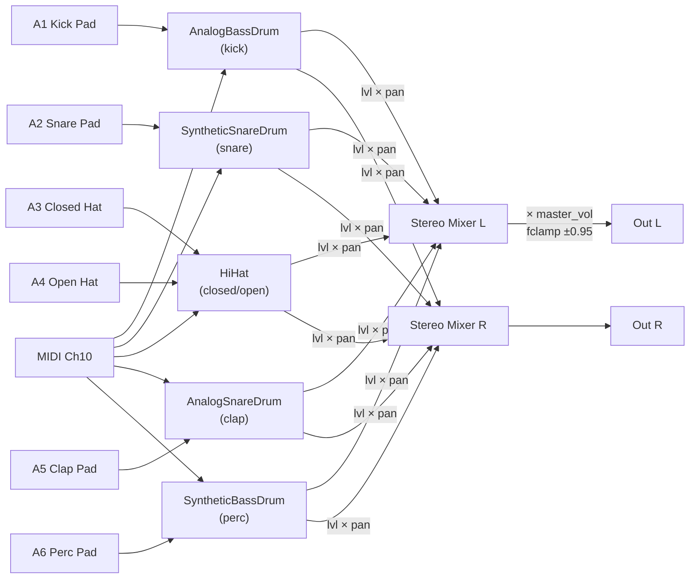
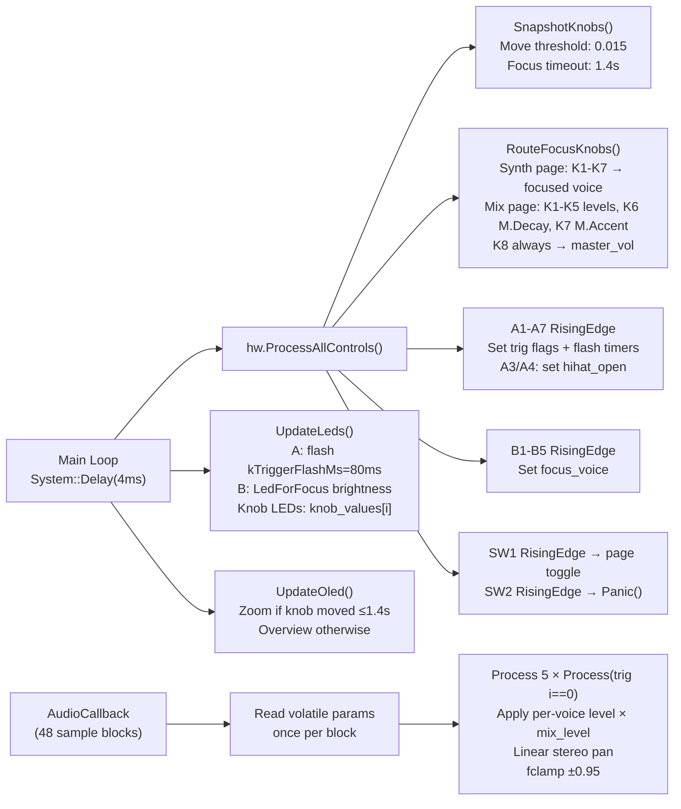

# DIAGRAMS — Field_DrumLab

## 1. System Architecture

---

## 2. Signal Flow

**HiHat choke**: A3 (closed) sets `hihat_open = false` before triggering — A4 (open) sets `hihat_open = true`. Decay in the audio callback uses `open_hat ? 0.7f : v_decay[HiHat]`.

---

## 3. Control Flow

