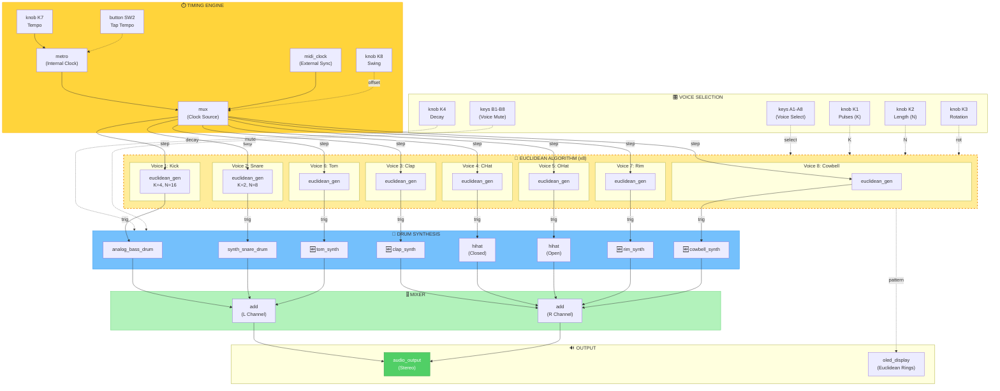

# Field_EuclideanRhythmist

**Platform**: Daisy Field  
**Category**: Algorithmic Sequencer / Drum Machine  
**Complexity**: High (Algorithmic Logic)

---

## Project Definition

An **8-channel Euclidean rhythm sequencer** that generates drum patterns using the Euclidean algorithm. Each channel controls a different drum voice, and users can adjust the number of pulses, sequence length, and rotation for each.

### What is a Euclidean Rhythm?
The Euclidean algorithm distributes `K` pulses as evenly as possible across `N` steps. For example:
- `E(3, 8)` = `[X . . X . . X .]` (Cuban Tresillo)
- `E(4, 16)` = `[X . . . X . . . X . . . X . . .]` (4-on-the-floor)
- `E(5, 8)` = `[X . X X . X X .]` (Bossa Nova)

### Features
- 8 drum voices (Kick, Snare, Clap, HiHat Closed, HiHat Open, Tom, Rim, Cowbell)
- Per-voice Euclidean parameters: Pulses (K), Length (N), Rotation (offset)
- Global tempo with tap tempo
- Internal clock or external MIDI sync
- OLED: Circular Euclidean ring visualization

### Control Mapping

| Control | Function | Range |
|---------|----------|-------|
| **Knob 1** | Pulses (K) for selected voice | 0-16 |
| **Knob 2** | Length (N) for selected voice | 1-16 |
| **Knob 3** | Rotation for selected voice | 0 to N-1 |
| **Knob 4** | Voice Decay | 0-100% |
| **Knob 5-6** | Voice Tone/Tune | Varies |
| **Knob 7** | Tempo | 40-240 BPM |
| **Knob 8** | Swing | 0-50% |
| **Keys A1-A8** | Select voice 1-8 | Toggle |
| **Keys B1-B8** | Mute voice 1-8 | Toggle |
| **SW1** | Play/Stop | Toggle |
| **SW2** | Tap Tempo | Tap |

### Hardware Constraints
- Sample Rate: 48kHz
- Block Size: 48 samples
- Audio: Stereo Out (L = Kick/Snare/Tom, R = HiHat/Clap/Rim)
- MIDI: Clock Sync In (optional)

---

## Block Diagram (Mermaid)

This is the **source of truth** for the signal flow. C++ implementation MUST match this diagram.

### Block Legend
| Color | Meaning |
|-------|---------|
| 🟡 **Yellow** | Timing/Clock Engine |
| 🟠 **Orange Dashed** | Euclidean Algorithm (Custom Logic) |
| 🔵 **Blue** | Drum Synthesis (DaisySP) |
| 🟢 **Green** | Mixer / Output |

---

## DVPE Gap Analysis (Pre-Implementation)

**Expected Rating**: 4/10

### Identified Gaps

| Block | Status | Notes |
|-------|--------|-------|
| `analog_bass_drum` | ✅ Exists | DaisySP |
| `synth_snare_drum` | ✅ Exists | DaisySP |
| `hihat` | ✅ Exists | DaisySP |
| `metro` | ✅ Exists | Clock source |
| `midi_clock` | ⚠️ Partial | MIDI blocks exist, clock sync may need work |
| **`euclidean_gen`** | ❌ **MISSING** | Core algorithm block |
| `clap_synth` | ❌ Missing | No dedicated clap in DaisySP |
| `tom_synth` | ❌ Missing | No dedicated tom in DaisySP |
| `rim_synth` | ❌ Missing | No dedicated rim in DaisySP |
| `cowbell_synth` | ❌ Missing | No dedicated cowbell in DaisySP |
| `swing` | ⚠️ Partial | Needs custom timing offset logic |

**Critical Gap**: The `euclidean_gen` block (the core Euclidean rhythm generator) does not exist in DVPE. This is pure algorithmic logic, not signal flow.

---

## C++ Implementation

### Implementation Status
- ✅ Internal clock with tap tempo (SW2)
- ✅ Swing applied to even/odd 16th steps
- ✅ Bjorklund-based Euclidean pattern generation per voice
- ✅ OLED ring visualization for the selected voice
- ⚠️ External MIDI clock sync not implemented yet
