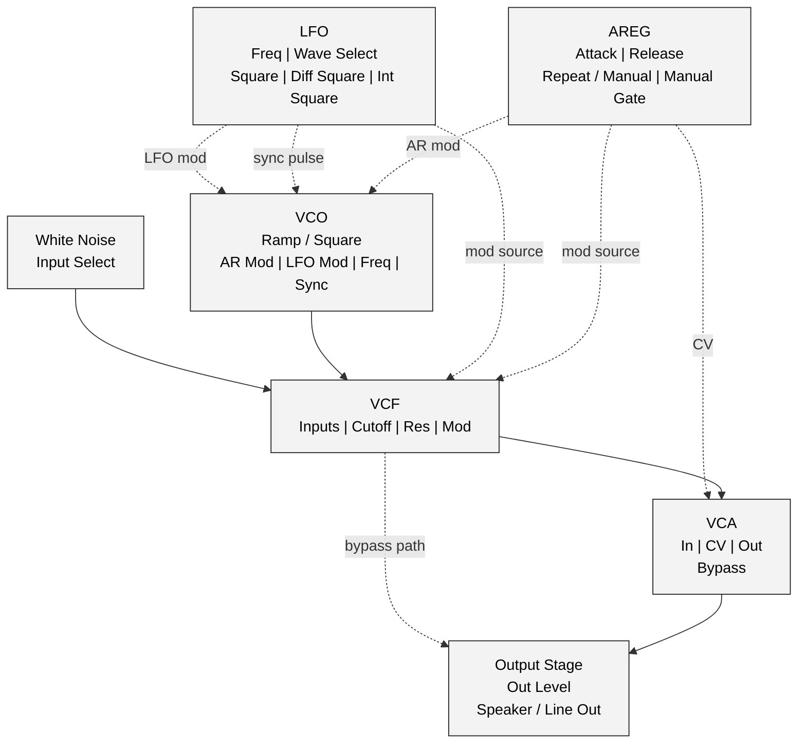
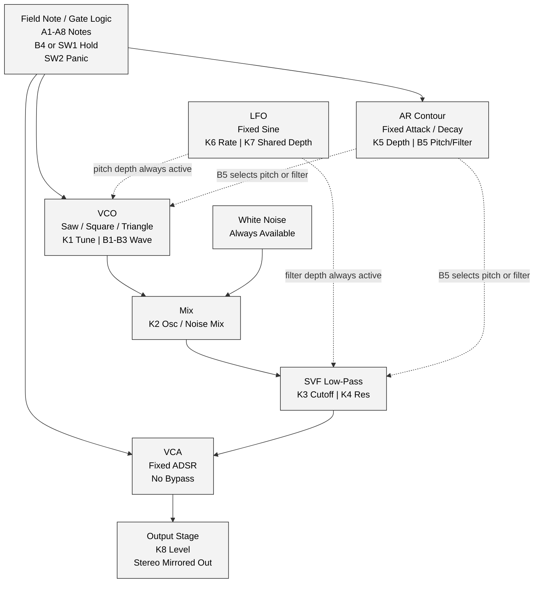
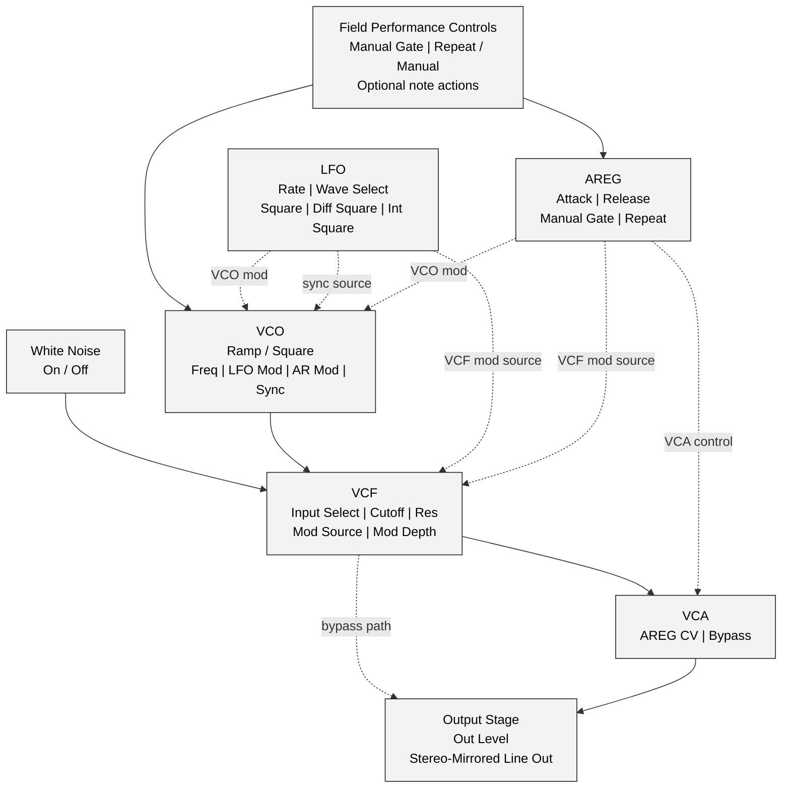
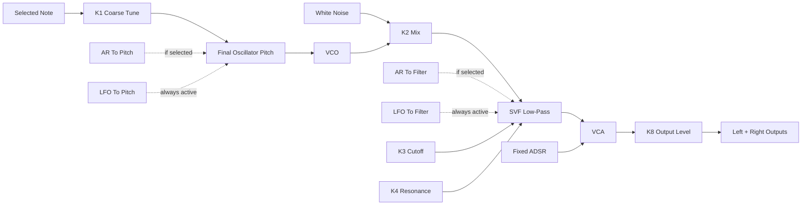
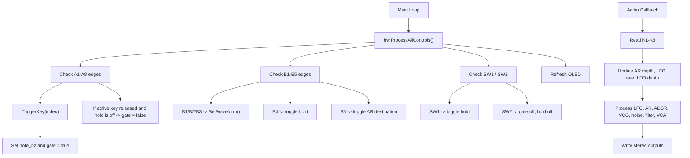

# Field_MFOS_NoiseToaster Diagrams

## 1. Analog Reference Redraw

This Mermaid redraw is based on Figure 4-2 from the MFOS Noise Toaster reference. It is the analog guiding-star architecture, not the current Daisy Field firmware.

## 2. Current Firmware Block Diagram

This block diagram is a 1:1 representation of the current `Field_MFOS_NoiseToaster.cpp` firmware, drawn in the same style as the analog reference rather than the same architecture.

## 3. Target Post-Improvement Block Diagram

This target diagram shows the closest practical Daisy Field adaptation to the analog Figure 4-2 architecture after the highest-value faithfulness improvements are applied. It is not the current firmware.

## 4. Audio Signal Flow

## 5. Control And Event Flow

## 6. Documentation Notes

- The current firmware has one shared LFO depth control, not separate routing buttons.
- The AR contour destination is switchable, but the LFO destination is not.
- `SW1` and `B4` both control the same hold state.
- The analog reference redraw is based on the Ray Wilson PDF and the included `4-2_Noise_Toaster_Block_Diagram.png`.
- The current-firmware block diagram is intentionally less faithful to the analog architecture than the reference redraw, because it reflects the code as it exists today.
- The target post-improvement diagram is a planning aid only and must not be read as a statement about current firmware behavior.
