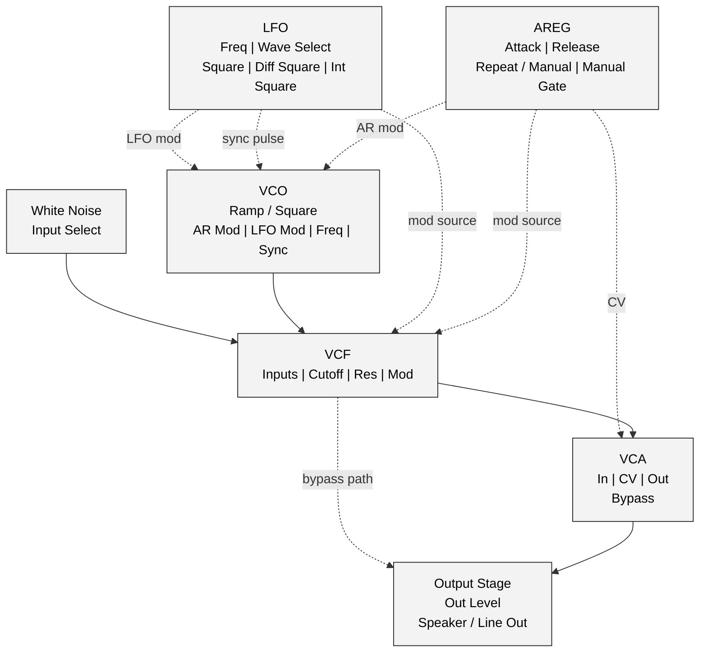
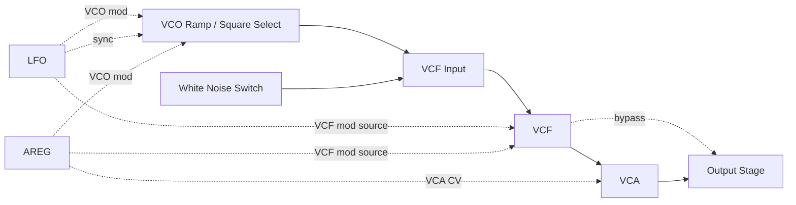
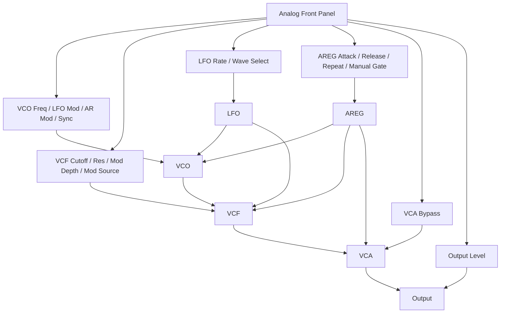
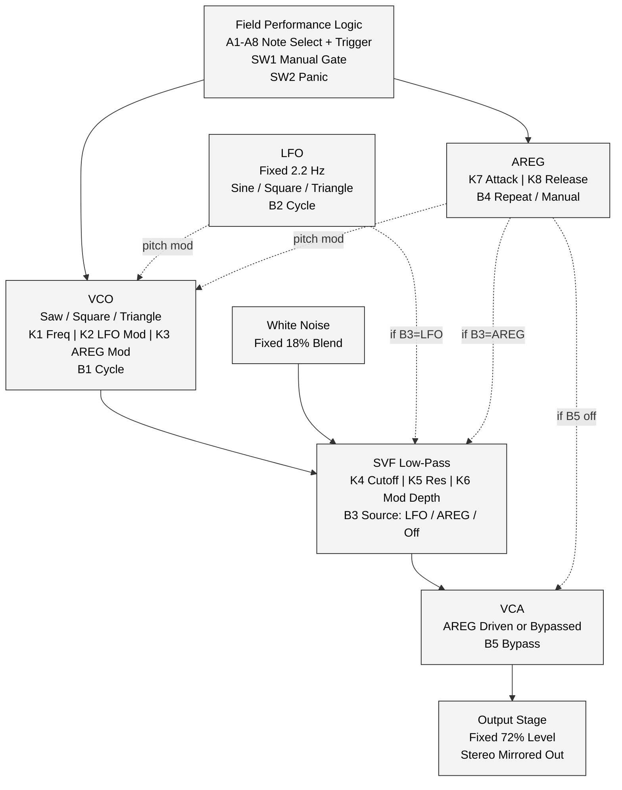
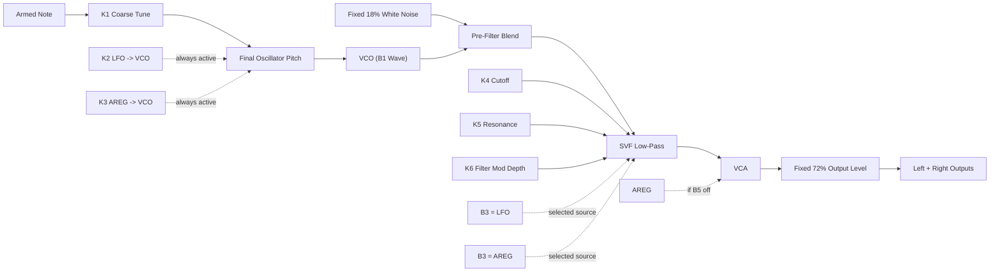
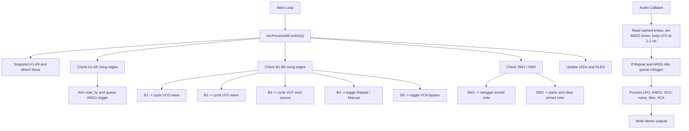
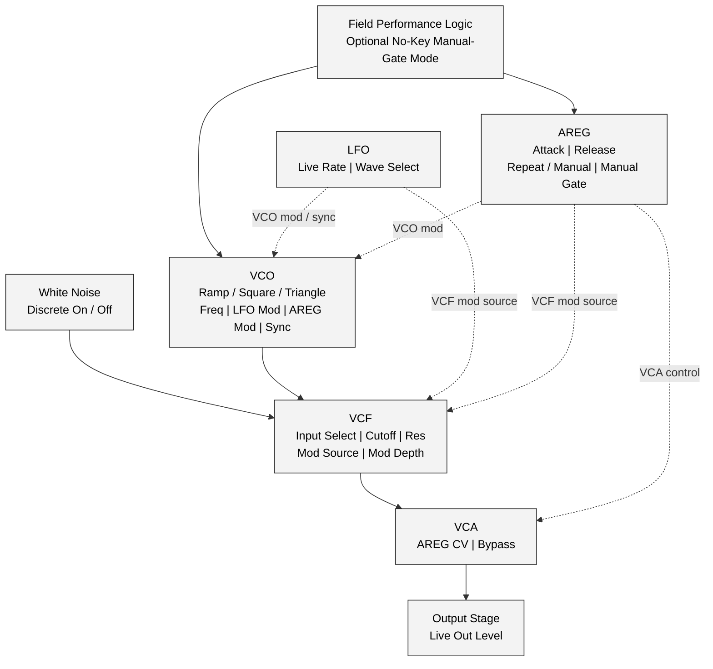

# Field_MFOS_NoiseToaster Diagrams

## 1. Analog Reference Redraw

This Mermaid redraw is based on Figure 4-2 from the MFOS Noise Toaster reference. It is the analog guiding-star architecture, not the current Daisy Field firmware.

## 2. Analog Reference Audio Signal Flow

## 3. Analog Reference Control And Event Flow

## 4. Current Firmware Block Diagram

This block diagram is a 1:1 representation of the current `Field_MFOS_NoiseToaster.cpp` firmware.

## 5. Current Firmware Audio Signal Flow

## 6. Current Firmware Control And Event Flow

## 7. Next Faithfulness Target

This target diagram shows the next logical step after the current firmware if the project keeps moving toward the analog panel.

## 8. Documentation Notes

- The current firmware now implements the analog-style `Repeat / Manual`, `Manual Gate`, `VCF mod source`, `VCA bypass`, and live `AREG` timing controls.
- The current firmware still uses a fixed white-noise blend, a fixed LFO rate, and a fixed output level.
- The current block and flow diagrams are intended to be literal reflections of the code, not aspirational sketches.
