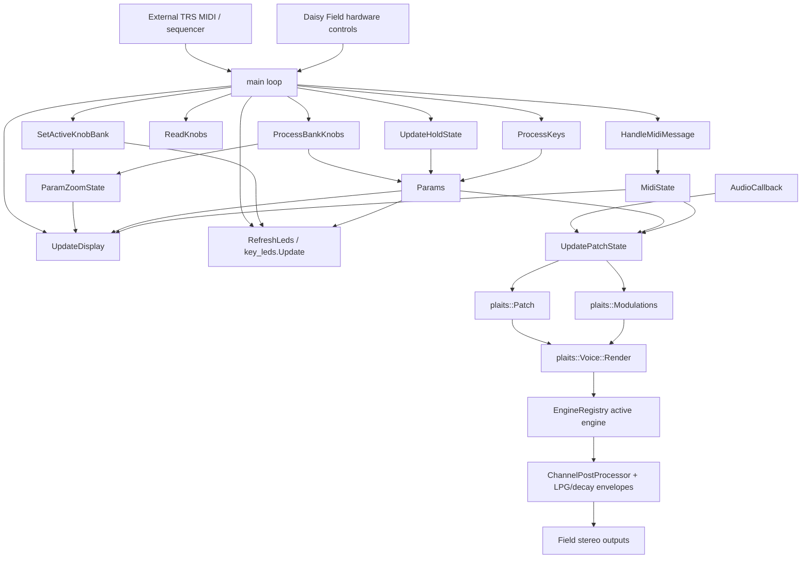
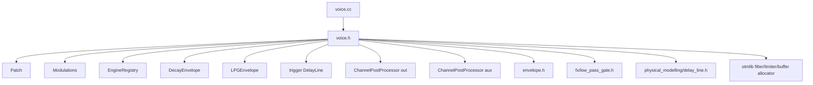
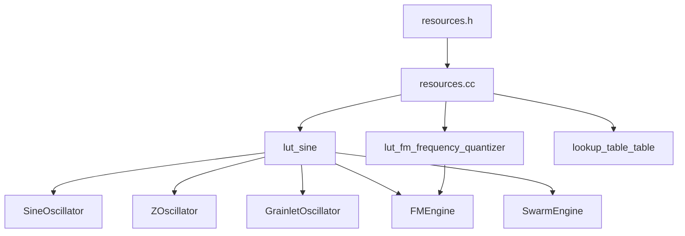
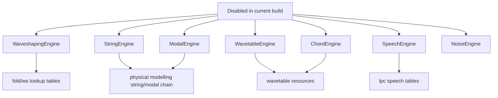
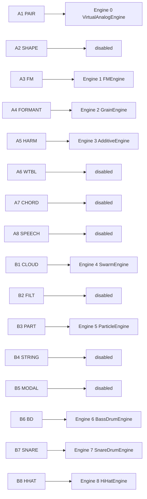

# Field_MI_Plaits Dependencies

This document tracks the code dependencies for the current `Field_MI_Plaits` Daisy Field build.

Scope:
- This is the dependency view for the current compiled project in `DaisyExamples/MyProjects/_projects/Field_MI_Plaits`.
- It focuses on build inputs, runtime flow, active Plaits engine dependencies, the banked-parameter helper layer, and the resource tables that are still relevant to the reduced-engine build.
- It does not attempt to fully diagram every unused file still present in `PlaitsPatchInit`; disabled engines and disabled resource families are shown separately.

## 1. Build And Link Dependency Graph

```mermaid
flowchart TD
    MK[Field_MI_Plaits/Makefile]

    APP[Field_MI_Plaits.cpp]
    FD[field_defaults.h]
    PFB[field_parameter_banks.h]
    FI[field_instrument_ui.h]
    DF[daisy_field.h / libDaisy]
    DSP[daisysp.h / DaisySP]

    VH[plaits/dsp/voice.h]
    VC[plaits/dsp/voice.cc]
    RH[plaits/resources.h]
    RC[plaits/resources.cc]

    STU[stmlib/dsp/units.cc]
    STR[stmlib/utils/random.cc]

    E1[virtual_analog_engine.cc]
    E2[fm_engine.cc]
    E3[grain_engine.cc]
    E4[additive_engine.cc]
    E5[swarm_engine.cc]
    E6[particle_engine.cc]
    E7[bass_drum_engine.cc]
    E8[snare_drum_engine.cc]
    E9[hi_hat_engine.cc]

    LIB[libDaisy static library]
    DSPLIB[DaisySP static library]

    MK --> APP
    MK --> VC
    MK --> RC
    MK --> STU
    MK --> STR
    MK --> E1
    MK --> E2
    MK --> E3
    MK --> E4
    MK --> E5
    MK --> E6
    MK --> E7
    MK --> E8
    MK --> E9
    MK --> LIB
    MK --> DSPLIB

    APP --> FD
    APP --> PFB
    APP --> FI
    APP --> DF
    APP --> DSP
    APP --> VH

    FI --> FD
    FI --> DF

    VC --> VH
    RC --> RH

    VH --> RH
    VH --> E1
    VH --> E2
    VH --> E3
    VH --> E4
    VH --> E5
    VH --> E6
    VH --> E7
    VH --> E8
    VH --> E9

    APP --> LIB
    APP --> DSPLIB
```



## 2. Runtime Control And Audio Flow



## 3. Field Application File-Level Dependency Graph

```mermaid
flowchart LR
    subgraph FieldApp[Field_MI_Plaits.cpp]
        MAIN2[main()]
        LOOP[main loop helpers]
        CB[AudioCallback]
        DRAW[OLED draw helpers]
    end

    subgraph Helpers[Field helper headers]
        FD2[field_defaults.h]
        PFB2[field_parameter_banks.h]
        FI2[field_instrument_ui.h]
        LEDBANK[OneHotKeyLedBank]
        ZOOM[ParamZoomState]
        FORMAT[FormatPercent / note-name helpers]
    end

    subgraph PlaitsCore[Plaits wrapper objects]
        VOBJ[plaits::Voice]
        POBJ[plaits::Patch]
        MOBJ[plaits::Modulations]
        AFR[plaits::Voice::Frame buffer]
    end

    MAIN2 --> LOOP
    MAIN2 --> CB
    LOOP --> DRAW

    MAIN2 --> FD2
    MAIN2 --> PFB2
    MAIN2 --> FI2
    FI2 --> LEDBANK
    FI2 --> ZOOM
    FD2 --> FORMAT

    MAIN2 --> VOBJ
    MAIN2 --> POBJ
    MAIN2 --> MOBJ
    CB --> AFR
    CB --> VOBJ
    LOOP --> POBJ
    LOOP --> MOBJ
```

## 4. Plaits Voice Dependency Graph



## 5. Active Engine Dependency Graph

```mermaid
flowchart TD
    REG2[Voice EngineRegistry]

    VA[VirtualAnalogEngine]
    FM[FMEngine]
    GRAIN[GrainEngine]
    ADD[AdditiveEngine]
    SWARM[SwarmEngine]
    PART[ParticleEngine]
    BD[BassDrumEngine]
    SD[SnareDrumEngine]
    HH[HiHatEngine]

    REG2 --> VA
    REG2 --> FM
    REG2 --> GRAIN
    REG2 --> ADD
    REG2 --> SWARM
    REG2 --> PART
    REG2 --> BD
    REG2 --> SD
    REG2 --> HH

    VA --> VSO[VariableShapeOscillator]
    VA --> VSAW[VariableSawOscillator]

    FM --> FMSTATE[phase accumulators / feedback state]
    FM --> RSRC1[resources.h]

    GRAIN --> GLET[GrainletOscillator]
    GRAIN --> ZOSC[ZOscillator]
    GRAIN --> OPF[stmlib::OnePole]

    ADD --> HOSC[HarmonicOscillator]

    SWARM --> OSC[Oscillator]
    SWARM --> SSO[StringSynthOscillator]
    SWARM --> SINEOSC[SineOscillator]
    SWARM --> RSRC2[resources.h]
    SWARM --> RAND[stmlib::Random]

    PART --> NOISE[Particle noise objects]
    PART --> DIFF[Diffuser]
    PART --> SVF[stmlib::Svf]

    BD --> ABD[AnalogBassDrum]
    BD --> SBD[SyntheticBassDrum]
    BD --> ODRV[Overdrive]
    BD --> SRR[SampleRateReducer]

    SD --> ASD[AnalogSnareDrum]
    SD --> SSD[SyntheticSnareDrum]

    HH --> HH1[HiHat SquareNoise branch]
    HH --> HH2[HiHat RingModNoise branch]
```



## 6. Resource Dependency Graph



## 7. Current Disabled Dependency Families

These files still exist in the source tree, but they are not part of the current reduced `Field_MI_Plaits` build path.



## 8. Original Slot Layout To Active Build Mapping

This is not a compile dependency, but it is an important selection dependency in `Field_MI_Plaits.cpp` because the UI keeps the original Plaits 16-slot layout while only some slots map to live engines.



## 9. Dependency Notes

- `Field_MI_Plaits.cpp` is the orchestration layer. It owns hardware init, MIDI polling, control scanning, OLED drawing, LED refresh, and translation into `plaits::Patch` / `plaits::Modulations`.
- `field_defaults.h` is the hardware mapping layer for key indices, LEDs, and shared Daisy Field constants.
- `field_parameter_banks.h` stores the main and alt knob banks, active bank selection, and pickup/catch state.
- `field_instrument_ui.h` provides the narrow UI helpers used by this firmware: zoom-state tracking, one-hot key LED handling, baseline management, and formatting helpers.
- `voice.h` / `voice.cc` are the integration boundary between the Field wrapper and the Mutable Plaits DSP engines.
- `resources.h` / `resources.cc` provide lookup tables shared by multiple oscillators and engines.
- `units.cc` and `random.cc` come from `stmlib` and are linked explicitly by the project `Makefile`.
- `libDaisy` provides the board, audio, MIDI, ADC, display, and timing APIs used by the app.
- `DaisySP` is included at the application layer even though the current reduced Plaits wrapper is primarily driven by Plaits DSP and `stmlib`.

## 11. Banked Control Notes

- Main and alt knob values are stored separately in `ParamBankSet`.
- `SW1` switches the active bank only; it does not copy values between banks.
- Knob LEDs are rendered from stored logical values, not from raw knob positions.
- `ParamZoomState` follows the active stored values so the zoom UI stays consistent with pickup/catch behavior.
- The audio callback stays DSP-only; all scanning, pickup logic, and OLED work remain in the main loop.

## 10. Maintenance Checklist

When the project changes, update this file if any of the following happen:

- a new engine source is added to or removed from `Field_MI_Plaits/Makefile`
- `voice.h` or `voice.cc` changes the registered engine set
- `Field_MI_Plaits.cpp` changes the 16-slot map in `kEngineSlotToEngine`
- a previously disabled resource family is re-enabled in `resources.cc`
- new shared helper headers are added between the app and the Plaits core
