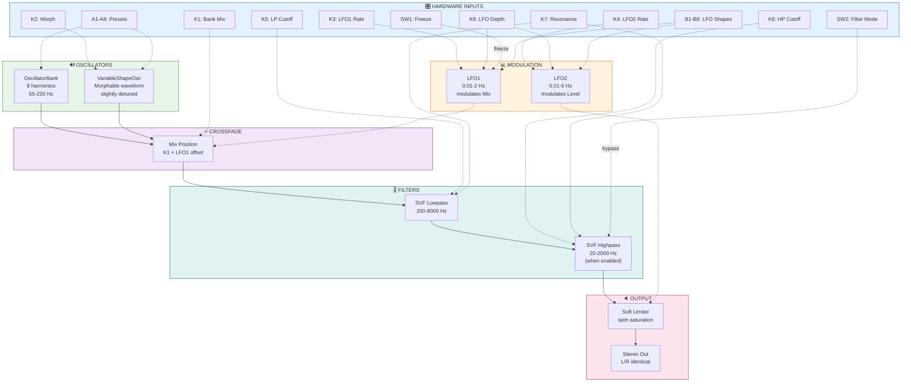
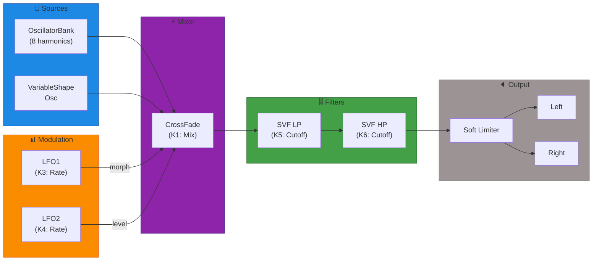
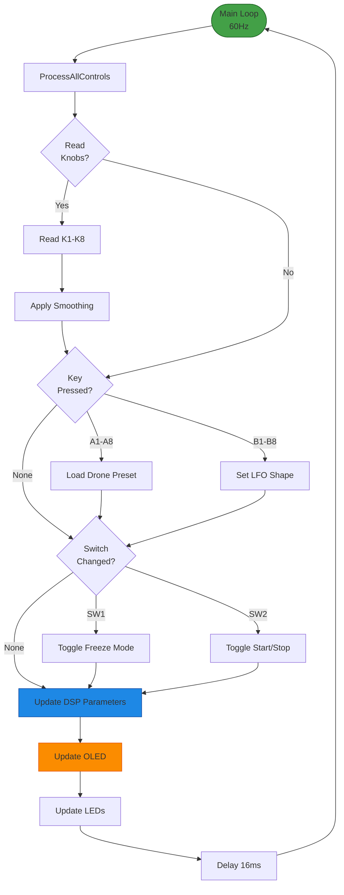

# Field Wavetable Drone Lab — Controls Documentation

## 1. Control Mapping

### Hardware Overview

| Control Type | Quantity | Purpose |
|--------------|----------|---------|
| **Knobs** | 8 | Continuous parameter control |
| **Keys (A-row)** | 8 | Drone preset selection |
| **Keys (B-row)** | 8 | LFO shape/speed selection |
| **Switches** | 2 | Toggle states (Freeze, HP Enable) |

---

### Knob Assignments

| Knob | Parameter | Range | Default | Unit |
|------|-----------|-------|---------|------|
| **K1** | Bank Mix | 0.0 – 1.0 | 0.5 | — |
| **K2** | VarShape Morph | 0.0 – 1.0 | 0.3 | — |
| **K3** | LFO1 Rate (Morph) | 0.01 – 2.0 | 0.1 | Hz |
| **K4** | LFO2 Rate (Level) | 0.01 – 5.0 | 0.2 | Hz |
| **K5** | LP Cutoff | 200 – 8000 | 2000 | Hz |
| **K6** | HP Cutoff | 20 – 2000 | 100 | Hz |
| **K7** | Filter Resonance | 0.0 – 0.9 | 0.3 | — |
| **K8** | LFO Mod Depth | 0.0 – 1.0 | 0.5 | — |

---

### Key Assignments

#### A-Row: Drone Preset Select (A1–A8)

| Key | Preset | Description |
|-----|--------|-------------|
| A1 | `DEEP_BASS` | Sub-heavy foundation, slow morph |
| A2 | `WARM_PAD` | Mid-range warmth, gentle movement |
| A3 | `SHIMMERING` | High harmonics, fast subtle LFO |
| A4 | `DARK_AMBIENT` | Low + filtered, mysterious |
| A5 | `BRIGHT_EVOLVE` | Open filter, active morphing |
| A6 | `SPARSE_MINIMAL` | Few harmonics, wide spacing |
| A7 | `DENSE_CLUSTER` | Many harmonics, beating |
| A8 | `NOISE_WASH` | High HP, textural noise mix |

#### B-Row: LFO Shape Select (B1–B8)

| Key | Shape | LFO1 & LFO2 Behavior |
|-----|-------|---------------------|
| B1 | `SINE` | Smooth, organic |
| B2 | `TRI` | Linear sweep |
| B3 | `SAW_UP` | Ramp up, sudden reset |
| B4 | `SAW_DOWN` | Ramp down, sudden reset |
| B5 | `SQUARE` | Stepped, alternating |
| B6 | `RANDOM` | Sample & hold style |
| B7 | `SYNC_SLOW` | Both LFOs synced, slow |
| B8 | `SYNC_FAST` | Both LFOs synced, fast |

---

### Switch Assignments

| Switch | Function | States |
|--------|----------|--------|
| **SW1** | Freeze | OFF / ON (holds current morph position) |
| **SW2** | Start / Stop | OFF (muted) / ON (playing) |

---

## 2. System Diagrams

### A. System Architecture — Block Diagram

**Why Block Diagram?** Shows DSP module connections and control relationships.



---

### B. Audio Signal Flow — Signal Flow Graph

**Why Signal Flow Graph?** Shows the sample-by-sample audio processing chain.



---

### C. Control Flow — Flowchart

**Why Flowchart?** Shows event handling and UI logic with decision branches.



---

### D. OLED Display States — ASCII Mockups

**OLED Size:** 128x64 pixels (SSD1306)

#### State 1: Normal Playback (no parameter being adjusted)
```
┌──────────────────────────────┐
│ Drone: Deep Bass             │  ← Line 0: Preset name
│                              │
│                              │
│                              │
│                              │
│                              │
│ LFO:1 RUN PLAY               │  ← Line 54: Status bar
└──────────────────────────────┘
```

#### State 2: Adjusting Parameter (K5 = LP Cutoff)
```
┌──────────────────────────────┐
│ Drone: Shimmering            │
│ > LP Cutoff                  │  ← Active param label
│                              │
│  2458                        │  ← Large value (Font_11x18)
│                              │
│                              │
│ LFO:3 RUN PLAY               │
└──────────────────────────────┘
```

#### State 3: Frozen LFO + Audio Stopped
```
┌──────────────────────────────┐
│ Drone: Noise Wash            │
│ > LFO1 Rate                  │
│                              │
│  0.15                        │
│                              │
│                              │
│ LFO:6 FRZ STOP               │  ← FRZ=SW1 on, STOP=SW2 off
└──────────────────────────────┘
```

---

## 3. Presets

### Preset 1: "Deep Bass"

**Character:** Sub-heavy foundation with slow organic morph

| Control | Value | Notes |
|---------|-------|-------|
| Drone | A1 | Deep Bass preset |
| LFO Shape | B1 (Sine) | Organic movement |
| K1 Bank Mix | 0.9 | Mostly OscBank |
| K2 VarMorph | 0.1 | Subtle shape |
| K3 LFO1 Rate | 0.05 Hz | Very slow morph |
| K4 LFO2 Rate | 0.08 Hz | Slow level |
| K5 LP Cutoff | 400 Hz | Dark filter |
| K6 HP Cutoff | 30 Hz | Pass sub |
| K7 Resonance | 0.2 | Gentle |
| K8 LFO Depth | 0.5 | Medium modulation |

---

### Preset 2: "Shimmering"

**Character:** High harmonic content with fast subtle modulation

| Control | Value | Notes |
|---------|-------|-------|
| Drone | A3 | Shimmering preset |
| LFO Shape | B3 (Saw Up) | Rising ramps |
| K1 Bank Mix | 0.4 | Balanced |
| K2 VarMorph | 0.7 | Active shape |
| K3 LFO1 Rate | 0.8 Hz | Faster morph |
| K4 LFO2 Rate | 1.2 Hz | Active level |
| K5 LP Cutoff | 6000 Hz | Bright |
| K6 HP Cutoff | 500 Hz | Remove low |
| K7 Resonance | 0.5 | Resonant |
| K8 LFO Depth | 0.8 | Active modulation |

---

## Quick Reference Card

```
┌─────────────────────────────────────────────────────────┐
│    FIELD WAVETABLE DRONE LAB — CONTROL REFERENCE        │
├─────────────────────────────────────────────────────────┤
│  KNOBS                                                  │
│  K1: Bank Mix  K2: VarMorph  K3: LFO1 Rt  K4: LFO2 Rt   │
│  K5: LP Cut    K6: HP Cut    K7: Reson    K8: LFO Dep   │
├─────────────────────────────────────────────────────────┤
│  KEYS (A-ROW): Drone Preset                             │
│  A1=Deep A2=Warm A3=Shimmer A4=Dark A5=Bright           │
│  A6=Sparse A7=Dense A8=Noise                            │
├─────────────────────────────────────────────────────────┤
│  KEYS (B-ROW): LFO Shape                                │
│  B1=Sin B2=Tri B3=SawUp B4=SawDn B5=Sq B6=Rnd B7-8=Sync │
├─────────────────────────────────────────────────────────┤
│  SWITCHES                                               │
│  SW1: Freeze On/Off    SW2: Filter Mode (LP/LP+HP)      │
└─────────────────────────────────────────────────────────┘
```
