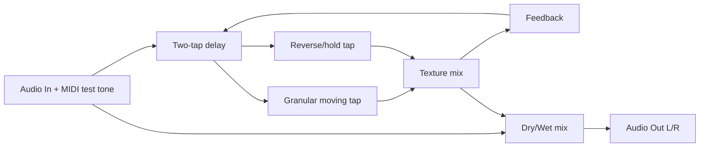
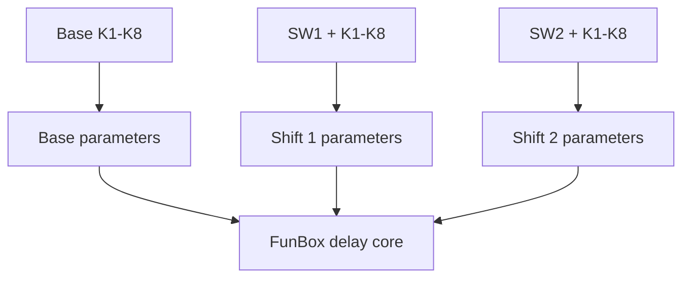
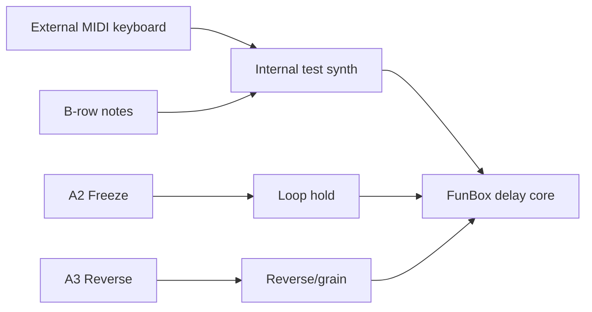
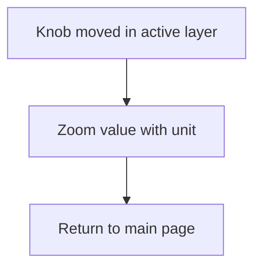

# Controls Report - Field_delay_FunBox

## Behavior

Creative delay family adaptation: two-tap delay, drift, spectral smear,
granular-style moving tap, freeze, and reverse/looper hold gestures.

## Knob Layers

Knobs use movement-gated "until touched" layers. Shifted knob movement never
modifies the unshifted parameter.

| Knob | Base | Hold SW1 | Hold SW2 |
|---|---|---|---|
| K1 | Mix | Pre Delay | Range |
| K2 | Delay Time ms | Width | Grain Density |
| K3 | Feedback % | Spread | Low Cut Hz |
| K4 | Tone % | Damping | High Cut Hz |
| K5 | Texture % | Tap Mode | Spectral Smear |
| K6 | Drift % | Freeze Amt | Warp |
| K7 | Input Drive dB | MIDI Level | MIDI Attack ms |
| K8 | Output dB | Tempo BPM | MIDI Release ms |

## Keys And Switches

| Control | Function |
|---|---|
| SW1 | Hold for shift layer 1 |
| SW2 | Hold for shift layer 2 |
| A1 | Bypass state |
| A2 | Freeze/looper hold state |
| A3 | Reverse/grain state |
| A4 | Two-tap ratio state |
| A5 | Diffuse/wide state |
| A6 | MIDI test synth waveform |
| A7 | Octave down |
| A8 | Octave up |
| B1-B8 | White keys C4 D4 E4 F4 G4 A4 B4 C5 |

## OLED

The OLED shows the active layer and a compact parameter list. Touched parameters
open a short zoom view with units.

