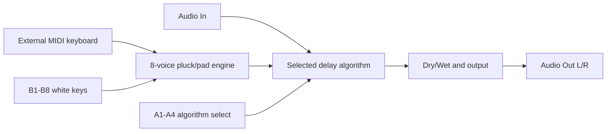
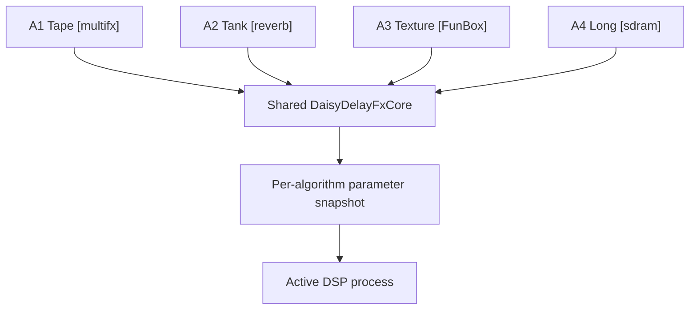
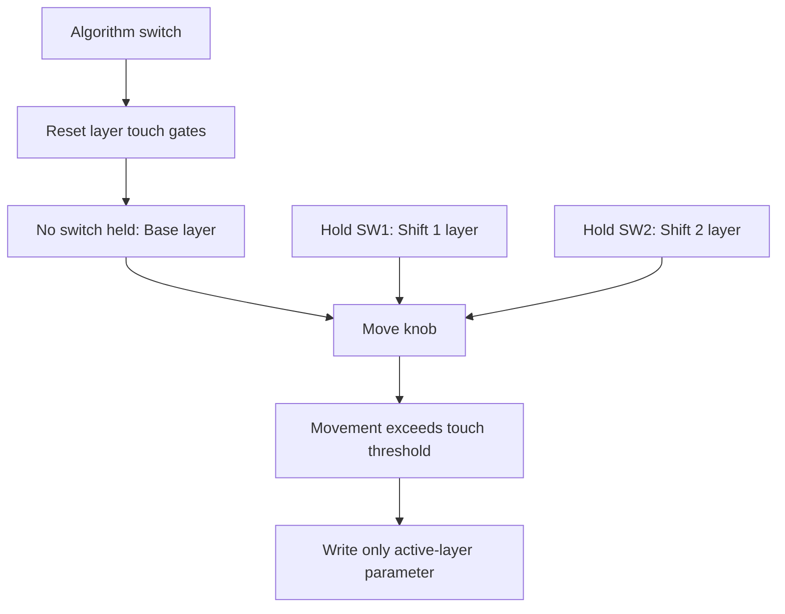
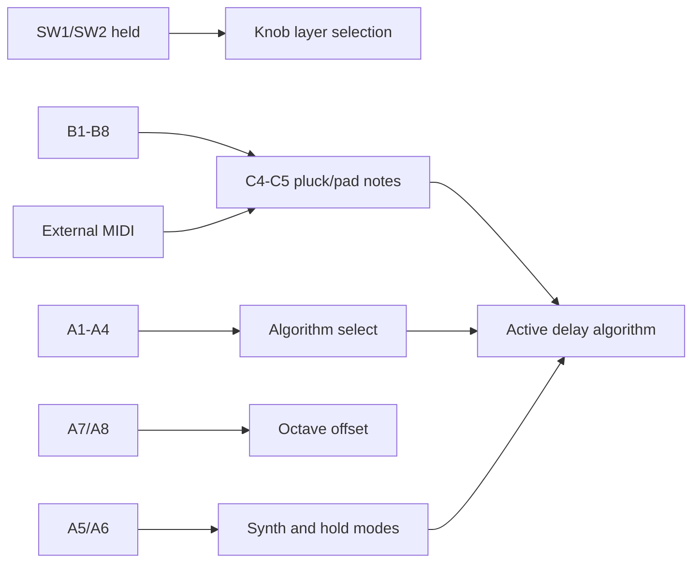
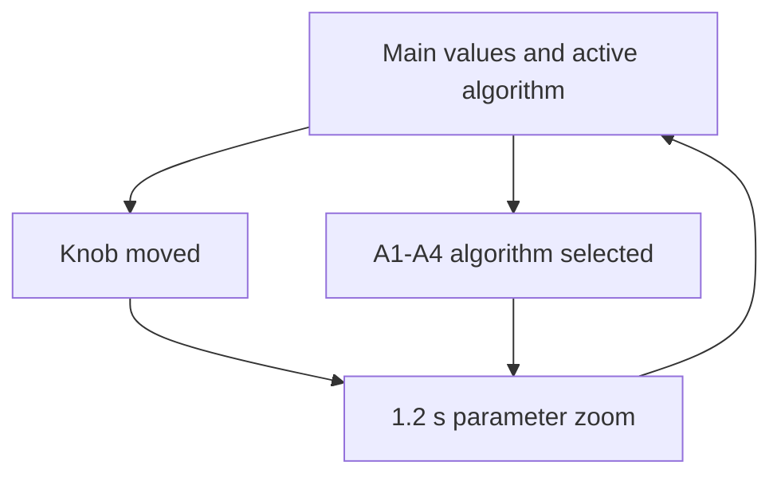

# Controls Report - Field_delay_bundle

## Behavior

One Field project selects between four delay algorithms. Audio input, external
MIDI, and B-row notes feed the active algorithm through an internal 8-voice
pluck/pad resonator. A1-A4 select algorithms; A5/A6 control the internal sound
engine; A7/A8 shift the MIDI/B-row octave.

## Algorithm List

| A key | Type-first label | Source project | Basis |
|---|---|---|---|
| A1 | Tape [multifx] | `balazsbencs/daisy-multifx-pedal` | SDRAM tape delay with modulation, tone, grit, and feedback color |
| A2 | Tank [reverb] | `Farmer2K5/daisy-reverb-playground` | Early reflections, diffusion, damping, and FDN/tank reverb-delay behavior |
| A3 | Texture [FunBox] | `GuitarML/FunBox` | Multi-mode texture delay with smear, grains, reverse accent, freeze, and hold behavior |
| A4 | Long [sdram] | `Farmer2K5/daisy-sdram-delaylines` | Long external-buffer fractional stereo delay with ping-pong feedback |

## Knob Layers

Knobs use movement-gated "until touched" layers. Holding `SW1` or `SW2`
changes which parameter the knob targets. A parameter is not written merely
because the layer changed; it is written only after that physical knob moves in
the active layer. Switching algorithm resets the layer touch gates so the new
algorithm does not inherit accidental shifted writes.

| Knob | Base | Hold SW1 | Hold SW2 |
|---|---|---|---|
| K1 | Mix | Pre Delay | Range / Tank Size |
| K2 | Delay Time / Long Time | Width | Density / Grain Density |
| K3 | Feedback / Decay | Spread / Diffusion | Low Cut Hz |
| K4 | Tone / HF Damp | Damping | High Cut Hz |
| K5 | Grit / Tank Color / Texture | Rhythm / Tap Mode | Smear / Spectral Smear |
| K6 | Mod / Drift | Synth Bright | Warp / Interp Warp |
| K7 | Input Drive dB | Synth Decay | MIDI Attack ms |
| K8 | Output dB | Synth Level | MIDI Release ms |

## Keys And Switches

| Control | Function |
|---|---|
| SW1 | Hold for shift layer 1 |
| SW2 | Hold for shift layer 2 |
| A1 | Select Tape [multifx]; LED on when selected |
| A2 | Select Tank [reverb]; LED on when selected |
| A3 | Select Texture [FunBox]; LED on when selected |
| A4 | Select Long [sdram]; LED on when selected |
| A5 | Internal sound mode: off, pluck, pad |
| A6 | B-key/MIDI hold mode: momentary, latch, drone |
| A7 | Octave down |
| A8 | Octave up |
| B1-B8 | 8-voice internal resonator notes C4 D4 E4 F4 G4 A4 B4 C5, shifted by A7/A8; OLED zoom shows the active B note |

## OLED

The OLED shows the bundle title, active algorithm label, octave offset, active
layer values, and units. Moving a knob or selecting an algorithm opens a short
zoom view with the changed target, value, unit/mode, and bar.

