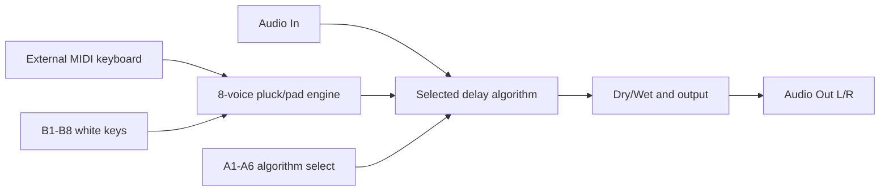
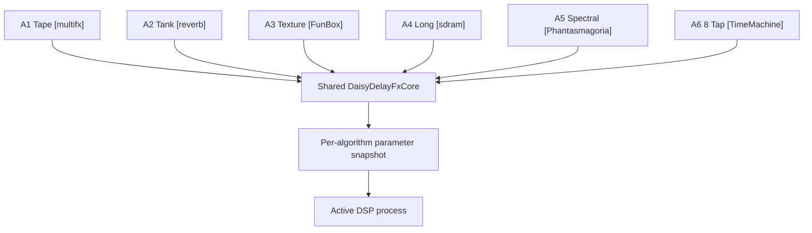
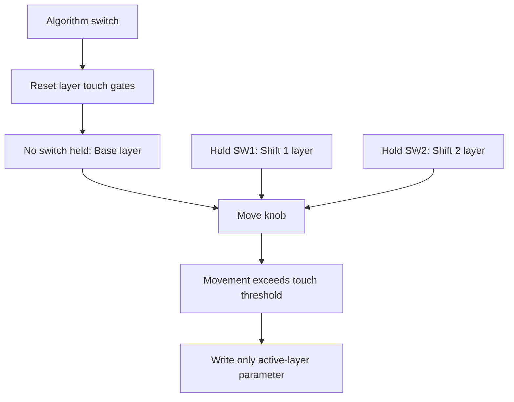
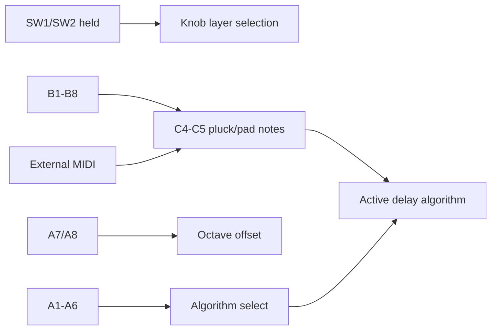
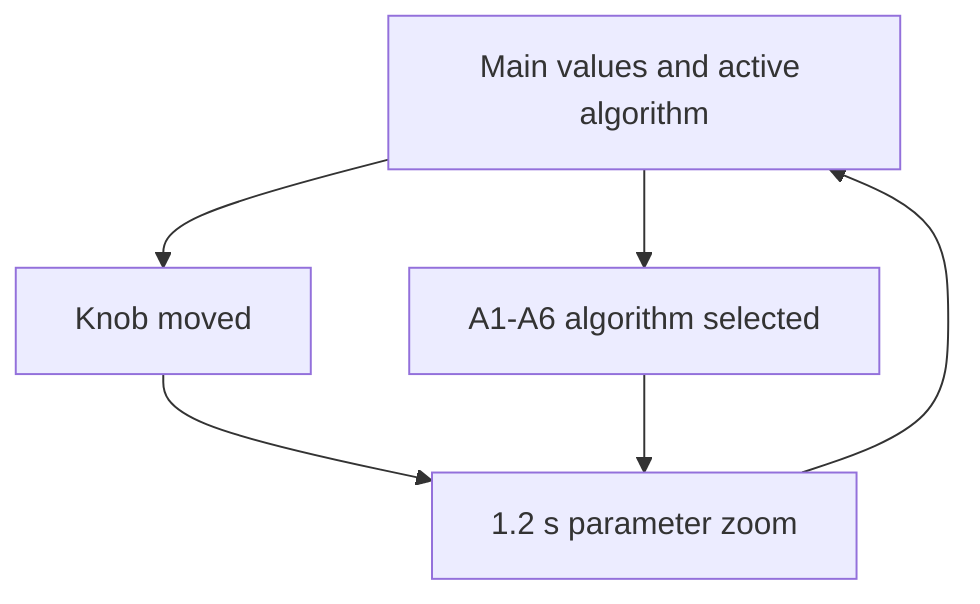

# Controls Report - Field_delay_bundle

## Behavior

One Field project selects between six delay algorithms. Audio input, external
MIDI, and B-row notes feed the active algorithm through an internal 8-voice
pluck/pad resonator. A1-A6 select algorithms; A7/A8 shift the MIDI/B-row
octave.

```mermaid
flowchart LR
    IN["Audio In"] --> ALG["Selected delay algorithm"]
    MIDI["External MIDI keyboard"] --> TONE["8-voice pluck/pad engine"]
    BROW["B1-B8 white keys"] --> TONE
    TONE --> ALG
    ASEL["A1-A6 algorithm select"] --> ALG
    ALG --> MIX["Dry/Wet and output"]
    MIX --> OUT["Audio Out L/R"]
```

## Algorithm List

| A key | Type-first label | Source project | Basis |
|---|---|---|---|
| A1 | Tape [multifx] | `balazsbencs/daisy-multifx-pedal` | SDRAM tape delay with modulation, tone, grit, and feedback color |
| A2 | Tank [reverb] | `Farmer2K5/daisy-reverb-playground` | Early reflections, diffusion, damping, and FDN/tank reverb-delay behavior |
| A3 | Texture [FunBox] | `GuitarML/FunBox` | Multi-mode texture delay with smear, grains, reverse accent, freeze, and hold behavior |
| A4 | Long [sdram] | `Farmer2K5/daisy-sdram-delaylines` | Long external-buffer fractional stereo delay with ping-pong feedback |
| A5 | Spectral [Phantasmagoria] | `FuzzyLotus/Phantasmagoria` | Clean-room behavior adaptation with reverse-grain reading, smear diffusion, erosion, chamber taps, and freeze memory |
| A6 | 8 Tap [TimeMachine] | `oamodular/time-machine` | Clean-room behavior adaptation with eight read-head tap distribution, skew, blur, and feedback limiting |

```mermaid
flowchart TD
    A1["A1 Tape [multifx]"] --> CORE["Shared DaisyDelayFxCore"]
    A2["A2 Tank [reverb]"] --> CORE
    A3["A3 Texture [FunBox]"] --> CORE
    A4["A4 Long [sdram]"] --> CORE
    A5["A5 Spectral [Phantasmagoria]"] --> CORE
    A6["A6 8 Tap [TimeMachine]"] --> CORE
    CORE --> SNAP["Per-algorithm parameter snapshot"]
    SNAP --> DSP["Active DSP process"]
```

## Knob Layers

Knobs use movement-gated "until touched" layers. Holding `SW1` or `SW2`
changes which parameter the knob targets. A parameter is not written merely
because the layer changed; it is written only after that physical knob moves in
the active layer. Switching algorithm resets the layer touch gates so the new
algorithm does not inherit accidental shifted writes.

```mermaid
flowchart TD
    BASE["No switch held: Base layer"] --> K["Move knob"]
    SW1["Hold SW1: Shift 1 layer"] --> K
    SW2["Hold SW2: Shift 2 layer"] --> K
    K --> TOUCH["Movement exceeds touch threshold"]
    TOUCH --> WRITE["Write only active-layer parameter"]
    ALG["Algorithm switch"] --> RESET["Reset layer touch gates"]
    RESET --> BASE
```

| Knob | Base | Hold SW1 | Hold SW2 |
|---|---|---|---|
| K1 | Mix | Pre Delay / Chamber Pre | Range / Tank Size |
| K2 | Delay Time / Long Time / Tap Time | Width | Density / Grain Density / Tap Focus |
| K3 | Feedback / Decay | Spread / Diffusion / Smear Diff | Low Cut Hz |
| K4 | Tone / HF Damp / Repeat Age | Damping / Erosion | High Cut Hz |
| K5 | Grit / Tank Color / Texture / Reverse Mix / Distribution | Rhythm / Tap Mode / Chamber Mix / Tap Pattern | Smear / Spectral Smear / Blur Spread |
| K6 | Mod / Drift / Tape Warble / Blur | Synth Bright / Freeze Voice | Warp / Interp Warp / Freeze Drift / Clock Warp |
| K7 | Input Drive dB | Synth Decay / MIDI Level | MIDI Attack ms |
| K8 | Output dB | Synth Level / Tempo | MIDI Release ms |

## Keys And Switches

| Control | Function |
|---|---|
| SW1 | Hold for shift layer 1 |
| SW2 | Hold for shift layer 2 |
| A1 | Select Tape [multifx]; LED on when selected |
| A2 | Select Tank [reverb]; LED on when selected |
| A3 | Select Texture [FunBox]; LED on when selected |
| A4 | Select Long [sdram]; LED on when selected |
| A5 | Select Spectral [Phantasmagoria]; LED on when selected |
| A6 | Select 8 Tap [TimeMachine]; LED on when selected |
| A7 | Octave down |
| A8 | Octave up |
| B1-B8 | 8-voice internal resonator notes C4 D4 E4 F4 G4 A4 B4 C5, shifted by A7/A8; OLED zoom shows the active B note |

```mermaid
flowchart LR
    SW["SW1/SW2 held"] --> LAYERS["Knob layer selection"]
    A16["A1-A6"] --> SELECT["Algorithm select"]
    A78["A7/A8"] --> OCT["Octave offset"]
    BROW["B1-B8"] --> NOTES["C4-C5 pluck/pad notes"]
    MIDI["External MIDI"] --> NOTES
    NOTES --> DSP["Active delay algorithm"]
    SELECT --> DSP
```

## OLED

The OLED shows the bundle title, active algorithm label, octave offset, active
layer values, and units. Moving a knob or selecting an algorithm opens a short
zoom view with the changed target, value, unit/mode, and bar.

```mermaid
flowchart TD
    IDLE["Main values and active algorithm"] --> KNOB["Knob moved"]
    IDLE --> ALG["A1-A6 algorithm selected"]
    KNOB --> ZOOM["1.2 s parameter zoom"]
    ALG --> ZOOM
    ZOOM --> IDLE
```
