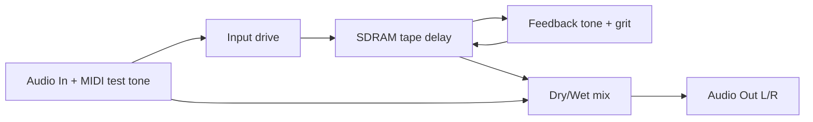
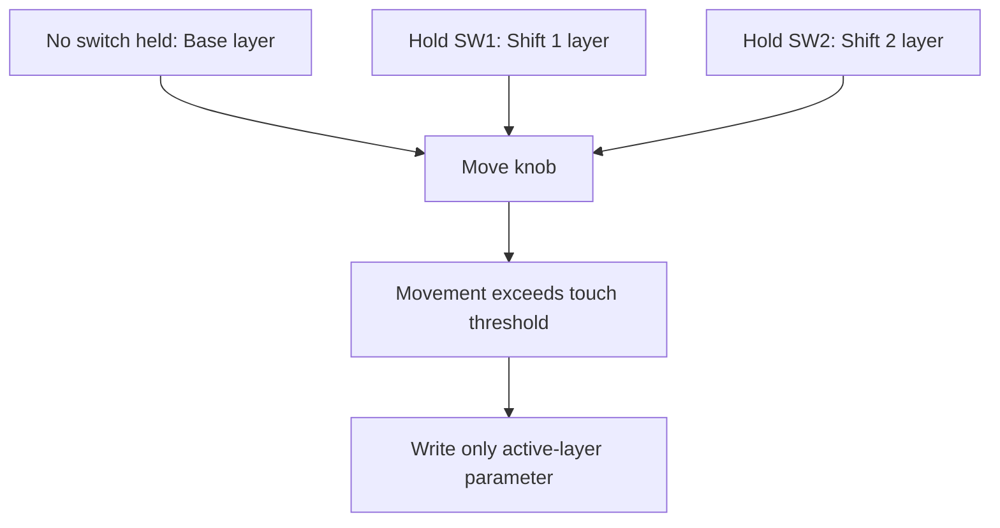
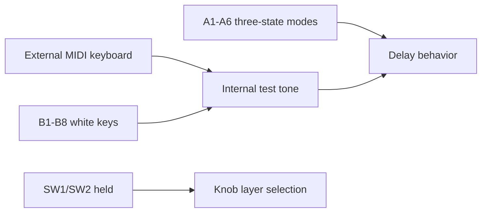
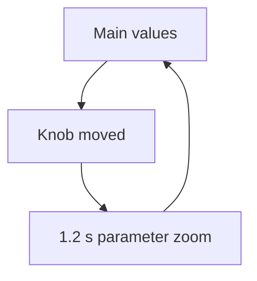

# Controls Report - Field_delay_daisy-multifx-pedal

## Behavior

Tape-style SDRAM delay with flutter, tone, grit, feedback limiting, freeze, and
MIDI/B-row test tone input.

## Knob Layers

Knobs use movement-gated "until touched" layers. Holding `SW1` or `SW2` changes
which parameter the knob targets. A parameter is not written merely because the
layer changed; it is written only after that physical knob moves in the active
layer.

| Knob | Base | Hold SW1 | Hold SW2 |
|---|---|---|---|
| K1 | Mix | Pre Delay | Range |
| K2 | Delay Time ms | Width | Density |
| K3 | Feedback % | Spread | Low Cut Hz |
| K4 | Tone % | Damping | High Cut Hz |
| K5 | Grit % | Rhythm | Smear |
| K6 | Mod % | Freeze Amt | Warp |
| K7 | Input Drive dB | MIDI Level | MIDI Attack ms |
| K8 | Output dB | Tempo BPM | MIDI Release ms |

## Keys And Switches

| Control | Function |
|---|---|
| SW1 | Hold for shift layer 1 |
| SW2 | Hold for shift layer 2 |
| A1 | Bypass state: off active, blink wet-only, on bypass |
| A2 | Freeze state: off live write, blink soft freeze, on hard freeze |
| A3 | Reverse/grain accent |
| A4 | Sync ratio: free, dotted, triplet |
| A5 | Diffuse/spread boost |
| A6 | MIDI test synth waveform |
| A7 | Octave down |
| A8 | Octave up |
| B1-B8 | White keys C4 D4 E4 F4 G4 A4 B4 C5, shifted by A7/A8 |

## OLED

The OLED shows the active layer, octave offset, and main parameter values with
units. Moving a knob opens a short zoom view with the changed parameter, value,
unit, and bar.

