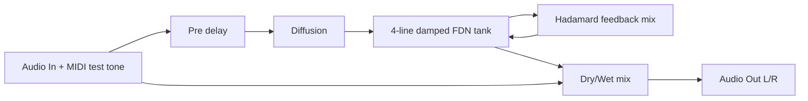
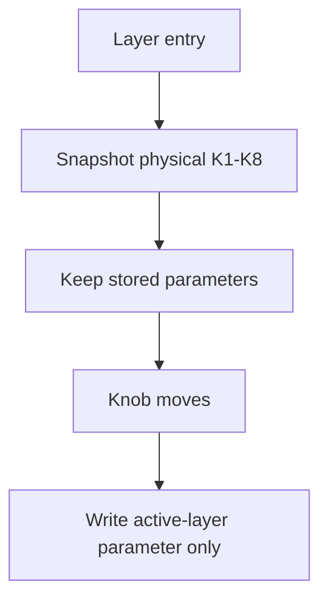
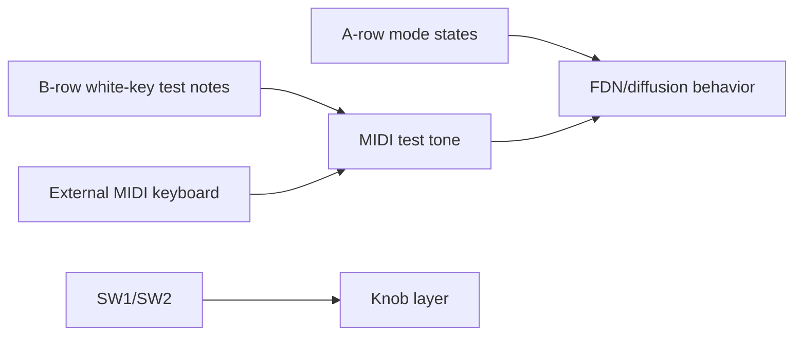
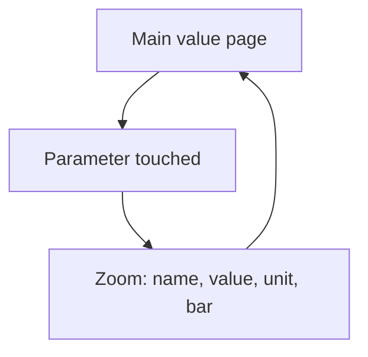

# Controls Report - Field_delay_daisy-reverb-playground

## Behavior

FDN-style reverb/delay tank with diffusion and damping. It is an algorithmic
playground adaptation, not a literal port of one source example.

## Knob Layers

Knobs use movement-gated "until touched" layers. Holding `SW1` or `SW2` changes
the active target, and only moved knobs write values.

| Knob | Base | Hold SW1 | Hold SW2 |
|---|---|---|---|
| K1 | Mix | Pre Delay | Tank Size |
| K2 | Delay Time ms | Width | Density |
| K3 | Decay % | Diffusion | Low Cut Hz |
| K4 | HF Damp % | Damping | High Cut Hz |
| K5 | Tank Color % | Rhythm | Smear |
| K6 | Mod % | Freeze Amt | Warp |
| K7 | Input Drive dB | MIDI Level | MIDI Attack ms |
| K8 | Output dB | Tempo BPM | MIDI Release ms |

## Keys And Switches

| Control | Function |
|---|---|
| SW1 | Hold for shift layer 1 |
| SW2 | Hold for shift layer 2 |
| A1 | Bypass state: off active, blink wet-only, on bypass |
| A2 | Freeze state for reverb tail write behavior |
| A3 | Reverse/grain accent |
| A4 | Rhythm ratio |
| A5 | Diffusion density boost |
| A6 | MIDI test synth waveform |
| A7 | Octave down |
| A8 | Octave up |
| B1-B8 | White keys C4 D4 E4 F4 G4 A4 B4 C5 |

## OLED

Main screen shows active layer and key parameters with units. Touch zoom appears
when a knob changes and times out automatically.

