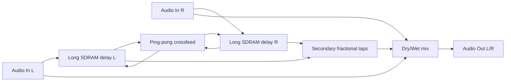
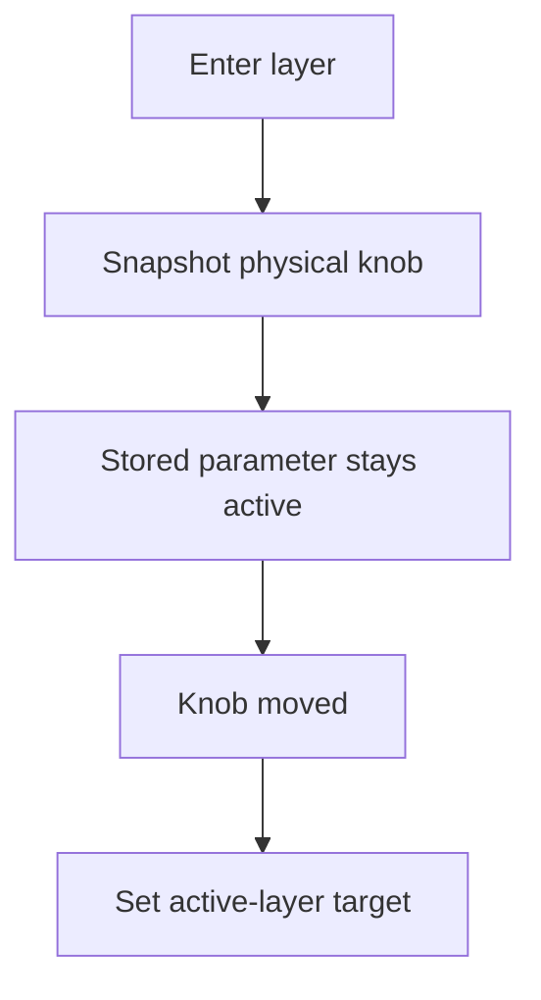
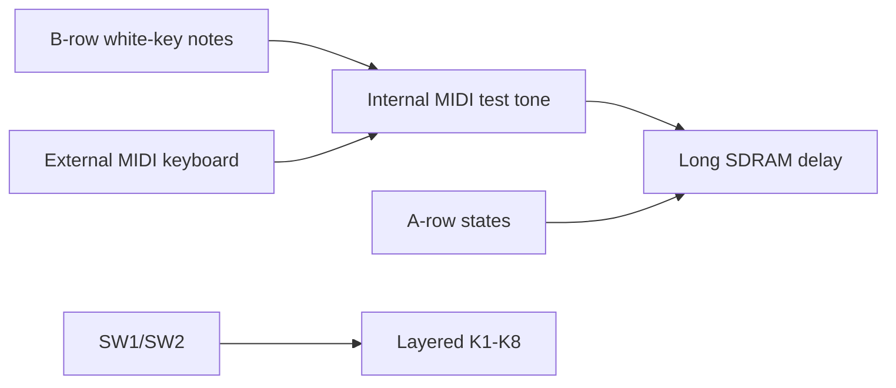
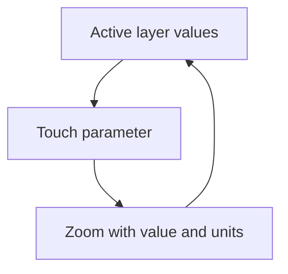

# Controls Report - Field_delay_daisy-sdram-delaylines

## Behavior

Long stereo fractional delay using Field SDRAM-backed buffers. This is the most
primitive-focused adaptation: it highlights external memory, fractional reads,
smear/warp, and ping-pong feedback rather than a complex mode system.

## Knob Layers

Knobs use movement-gated "until touched" layers. Shifted layers never write base
parameters unless the base layer is active and the knob moves.

| Knob | Base | Hold SW1 | Hold SW2 |
|---|---|---|---|
| K1 | Mix | Pre Delay | Range |
| K2 | Long Time ms | Width | Density |
| K3 | Feedback % | Spread | Low Cut Hz |
| K4 | Tone % | Damping | High Cut Hz |
| K5 | Ping-pong % | Rhythm | Smear |
| K6 | Mod % | Freeze Amt | Interp Warp |
| K7 | Input Drive dB | MIDI Level | MIDI Attack ms |
| K8 | Output dB | Tempo BPM | MIDI Release ms |

## Keys And Switches

| Control | Function |
|---|---|
| SW1 | Hold for shift layer 1 |
| SW2 | Hold for shift layer 2 |
| A1 | Bypass state |
| A2 | Freeze long buffer write state |
| A3 | Reverse/grain accent |
| A4 | Rhythm ratio |
| A5 | Diffuse/wide state |
| A6 | MIDI test synth waveform |
| A7 | Octave down |
| A8 | Octave up |
| B1-B8 | White keys C4 D4 E4 F4 G4 A4 B4 C5 |

## OLED

The OLED reports the active layer and values with units. Moving a parameter
opens a short zoom view so the user sees the touched target immediately.

