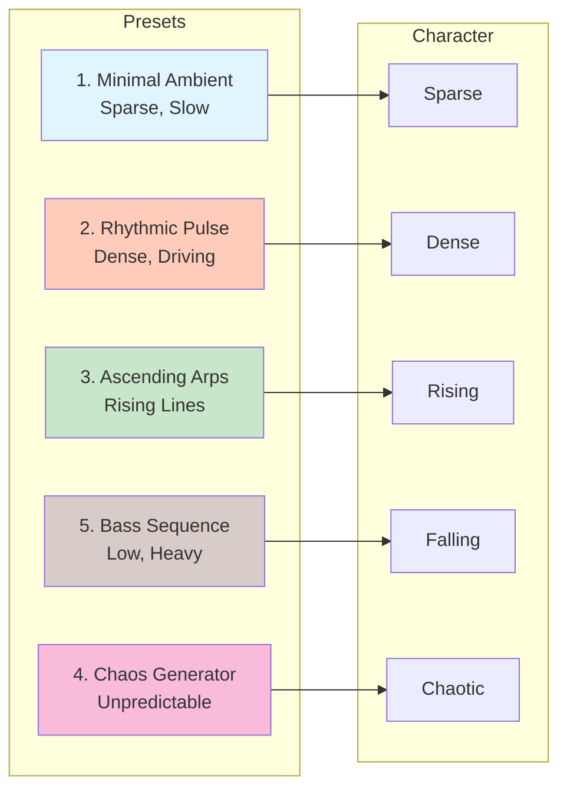
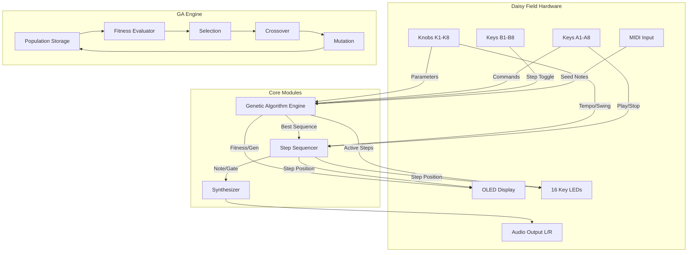
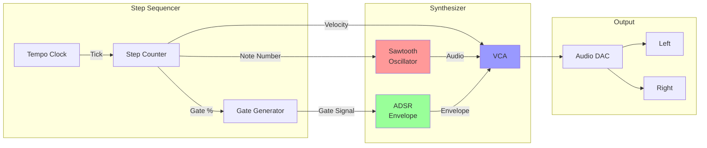
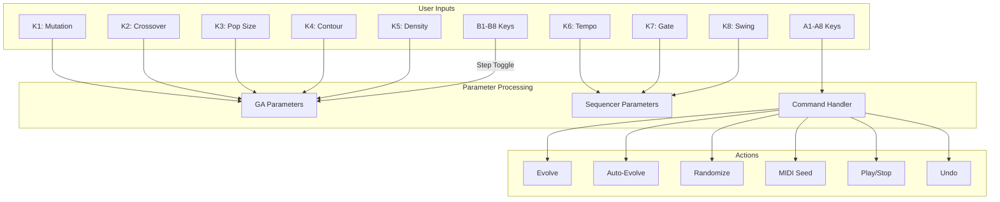
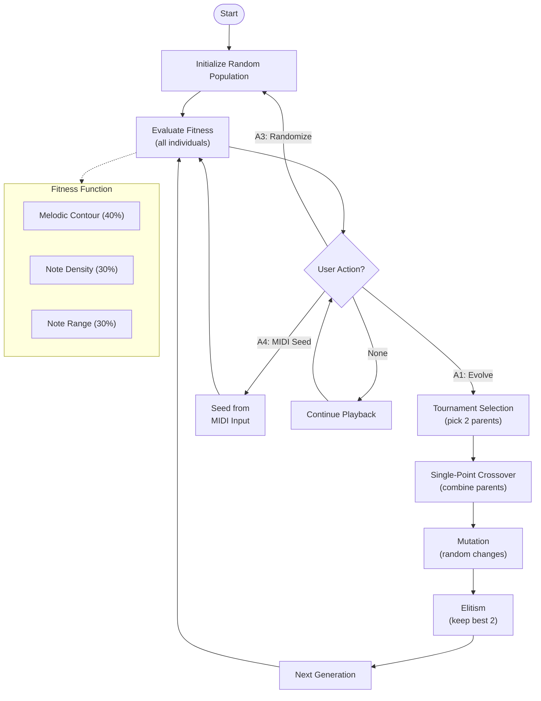

# Genetic Step Sequencer — User Manual

## Introduction

The Genetic Step Sequencer uses evolutionary algorithms to create and evolve 16-step musical patterns. Instead of programming sequences manually, you guide the evolution through fitness parameters, and the system generates musically coherent patterns.

---

## Quick Start

1. **Power On**: The sequencer starts with a random population
2. **Press A5**: Start playback
3. **Press A1**: Evolve to next generation
4. **Adjust K1-K5**: Change evolution parameters
5. **Repeat A1**: Watch patterns evolve

---

## Panel Layout

```
┌──────────────────────────────────────────────────────────────┐
│  ┌────────────────────────────────────────────────────────┐  │
│  │              128x64 OLED DISPLAY                       │  │
│  │  G:042 F:0.87 M:15%                        120 BPM     │  │
│  │  ▓▓░░▓▓▓░▓░▓▓░░▓▓  (16 steps)                         │  │
│  │  ████████████░░░░░░░░  (fitness bar)                   │  │
│  └────────────────────────────────────────────────────────┘  │
│                                                              │
│  [K1] [K2] [K3] [K4] [K5] [K6] [K7] [K8]   ← 8 Knobs        │
│                                                              │
│  [A1] [A2] [A3] [A4] [A5] [A6] [A7] [A8]   ← Function Keys  │
│  [B1] [B2] [B3] [B4] [B5] [B6] [B7] [B8]   ← Step Keys      │
└──────────────────────────────────────────────────────────────┘
```

---

## Knob Reference

| Knob | Parameter | Range | Effect |
|------|-----------|-------|--------|
| **K1** | Mutation Rate | 0-50% | Higher = more random changes per generation |
| **K2** | Crossover Rate | 50-100% | Higher = more parent mixing |
| **K3** | Population Size | 10-50 | Larger = more diverse gene pool |
| **K4** | Contour Bias | -1 to +1 | Negative = favor falling lines, Positive = rising |
| **K5** | Target Density | 25-100% | Target percentage of active steps |
| **K6** | Tempo | 40-240 BPM | Playback speed |
| **K7** | Gate Length | 10-100% | Note duration within each step |
| **K8** | Swing | 0-50% | Rhythmic shuffle amount |

---

## Key Reference

### Function Keys (A Row)

| Key | Function | LED Indicator |
|-----|----------|---------------|
| **A1** | **Evolve** — Run one generation | Dim = has evolved |
| **A2** | **Auto-Evolve** — Toggle continuous evolution | Bright = active |
| **A3** | **Randomize** — New random population | (momentary) |
| **A4** | **MIDI Seed** — Capture notes from MIDI keyboard | Bright = capturing |
| **A5** | **Play/Stop** — Toggle playback | Bright = playing |
| **A6** | **Select Best** — Load fittest individual | (momentary) |
| **A7** | **Undo** — Revert to previous generation | (momentary) |
| **A8** | Reserved | — |

### Step Keys (B Row)

| Key | Function | LED Indicator |
|-----|----------|---------------|
| **B1-B8** | Toggle steps 1-8 on/off | Bright = current step, Dim = active |

---

## Display Guide

```
G:042 F:0.87 M:15%                        120 BPM
│     │       │                            │
│     │       └─ Current mutation rate     └─ Tempo
│     └─ Best fitness score (0.00 - 1.00)
└─ Generation counter

▓▓░░▓▓▓░▓░▓▓░░▓▓   ← Sequence grid (filled = active step)
        ▲           ← Playhead position

████████████░░░░░░░░  ← Fitness progress bar

AUTO  MIDI  PLAY     ← Status indicators
```

---

## Workflow Examples

### Basic Evolution
1. Start with random population (automatic on power-up)
2. Press **A5** to start playback
3. Adjust **K5** (Density) to taste
4. Press **A1** repeatedly to evolve
5. When satisfied, the pattern continues playing

### Guided Evolution
1. Set **K1** (Mutation) low (~10%) for subtle changes
2. Set **K2** (Crossover) high (~90%) for smooth transitions
3. Press **A2** to enable Auto-Evolve
4. Adjust **K4** (Contour) to shape melodic direction
5. Let it run — patterns evolve every 16 beats

### MIDI Seeding
1. Connect MIDI keyboard to Daisy Field
2. Press **A4** (LED lights up = capturing)
3. Play up to 16 notes on keyboard
4. Press **A4** again (stops capture)
5. Population is now seeded from your input
6. Evolve with **A1** to create variations

### Undo/Redo
- Press **A7** to undo last evolution
- History stores up to 10 generations
- Useful for reverting unwanted mutations

---

## Genetic Algorithm Explained

### Fitness Evaluation
Each sequence is scored (0.0 - 1.0) based on:
- **Melodic Contour** (40%): Stepwise motion scores higher than large jumps
- **Note Density** (30%): Closer to target density = higher score
- **Note Range** (30%): Notes within specified octave range score higher

### Evolution Process
1. **Selection**: Tournament selection picks fitter parents
2. **Crossover**: Parents are combined at a random split point
3. **Mutation**: Random changes to notes, velocities, gates
4. **Elitism**: Top 2 individuals always survive

---

## Factory Presets

### Preset 1: Minimal Ambient
*Sparse, slowly evolving patterns with smooth melodic contours*

```
┌─────────────────────────────────────────────────────────────────┐
│  Sequence:  ▓░░░▓░░░░░▓░░░░▓                                   │
│  Notes:     C4    E4      G4    C5                              │
│                                                                  │
│  K1 ●○○○○  K2 ○○○○●  K3 ○●○○○  K4 ○○●○○                        │
│  Mut:10%   Cross:95% Pop:20   Bias:0                            │
│                                                                  │
│  K5 ○●○○○  K6 ○○●○○  K7 ○○○●○  K8 ○○○○○                        │
│  Dens:35%  Tempo:80  Gate:70%  Swing:0%                         │
└─────────────────────────────────────────────────────────────────┘
```

| Knob | Value | Effect |
|------|-------|--------|
| K1 | 10% | Minimal mutations for subtle evolution |
| K2 | 95% | High crossover for smooth transitions |
| K3 | 20 | Small population for coherent patterns |
| K5 | 35% | Low density for sparse notes |
| K6 | 80 BPM | Slow, meditative tempo |

---

### Preset 2: Rhythmic Pulse
*Dense, driving patterns with strong rhythmic feel*

```
┌─────────────────────────────────────────────────────────────────┐
│  Sequence:  ▓▓░▓▓▓░▓▓░▓▓▓░▓▓                                   │
│  Notes:     C3C3 E3F3G3 A3 C4D4E4 G4A4                          │
│                                                                  │
│  K1 ○○●○○  K2 ○○○●○  K3 ○○○●○  K4 ○○●○○                        │
│  Mut:25%   Cross:80% Pop:40   Bias:0                            │
│                                                                  │
│  K5 ○○○○●  K6 ○○○●○  K7 ○○●○○  K8 ○○●○○                        │
│  Dens:90%  Tempo:140 Gate:50%  Swing:25%                        │
└─────────────────────────────────────────────────────────────────┘
```

| Knob | Value | Effect |
|------|-------|--------|
| K1 | 25% | Moderate mutations for variety |
| K5 | 90% | High density for driving rhythm |
| K6 | 140 BPM | Uptempo pulse |
| K8 | 25% | Swing for groove feel |

---

### Preset 3: Ascending Arpeggios
*Rising melodic lines with positive contour bias*

```
┌─────────────────────────────────────────────────────────────────┐
│  Sequence:  ▓░▓░▓░▓░▓░▓░▓░▓░▓░                                 │
│  Notes:     C3 E3 G3 B3 C4 E4 G4 B4  (ascending)                │
│             ↗  ↗  ↗  ↗  ↗  ↗  ↗  ↗                              │
│                                                                  │
│  K1 ○●○○○  K2 ○○○●○  K3 ○○●○○  K4 ○○○○●                        │
│  Mut:15%   Cross:85% Pop:30   Bias:+1                           │
│                                                                  │
│  K5 ○○●○○  K6 ○○●○○  K7 ○○○●○  K8 ○○○○○                        │
│  Dens:50%  Tempo:120 Gate:60%  Swing:0%                         │
└─────────────────────────────────────────────────────────────────┘
```

| Knob | Value | Effect |
|------|-------|--------|
| K4 | +1.0 | Strong ascending bias |
| K5 | 50% | Alternating on/off for arpeggios |
| K6 | 120 BPM | Standard tempo |

---

### Preset 4: Chaos Generator
*Highly mutating, unpredictable patterns*

```
┌─────────────────────────────────────────────────────────────────┐
│  Sequence:  ▓▓▓░▓░░▓░▓▓░▓░▓░                                   │
│  Notes:     C2G5E3 F# A1 D4B6 E2 G#                             │
│             (wide intervals, unpredictable)                     │
│                                                                  │
│  K1 ○○○○●  K2 ○●○○○  K3 ○○○○●  K4 ○○●○○                        │
│  Mut:50%   Cross:60% Pop:50   Bias:0                            │
│                                                                  │
│  K5 ○○○●○  K6 ○○○○●  K7 ○●○○○  K8 ○○○○●                        │
│  Dens:70%  Tempo:180 Gate:30%  Swing:50%                        │
└─────────────────────────────────────────────────────────────────┘
```

| Knob | Value | Effect |
|------|-------|--------|
| K1 | 50% | Maximum mutations for chaos |
| K2 | 60% | Lower crossover for more randomness |
| K3 | 50 | Large population for diversity |
| K6 | 180 BPM | Fast tempo |
| K8 | 50% | Heavy swing |

---

### Preset 5: Bass Sequence
*Low-register patterns with descending tendency*

```
┌─────────────────────────────────────────────────────────────────┐
│  Sequence:  ▓░░▓▓░░▓░░▓▓░░▓░                                   │
│  Notes:     E2  C2D2  A1  F1G1  D1                              │
│             ↘     ↘     ↘    ↘                                  │
│                                                                  │
│  K1 ○●○○○  K2 ○○○●○  K3 ○○●○○  K4 ●○○○○                        │
│  Mut:15%   Cross:85% Pop:25   Bias:-1                           │
│                                                                  │
│  K5 ○○●○○  K6 ○●○○○  K7 ○○○○●  K8 ○●○○○                        │
│  Dens:45%  Tempo:90  Gate:90%  Swing:15%                        │
└─────────────────────────────────────────────────────────────────┘
```

| Knob | Value | Effect |
|------|-------|--------|
| K4 | -1.0 | Strong descending bias |
| K7 | 90% | Long gates for bass sustain |
| K6 | 90 BPM | Slower, heavier feel |

---

### Preset Quick Reference



---

## System Architecture

### Block Diagram



### Audio Signal Flow



### Control Signal Flow



### Genetic Algorithm Process



---

## Troubleshooting

| Issue | Solution |
|-------|----------|
| No sound | Check K7 Gate Length > 10%. Check audio connections. |
| Patterns too random | Reduce K1 Mutation Rate |
| Patterns too similar | Increase K1 Mutation Rate, Increase K3 Population |
| Evolution stuck | Press A3 to randomize, or increase K1 |
| Wrong tempo | Adjust K6, range is 40-240 BPM |

---

## Technical Specifications

| Parameter | Value |
|-----------|-------|
| Steps | 16 |
| Population Size | 10-50 individuals |
| History Depth | 10 generations |
| Audio Output | Sawtooth oscillator with ADSR envelope |
| Sample Rate | 48 kHz |
| Note Range | C2 (36) to C6 (84) |
