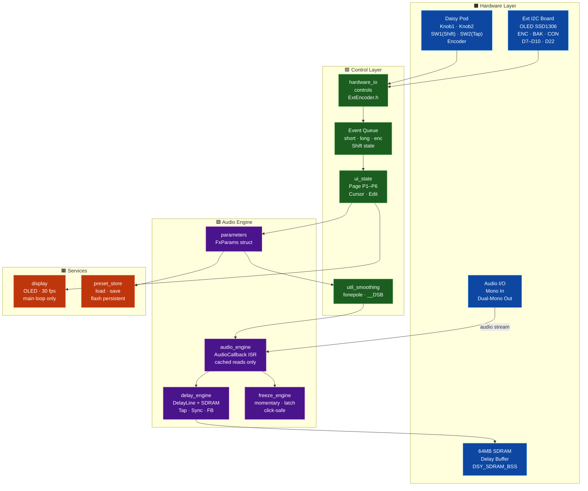
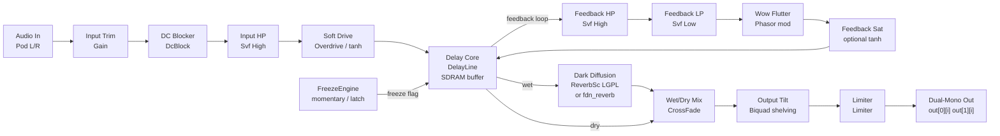
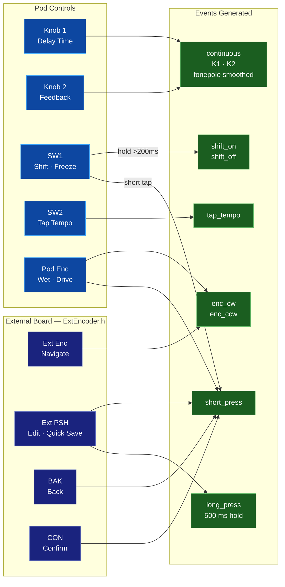
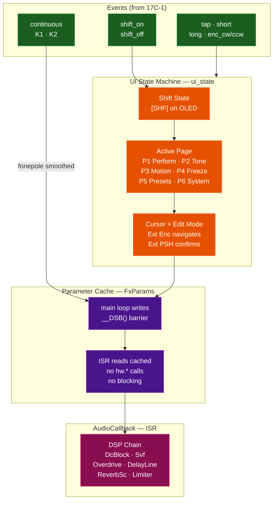

Technical Requirements / Statement of Work
Project: Electrosmith Daisy Pod + External OLED/Encoder Control Board
Target use case: EDGE-oriented mono DSP effects instrument

This is written as an implementation brief for Codex / coding agent.

1. Project Objective

Develop production-quality embedded firmware for an Electrosmith Daisy Pod upgraded with an external OLED + encoder + 2-button board, to create a dedicated mono effects processor optimized for Behringer EDGE input material.

The firmware shall behave as a performance instrument, not as a generic parameter demo.

Primary effect concept:

EDGE Performance Echo+
= input conditioning
+ soft drive
+ tempo-synced filtered delay
+ dark diffusion / compact reverb
+ freeze / stutter capture
+ OLED menu UI
+ layered control mapping with Shift

The implementation shall use libDaisy for hardware/platform integration and DaisySP plus custom DSP blocks where appropriate

2. Confirmed Hardware Context
2.1 Base platform
Electrosmith Daisy Pod
Daisy Seed mounted on Pod
Pod-native controls available:
2 potentiometers
2 pushbuttons
1 audio input path
stereo output path, but project is mono-in / mono-FX / dual-mono-out
2.2 Added external UI board

Confirmed external board signals:

SDA = I2C data
SCL = I2C clock
PSH = encoder pushbutton
TRA = encoder quadrature A
TRS = encoder quadrature B
BAK = back button
CON = confirm button
VCC = 3.3 V
GND = ground
2.3 Additional constraints confirmed
3V3 logic
no pin conflicts with Pod/Seed usage
OLED pull-ups are safe
encoder pins are not floating
2.4 Available controls summary
Pod-native
Pod Knob 1
Pod Knob 2
Pod Button SW1
Pod Button SW2
Pod onboard encoder with pushbutton
External board
OLED display over I2C
External encoder
External encoder pushbutton
Back button
Confirm button
3. Product Definition

The firmware shall implement a single focused FX instrument for EDGE-style material rather than a broad multi-effect browser.

3.1 Sonic design goals

The firmware must work well on:

percussive analog hits
short decays
noisy bursts
resonant sequences
bass pulses
metallic/industrial EDGE patches
3.2 Musical goals

The firmware shall:

thicken and spatialize EDGE without obscuring transient identity
create rhythmic multiplication via synced delay
support performance gestures such as freeze/stutter
allow fast access to primary controls
allow deep secondary editing without making live controls cumbersome
3.3 Non-goals for first release

Do not implement in v1:

broad “Swiss-army” multi-FX architecture
stereo imaging engines requiring true stereo input
MIDI control
preset morphing
sample loading
granular cloud engine
frequency shifter / ring mod
advanced modulation matrix
desktop editor

These may be future phases.

4. Functional Scope
4.1 Required DSP chain

The audio engine shall implement this signal flow:

Audio In
  ->
Input Trim
  ->
DC Blocker
  ->
Input High-Pass Filter
  ->
Soft Drive / Saturation
  ->
Tempo-Synced Delay Core
     with feedback high-pass
     with feedback low-pass
     with optional mild wow/flutter
     with optional saturation in feedback path
  ->
Compact Dark Diffusion / Reverb on wet path
  ->
Wet/Dry Mix
  ->
Output Tone / Tilt
  ->
Output Limiter / Protection
  ->
Dual-mono output (same signal to L/R)
4.2 Required effect features
A. Input conditioning

Must include:

DC blocking
input high-pass filter
controllable input trim
clipping prevention strategy
B. Drive stage

Must include:

soft saturation / overdrive
musically smooth transfer function
output level compensation as needed

Preferred first transfer function:

tanh or similarly smooth soft clip
C. Delay engine

Must include:

tempo-synced delay times
free-time mode optional only if easy; sync mode is mandatory
feedback control
filtered feedback loop
freeze / near-infinite hold mode
stable behavior at high feedback settings
D. Wet-path diffusion

Must include:

dark, short-to-medium diffusion/reverb character
damping / tone control
moderate CPU footprint
E. Freeze / stutter

Must include:

momentary freeze
optional latched freeze
repeat behavior stable under performance use
minimized clicks on engage/disengage
F. Output stage

Must include:

wet/dry mix
output tone / tilt or equivalent finishing control
limiter or soft protection to avoid runaway peaks
5. UI / UX Requirements
5.1 Design principle

The UI shall be split into:

performance layer
edit/navigation layer
shifted alternate control layer

This is mandatory.

5.2 Shift behavior

One pushbutton shall act as Shift for alternate controls / secondary parameter access.

Required Shift semantics
short hold while manipulating another control exposes secondary parameter behavior
Shift must be deterministic and must not require awkward two-hand timing
Shift state must be visible on OLED

Preferred default:

use one Pod pushbutton as Shift
Reason: ergonomically closer to performance controls.
5.3 Recommended control-role allocation
Performance controls
Pod Knob 1 → primary time-related macro
Pod Knob 2 → primary feedback / regeneration macro
Pod Button SW1 → Tap Tempo
Pod Button SW2 → Shift or Freeze, depending on final map
Pod onboard encoder + PB → performance-side alternate macro control or page quick access
External encoder → menu navigation / edit
External encoder PB → enter / edit / commit selected item
External Back → exit / cancel / menu up
External Confirm → confirm / commit / preset load / latch action
5.4 Required UI pages

At minimum implement:

Page 1 — Perform

Must expose:

time
feedback
drive
mix
BPM
freeze status
Page 2 — Tone

Must expose:

input HP
feedback LP
feedback HP
wet tone / damping
output tone / tilt
Page 3 — Motion

Must expose:

wow depth
wow rate
modulation enable / disable
Page 4 — Freeze

Must expose:

freeze mode
latch / momentary
hold behavior
loop/repeat size if implemented
Page 5 — Presets

Must expose:

load preset
save preset
init/default preset
Page 6 — System

Must expose:

brightness
encoder direction if needed
bypass mode
sample rate / block-size display
firmware version display
5.5 Screen behavior

OLED UI shall:

refresh at limited frame rate (target 20–30 Hz max)
avoid excessive redraws
use dirty redraw or cached redraw strategy
remain readable on a small display
clearly indicate:
current page
selected parameter
edit mode
Shift active state
freeze active state
BPM
5.6 Menu philosophy

The UI shall be:

shallow
deterministic
performance-oriented

Avoid:

nested menu labyrinths
modal ambiguity
hidden long-press actions unless explicitly shown somewhere
6. Control Mapping Requirements
6.1 Mandatory support for dual-layer control mapping

Every primary continuous control should support a secondary “Alt” target under Shift.

6.2 Required initial control map
Unshifted layer
Control	Function
Pod Knob 1	Delay time
Pod Knob 2	Feedback
Pod SW1	Tap tempo
Pod SW2	Freeze momentary or Shift
Pod encoder turn	Wet/dry or drive
Pod encoder push	Quick action: freeze latch / page toggle / mode
External encoder turn	Navigate selection
External encoder push	Edit selected parameter
Back	Back/cancel
Confirm	Confirm/apply
Shifted layer
Control	Function
Shift + Pod Knob 1	Delay subdivision / modulation depth / alternate time macro
Shift + Pod Knob 2	Feedback tone / damping / alternate feedback macro
Shift + SW1	Delay mode / clock mode
Shift + SW2	Alternate freeze mode / latch
Shift + Pod encoder turn	Drive / output tone
Shift + Pod encoder push	Page quick jump / preset quick save

Codex may improve exact mapping, but it must preserve:

fast live access
clear Shift behavior
external encoder reserved primarily for navigation/edit
7. DSP Requirements
7.1 Sample rate and block size

Firmware shall support a stable, practical real-time configuration.

Preferred initial target:

48 kHz
practical block size chosen to balance latency and CPU headroom
7.2 CPU budget

The implementation shall leave reasonable CPU headroom for UI and control scanning.
Avoid designs that run near failure margin under normal operation.

7.3 Real-time safety

Audio callback code shall:

avoid dynamic allocation
avoid blocking calls
avoid I2C/OLED writes inside the audio callback
avoid file I/O inside the callback
avoid expensive parameter parsing inside the callback
7.4 Parameter smoothing

All audible continuous parameters must be smoothed as appropriate, especially:

wet/dry mix
delay time transitions if not quantized
feedback
drive
output tone
7.5 Feedback stability

Delay feedback path must remain stable near maximum settings.
The code shall include protection against runaway behavior.

7.6 Freeze behavior

Freeze/stutter logic shall be explicitly engineered to avoid:

severe clicks
uncontrolled DC accumulation
runaway level jumps
unstable buffer indexing
7.7 Nonlinear stage precautions

Because no analog prefilter is inserted before the Pod, the DSP must include sensible conditioning:

DC blocking
input HP
optional pre/post low-pass around nonlinear stages if necessary
8. Software Architecture Requirements
8.1 Required modules

The firmware shall be organized into clear modules, at minimum:

main.cpp
hardware_io.*
controls.*
ui_state.*
display.*
parameters.*
audio_engine.*
delay_engine.*
freeze_engine.* or equivalent
preset_store.*
util_smoothing.*

Equivalent naming is acceptable if separation is preserved.

8.2 Required separation of concerns
Audio engine

Handles:

audio callback
DSP processing
cached parameter consumption
Hardware/control layer

Handles:

Pod knobs/buttons/encoder
external encoder/buttons
debouncing
control scanning
UI state machine

Handles:

pages
selection cursor
edit mode
Shift state
event handling
Display layer

Handles:

page rendering
formatting
redraw throttling
Preset storage

Handles:

load/save/init
validation/default fallback
8.3 Event-driven UI

The UI shall be implemented as an event/state-machine system, not as ad-hoc inline conditional logic.

Required event classes include, at minimum:

button short press
button long press
encoder clockwise
encoder counter-clockwise
encoder press
Shift pressed/released
tap tempo event
9. Data Model Requirements
9.1 Parameter structure

Use a central parameter structure, e.g.:

struct FxParams
{
    float input_gain_db;
    float hp_hz;
    float drive;
    float delay_time_beats;
    float feedback;
    float fb_lp_hz;
    float fb_hp_hz;
    float wow_depth;
    float wow_rate_hz;
    float diffuse_amt;
    float wet;
    float output_tilt;
    float limiter_drive;

    float freeze_size_ms;
    bool  freeze_reverse;
    bool  freeze_latched;
};

Codex may refine names/types, but must keep a centralized parameter store.

9.2 Preset model

Presets shall store all user-editable parameters needed to reproduce sound/behavior.

Must support at least:

a compiled default preset set
save/load to persistent memory if practical on target
fallback to defaults if saved data invalid
10. Deliverables
10.1 Required code deliverables

Codex shall produce:

Buildable firmware project
Clean source structure
Hardware pin map in code comments or config header
UI state-machine implementation
OLED rendering implementation
DSP engine implementation
Preset support
README with build/flash/use instructions
10.2 Required documentation deliverables
A. Technical README

Must include:

project overview
toolchain/build instructions
flash instructions
pin mapping
control mapping
page descriptions
known limitations
B. Architecture note

Short markdown document containing:

software module overview
state-machine overview
DSP block diagram
CPU/latency considerations
C. Test checklist

Must include:

boot test
control scan test
OLED test
audio pass-through test
delay timing test
freeze test
preset save/load test
long-run stability test
11. Acceptance Criteria

The project is accepted only if all of the following are met.

11.1 Boot / hardware
firmware boots reliably
OLED initializes reliably
no control conflicts
external encoder and buttons work correctly
Pod controls remain functional
11.2 Audio
clean bypass/pass-through works
no obvious clipping at nominal operating level unless intentionally driven
delay works and syncs correctly
freeze works repeatably
wet/dry mix behaves correctly
output is stable on both channels
11.3 UI
page navigation is consistent
Shift behavior is functional and understandable
no ambiguous control ownership
OLED remains readable and stable during operation
11.4 Performance
no audio dropouts during normal use
no OLED/UI updates inside callback causing glitches
no severe zipper noise on typical control changes
11.5 Code quality
code is modular and readable
no major dead code / spaghetti logic
comments explain non-obvious logic
no hardcoded magic values without rationale where it matters
12. Suggested Development Phases
Phase 1 — Hardware/UI bring-up
initialize OLED
read all controls
encoder direction/debounce verified
button event generation
page switching
test screen
Phase 2 — Audio skeleton
passthrough
DC block
input HP
parameter cache
Phase 3 — Delay core
synced delay
feedback
filtered loop
tap tempo
Phase 4 — Drive + diffusion + limiter
drive stage
compact dark wet diffusion
output finishing
Phase 5 — Freeze/stutter
freeze behavior
latch/momentary modes
click minimization
Phase 6 — Presets + polish
preset save/load
screen refinement
control map refinement
defensive bug fixing
13. Technical Guidance / Constraints for Codex
13.1 Use libraries pragmatically
use libDaisy for hardware/platform functions
use DaisySP where primitives are appropriate, but do not force a design around library availability alone
13.2 Prefer robust simple DSP over fancy fragile DSP

The first release should emphasize:

stable timing
musically good defaults
reliable UI
low-regret architecture
13.3 Avoid premature abstraction

Do not over-generalize into a large plugin-like framework for v1.

13.4 But do preserve extension paths

The code should leave a realistic path for future additions such as:

alternate FX algorithms
MIDI clock/control
extra preset logic
stereo port
external sync integration
14. Suggested Initial Presets

Provide at least 5 factory presets:

Kick Dub
Snare Space
Metal Burst
Noise Wash
Bass Echo Drive

These are names only; exact voicing may be chosen during implementation.

15. Final Implementation Intent

This project is not a generic effects sandbox.

It is a dedicated embedded performance FX instrument for EDGE-like mono analog material, with:

immediate live controls
deeper OLED-driven editing
Shift-based secondary access
one coherent sonic identity

---

16. DAISY_QAE Compliance Block

This section satisfies mandatory DAISY_QAE workflow requirements (CONCEPT phase items).

16.1 Complexity Rating

**9 / 10**

Rationale: multi-encoder I2C hardware, external OLED on Pod, custom delay engine requiring SDRAM, freeze/stutter logic, multi-page UI state machine, Shift layer, preset persistence.

16.2 DaisySP / DAFX Module Selection

| DSP Stage | Module | Library | Notes |
|---|---|---|---|
| DC Blocker | `DcBlock` | DaisySP core | `Init(sr)` → `Process(in)` |
| Input HP Filter | `Svf` (High output) | DaisySP core | `SetFreq()` `SetRes(0)` `Process(in)` `High()` |
| Soft Drive | `Overdrive` | DaisySP core | `Init()` (no sr arg) `SetDrive(0-1)` `Process(in)` |
| Delay Core | Custom `DelayLine<float,N>` | DaisySP core | **Must use SDRAM** — see §16.4 |
| Feedback LP | `Svf` (Low output) | DaisySP core | Separate instance in feedback path |
| Feedback HP | `Svf` (High output) | DaisySP core | Separate instance in feedback path |
| Wow/Flutter | `Phasor` → LUT → delay tap mod | DaisySP core | Modulate read pointer offset |
| Diffusion/Reverb | `ReverbSc` (**LGPL**) or `fdn_reverb` | DaisySP LGPL / DAFX | See §16.3 |
| Output Tilt | `Biquad` or `highshelving`+`lowshelving` | DaisySP / DAFX | Shelving pair = true tilt EQ |
| Output Limiter | `Limiter` | DaisySP core | `Init(sr)` `ProcessBlock(buf,buf,size)` |
| Parameter Smoothing | `fonepole()` | DaisySP utility | Per continuous param in callback |

16.3 LGPL Flag

If `ReverbSc` is chosen for the diffusion stage, the Makefile **must** include:

```makefile
USE_DAISYSP_LGPL = 1
```

Alternative: use `fdn_reverb` from `DaisyExamples/MyProjects/DAFX_2_Daisy_lib/` — no LGPL flag required.

16.4 SDRAM Placement — Delay Buffer (Critical)

A 2-second delay buffer at 48 kHz = `2 × 48000 × 4 bytes = 384 KB`. This **exceeds** available SRAM when combined with stack, BSS, and DSP state. The delay buffer **must** be placed in SDRAM:

```cpp
// Global scope — attribute forces placement in 64MB external SDRAM
static float DSY_SDRAM_BSS delay_buf[48000 * MAX_DELAY_SEC];
```

Omitting `DSY_SDRAM_BSS` will cause a silent linker overflow or runtime stack corruption.

16.5 Audio Callback Format (Pod — Non-Interleaved)

The reference implementation `Pod_OLED_EuclideanDrums` (confirmed working) uses the **non-interleaved** signature, which is valid for `DaisyPod`:

```cpp
void AudioCallback(AudioHandle::InputBuffer  in,
                   AudioHandle::OutputBuffer out,
                   size_t                    size)
{
    for(size_t i = 0; i < size; i++) {
        float sig = /* DSP chain */;
        out[0][i] = sig;   // Left
        out[1][i] = sig;   // Right (dual-mono)
    }
}
```

16.6 Initialization Order

```cpp
int main() {
    pod.Init();
    pod.SetAudioBlockSize(48);          // 48 recommended for heavy DSP — see §16.10
    pod.SetAudioSampleRate(SaiHandle::Config::SampleRate::SAI_48KHZ);
    float sr = pod.AudioSampleRate();

    ext_enc.Init();                     // ExtEncoder.h — see §16.7

    // Init all DSP modules with sample rate
    dc_block.Init(sr);
    svf_input_hp.Init(sr);
    overdrive.Init();                   // NOTE: no sr argument
    // ... all other modules

    pod.StartAdc();                     // CRITICAL: must be before StartAudio
    pod.StartAudio(AudioCallback);

    uint32_t last_draw = 0;
    while(true) {
        ext_enc.Debounce();             // call every loop iteration (~1kHz cadence)
        pod.ProcessAllControls();
        // ... event processing, UI state machine, preset I/O

        uint32_t now = System::GetNow();
        if(now - last_draw >= 33) {     // ~30 fps OLED throttle
            last_draw = now;
            // render active OLED page
        }
    }
}
```

16.7 External Encoder / Button Board — Reuse ExtEncoder.h

A complete, working wrapper for the external board already exists at:

```
DaisyExamples/MyProjects/_projects/Pod_OLED_EuclideanDrums/ExtEncoder.h
```

**Copy this file into the project.** It handles:

- Encoder A/B/PSH on pins `D7 / D8 / D9`
- CON (confirm) button on `D10`
- BAK (back) button on `D22` — uses direct GPIO + manual 8-bit shift-register debounce because `pod.Init()` configures `D17` (LED2_R) as a push-pull output, which corrupts `daisy::Switch` state on adjacent pins
- PSH held >500 ms long-press detection (fires once per hold)
- Encoder direction flip settable from System page

**Do not re-implement this from scratch.** The BAK pin workaround is non-obvious and already proven against hardware.

16.8 OLED I2C Pins (Pod)

```
SCL = D11
SDA = D12
I2C bus: I2C_1, 400 kHz
```

Note: The Daisy Field OLED uses SPI. The Pod has no native OLED — the external board connects over I2C. These are different buses; do not confuse them.

16.9 Thread Safety

When writing multiple fields of `FxParams` from the main loop before the audio ISR reads them, use a `__DSB()` barrier:

```cpp
params.delay_time_beats = new_time;
params.feedback         = new_fb;
__DSB();                    // flush write buffer — ISR sees both values together
params_ready = true;
```

For single-field updates (`volatile float`), the barrier is not required — 32-bit aligned writes are atomic on Cortex-M7.

Reference: `DAISY_DEVELOPMENT_STANDARDS.md` §7 — Thread Safety Patterns.

16.10 Block Size Recommendation

Use **48** for this project. Block size 4 (used in lighter Pod examples) leaves insufficient CPU headroom for the full DSP chain: delay read/write, reverb, drive, two feedback filter stages, wow modulation, limiter, and parameter smoothing running simultaneously.

---

17. Block Diagrams

> These satisfy the DAISY_QAE Step 2 requirement: 3 diagrams before implementation.

### 17A. System Architecture



### 17B. Signal Flow (flowchart LR)



### 17C-1. Control Flow — Inputs → Events (flowchart LR)

> Shows how physical controls map to event types. All reads happen in the **main loop** — never in ISR.



### 17C-2. Control Flow — Events → State → ISR (flowchart TD)

> Shows how events drive the UI state machine and how parameter changes reach the audio ISR safely.

