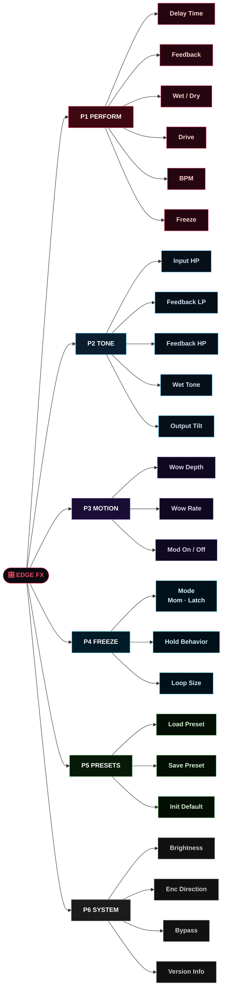
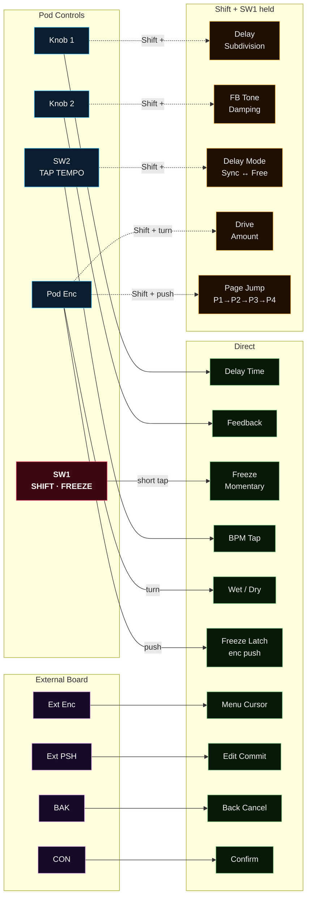
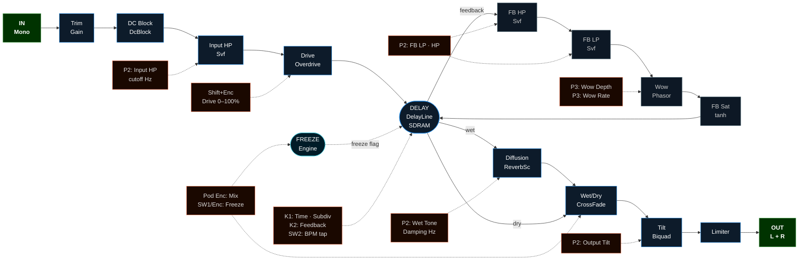

# EDGE Performance FX — Pages, Controls & Effects

Three visual maps:
- **Map 1** — Page hierarchy and parameters per page
- **Map 2** — Physical controls → direct and shifted effect targets
- **Map 3** — DSP signal chain with control assignments per stage

---

## Map 1 — Pages & Parameters

Each page node branches to its editable parameters.
Live controls (Knob 1, Knob 2, SW1, SW2, Pod Enc) are accessible from any page — shown in Map 2.

---

## Map 2 — Control Routing

Solid arrows = direct action. Dashed arrows = Shift + control.
SW1 is the Shift modifier: short tap alone = Freeze momentary.

---

## Map 3 — DSP Chain + Control Assignments

Main signal path (left → right). Feedback loop shown. Dashed lines = which controls
or pages govern each DSP stage.

