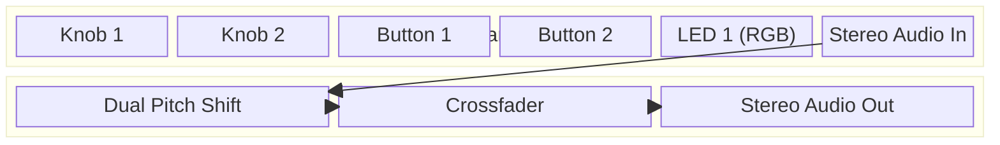
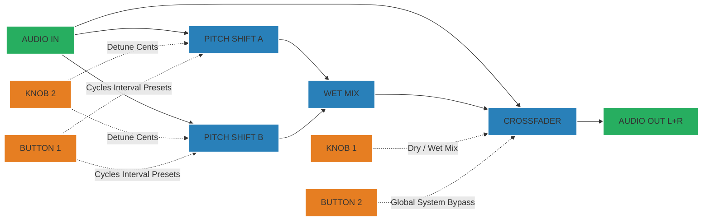

# Pod Harmonizer — Controls Documentation

## A. System Architecture

## B. Signal Flow

## C. Parameter Mapping

### Hardware Controls

| Control | Mode | Function | Range / Notes |
|---------|------|----------|---------------|
| **Button 1** | Global | Preset Cycler | Cycles between Thirds, Fifths, and Octave presets |
| **Button 2** | Global | Bypass Toggle| Bypasses effect, sending only dry input to the output. |
| **Knob 1** | Global | Mix | Crossfades between 0% (Dry) and 100% (Wet) |
| **Knob 2** | Global | Detune | Pitch offsets both shifters (0 - 50 Cents) for chorus-like thickness |

### LED Indicators

| Component | Color | Presets |
|-----------|-------|---------|
| **LED 1** | Green | Thirds (+Major 3rd, -Minor 3rd) |
| **LED 1** | Blue | Fifths (+Perfect 5th, -Perfect 4th) |
| **LED 1** | Purple| Octave (+1 Octave, -1 Octave) |
| **LED 1** | Dim | Global Bypass Active |

## D. Presets

1. **Thirds (Green)**: Creates a major 3rd above the input and a minor 3rd below the input, forming rich chordal sounds with single melody lines.
2. **Fifths (Blue)**: Creates a perfect 5th up and a perfect 4th down. An iconic harmony setting for strong root reinforcements.
3. **Octaves (Purple)**: Standard dual octaver. One octave up, one octave down. Excellent for expanding sonic width. 
