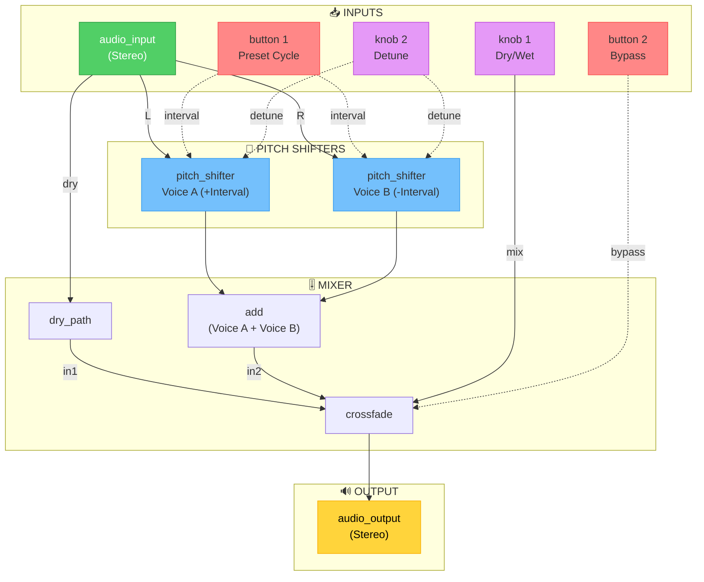

# Pod_Harmonizer

**Platform**: Daisy Pod  
**Category**: Audio Effect (Pitch Processing)  
**Complexity**: Intermediate

---

## Project Definition

A **stereo harmonizer** effect that takes audio input and creates two pitch-shifted harmony voices. The user can control the harmony intervals and mix between dry and wet signals.

### Features
- Dual pitch shifting (Voice A and Voice B)
- MIDI-controlled transposition (optional)
- Dry/Wet mix
- Button-selectable harmony presets (Thirds, Fifths, Octave)

### Control Mapping

| Control | Function | Range |
|---------|----------|-------|
| **Knob 1** | Dry/Wet Mix | 0-100% |
| **Knob 2** | Detune Amount | 0-50 cents |
| **Button 1** | Cycle Harmony Preset | 3rds / 5ths / Oct |
| **Button 2** | Bypass Toggle | On / Off |
| **LED** | Indicates Mode | Green=3rd, Blue=5th, Purple=Oct |

### Hardware Constraints
- Sample Rate: 48kHz
- Block Size: 48 samples
- Audio: Stereo In / Stereo Out
- MIDI: Optional (for real-time interval control)

---

## Block Diagram (Mermaid)

This is the **source of truth** for the signal flow. C++ implementation MUST match this diagram.

### Block Legend
| Color | Meaning |
|-------|---------|
| 🟢 **Green** | Audio Input |
| 🔵 **Blue** | DSP Blocks (Pitch Shifters) |
| 🟣 **Purple** | Knob Controls |
| 🔴 **Red** | Button Controls |
| 🟡 **Yellow** | Audio Output |

---

## DVPE Gap Analysis (Pre-Implementation)

**Expected Rating**: 9/10

All blocks in the diagram exist in DVPE:
- `audio_input` ✅
- `pitch_shifter` ✅
- `add` ✅
- `crossfade` ✅
- `audio_output` ✅
- `knob` ✅
- `button` ✅

**Minor Gap**: The "Preset Cycling" logic (Button 1 → State Machine → Interval Value) requires a small state machine or lookup table. This can be handled with a `counter` or `selector` block if available, or embedded in the `pitch_shifter` parameters.

---

## C++ Implementation

The C++ module uses the DaisySP pitch shifters with dynamic preset shifting configurations and a strict split-polling latency architecture separating analog signal polling (`ProcessAnalogControls()`) and UI button actions in the primary loop.

For a detailed visual map of how parameters and user controls connect directly to DSP operations, please refer to [CONTROLS.md](CONTROLS.md).
