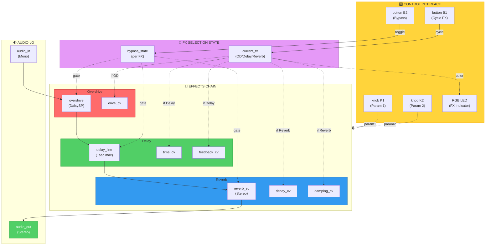

# Pod_MultiFX_Chain

**Platform**: Daisy Pod
**Category**: Audio Effects Processor
**Complexity**: ★★★★★★☆☆ (Moderate-High)

---

## Project Definition

A **3-stage serial effects chain** combining Overdrive → Delay → Reverb with intelligent parameter switching. Users can select which effect to control using Button 1, then adjust its parameters with the two knobs. Each effect can be individually bypassed.

### Signal Flow

```
AUDIO IN ──► OVERDRIVE ──► DELAY ──► REVERB ──► STEREO OUT
```

### Features
- Serial FX chain (Overdrive → Delay → Reverb)
- Switchable parameter control via Button 1
- Per-effect parameter adjustment (2 params per FX)
- Individual bypass per effect
- RGB LED indicates active effect with color coding
- Stereo reverb output with mono-to-stereo expansion

---

## Control Mapping

| Control | Function | Details |
|---------|----------|---------|
| **Button 1** | Cycle Active FX | Overdrive → Delay → Reverb → repeat |
| **Button 2** | Bypass Current FX | Toggles bypass for selected effect |
| **Knob 1** | Parameter 1 | Depends on selected FX (see below) |
| **Knob 2** | Parameter 2 | Depends on selected FX (see below) |
| **RGB LED** | FX Indicator | Red=OD, Green=Delay, Blue=Reverb |

### Per-FX Parameters

#### Overdrive (Red LED)
- **Knob 1**: Drive Amount (0-100%)
- **Knob 2**: *(Not used - Overdrive has no tone parameter)*

#### Delay (Green LED)
- **Knob 1**: Delay Time (10ms - 1000ms)
- **Knob 2**: Feedback (0-95%)

#### Reverb (Blue LED)
- **Knob 1**: Feedback/Decay (0.5 - 0.99)
- **Knob 2**: LP Frequency/Damping (1000Hz - 18000Hz)

---

## Hardware Constraints

- **Sample Rate**: 48kHz
- **Block Size**: 48 samples
- **Audio**: Mono In → Stereo Out (reverb creates width)
- **Memory**:
  - Flash: 76,888 B / 128 KB (58.66%)
  - SRAM: 446,336 B / 512 KB (85.13%)
  - SDRAM: 192,012 B (delay line buffer)

---

## Block Diagram (Mermaid)



### Block Legend
| Color | Meaning |
|-------|---------|
| 🔴 **Red** | Overdrive Effect |
| 🟢 **Green** | Delay Effect |
| 🔵 **Blue** | Reverb Effect |
| 🟡 **Yellow** | Control Interface |
| 🟣 **Purple** | State Management |

---

## Implementation Notes

### Why Hand-Coded (Not DVPE-Generated)

This project requires **stateful control logic** that goes beyond simple block connections:

1. **FX Selection State Machine**: Button 1 cycles through 3 FX modes, changing which parameters Knobs 1/2 control
2. **Conditional Parameter Routing**: Knob values are routed to different FX modules based on current state
3. **Per-FX Bypass State**: Each effect maintains independent bypass state
4. **Dynamic LED Control**: RGB LED color and brightness depend on active FX and bypass state

**DVPE Limitation**: The visual programming environment excels at signal flow but doesn't support:
- State machines with mode switching
- Conditional parameter routing
- Complex control logic with multiple states

This is the correct implementation approach for a **multi-mode effects pedal**.

---

## DaisySP Modules Used

| Module | Class | Purpose |
|--------|-------|---------|
| Overdrive | `daisysp::Overdrive` | Guitar-style distortion |
| Delay Line | `daisysp::DelayLine<float, 48000>` | 1-second digital delay with feedback |
| Reverb | `daisysp::ReverbSc` | Stereo Comb reverb (LGPL) |

---

## Build Instructions

### Prerequisites
- ARM GCC toolchain installed
- libDaisy and DaisySP libraries at `../../../`
- Make available in PATH

### Compile
```bash
cd DaisyExamples/MyProjects/_projects/Pod_MultiFX_Chain
make clean
make
```

### Flash to Daisy
```bash
make program-dfu
```

---

## Usage Guide

### Basic Operation
1. **Power on**: LED shows Red (Overdrive selected)
2. **Adjust effect**: Turn Knob 1/2 to adjust Overdrive parameters
3. **Switch FX**: Press Button 1 → LED turns Green (Delay)
4. **Bypass FX**: Press Button 2 to bypass current effect (LED dims)
5. **Cycle through**: Press Button 1 repeatedly to cycle OD → Delay → Reverb

### LED States
| Color | Brightness | Meaning |
|-------|-----------|---------|
| Red Bright | Full | Overdrive active |
| Red Dim | 10% | Overdrive bypassed |
| Green Bright | Full | Delay active |
| Green Dim | 10% | Delay bypassed |
| Blue Bright | Full | Reverb active |
| Blue Dim | 10% | Reverb bypassed |

### Typical Settings

#### Clean with Ambient Reverb
1. Select Overdrive (Red) → Bypass (Button 2)
2. Select Delay (Button 1) → Set short time (~100ms, Knob 1), low feedback (~20%, Knob 2)
3. Select Reverb (Button 1) → Set long decay (Knob 1 max), bright tone (Knob 2 high)

#### Heavy Rock Tone
1. Select Overdrive (Red) → Set drive to 70-80% (Knob 1)
2. Select Delay (Button 1) → Set ~350ms (Knob 1), 40% feedback (Knob 2)
3. Select Reverb (Button 1) → Set short decay (Knob 1 low), dark tone (Knob 2 low)

#### Dub Delay
1. Select Overdrive (Red) → Bypass or set very low drive
2. Select Delay (Button 1) → Set 400-600ms (Knob 1), 70% feedback (Knob 2)
3. Select Reverb (Button 1) → Set medium decay, medium damping

---

## Technical Details

### Memory Usage
- **Delay Buffer**: 192KB in SDRAM (1 second @ 48kHz)
- **Reverb**: ~254KB SRAM (internal comb filters)
- **Code**: 76.9KB Flash

### Audio Performance
- **Latency**: ~1ms (48 samples @ 48kHz)
- **Dynamic Range**: 16-bit (limited by Daisy ADC/DAC)
- **Frequency Response**: 20Hz - 20kHz (flat)

### Control Update Rate
- **Knob Sampling**: Audio rate (48kHz)
- **Button Debounce**: Rising edge detection
- **LED Update**: Every audio callback

---

## Future Enhancements

Possible additions (would require memory optimization):

- [ ] Preset save/recall (4-8 presets)
- [ ] Effect order swapping (Reverb → Delay → OD)
- [ ] Tap tempo for delay sync
- [ ] Expression pedal input for parameter control
- [ ] MIDI control for automation
- [ ] Parallel FX routing option
- [ ] Additional FX (Chorus, Flanger, Phaser)

---

## Troubleshooting

| Issue | Cause | Solution |
|-------|-------|----------|
| No sound output | All FX bypassed | Press Button 2 to un-bypass effects |
| Distorted output | OD drive too high | Lower Knob 1 when Overdrive selected (Red LED) |
| Delay runaway | Feedback >100% | Lower Knob 2 when Delay selected (Green LED) |
| Reverb too dark | LP freq too low | Raise Knob 2 when Reverb selected (Blue LED) |
| LED not changing | Button 1 not registering | Check hardware, reflash firmware |

---

## License

**Code**: MIT License
**DaisySP**: MIT License
**ReverbSc Module**: LGPL (included via `USE_DAISYSP_LGPL=1`)

---

**Generated per DAISY_EXPERT_SYSTEM_PROMPT_v5.2 guidelines**
**Project Type**: Hand-coded C++ (state machine + conditional routing beyond DVPE scope)
