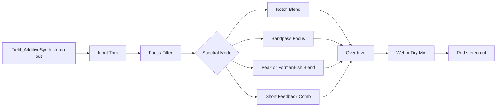
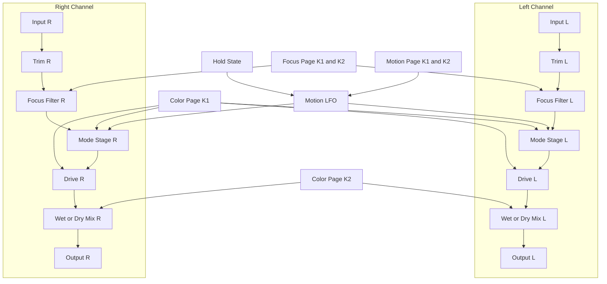
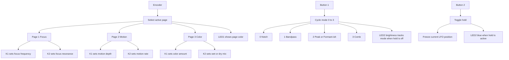

# Pod_SpectralMutator

Stereo Daisy Pod effect box for adding unusual post-FX spectral color after
`Field_AdditiveSynth`.

## Purpose

`Field_AdditiveSynth` already provides chorus and reverb. `Pod_SpectralMutator`
is meant to sit after that and add:

- moving notches
- narrow bandpass focus
- resonant peak or formant-like emphasis
- short metallic comb coloration
- post-filter drive and wet/dry blend

The goal is to add character without losing the original synth identity at low
mix settings.

## Current Signal Chain

`stereo input -> input trim -> focus filter -> mode stage -> drive -> wet/dry output`

## Block Diagram



## Signal Flow Diagram



## Controls

### Page 1: Focus

- `K1`: focus frequency
- `K2`: focus resonance

### Page 2: Motion

- `K1`: motion depth
- `K2`: motion rate

### Page 3: Color

- `K1`: color amount
- `K2`: wet/dry mix

### Buttons

- `B1`: cycle mode
  - `0`: Notch
  - `1`: Bandpass
  - `2`: Peak/Formant-ish
  - `3`: Comb
- `B2`: hold current motion value

### LEDs

- `LED1`: current page color
- `LED2`: hold state or current mode level

## Control Flow Diagram



## Pairing With Field_AdditiveSynth

Good starting presets from `Field_AdditiveSynth`:

- `Organ`: strong candidate for notch and peak modes
- `Hollow`: useful for animated motion tests
- `Buzz`: useful for input trim and harshness checks

Suggested use:

- keep the synth's own chorus and reverb active
- start with a low Pod wet/dry setting
- sweep focus frequency first, then add motion, then raise color

## Patch Examples

Values are shown as normalized Pod settings from `0.00` to `1.00`, followed by an
approximate knob position in parentheses.

### 1. Hollow Sweep

- Best with `Field_AdditiveSynth`: `Hollow`
- Mode: `0` Notch
- Hold: `Off`
- Page 1 Focus: `K1 0.38` (`11:00`), `K2 0.54` (`1:00`)
- Page 2 Motion: `K1 0.52` (`1:00`), `K2 0.18` (`9:30`)
- Page 3 Color: `K1 0.34` (`10:30`), `K2 0.30` (`10:00`)
- Result: moving hollowed pad with gentle vowel-like shifting

### 2. Talking Organ

- Best with `Field_AdditiveSynth`: `Organ`
- Mode: `2` Peak/Formant-ish
- Hold: `Off`, then tap `B2` when the sweep lands on a good vowel
- Page 1 Focus: `K1 0.31` (`10:00`), `K2 0.72` (`2:00`)
- Page 2 Motion: `K1 0.42` (`11:30`), `K2 0.26` (`10:30`)
- Page 3 Color: `K1 0.46` (`12:00`), `K2 0.38` (`11:00`)
- Result: reed-like animated formant emphasis that can be frozen into a fixed tone

### 3. Radio Tunnel

- Best with `Field_AdditiveSynth`: `Bell` or `Tri`
- Mode: `1` Bandpass
- Hold: `Off`
- Page 1 Focus: `K1 0.24` (`9:30`), `K2 0.80` (`2:30`)
- Page 2 Motion: `K1 0.16` (`9:30`), `K2 0.12` (`9:00`)
- Page 3 Color: `K1 0.28` (`10:00`), `K2 0.44` (`11:30`)
- Result: narrow, nasal, distant focus that cuts a pad down to a small spectral window

### 4. Metallic Halo

- Best with `Field_AdditiveSynth`: `Organ` or `Buzz`
- Mode: `3` Comb
- Hold: `On` after finding a sweet spot
- Page 1 Focus: `K1 0.58` (`1:30`), `K2 0.40` (`11:00`)
- Page 2 Motion: `K1 0.20` (`9:30`), `K2 0.10` (`9:00`)
- Page 3 Color: `K1 0.64` (`2:00`), `K2 0.26` (`10:00`)
- Result: metallic ring around the existing reverb tail without turning into a full delay

### 5. Broken Glass Reed

- Best with `Field_AdditiveSynth`: `Buzz`
- Mode: `3` Comb
- Hold: `Off`
- Page 1 Focus: `K1 0.69` (`2:30`), `K2 0.66` (`1:30`)
- Page 2 Motion: `K1 0.34` (`10:30`), `K2 0.20` (`9:30`)
- Page 3 Color: `K1 0.78` (`3:00`), `K2 0.36` (`11:00`)
- Result: bright, unstable metallic edge with stronger drive and a sharper comb bite

## Quick Starting Moves

- For softer pads, keep `Page 3 K2` below `0.35` so the Pod stays as a color layer.
- If comb mode gets too sharp, reduce `Page 3 K1` before reducing wet mix.
- For frozen spectral sweet spots, set motion first, then hit `B2` instead of turning motion depth to zero.
- `Organ`, `Hollow`, and `Buzz` remain the most useful comparison presets from `Field_AdditiveSynth`.

## Build

From the project directory:

```bash
make
```

## Notes

- Motion is smoothed and can be frozen with `B2`
- Comb feedback is deliberately clamped for stability
- This is an external-input Pod effect, not a Pod synth voice
