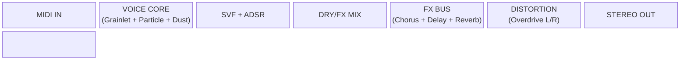
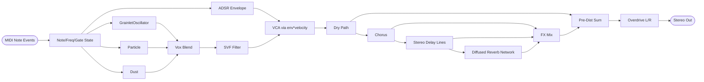
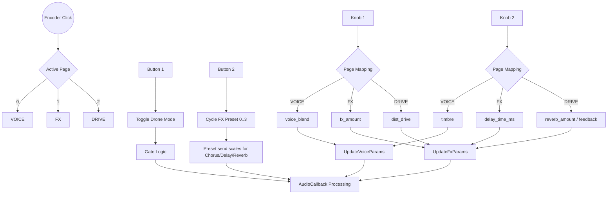

# Pod_SynthFxWorkstation Diagrams

Derived from:
- `Pod_SynthFxWorkstation.cpp`

## A) Block Diagram

```mermaid
block-beta
  columns 7
  MIDI["MIDI IN"]
  VOX["VOICE CORE\n(Grainlet + Particle + Dust)"]
  FLT["SVF + ADSR"]
  MIX["DRY/FX MIX"]
  FX["FX BUS\n(Chorus + Delay + Reverb)"]
  DIST["DISTORTION\n(Overdrive L/R)"]
  OUT["STEREO OUT"]

  MIDI --> VOX --> FLT --> MIX --> FX --> DIST --> OUT
```

## B) Audio Flow

```mermaid
flowchart LR
  MIDI([MIDI Note Events]) --> NOTE[Note/Freq/Gate State]

  NOTE --> GRAIN[GrainletOscillator]
  NOTE --> PART[Particle]
  NOTE --> DUST[Dust]
  NOTE --> ENV[ADSR Envelope]

  GRAIN --> VBLEND[Vox Blend]
  PART --> VBLEND
  DUST --> VBLEND
  VBLEND --> SVF[SVF Filter]
  ENV --> VCA[VCA via env*velocity]
  SVF --> VCA

  VCA --> DRY[Dry Path]

  DRY --> CH[Chorus]
  CH --> DLY[Stereo Delay Lines]
  DLY --> RVB[Diffused Reverb Network]

  CH --> FXMIX[FX Mix]
  DLY --> FXMIX
  RVB --> FXMIX

  DRY --> PRE[Pre-Dist Sum]
  FXMIX --> PRE
  PRE --> DIST[Overdrive L/R]
  DIST --> OUT([Stereo Out])
```

## C) Control Flow

```mermaid
flowchart TD
  ENC((Encoder Click)) --> PAGE{Active Page}
  PAGE -->|0| P0[VOICE]
  PAGE -->|1| P1[FX]
  PAGE -->|2| P2[DRIVE]

  B1[Button 1] --> DRONE[Toggle Drone Mode]
  B2[Button 2] --> PRESET[Cycle FX Preset 0..3]

  K1[Knob 1] --> MAP1{Page Mapping}
  K2[Knob 2] --> MAP2{Page Mapping}

  MAP1 -->|VOICE| VB[voice_blend]
  MAP2 -->|VOICE| TIM[timbre]

  MAP1 -->|FX| FXA[fx_amount]
  MAP2 -->|FX| DTM[delay_time_ms]

  MAP1 -->|DRIVE| DD[dist_drive]
  MAP2 -->|DRIVE| RVA[reverb_amount / feedback]

  PRESET --> FXBUS[Preset send scales for Chorus/Delay/Reverb]
  VB --> PARAMS[UpdateVoiceParams]
  TIM --> PARAMS
  FXA --> FXPARAMS[UpdateFxParams]
  DTM --> FXPARAMS
  DD --> FXPARAMS
  RVA --> FXPARAMS

  DRONE --> GATE[Gate Logic]
  GATE --> AUDIO[AudioCallback Processing]
  FXBUS --> AUDIO
  PARAMS --> AUDIO
  FXPARAMS --> AUDIO
```

