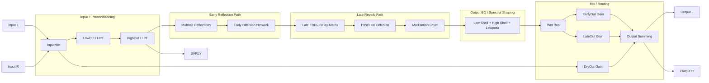
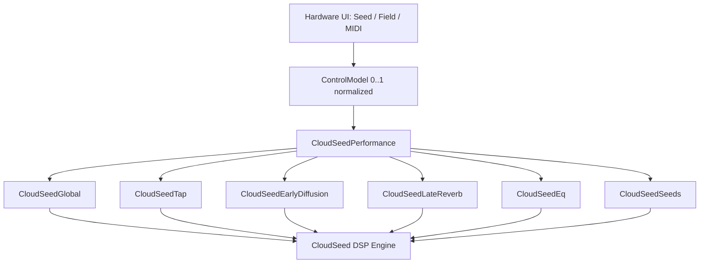
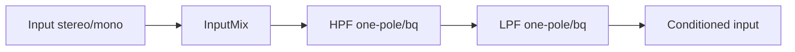
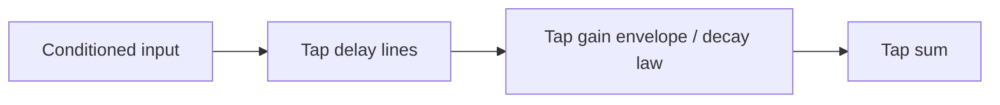
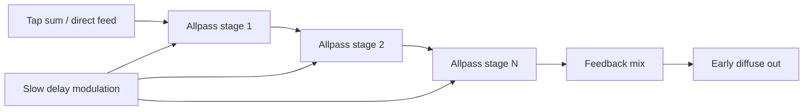
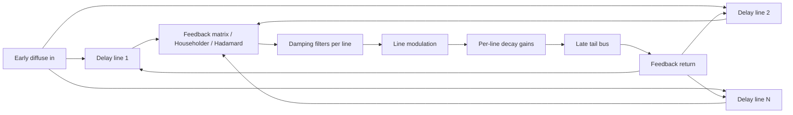
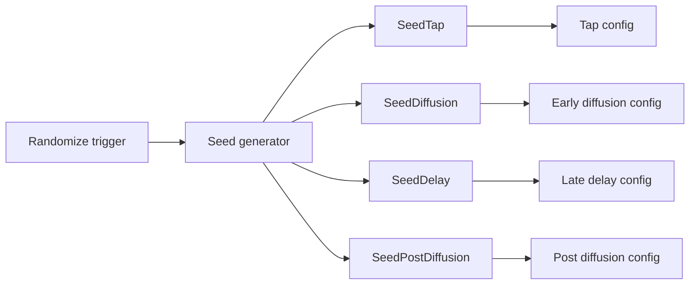

# CloudSeedCore Interactive DSP Block Diagram (Daisy Bridge)

This schematic describes an interactive CloudSeedCore-style reverb architecture for Daisy Seed/Field integration.

- Shows **audio signal flow** from input to output.
- Breaks down the engine into main FX stages.
- Expands each stage into DSP primitives/classes.
- Documents control/parameter ownership by block.

---

## 1) Top-Level Signal Flow

---

## 2) Interactive Control Plane (Parameter Domains)

---

## 3) Expandable DSP Primitives by Main FX Block

## 3.1 Input + Preconditioning (Global)

**DSP primitives/classes**
- Gain stage (`InputMix`).
- High-pass filter (`LowCutEnabled`, `LowCut`).
- Low-pass filter (`HighCutEnabled`, `HighCut`).

**Controls (CloudSeedGlobal)**
- `INTERPOLATION_PARAM`
- `INPUT_MIX_PARAM`
- `LOW_CUT_ENABLED_PARAM`, `LOW_CUT_PARAM`
- `HIGH_CUT_ENABLED_PARAM`, `HIGH_CUT_PARAM`
- `DRY_OUT_PARAM`, `EARLY_OUT_PARAM`, `LATE_OUT_PARAM`

---

## 3.2 Multitap Reflections (Tap Block)

**DSP primitives/classes**
- Parallel short delay lines.
- Per-tap gain/decay scaling.
- Optional tap predelay.

**Controls (CloudSeedTap)**
- `TAP_ENABLED_PARAM`
- `TAP_COUNT_PARAM`
- `TAP_DECAY_PARAM`
- `TAP_PREDELAY_PARAM`
- `TAP_LENGTH_PARAM`

---

## 3.3 Early Diffusion Network

**DSP primitives/classes**
- Cascaded allpass diffusers.
- Diffusion feedback path.
- Delay-time modulation (LFO/random).

**Controls (CloudSeedEarlyDiffusion)**
- `EARLY_DIFFUSE_ENABLED_PARAM`
- `EARLY_DIFFUSE_COUNT_PARAM`
- `EARLY_DIFFUSE_DELAY_PARAM`
- `EARLY_DIFFUSE_MOD_AMOUNT_PARAM`
- `EARLY_DIFFUSE_FEEDBACK_PARAM`
- `EARLY_DIFFUSE_MOD_RATE_PARAM`

---

## 3.4 Late Reverb Core (FDN / Delay Matrix)

**DSP primitives/classes**
- Delay-bank (`LateLineCount`, `LateLineSize`).
- Feedback mixing matrix (`LateMode`).
- Per-line damping filters.
- Delay-line modulation (`LateLineModAmount`, `LateLineModRate`).
- Decay gains (`LateLineDecay`).
- Optional late diffusion chain.

**Controls (CloudSeedLateReverb)**
- `LATE_MODE_PARAM`
- `LATE_LINE_COUNT_PARAM`
- `LATE_DIFFUSE_ENABLED_PARAM`
- `LATE_DIFFUSE_COUNT_PARAM`
- `LATE_LINE_SIZE_PARAM`
- `LATE_LINE_MOD_AMOUNT_PARAM`
- `LATE_DIFFUSE_DELAY_PARAM`
- `LATE_DIFFUSE_MOD_AMOUNT_PARAM`
- `LATE_LINE_DECAY_PARAM`
- `LATE_LINE_MOD_RATE_PARAM`
- `LATE_DIFFUSE_FEEDBACK_PARAM`
- `LATE_DIFFUSE_MOD_RATE_PARAM`

---

## 3.5 Output EQ / Spectral Section

**DSP primitives/classes**
- Shelving filters.
- Final low-pass roll-off.
- Cross-seed logic for parameter randomization coupling.

**Controls (CloudSeedEq)**
- `EQ_LOW_SHELF_ENABLED_PARAM`
- `EQ_HIGH_SHELF_ENABLED_PARAM`
- `EQ_LOWPASS_ENABLED_PARAM`
- `EQ_LOW_FREQ_PARAM`
- `EQ_HIGH_FREQ_PARAM`
- `EQ_CUTOFF_PARAM`
- `EQ_LOW_GAIN_PARAM`
- `EQ_HIGH_GAIN_PARAM`
- `EQ_CROSS_SEED_PARAM`

---

## 3.6 Seed/Randomization Control Layer

**DSP primitives/classes**
- Deterministic seedable RNG.
- Block-local seed routing (tap/diffusion/delay/post-diffusion).

**Controls (CloudSeedSeeds)**
- `SEED_TAP_PARAM`
- `SEED_DIFFUSION_PARAM`
- `SEED_DELAY_PARAM`
- `SEED_POST_DIFFUSION_PARAM`

---

## 4) Daisy Performance Macro Mapping (Current 8 Knobs)

| Performance Param | Suggested CloudSeed Domain |
|---|---|
| `MIX_PARAM` | `INPUT_MIX_PARAM` / wet blend macro |
| `SIZE_PARAM` | `LATE_LINE_SIZE_PARAM` |
| `DECAY_PARAM` | `LATE_LINE_DECAY_PARAM` |
| `DIFFUSION_PARAM` | `EARLY_DIFFUSE_FEEDBACK_PARAM` + `LATE_DIFFUSE_FEEDBACK_PARAM` macro |
| `PRE_DELAY_PARAM` | `TAP_PREDELAY_PARAM` |
| `DAMPING_PARAM` | `HIGH_CUT_PARAM` + damping filters macro |
| `MODULATION_PARAM` | `LATE_LINE_MOD_AMOUNT_PARAM` + `EARLY_DIFFUSE_MOD_AMOUNT_PARAM` |
| `MODULATION_RATE_PARAM` | `LATE_LINE_MOD_RATE_PARAM` + `EARLY_DIFFUSE_MOD_RATE_PARAM` |

---

## 5) Practical Class/Module Decomposition (for implementation)

- `InputConditioner`
  - Gain + HP/LP filters.
- `TapReflections`
  - Multitap delays and decay curves.
- `EarlyDiffuser`
  - Cascaded allpass network + modulation.
- `LateReverbCore`
  - Delay-bank, feedback matrix, damping, modulation, decay.
- `OutputEq`
  - Shelf + lowpass chain.
- `SeedRouter`
  - Seeded randomization and per-block dispatch.
- `CloudSeedEngineAdapter`
  - Bridges `ControlModel` / per-class enums to DSP internals.

This decomposition aligns with the enum classes in `CloudSeedInteractiveParameters.h` and keeps Seed/Field control mapping independent from DSP internals.
