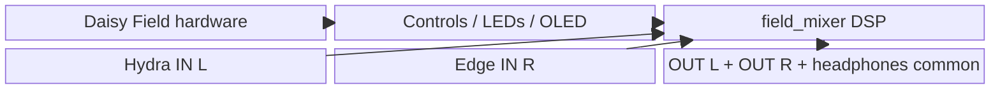
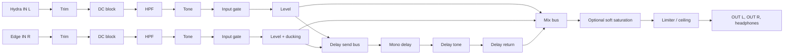
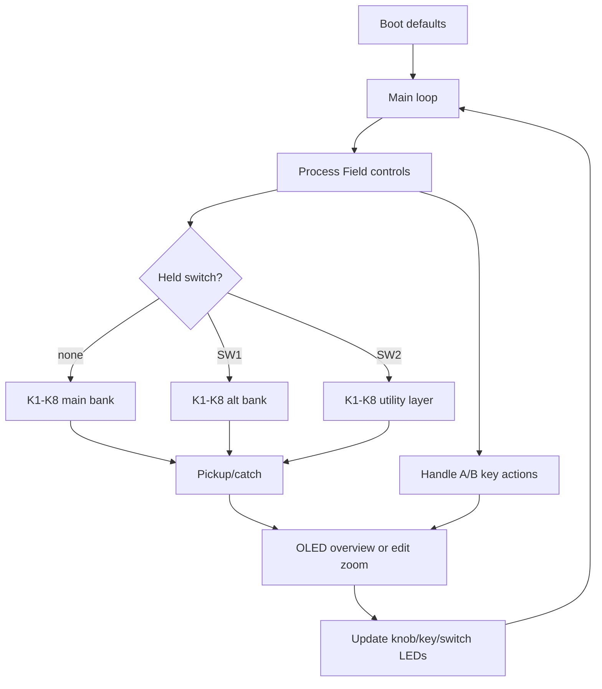

# field_mixer

`field_mixer` is a Daisy Field performance mixer for two mono instruments:
Hydra on `IN L` and Edge on `IN R`. It keeps the sources separate at the
control level, then creates one common output mix on `OUT L` and `OUT R`.
The headphone output carries the same common mix because the Field exposes the
headphone jack through the same codec output pair used by the line outputs.

The project intentionally avoids side-image controls. Round 1 focuses on level,
input cleanup, no-input hum suppression, tone, delay-send performance, ducking,
saturation, and output safety.

## Concept

- Purpose: mix Hydra and Edge quickly in a small hardware rig without adding a
  deep effects workstation.
- Required DSP: DC blocking, high-pass filtering, smooth input gating for
  floating/no-input jacks, tone tilt, mono delay, envelope-based Edge ducking,
  optional soft saturation, and always-on limiting.
- Complexity rating: 5/10. The DSP is deliberately conservative; the main
  complexity is the Field control surface and safe pickup/catch behavior.

## System Architecture



## Signal Flow



## Control Flow



## Build

From this directory:

```sh
make
```

## Validation Status

This project may be marked hardware-validated only after:

- `make` succeeds
- QAE validation succeeds
- `make program` succeeds through ST-Link, if flashing is requested
- the manual checklist in `CONTROLS.md` is completed and dated

Until then, describe the result as `build-verified only - hardware validation
not performed`.
