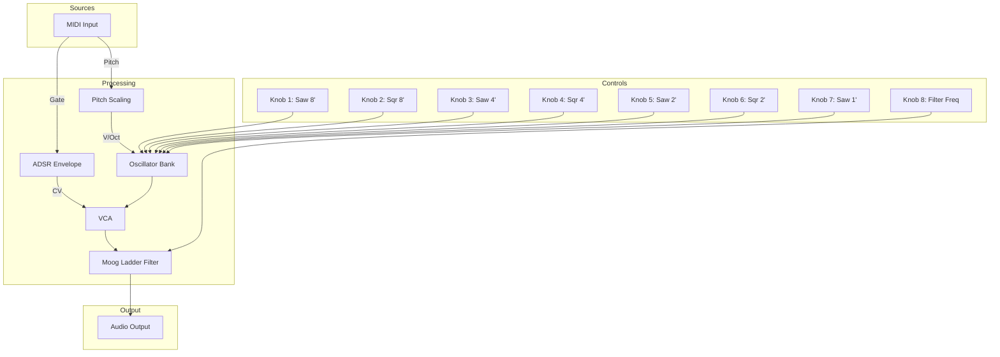

```mermaid
graph TD
    subgraph Controls
        K1[Knob 1: Saw 8']
        K2[Knob 2: Sqr 8']
        K3[Knob 3: Saw 4']
        K4[Knob 4: Sqr 4']
        K5[Knob 5: Saw 2']
        K6[Knob 6: Sqr 2']
        K7[Knob 7: Saw 1']
        K8[Knob 8: Filter Freq]
    end

    subgraph Sources
        MIDI[MIDI Input]
    end

    subgraph Processing
        Scale[Pitch Scaling]
        OscBank[Oscillator Bank]
        ADSR[ADSR Envelope]
        VCA[VCA]
        Filter[Moog Ladder Filter]
    end

    subgraph Output
        Out[Audio Output]
    end

    %% Connections
    MIDI -- Pitch --> Scale
    Scale -- V/Oct --> OscBank
    MIDI -- Gate --> ADSR

    K1 --> OscBank
    K2 --> OscBank
    K3 --> OscBank
    K4 --> OscBank
    K5 --> OscBank
    K6 --> OscBank
    K7 --> OscBank

    OscBank --> VCA
    ADSR -- CV --> VCA
    VCA --> Filter
    K8 --> Filter
    Filter --> Out
```